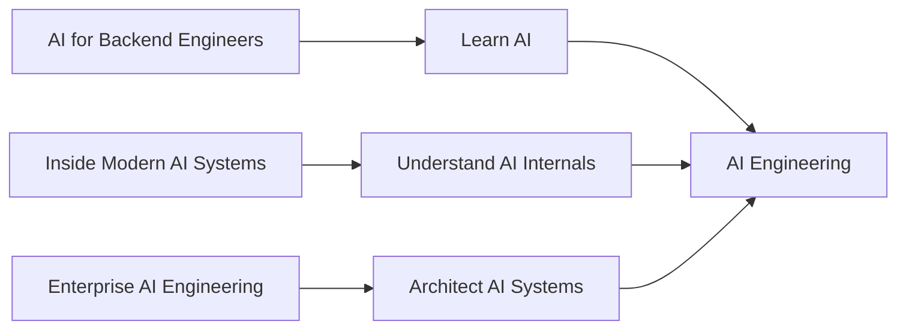

# About Mihir Jha

I’m a **Software Architect with 14+ years of experience** designing and building scalable, high-performance, secure, and cloud-native systems across finance, banking, and telecom.

My professional background spans:

- Distributed Systems
- Microservices
- Event-Driven Architecture
- Cloud-Native Engineering
- AWS, Azure & GCP
- Java, Kotlin & Spring
- Kubernetes & Terraform
- Production System Design

My engineering background is rooted in building reliable backend and distributed systems, and my current journey is focused on extending that foundation into **AI Engineering and Enterprise AI Architecture**.

---

# 🎯 Current Focus

I’m focused on the intersection of:

**Software Engineering + Cloud Architecture + AI Engineering**

My current areas of exploration include:

- Machine Learning & Deep Learning
- Foundation Models & Large Language Models
- Generative AI
- Retrieval-Augmented Generation (RAG)
- Advanced Retrieval
- AI Agents & Agentic AI
- Multi-Agent Systems
- AI System Design
- Enterprise AI Architecture
- MLOps & LLMOps
- Cloud AI Engineering
- AI-powered Microservices
- AI Infrastructure & Platform Engineering

The broader objective is to understand how modern AI capabilities can be integrated into scalable, secure, observable, and production-ready software systems.

---

# 🧠 My Engineering Perspective

I approach AI from an engineering and architecture perspective.

For me, learning an AI technology is not only about understanding:

> **How does it work?**

It is also about understanding:

```text
How does it fit into a system?
        ↓
How does it scale?
        ↓
How does it fail?
        ↓
How do we secure it?
        ↓
How do we observe and evaluate it?
        ↓
How do we control cost?
        ↓
How do we operate it reliably?
```

This perspective connects my background in backend and cloud engineering with modern AI systems.

---

# 📚 About This Blog

The **Enterprise AI Engineering Blog** is where I publish technical articles, architecture deep dives, engineering perspectives, implementation insights, and practical lessons from exploring modern software and AI systems.

The focus is on understanding not only **how technologies work**, but also:

- How they fit into production architectures
- What trade-offs they introduce
- How they scale
- How they should be secured
- How they should be observed and evaluated
- How they integrate with existing backend systems
- How cloud infrastructure influences architecture
- How AI capabilities become production software

The blog is organized around three complementary content journeys.

---

# 🤖 AI for Backend Engineers

**Learn AI**

A practical learning journey connecting:

- Machine Learning
- Deep Learning
- Foundation Models
- Large Language Models
- Prompt Engineering
- RAG
- AI Agents
- Cloud AI
- Production AI Engineering

The goal is to help backend engineers understand how AI capabilities can become part of modern software systems.

---

# 🧠 Inside Modern AI Systems

**Understand AI**

A hands-on exploration of the internal components behind modern AI systems.

The series focuses on:

- Neural Networks
- Transformers
- LLM Internals
- AI Training
- AI Inference
- PyTorch
- TensorFlow / Keras
- Performance and optimization

The goal is to move beyond framework abstractions and understand what is happening underneath them.

---

# 🏢 Enterprise AI Engineering

**Architect AI**

A production-focused architecture journey exploring how enterprise-grade AI systems are designed and operated.

The broader focus includes:

- Enterprise AI Architecture
- RAG Systems
- AI Gateways
- Agentic AI
- AI Platforms
- AI Observability
- LLMOps
- AI Security
- AI Governance
- AI Inference Infrastructure
- Distributed AI Systems

The goal is to understand how individual AI capabilities become **scalable enterprise systems**.

---

# 🧭 The Overall Journey

The three content tracks complement one another:



The broader progression is:

```text
Learn
  ↓
Understand
  ↓
Build
  ↓
Architect
  ↓
Operate
  ↓
Optimize
```

---

# 📖 Enterprise AI Engineering Handbook

For structured, chapter-based technical learning and reference material, visit the:

**[Enterprise AI Engineering Handbook](https://enterpriseai.handbook.mihirkjha.com/)**

The blog and handbook serve different purposes.

```text
Blog
  ↓
Articles, Deep Dives & Engineering Perspectives

Handbook
  ↓
Structured Technical Reference

GitHub
  ↓
Code, Projects & Experiments

LinkedIn
  ↓
Discussion, Distribution & Community

Newsletter
  ↓
Ongoing Enterprise AI Engineering Updates
```

---

# 💻 GitHub

I use GitHub to support the learning and engineering journey with:

- Source code
- AI experiments
- Architecture examples
- Implementation projects
- Notebooks
- Supporting documentation

**[GitHub — MihirKJha](https://github.com/MihirKJha/)**

---

# 💼 LinkedIn

I regularly share:

- Technical insights
- Architecture discussions
- Compact versions of articles
- Engineering perspectives
- New article announcements
- Enterprise AI discussions

**[LinkedIn — Mihir Jha](https://www.linkedin.com/in/mihirkrjha/)**

---

# 📰 Enterprise AI Engineering Newsletter

The **Enterprise AI Engineering** newsletter focuses on practical, production-oriented perspectives across:

- Enterprise AI Engineering
- AI System Design
- Cloud Architecture
- Backend Engineering
- Generative AI & LLMs
- RAG & Advanced Retrieval
- AI Agents & Agentic AI
- MLOps & LLMOps
- Production AI Architecture

**[Read the Enterprise AI Engineering Newsletter](https://www.linkedin.com/newsletters/enterprise-ai-engineering-7479222208079319041/)**

---

# 🎯 My Goal

My goal is to bridge **traditional software and cloud engineering with modern AI engineering** and document practical approaches for designing:

- Scalable systems
- Secure systems
- Observable systems
- Reliable systems
- Cost-aware systems
- Production-ready intelligent systems

I want this blog, the handbook, and the supporting projects to become a practical record of that journey.

---

# 🚀 The Long-Term Direction

The broader journey is moving from:

```text
Software Engineering
        ↓
Cloud Engineering
        ↓
AI Engineering
        ↓
AI Systems Engineering
        ↓
Enterprise AI Architecture
```

The long-term objective is to understand how to build intelligent systems that are not only technically capable, but also **reliable, maintainable, secure, observable, and scalable**.

---

# 👨‍💻 About Me

**Mihir Jha**

*Software Architect | AI Engineering | Cloud Architecture | Backend Engineering*

Focused on bridging traditional software and cloud engineering with modern AI engineering to design scalable, secure, observable, and production-ready intelligent systems.

---

<div align="center" markdown="1">

### 🚀 Learn AI. Understand AI. Build AI. Architect AI.

**Building Production-Grade AI Systems Through Engineering, Architecture & Continuous Learning.**

**© 2026 Mihir Jha**

</div>