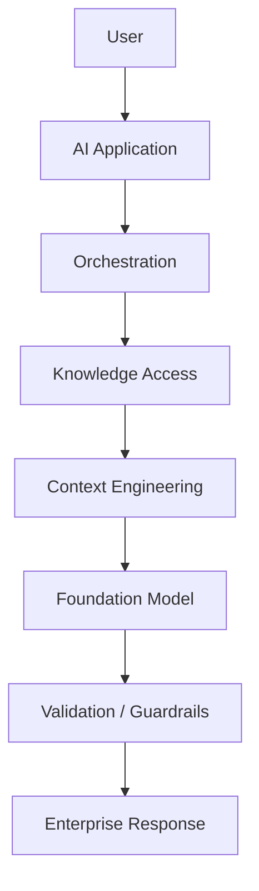
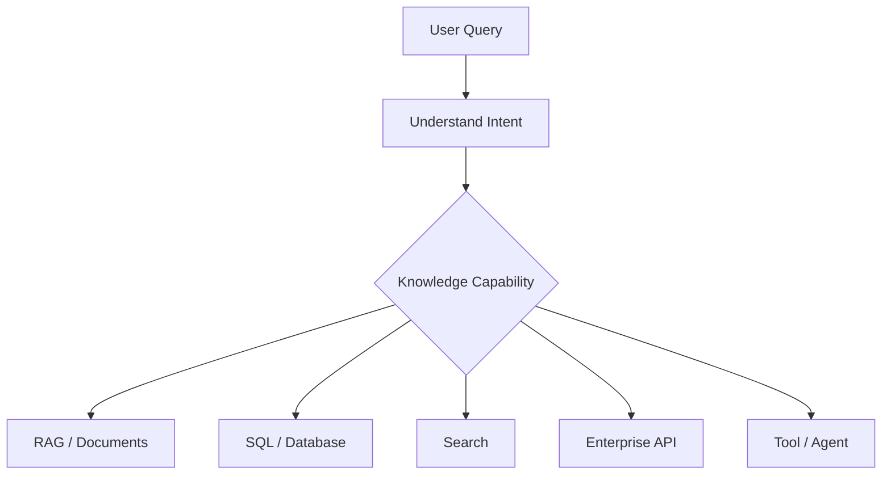

# 1.2 — From LLM Applications to Enterprise RAG Systems

> **Series:** Enterprise AI Systems Architecture Stack  
> **Phase:** 2 — GenAI & RAG Engineering

## 🎯 Architecture Insight

A basic LLM application follows:

**User → Prompt → LLM → Response**

For enterprise systems, the model may need knowledge that does not exist in its parameters.

The architecture therefore evolves from a **model-centric application** into a **knowledge-aware AI system**.

### Enterprise AI Evolution

The key architectural change is:

> **Knowledge becomes an explicit system dependency.**

## 🏗️ Architectural Boundary

    AI Application
          │
          ├── Orchestration
          │
          ├── Knowledge Access
          │     ├── RAG
          │     ├── SQL
          │     ├── Search
          │     ├── APIs
          │     └── Tools
          │
          ├── Context Engineering
          ├── Model Access
          └── Validation

This separates **how the application reasons about a request** from **how it accesses enterprise knowledge**.

## 🧩 RAG Is Not the Only Knowledge Path

An enterprise system should not assume:

**Every Question → Vector Database**

Different requests may require different capabilities.

For example:

- Policy question → **Document RAG**
- Customer balance → **SQL / Database**
- Current status → **Enterprise API**
- Complex task → **Multiple capabilities**

Therefore:

> **RAG is one knowledge-access capability within Enterprise AI, not the universal data-access mechanism.**

## 🔗 The Core Relationship

    User Request
          ↓
    Understand Intent
          ↓
    Select Capability
          ↓
    Access Knowledge
          ↓
    Build Context
          ↓
    Generate
          ↓
    Validate
          ↓
    Enterprise Response

The important architectural separation is:

| Layer | Responsibility |
|---|---|
| Intent | Understand the request |
| Knowledge Access | Select the appropriate capability |
| Context | Prepare information for the model |
| Generation | Produce the response |
| Validation | Apply enterprise controls |

## ⚖️ First Architectural Decision

The question should not be:

> **"How do I connect the LLM to our data?"**

It should be:

> **"What knowledge does this request require, where does that knowledge live, and which capability should access it?"**

This changes the design from **technology-first** to **capability-first architecture**.

## 💼 Backend Architecture Parallel

This follows the same principle used in backend systems.

We don't send every request directly to one database. We identify the required capability and route the request accordingly.

Enterprise AI should apply the same thinking:

**Understand → Select Capability → Access Knowledge → Generate → Validate**

This creates boundaries that allow retrieval methods, data sources, models, and tools to evolve independently.

## 🔑 Key Architectural Trade-offs

More knowledge-access capabilities provide flexibility but introduce:

- **Latency**
- **Complexity**
- **Failure paths**
- **Infrastructure cost**
- **Security boundaries**

The goal is not to support every possible mechanism.

> **Choose the simplest architecture that satisfies the knowledge requirement.**

## 🚨 Architect Mental Models

- **LLM Application ≠ Enterprise AI System**
- **RAG ≠ Universal Data Access**
- **Vector Database ≠ Enterprise Knowledge Layer**
- **More Capabilities ≠ Better Architecture**
- **Knowledge Access Should Be Capability-Based**

## 💡 Architect Takeaway

> **The evolution from an LLM application to an Enterprise AI system happens when knowledge access becomes an explicit architectural capability.**

The architect's question becomes:

**What knowledge does this request require, which system owns it, and what is the right capability to access it?**