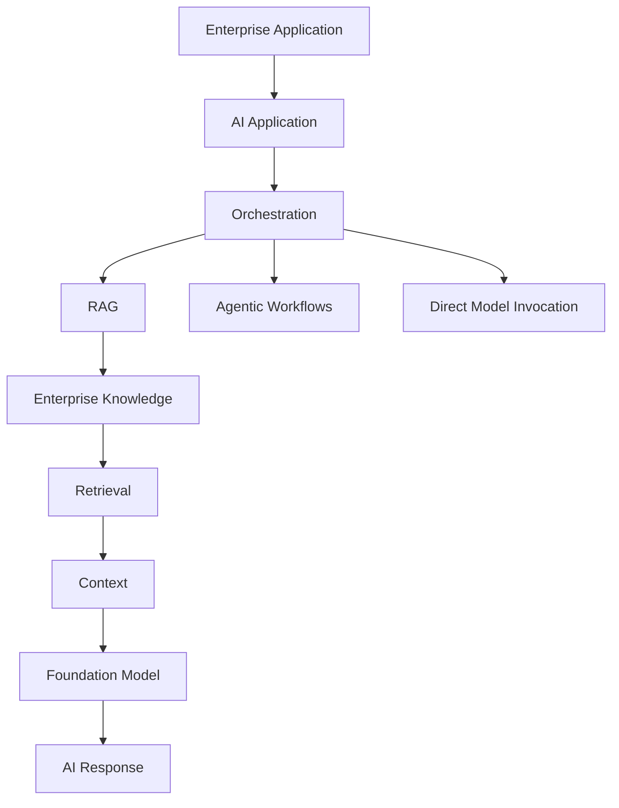
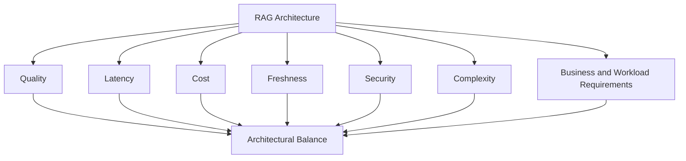

# 1.1 — Where RAG Fits in the Enterprise AI Architecture

> **Series:** Enterprise AI Systems Architecture Stack  
> **Phase:** 2 — GenAI & RAG Engineering

## 🎯 Architecture Insight

RAG is a **knowledge-grounding capability inside an AI application**. It connects enterprise knowledge with a foundation model so that responses can be generated using relevant external context.

It should not be reduced to **Vector Database + Embeddings + LLM**.

### Enterprise AI Positioning



RAG is therefore a **subsystem of the AI application**, not the complete AI application.

## 🏗️ Architectural Boundary

    AI Application
          │
          ├── Orchestration
          │
          ├── RAG
          │     ├── Retrieval
          │     ├── Ranking
          │     └── Context Construction
          │
          ├── Agents
          │
          └── Model Invocation

RAG should focus on **knowledge retrieval and grounding** rather than business workflow orchestration, agent planning, model infrastructure, or platform operations.

## 🔗 The Core Relationship

    Enterprise Knowledge
            ↓
         Retrieval
            ↓
          Ranking
            ↓
      Context Construction
            ↓
       Foundation Model
            ↓
        AI Response

This creates four useful architectural boundaries:

| Layer | Responsibility |
|---|---|
| Knowledge | What the enterprise knows |
| Retrieval | What the system finds |
| Context | What the model receives |
| Generation | What the model produces |

The separation becomes increasingly important as retrieval strategies become more sophisticated.

## ⚖️ First Architectural Decision

The first question should not be:

> **Which vector database should we use?**

It should be:

> **Does this AI capability require external or enterprise knowledge?**

```
    User Request
         │
         ▼
    External knowledge required?
       /              \
     No                Yes
     ↓                  ↓
 Direct LLM            RAG
                        ↓
                 Retrieve Evidence
                        ↓
                 Grounded Response

```
RAG becomes a strong architectural candidate when the system requires private knowledge, frequently changing information, controlled evidence, or source attribution.

## 🔑 Key Architectural Trade-offs

An architect must balance:

- **Knowledge quality**
- **Retrieval latency**
- **Context and model cost**
- **Knowledge freshness**
- **Security boundaries**
- **Operational complexity**

A more sophisticated RAG architecture is not automatically a better architecture. The correct design depends on the **knowledge requirements, workload, and business constraints**.

## 💻 Architecture Principle

The enterprise rag architecture should depend on **retrieval capabilities**, not directly on a particular framework or vector database.

    class Retriever:
        def retrieve(self, query: str, top_k: int):
            ...

The boundary can later support:

    Retriever
       ├── Dense Retriever
       ├── Hybrid Retriever
       ├── Graph Retriever
       └── SQL Retriever

This keeps the application architecture independent of implementation choices such as LangChain, LlamaIndex, Haystack, or a specific vector database.

## 🚨 Architect Mental Models

- **RAG ≠ Vector Database**
- **RAG ≠ PDF Chat**
- **RAG ≠ Fine-Tuning**
- **More Context ≠ Better Answers**
- **LLM ≠ Complete RAG System**

## 💡 Architect Takeaway

> **RAG is a knowledge-grounding layer within an Enterprise AI architecture. Its architectural value comes from how effectively it connects enterprise knowledge to model reasoning—not from any single retrieval technology.**

The next architectural questions are:

**Where does knowledge come from? → How is it retrieved? → How is it ranked? → What context reaches the model? → How does the system operate reliably at scale?**

---

## Further Reading

For deeper coverage of Core Retrieval Engineering, including VectorStore Retrieval, Multi-Query Retrieval, Self-Query Retrieval, Parent-Document Retrieval, retriever comparison, strategy selection, and production considerations:

[Enterprise AI Systems Hanbook](https://enterpriseai.handbook.mihirkjha.com/)

**Enterprise AI Engineering Handbook — Core Retrieval Engineering**

---