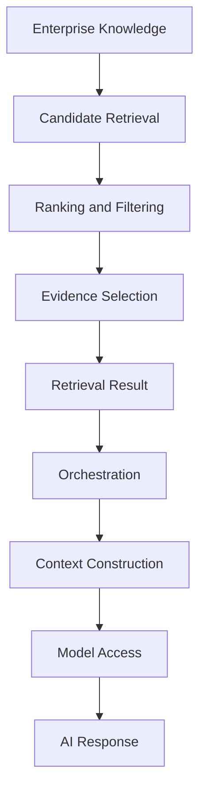
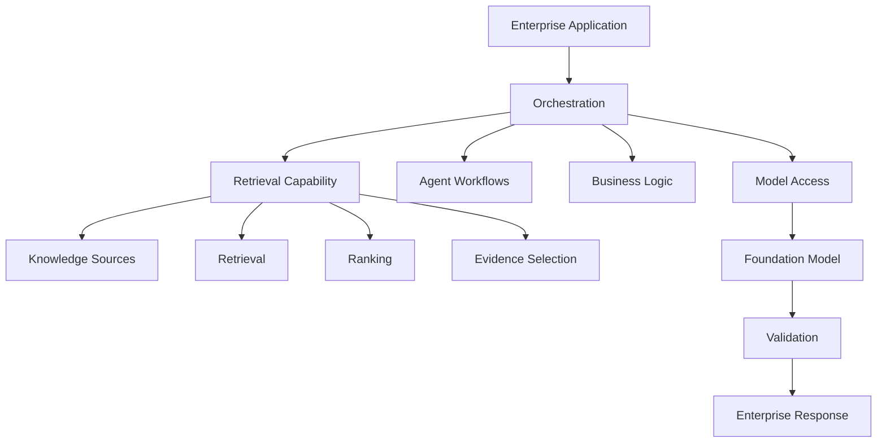

# 1.4 — Designing RAG System Boundaries: What Belongs Inside Retrieval?

> **Series:** Enterprise AI Systems Architecture Stack  
> **Phase:** 2 — GenAI & RAG Engineering

## 🎯 Architecture Insight

As RAG systems evolve, one important architectural question appears:

> **Where does retrieval end, and where do other AI capabilities begin?**

A common failure mode is allowing retrieval to absorb prompt construction, LLM invocation, tool execution, agent workflows, business logic, and response validation.

The result is a large RAG subsystem that **owns too much and becomes difficult to evolve**.

A better approach is to treat retrieval as a focused **knowledge and evidence capability** inside the larger AI application.

Its responsibility is not to generate the final answer.

> **Retrieval determines what enterprise knowledge is relevant enough to become evidence for a request.**

## 🏗️ The Retrieval Boundary

A useful retrieval lifecycle is:



The retrieval capability can include:

- Knowledge source access
- Sparse, dense, or hybrid retrieval
- Metadata filtering
- Ranking and reranking
- Evidence selection
- Source attribution and retrieval signals

The key architectural distinction is:

**Retrieval produces evidence.**  
**The AI application decides how that evidence is used.**

## 🧩 What Stays Outside Retrieval?

Retrieval should not own the complete AI workflow.



Typical boundaries:

| Capability | Architectural Boundary |
|---|---|
| Business workflow | Application / orchestration |
| Agent planning | Agent / workflow layer |
| Prompt strategy | Context engineering |
| Model invocation | Model access layer |
| Response validation | Guardrails / validation |
| Authentication | Security / platform |

This prevents retrieval from becoming a **monolithic AI subsystem**.

## 🔌 Capability-Oriented Design

The application should depend on a retrieval capability rather than a specific implementation:

```text
AI Application
      ↓
  Retriever
      ↓
┌─────┼──────┐
Dense Hybrid Graph
              ↓
           SQL / API
```

Conceptually:

```text
retrieve(query, filters)
        ↓
Retrieval Result
   ├── Evidence
   ├── Sources
   ├── Metadata
   └── Relevance Signals
```

This allows the retrieval implementation to evolve without redesigning the complete AI application.

## ⚖️ Why Boundaries Matter

Clear boundaries improve:

- **Replaceability** — retrieval strategies evolve independently
- **Testability** — retrieval quality is measured separately from generation
- **Scalability** — retrieval workloads scale independently
- **Observability** — failures can be isolated
- **Security** — knowledge access policies can be enforced consistently

When an AI response fails, clear boundaries help identify:

**Retrieval problem → Context problem → Model problem → Validation problem**

## 💼 Backend Architecture Parallel

The retrieval boundary follows the same principle as service boundaries in backend architecture.

```text
API Layer
    ↓
Order Service
    ↓
Payment Service
    ↓
Inventory Service
```

Each service owns a focused capability.

The Payment Service should not also manage inventory, reporting, and customer workflows.

Similarly:

```text
AI Application
      ↓
Retrieval Capability
      ↓
Enterprise Knowledge
```

Retrieval owns **knowledge discovery and evidence preparation**.

Orchestration coordinates the request.

Model access invokes the model.

Validation checks the output.

> **High cohesion inside a capability. Clear boundaries between capabilities.**

## 🚨 Boundary Anti-Patterns

- **Retriever owns prompts** → couples retrieval to model behavior
- **Retriever invokes the LLM** → mixes evidence discovery with generation
- **Retriever executes every tool** → becomes workflow orchestration
- **Vector database = retrieval architecture** → technology replaces architecture
- **One giant RAG service** → unrelated responsibilities become tightly coupled

## 💡 Architect Takeaway

> **Retrieval is an evidence-producing capability, not the owner of the complete AI workflow.**

A strong Enterprise RAG architecture separates:

**Knowledge Access → Retrieval → Evidence → Orchestration → Model → Validation**

This allows each capability to evolve independently while keeping the AI system easier to test, operate, secure, and scale.