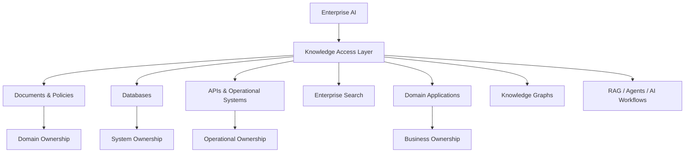
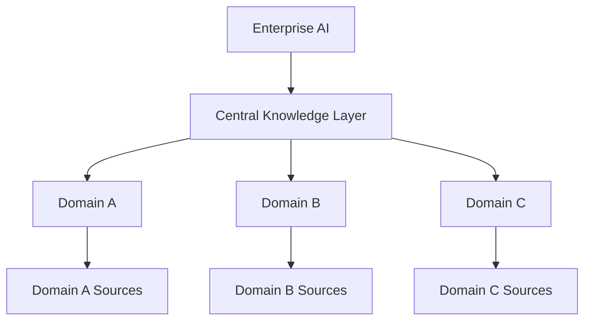
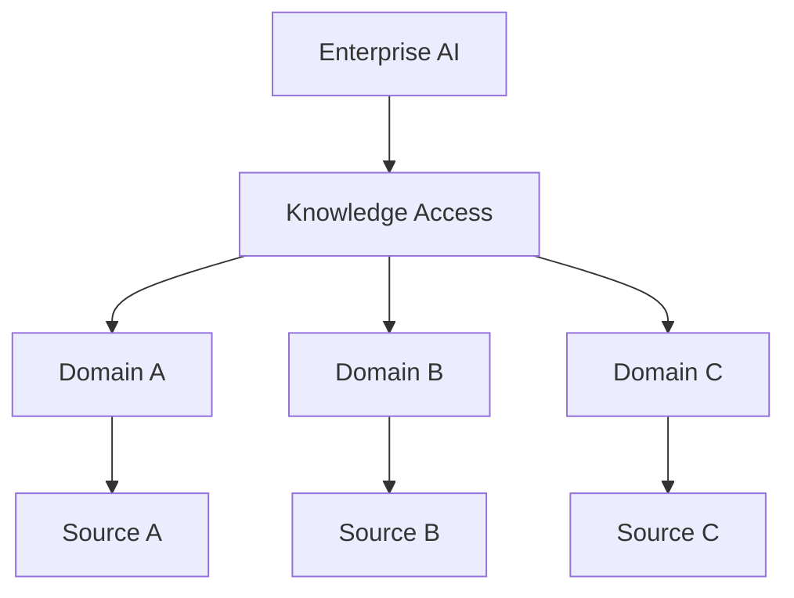
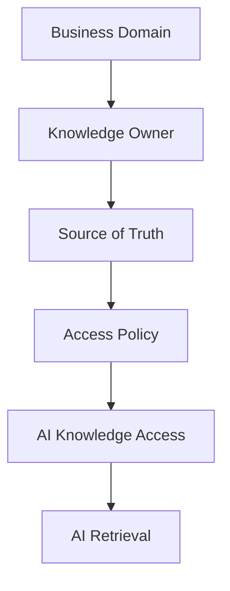
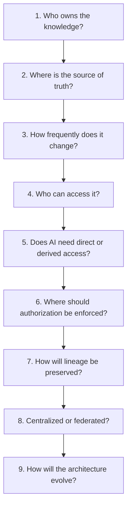

# 1.5 — Designing the Enterprise Knowledge Architecture for AI

> **Series:** Enterprise AI Systems Architecture  
> **Phase:** 2 — GenAI & RAG Engineering

## 🎯 Architecture Insight

When designing Enterprise AI, it is tempting to begin with the technology:

- Which foundation model?
- Which embedding model?
- Which vector database?
- Which RAG framework?

But an enterprise architecture question comes first:

> **Where does the enterprise knowledge actually live, who owns it, and how should AI access it?**

Enterprise knowledge is rarely contained in one repository.

It may be distributed across:

- Documents and policies
- Databases
- Enterprise search platforms
- APIs
- Operational systems
- Domain applications
- Knowledge graphs
- Data platforms

These systems can have different owners, security models, freshness requirements, governance policies, and definitions of truth.

Therefore:

> **Enterprise AI architecture should begin with the knowledge landscape, not with the retrieval technology.**

## 🏗️ Enterprise Knowledge Landscape



The key architectural observation is that **AI consumes knowledge owned by other enterprise capabilities**.

AI does not automatically become the owner of that knowledge.

## 🧠 Source of Truth

A fundamental question is:

> **Which system is authoritative for this information?**

| Enterprise Knowledge | Potential Source of Truth |
|---|---|
| Customer profile | CRM |
| Order status | Order Management System |
| Employee information | HR System |
| Product information | Product System |
| Company policies | Document Management Platform |
| Operational status | Operational APIs |
| Financial records | Financial System |

An AI application may need information from many enterprise systems.

However, creating an AI copy of that information does not automatically make the AI platform its owner.

The architecture should preserve:

**Source of Truth → Knowledge Access → AI Consumption**

If order status changes in the operational system, an AI representation must not become a conflicting source of truth.

## 🏗️ AI Should Not Become the New System of Record


The **Knowledge Access Layer** creates a controlled boundary between enterprise systems and AI capabilities.

It may provide:

- Knowledge discovery
- Source routing
- Retrieval interfaces
- Access policies
- Derived representations
- Metadata
- Authorization-aware access
- Freshness signals

The exact implementation can vary.

The principle remains:

> **Enterprise AI should consume enterprise knowledge through well-defined boundaries rather than creating an uncontrolled second system of record.**

## 🧩 Centralized vs Federated Knowledge Architecture

A major architectural decision is:

> **Should knowledge access be centralized or federated?**

### Centralized Knowledge Architecture



### Advantages

- Consistent governance
- Centralized operations
- Easier enterprise-wide discovery
- Common indexing and retrieval infrastructure
- Potentially simpler AI integration

### Challenges

- Synchronization complexity
- Large ingestion and update pipelines
- Central ownership bottlenecks
- Duplication of domain knowledge
- Risk of creating another enterprise data silo

Centralization may simplify the consumer experience while increasing complexity behind the platform.

### Federated Knowledge Architecture



### Advantages

- Strong domain ownership
- Knowledge remains closer to its source
- Independent domain evolution
- Better alignment with bounded contexts
- Reduced central ownership dependency

### Challenges

- Distributed governance
- More complex discovery
- Different access mechanisms
- More difficult cross-domain retrieval
- Greater architectural coordination

There is no universal winner.

The correct choice depends on the enterprise context.

## ⚖️ Centralized vs Federated: Decision Factors

| Dimension | Architectural Question |
|---|---|
| Ownership | Who is accountable for the knowledge? |
| Security | Who is allowed to access it? |
| Freshness | How quickly must changes reach AI? |
| Domain boundaries | Does the knowledge strongly belong to one domain? |
| Scale | How many sources and consumers exist? |
| Governance | Where should policies be enforced? |
| Operations | Who operates the knowledge infrastructure? |
| Evolution | How independently must domains evolve? |

The goal is not to choose the most sophisticated architecture.

The goal is to choose the architecture that provides the correct:

**Ownership + Access + Governance + Evolution**

model for the enterprise.

## 🔐 Knowledge Access Is Also an Authorization Problem

Knowledge architecture cannot be separated from identity and authorization.

Imagine Employee A can access a document while Employee B cannot.

If that document is copied into an AI-oriented knowledge store, the permission boundary must remain meaningful.

Otherwise, the AI system may accidentally create a new path around the enterprise authorization model.


Authorization should influence **which knowledge is eligible for retrieval**, not merely whether the user can access the AI application.

The important boundary becomes:

> **Identity → Authorization → Knowledge Access → Retrieval → Response**

This is much broader than simply securing a vector database.

## 🔄 Knowledge Freshness

Different enterprise knowledge has different freshness requirements.

For example:

- Policies may change occasionally.
- Product information may change frequently.
- Order status may change continuously.
- Inventory may require real-time access.
- Customer information may change throughout the day.

Therefore, one universal ingestion strategy is rarely appropriate.

```text
Static Knowledge
      |
      v
Periodic Refresh
Frequently Changing Knowledge
      |
      v
Incremental Update
Operational Knowledge
      |
      v
Real-Time / API Access
```

The architecture should determine whether AI should:

- Read the source directly
- Consume a synchronized representation
- Use event-driven updates
- Query an operational API
- Retrieve from an AI-optimized index

The decision depends on **freshness requirements and source characteristics**.

## 🔗 Data Lineage

Enterprise AI systems should be able to answer:

> **Where did this information come from?**

A knowledge representation may pass through:

```text
Enterprise Source
      |
      v
Extraction
      |
      v
Transformation
      |
      v
AI Representation
      |
      v
Retrieval
      |
      v
Context
      |
      v
AI Response
```

Without lineage, it becomes difficult to determine:

- Which system produced the information
- When it was captured
- Whether it is still current
- Which transformation was applied
- Which evidence supported an AI response

For enterprise systems:

> **Traceability is part of architecture, not merely an observability feature.**

## 🛡️ Governance and Ownership

Knowledge should have explicit ownership.



The knowledge owner should be accountable for the correctness and lifecycle of the underlying information.

The AI platform should not independently redefine business ownership.

This prevents a common architectural problem:

> **The AI platform becomes responsible for knowledge it was never designed or authorized to own.**

## 🧱 Direct Access vs Derived Knowledge

Another important decision is whether AI should access the original source directly or use an AI-specific representation.

### Direct Source Access

```text
AI
 |
 v
Enterprise API / Search / Database
```

Useful when:

- Data changes frequently
- Real-time information is required
- The source already provides a strong access contract
- Replication would create unnecessary complexity

### Derived AI Representation

```text
Enterprise Source
      |
      v
Transformation
      |
      v
AI-Optimized Representation
      |
      v
Retrieval
```

Useful when:

- Retrieval requires specialized indexing
- Documents require semantic search
- Large-scale retrieval is required
- The source is not optimized for AI access
- Multiple AI workloads consume the same representation

The architectural decision should be driven by:

**Freshness + Access + Scale + Retrieval Requirements + Ownership**

—not by the availability of a particular AI technology.

## 💼 Backend Architecture Parallel

This problem has a strong parallel with traditional backend architecture.

In a domain-oriented backend system:

```text
Order Service
      |
Order Data

Customer Service
      |
Customer Data

Inventory Service
      |
Inventory Data
```

We generally avoid creating one service that owns every domain's data simply because multiple workflows need access to it.

Instead, each domain owns its information and exposes focused capabilities.

Enterprise AI should follow a similar principle:

```text
Domain Systems
      |
      v
Knowledge Access Contracts
      |
      v
Enterprise AI
      |
      v
RAG / Agents / Models
```

The AI system may consume knowledge from many domains without becoming the owner of all those domains.

This is the same architectural principle:

> **High cohesion within a capability. Clear ownership and contracts across boundaries.**

The technology may be different, but the architectural reasoning is familiar to backend engineers.

## 🚨 Architectural Anti-Patterns

### 1. AI Data Silo

Creating a large AI-specific copy of enterprise knowledge without clear ownership.

**Problem:** The AI platform gradually becomes another system of record.

### 2. Centralized Everything

Moving every enterprise source into one AI platform simply because it makes retrieval easier.

**Problem:** Domain ownership and lifecycle responsibilities become blurred.

### 3. Ignoring Source Authorization

Allowing AI retrieval to return information without preserving source-level access rules.

**Problem:** The AI layer can become an unintended security boundary bypass.

### 4. Treating All Knowledge as Static

Using the same ingestion strategy for policies, product data, inventory, and real-time operational information.

**Problem:** Freshness requirements differ significantly across knowledge types.

### 5. Losing Lineage

Storing derived AI knowledge without preserving its origin.

**Problem:** The system cannot reliably explain where evidence came from or whether it is current.

## 🧠 Architect Mental Models

Keep these principles in mind:

- **Enterprise knowledge ≠ AI-owned knowledge**
- **Source of truth ≠ AI representation**
- **Retrieval ≠ knowledge ownership**
- **Centralized ≠ automatically better**
- **Federated ≠ automatically better**
- **Freshness is a design requirement**
- **Authorization must follow the knowledge**
- **Lineage is part of trust**
- **AI should integrate with domain ownership**
- **The AI platform should not become an uncontrolled data silo**

## 📐 Architecture Decision Framework

Before designing the knowledge layer, ask:



This sequence shifts the discussion from:

> **"Which vector database should we use?"**

to:

> **"What is the correct enterprise knowledge architecture for this AI workload?"**

That is the more important architectural question.

## 💡 Architect Takeaway

> **Enterprise AI should not replace enterprise knowledge architecture. It should integrate with it.**

The objective is not to create another uncontrolled repository of enterprise information.

The objective is to build a **governed knowledge access architecture** that allows AI systems to use enterprise knowledge while preserving:

**Ownership • Security • Freshness • Lineage • Governance • Trust**

A mature Enterprise AI architecture therefore treats knowledge as a **first-class architectural concern**.

RAG is only one consumer of that knowledge.

Agents, AI workflows, search experiences, decision-support systems, and future AI capabilities may all depend on the same underlying enterprise knowledge architecture.

The long-term architectural question is therefore not:

> **"How do we add RAG to our application?"**

It is:

> **"How should Enterprise AI access distributed organizational knowledge without breaking the ownership, security, freshness, and governance boundaries that already exist?"**

That is where **RAG architecture evolves into Enterprise AI architectur**