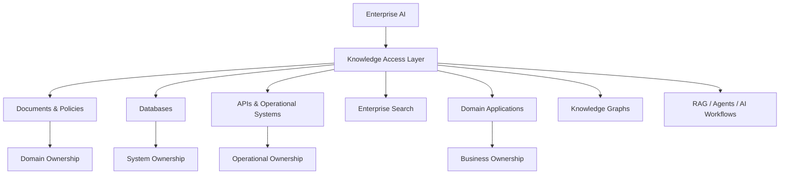
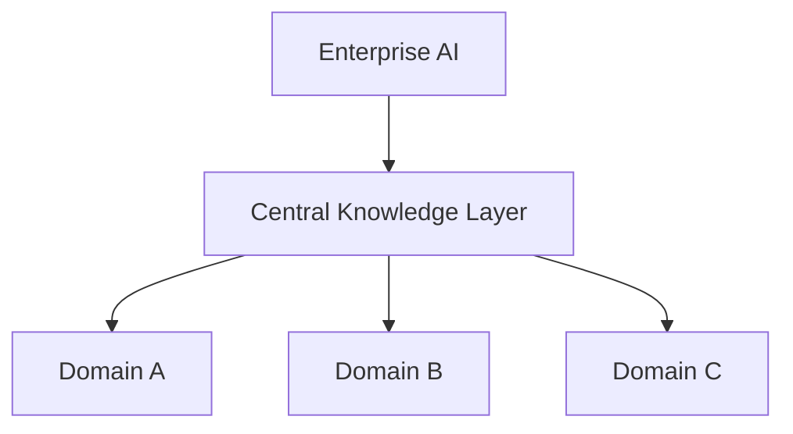
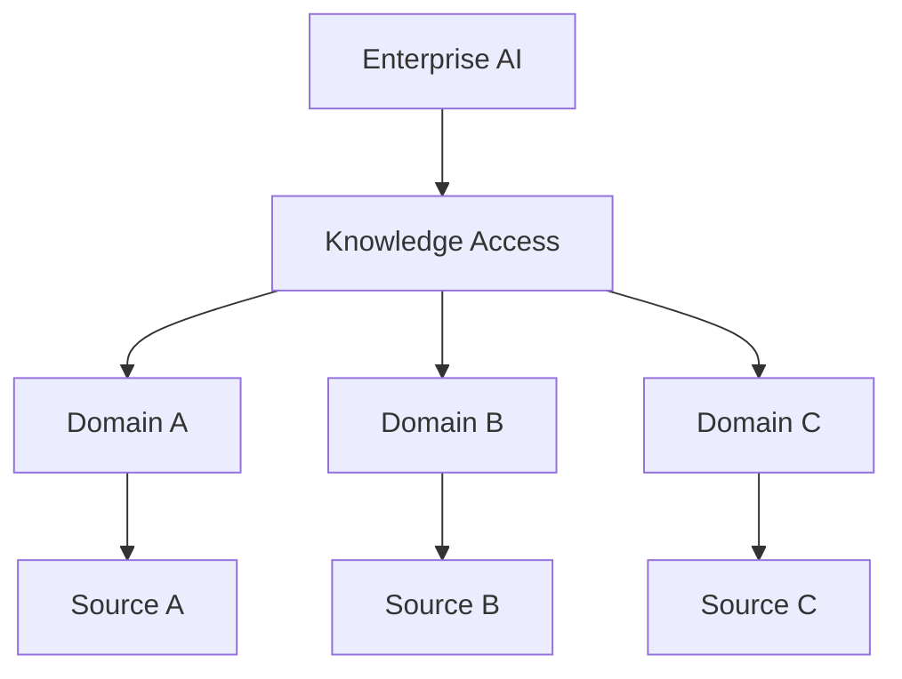
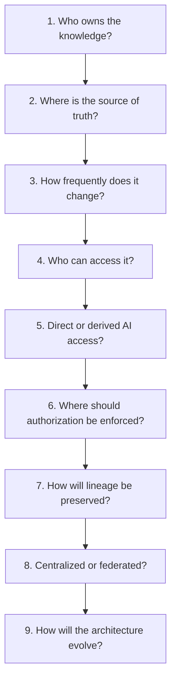

# 1.5 — Designing the Enterprise Knowledge Architecture for AI

> **Series:** Enterprise AI Systems Architecture  
> **Phase:** 2 — GenAI & RAG Engineering

## 🎯 Architecture Insight

A common mistake in Enterprise AI is starting with technology:

- Which LLM?
- Which embedding model?
- Which vector database?
- Which RAG framework?

The more fundamental question is:

> **Where does enterprise knowledge live, who owns it, and how should AI access it?**

Enterprise knowledge is distributed across documents, databases, APIs, operational systems, search platforms, domain applications, and knowledge graphs.

These sources have different ownership, security, freshness, and governance requirements.

> **Enterprise AI architecture should begin with the knowledge landscape—not with the retrieval technology.**

---

## 🏗️ Diagram 1.4 — Enterprise Knowledge Architecture for AI



The **Knowledge Access Layer** provides a controlled boundary between enterprise-owned knowledge and AI capabilities.

It can provide:

- Knowledge discovery
- Source routing
- Retrieval interfaces
- Access policies
- Metadata
- Freshness signals
- Authorization-aware access
- AI-optimized representations

The key separation is:

**Knowledge Ownership ≠ Knowledge Access ≠ AI Consumption**

---

## 🧠 Source of Truth

Every knowledge domain should have a clear authoritative source.

| Knowledge | Example Source of Truth |
|---|---|
| Customer profile | CRM |
| Order status | Order Management System |
| Employee information | HR System |
| Product information | Product System |
| Company policies | Document Platform |
| Operational status | Enterprise APIs |

An AI-specific index can improve retrieval, but it should not silently become the system of record.

For example:

**Order System → Source of Truth**  
**AI Index → Derived Representation**

This distinction prevents AI platforms from becoming uncontrolled enterprise data silos.

---

## 🧩 Centralized vs Federated Knowledge Access

One of the major architecture decisions is:

> **Should enterprise knowledge access be centralized or federated?**

### Centralized



A centralized architecture can provide:

- Consistent governance
- Centralized operations
- Common indexing infrastructure
- Easier enterprise-wide discovery

But it can introduce:

- Synchronization complexity
- Central ownership bottlenecks
- Duplication of domain knowledge
- Risk of another data silo

### Federated



A federated architecture keeps knowledge closer to domain systems.

It can provide:

- Strong domain ownership
- Independent domain evolution
- Better alignment with bounded contexts
- Reduced central ownership dependency

But it can introduce:

- Distributed governance
- More complex discovery
- Different access mechanisms
- Cross-domain coordination challenges

---

## ⚖️ Centralized vs Federated: Decision Factors

| Dimension | Centralized | Federated |
|---|---|---|
| Ownership | Centrally coordinated | Domain-owned |
| Governance | Centralized | Distributed |
| Discovery | Simpler | More complex |
| Operations | Centralized | Distributed |
| Domain autonomy | Lower | Higher |
| Cross-domain access | Easier to standardize | Requires coordination |
| Evolution | Platform-driven | Domain-driven |

There is no universally correct model.

The decision should consider:

**Ownership + Security + Freshness + Domain Boundaries + Scale + Governance + Evolution**

> **Choose the architecture that fits the enterprise operating model—not the architecture that looks most sophisticated.**

---

## 🔐 Authorization Must Follow the Knowledge

Knowledge access is also an authorization problem.

If one employee can access a document and another cannot, that distinction must remain meaningful when the knowledge becomes AI-accessible.


Authorization should influence:

> **Which knowledge is eligible for retrieval?**

The boundary becomes:

**Identity → Authorization → Knowledge Access → Retrieval → AI Context**

This is broader than simply securing a vector database.

---

## 🔄 Knowledge Freshness

Different knowledge requires different access strategies.

| Knowledge | Typical Strategy |
|---|---|
| Policies | Periodic refresh |
| Product information | Incremental updates |
| Customer information | Synchronization / API |
| Order status | Real-time API |
| Inventory | Real-time / near-real-time |

```text
Static Knowledge
      ↓
Periodic Refresh

Frequently Changing Knowledge
      ↓
Incremental Updates

Operational Knowledge
      ↓
Real-Time / API Access
```

The architecture should determine whether AI should:

- Read the source directly
- Consume a synchronized representation
- Use event-driven updates
- Query an operational API
- Retrieve from an AI-optimized index

> **Freshness is an architectural requirement, not merely an ingestion concern.**

---

## 🔗 Data Lineage

Enterprise AI should be able to answer:

> **Where did this information come from?**

```text
Enterprise Source
      ↓
Transformation
      ↓
AI Representation
      ↓
Retrieval
      ↓
Context
      ↓
AI Response
```

Useful lineage includes:

- Source identifier
- Owner
- Last updated timestamp
- Transformation history
- Evidence reference

Lineage supports auditability, debugging, trust, compliance, and freshness validation.

> **Traceability is part of enterprise AI architecture.**

---

## 🧱 Direct Access vs Derived Knowledge

AI does not always need a copied representation of enterprise information.

### Direct Access

```text
AI
 ↓
Enterprise API / Search
 ↓
Source of Truth
```

Useful when:

- Data changes frequently
- Real-time information is required
- The source provides a strong access contract
- Replication adds unnecessary complexity

### Derived Representation

```text
Enterprise Source
      ↓
Processing
      ↓
AI-Optimized Representation
      ↓
Retrieval
```

Useful when:

- Semantic retrieval is required
- Large document collections need specialized indexing
- Multiple AI workloads share the representation

The decision should be driven by:

**Freshness + Access + Scale + Retrieval Requirements + Ownership**

---

## 💻 Compact Architecture Examples

### Knowledge Access Contract

```java
public interface KnowledgeProvider {

    KnowledgeResult retrieve(
        KnowledgeRequest request,
        UserContext user
    );
}
```

The AI application depends on a **knowledge capability**, not directly on infrastructure.

### Dynamic Knowledge

```text
AI
 ↓
OrderKnowledgeProvider
 ↓
Order API
 ↓
Order Management System
```

For highly dynamic data, direct access can avoid stale AI representations.

### Domain-Owned Knowledge

```text
Customer Domain → Customer Knowledge
Order Domain    → Order Knowledge
Payment Domain  → Payment Knowledge
                         ↓
                    Enterprise AI
```

The AI platform consumes domain capabilities while domains remain accountable for their knowledge.

---

## 💼 Backend Architecture Parallel

This is closely related to traditional backend architecture.

We normally avoid making one service responsible for every domain simply because multiple workflows need access to the data.

```text
Order Service       → Order Data
Customer Service    → Customer Data
Inventory Service   → Inventory Data
```

Enterprise AI can follow the same principle:

```text
Domain Systems
      ↓
Knowledge Access Contracts
      ↓
Enterprise AI
      ↓
RAG / Agents / Models
```

The AI platform consumes knowledge from multiple domains without becoming the owner of those domains.

> **High cohesion within a capability. Clear ownership and contracts across boundaries.**

---

## 🚨 Key Architectural Anti-Patterns

### AI Data Silo

Copying enterprise knowledge into an AI platform without clear ownership.

**Problem:** AI becomes another system of record.

### Centralized Everything

Moving every source into one AI platform simply because retrieval becomes easier.

**Problem:** Domain ownership and lifecycle responsibilities become blurred.

### Ignoring Authorization

Retrieving knowledge without preserving source-level access rules.

**Problem:** AI can become an unintended security boundary bypass.

### Treating All Knowledge as Static

Using the same ingestion strategy for policies and real-time operational data.

**Problem:** Freshness requirements differ.

### Losing Lineage

Storing derived knowledge without preserving its origin.

**Problem:** Evidence becomes difficult to verify.

---

## 📐 Enterprise Knowledge Architecture Decision Framework

Before selecting retrieval technology, ask:



This shifts the architecture conversation from:

> **"Which vector database should we use?"**

to:

> **"What is the right enterprise knowledge architecture for this AI workload?"**

---

## 🔍 What This Means for RAG

RAG is often simplified to:

**Retrieve → Augment → Generate**

But enterprise RAG depends on decisions that happen before retrieval:

- Which knowledge sources are relevant?
- Who owns them?
- Which source is authoritative?
- Can the user access them?
- How fresh must the information be?
- Should AI use direct or derived access?
- Can the evidence be traced back to its source?

Therefore:

> **RAG is a capability within the enterprise knowledge architecture—not the enterprise knowledge architecture itself.**

The same knowledge architecture can support RAG, agents, enterprise search, AI workflows, copilots, and future AI applications.

---

## 💡 Architect Takeaway

> **Enterprise AI should not replace enterprise knowledge architecture. It should integrate with it.**

The objective is to build a **governed knowledge access architecture** that preserves:

**Ownership • Security • Freshness • Lineage • Governance • Trust**

The long-term question is not:

> **"How do we add RAG to our application?"**

It is:

> **"How should Enterprise AI access distributed organizational knowledge without breaking the ownership, security, freshness, and governance boundaries that already exist?"**

That is where **RAG architecture evolves into Enterprise AI architecture.**

---

## Further Reading

For deeper coverage of Core Retrieval Engineering, including VectorStore Retrieval, Multi-Query Retrieval, Self-Query Retrieval, Parent-Document Retrieval, retriever comparison, strategy selection, and production considerations:

[Enterprise AI Systems Hanbook](https://enterpriseai.handbook.mihirkjha.com/)

**Enterprise AI Engineering Handbook — Core Retrieval Engineering**

---