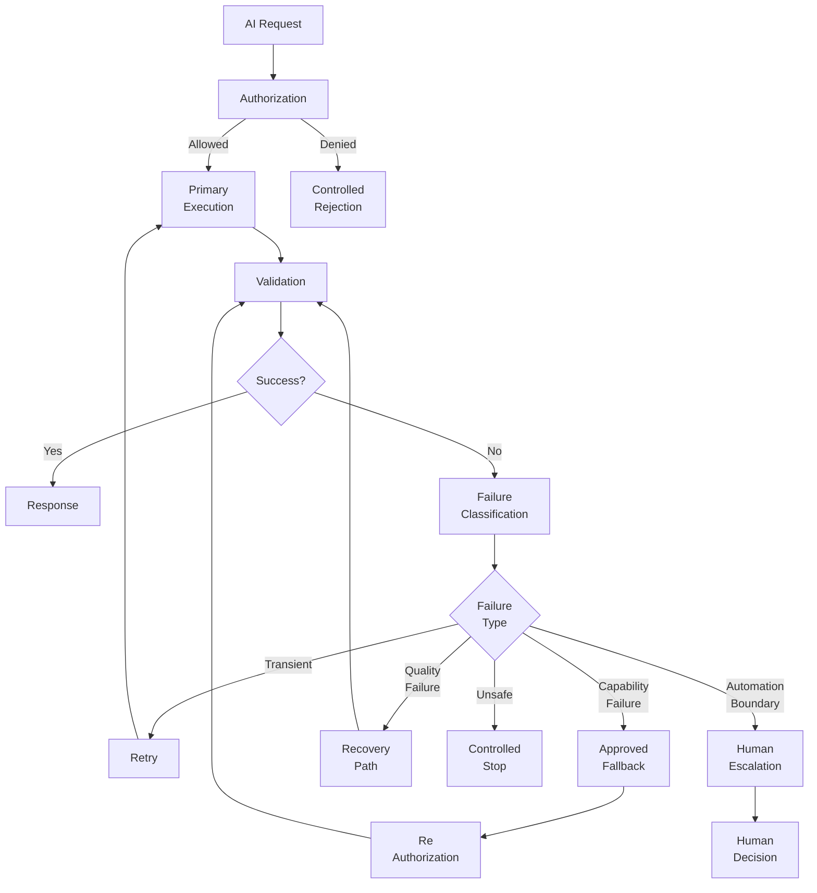
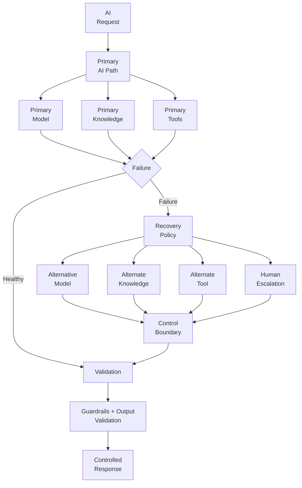
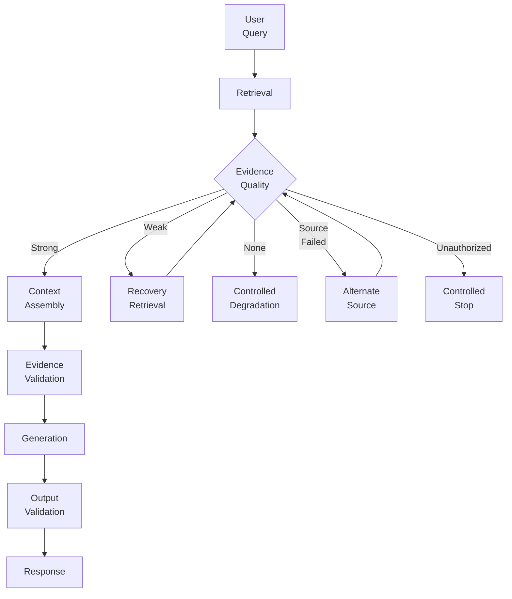

# 2.1 — Designing Reliable Enterprise AI: Failure, Fallback and Control

> **Series:** Enterprise AI Systems Architecture  
> **Phase:** 2 — GenAI & RAG Engineering

## 🎯  Architecture Insight

Enterprise AI systems cannot be designed around the assumption that every request will succeed.

Knowledge sources can fail. Retrieval can return weak evidence. Models can timeout. Tools and APIs can become unavailable. Authorization can fail. Guardrails can reject an action.

The architectural question is not:

> **How does the AI work when everything is healthy?**

It is:

> **How does the system behave when one or more capabilities fail?**


## 1. Reliability Starts With Failure Architecture

A reliable Enterprise AI system needs more than a successful primary execution path.

It needs:

- Failure detection
- Failure classification
- Retry policies
- Alternative execution paths
- Graceful degradation
- Output validation
- Authorization checks
- Guardrails
- Human escalation
- Observability

The architecture should treat failure as an expected system state.

---

## 2. Enterprise AI Failure Domains

Different failures require different recovery strategies.

| Failure Domain | Example | Typical Response |
|---|---|---|
| Knowledge | Source unavailable | Alternate source / degrade |
| Retrieval | Weak or empty evidence | Recovery retrieval |
| Model | Timeout / provider outage | Retry / alternate model |
| Tool | API failure | Retry / fallback |
| Authorization | Access denied | Stop |
| Guardrail | Unsafe request/action | Reject / escalate |
| Validation | Invalid output | Retry / regenerate |
| Dependency | Infrastructure failure | Retry / circuit breaker |
| Automation | Cannot safely continue | Human escalation |

The key principle:

> **Do not treat every failure as a retryable failure.**

A timeout may be transient.

An authorization failure is not.

A missing knowledge source may require fallback rather than repeated retries.

---

## 3. Primary Execution and Recovery Architecture

The AI request should move through a controlled execution loop rather than directly from request to response.

### Enterprise AI Failure and Recovery



The important architectural boundary is the **failure classification step**.

Failure should lead to a policy-driven recovery decision, not an unconditional retry.

---

## 4. Failure Classification

Before recovering from a failure, the system should understand what failed.

### Transient

- Timeout
- Temporary network failure
- Rate limit
- Temporary provider error

→ Retry may be appropriate.

### Capability Failure

- Model unavailable
- Knowledge source unavailable
- Tool unavailable

→ Use an approved alternative.

### Quality Failure

- Weak retrieval evidence
- Invalid model output
- Insufficient confidence

→ Re-retrieve, regenerate, validate, or degrade.

### Control Failure

- Authorization failure
- Guardrail rejection
- Policy violation

→ Stop the affected execution path.

### Automation Boundary

- System cannot confidently continue
- Business decision requires human judgment

→ Escalate.

---

## 5. Retry Is Not the Same as Fallback

Retry and fallback solve different problems.

| Strategy | Purpose | Example |
|---|---|---|
| Retry | Recover transient failure | Retry model request |
| Backoff | Avoid repeated pressure | Exponential backoff |
| Circuit Breaker | Protect failing dependency | Stop calling unavailable API |
| Fallback | Use another capability | Secondary model |
| Degradation | Reduce capability | Return limited answer |
| Escalation | Transfer decision | Human review |

A useful rule:

> **Retry when the same capability may recover. Fallback when the capability itself is unavailable.**

---

## 6. Fallback Architecture

Fallback should be designed before production incidents occur.

### Diagram 2.2 — Controlled Fallback Architecture



Fallback paths must remain inside the same security, authorization, validation, and governance boundaries.

A fallback that bypasses those controls is not a reliable architecture.

---

## 7. Graceful Degradation

Sometimes the correct response is not to find another complete execution path.

It is to reduce capability safely.

**Full capability**

> Retrieve enterprise knowledge → call tools → generate answer → execute action

**Degraded capability**

> Retrieve available knowledge → provide partial answer → communicate limitation

**Controlled stop**

> Evidence unavailable → do not generate unsupported answer

Degradation should preserve correctness and trust.

It should never silently convert:

**“I cannot verify this”**

into:

**“Here is an answer anyway.”**

---

## 8. Retrieval and Knowledge Failures

RAG introduces additional reliability boundaries because the AI may depend on external knowledge.

Possible failures include:

- Knowledge source unavailable
- Index unavailable
- Retrieval timeout
- Empty retrieval
- Weak evidence
- Stale knowledge
- Unauthorized source
- Conflicting sources

### Retrieval Failure and Evidence Control



The key architectural boundary is **evidence quality**.

Retrieval success does not automatically mean answer quality.

---

## 9. Validation Is a Reliability Boundary

Validation should exist before the final response or action.

Depending on the system, validation may check:

- Required evidence exists
- Retrieved content is relevant
- Output follows the expected schema
- Tool result is valid
- Business rules are satisfied
- Authorization is still valid
- Safety policies are satisfied
- Confidence is sufficient

Think of validation as:

**AI-generated result → Control boundary → Trusted response**

rather than:

**AI-generated result → User**

---

## 10. Authorization Must Survive Fallback

A common architectural mistake is securing the primary path while leaving fallback paths less controlled.

For example:

**Primary Model → Authorization → Tool → Validation**

but:

**Primary Model → Failure → Alternate Tool → Response**

The second path may accidentally bypass controls.

A better architecture treats authorization as part of the execution envelope:

**Request → Authorization → Capability → Re-Authorization → Validation → Response**

Every alternative capability must remain inside the same control boundary.

---

## 11. Human Escalation

Not every failure should be solved automatically.

Human escalation is appropriate when:

- Evidence is insufficient
- Multiple sources conflict
- The requested action is high impact
- Policy requires approval
- Confidence is below an acceptable threshold
- Automated recovery has failed
- The system cannot safely determine the next action

The human should receive enough context to make the decision:

- Original request
- Failure reason
- Evidence available
- Actions attempted
- Validation results
- Recommended next action

Human escalation therefore becomes an architectural control point, not merely an operational support mechanism.

---

## 12. Recovery Observability

Reliability requires visibility into recovery behavior.

Monitor:

- Failure type
- Failure frequency
- Retry count
- Fallback frequency
- Recovery success rate
- Validation rejection rate
- Guardrail rejection rate
- Human escalation rate
- Recovery latency
- Dependency health

A useful metric is not only:

**“How often did requests succeed?”**

but also:

**“How did the system recover when requests failed?”**

---

## 13. Recovery Policy

Recovery decisions should be explicit rather than embedded inside application logic.

### Diagram 2.4 — Recovery Decision Policy

 ```mermaid
 graph TD
     F[Failure] --> C[Classify<br/>Failure]
     C --> T{Transient?}

     T -->|Yes| R[Retry<br/>with Limits]
     T -->|No| A{Approved<br/>Alternative?}

     A -->|Yes| FB[Fallback]
     A -->|No| D{Safe to<br/>Degrade?}

     D -->|Yes| GD[Graceful<br/>Degradation]
     D -->|No| H{Safe to<br/>Continue?}

     H -->|Yes| V[Validate]
     H -->|No| HE[Human<br/>Escalation]

     R --> V
     FB --> V
     GD --> V
     HE --> HD[Human<br/>Decision]
 ```

The policy should define:

- Retry limit
- Backoff strategy
- Timeout
- Fallback priority
- Maximum degradation
- Escalation threshold
- Stop conditions

---

## 14. 💼 Backend Architecture Parallel

If you come from backend architecture, most reliability patterns are already familiar.

Traditional backend:

**Service → Dependency → Timeout / Failure → Retry / Circuit Breaker / Fallback → Controlled Response**

Enterprise AI extends the same model:

**AI Capability → Knowledge / Model / Tool / API → Failure + Uncertainty → Retry / Fallback / Degrade / Escalate → Validation + Controls → Controlled Response**

| Backend Pattern | Enterprise AI Equivalent |
|---|---|
| Service timeout | Model / tool timeout |
| Dependency failure | Knowledge / API failure |
| Retry | Retry model or dependency |
| Circuit breaker | Protect failing AI dependency |
| Fallback | Alternate model / knowledge source |
| Validation | Evidence / output validation |
| Authorization | AI + tool authorization |
| Graceful degradation | Reduced AI capability |
| Manual intervention | Human escalation |
| Error handling | Failure classification + recovery policy |

The important difference is:

> Traditional distributed systems ask **“Is the dependency available?”**

> Enterprise AI must also ask **“Is the evidence sufficient, is the output trustworthy, and is continuing safe?”**

So:

**Enterprise AI reliability = distributed-systems reliability + uncertainty + evidence validation + AI-specific control boundaries.**

---

## 15. Architecture Decision Checklist

When designing recovery architecture, ask:

1. What can fail?
2. Which failures are transient?
3. Which failures should never be retried?
4. What fallback capabilities are available?
5. Does every fallback preserve authorization?
6. Can the system degrade safely?
7. What evidence is required before responding?
8. Where is output validation performed?
9. When should humans take over?
10. How is recovery behavior observed?

---

## 16. Architect Mental Model

Do not design Enterprise AI as:

**Request → Model → Response**

Design it as:

**Request → Authorize → Execute → Validate → Respond**

with recovery around execution:

**Failure → Classify → Retry / Fallback / Degrade / Escalate → Validate**

And control around every path:

**Authorization + Evidence + Guardrails + Validation + Observability**

---

## 17. Architectural Anti-Patterns

### ❌ Retry Everything

Repeatedly retrying authorization, policy, or invalid-output failures creates unnecessary load and does not solve the underlying problem.

### ❌ Single-Provider Dependency

One model or AI provider becomes a single point of failure.

### ❌ Uncontrolled Fallback

A fallback path bypasses authorization or validation.

### ❌ Silent Degradation

The system returns a lower-quality answer without communicating limitations.

### ❌ AI-Generated Guessing

Missing evidence is replaced with model-generated assumptions.

### ❌ Human Escalation as an Afterthought

There is no defined path when automation reaches its safety boundary.

---

## 18. Architecture Takeaway

Reliable Enterprise AI is not defined only by how well the happy path works.

It is defined by how the architecture behaves when:

**Knowledge • Retrieval • Models • Tools • APIs • Dependencies • Authorization • Guardrails**

fail.

A production-grade system should:

**Detect → Classify → Recover → Validate → Control → Respond**

And when safe automation is no longer possible:

**Escalate → Human Decision**

---

## Final Architectural Journey

**Where RAG Fits → Why Enterprise RAG Exists → How RAG Requests Flow → Where Retrieval Boundaries Exist → How AI Accesses Enterprise Knowledge → How Enterprise AI Handles Failure**