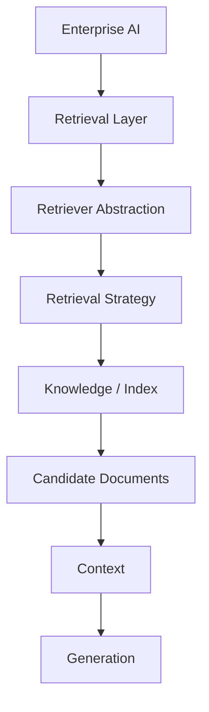
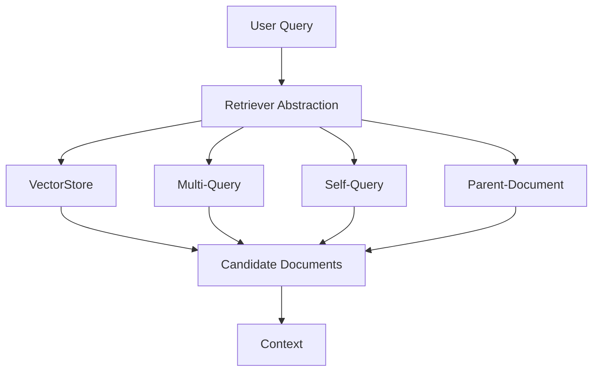

---

title: "Architecting the Retrieval Layer for Enterprise RAG"
description: "An architecture-focused guide to building enterprise retrieval layers with retriever abstractions, VectorStore, Multi-Query, Self-Query, Parent-Document retrieval, strategy selection, composability, and production trade-offs."
keywords:
  - Enterprise Retrieval Architecture
  - Enterprise RAG Architecture
  - Retrieval Layer Architecture
  - Enterprise AI Architecture
  - Retriever Abstraction
  - VectorStore Retrieval
  - Multi-Query Retrieval
  - Self-Query Retrieval
  - Parent-Document Retrieval
  - Enterprise RAG
  - Retrieval Strategy Selection
  - RAG Retrieval Engineering
  - AI Architecture
  - Production RAG
  - Retrieval Optimization

---

# 2.2 — Architecting the Retrieval Layer for Enterprise RAG

## Architecture Insight

Retrieval is often simplified to:

```text
User Query → Vector Database → Context → LLM
```

That model works for basic RAG, but enterprise systems usually have much more complex retrieval requirements.

Different queries may require:

- Semantic similarity
- Broader query coverage
- Metadata filtering
- Fine-grained retrieval with broader context
- Different precision/recall trade-offs
- Different latency and cost characteristics

This leads to an important architectural question:

> **Should retrieval be treated as a database operation, or as an independent capability of the Enterprise AI system?**

For production Enterprise RAG, retrieval should become its own architectural layer.

---

# 1. Enterprise Retrieval Layer

A clean architecture separates the application from the retrieval implementation:

```text
Enterprise AI
      ↓
Retrieval Layer
      ↓
Retriever Abstraction
      ↓
Retrieval Strategy
      ↓
Knowledge / Index
      ↓
Candidate Documents
      ↓
Context
      ↓
Generation
```

The application should request knowledge without needing to understand how that knowledge is retrieved.

### Responsibility Separation

```text
Application Layer
    ↓
Defines the business request

Retrieval Layer
    ↓
Determines how knowledge is retrieved

Knowledge Layer
    ↓
Owns enterprise information

Generation Layer
    ↓
Uses retrieved evidence
```

This separation allows retrieval strategies to evolve without constantly changing application logic.

---

# 2. Enterprise Retrieval Architecture



The Retrieval Layer becomes an independent capability with its own:

- Interfaces
- Strategies
- Performance characteristics
- Evaluation criteria
- Failure modes
- Operational controls

---

# 3. Retriever Abstraction

The most important architectural pattern is the **retriever abstraction**.

Instead of coupling the application directly to a specific retrieval implementation:

```text
Application
    ↓
Vector Database API
```

use:

```text
Application
    ↓
Retriever Interface
    ↓
Retrieval Implementation
    ↓
Knowledge / Index
```

Conceptually:

```text
RAG Application
       ↓
Retriever Interface
       ↓
┌─────────────────────────────┐
│ VectorStore Retriever       │
│ Multi-Query Retriever       │
│ Self-Query Retriever        │
│ Parent-Document Retriever   │
└─────────────────────────────┘
       ↓
Enterprise Knowledge
```

A simplified interface could be:

```java
public interface Retriever {

    /**
     * Retrieves enterprise knowledge relevant to the query.
     */
    List<Document> retrieve(Query query);
}
```

The application depends on the abstraction rather than the underlying retrieval technology.

---

# 4. Core Retrieval Strategies

## VectorStore Retrieval

The baseline retrieval pattern:

```text
User Query
    ↓
Embedding
    ↓
Vector Search
    ↓
Top-K Candidates
```

It works well for straightforward semantic retrieval and provides the foundation for more advanced strategies.

---

## Multi-Query Retrieval

A single query may not represent every relevant interpretation.

```text
User Query
    ↓
Query A
Query B
Query C
    ↓
Multiple Retrieval Paths
    ↓
Candidate Aggregation
```

Multi-Query retrieval can improve recall for:

- Broad questions
- Ambiguous queries
- Underspecified questions
- Queries with multiple semantic interpretations

The architectural trade-off is additional model calls, retrieval operations, latency, and cost.

---

## Self-Query Retrieval

Self-Query retrieval introduces structured metadata constraints into the retrieval process.

```text
"Find HR policies for Germany from 2025"
                 ↓
        Query Understanding
                 ↓
     Semantic Query + Filters
                 ↓
        Metadata-Aware Search
```

Useful metadata may include:

- Department
- Country
- Business unit
- Document type
- Year
- Classification

However:

> **Metadata filtering is a retrieval capability, not an authorization mechanism.**

Security and authorization must remain enforced by the appropriate enterprise control boundaries.

---

## Parent-Document Retrieval

Parent-Document retrieval separates retrieval granularity from generation context.

```text
Large Parent Document
        ↓
Small Child Chunks
        ↓
Vector Retrieval
        ↓
Matching Child
        ↓
Parent Resolution
        ↓
Broader Context
```

The child representation supports precise retrieval while the parent provides additional context.

This addresses an important architectural tension:

> **Smaller retrieval units can improve precision, while larger context can improve contextual completeness.**

---

# 5. Multiple Retriever Strategy Architecture

Retrieval strategies can also be composed.



A more advanced pipeline could look like:

```text
User Query
    ↓
Multi-Query
    ↓
Metadata Constraints
    ↓
Vector Retrieval
    ↓
Child Candidates
    ↓
Parent Resolution
    ↓
Context Selection
```

The important architectural principle is **composability**.

Not every query needs every strategy.

The Retrieval Layer should be able to select or compose the strategies appropriate for the request.

---

# 6. Retrieval Strategy Selection

There is no universally best retriever.

The correct question is:

> **What retrieval problem are we solving?**

Strategy selection should consider several dimensions.

### Query Characteristics

Is the query:

- Simple?
- Broad?
- Ambiguous?
- Conversational?
- Metadata-heavy?

### Metadata

Does the knowledge corpus contain useful structured metadata?

If yes, metadata-aware retrieval may provide better control.

### Document Structure

Are documents:

- Short and self-contained?
- Long and hierarchical?
- Organized into sections?
- Naturally represented through parent-child relationships?

### Precision vs Recall

Some workloads require broader candidate coverage.

Others require highly precise evidence.

### Latency

Additional query transformations and retrieval stages increase processing time.

### Cost

Additional model calls and retrieval operations increase operational cost.

### Complexity

Every additional strategy introduces:

- More components
- More configuration
- More failure modes
- More monitoring requirements

Therefore:

> **Advanced retrieval should solve a demonstrated problem, not exist simply because it is more sophisticated.**

---

# 7. Precision vs Recall

Retrieval architecture often involves balancing recall and precision.

```text
Higher Recall
    ↓
Broader Candidate Set
    ↓
More Coverage
    ↓
Potentially More Noise
```

versus:

```text
Higher Precision
    ↓
More Selective Results
    ↓
Less Noise
    ↓
Potentially Missed Evidence
```

A production architecture may therefore separate candidate generation from final context selection:

```text
Candidate Generation
        ↓
Broader Retrieval
        ↓
Candidate Filtering
        ↓
Context Selection
        ↓
Generation
```

This separation allows different stages to optimize for different objectives.

---

# 8. Retrieval → Candidate Documents → Context

The retrieval boundary should remain explicit.


The Retrieval Layer finds and prepares evidence.

The Generation Layer consumes that evidence.

This separation improves:

- Testing
- Evaluation
- Observability
- Optimization
- Replaceability
- Independent evolution

---

# 9. Retrieval Composability

A mature Retrieval Layer should support composition.

For example:

```text
Multi-Query
    ↓
Metadata Filtering
    ↓
Vector Retrieval
    ↓
Parent Resolution
    ↓
Context Selection
```

But composition should be driven by the retrieval problem.

A simple query may only require:

```text
Query → Vector Retrieval → Context
```

A complex enterprise query may require:

```text
Query
  ↓
Query Transformation
  ↓
Metadata Constraints
  ↓
Multiple Retrieval Paths
  ↓
Candidate Formation
  ↓
Context Resolution
```

The architecture should support both without changing the application layer.

---

# 10. Latency and Cost

Retrieval is also a performance architecture.

More sophisticated retrieval can improve quality while increasing:

- Model calls
- Search operations
- Processing time
- Data movement
- Token usage
- Infrastructure cost

Conceptually:

```text
Simple Vector Retrieval
        ↓
Lower Complexity
Lower Latency
Lower Cost

Advanced Retrieval Pipeline
        ↓
Higher Capability
Higher Complexity
Potentially Higher Latency
Potentially Higher Cost
```

The goal is not maximum retrieval complexity.

The goal is:

> **The simplest retrieval architecture that reliably solves the problem.**

---

# 11. Retrieval Boundaries

Avoid coupling business logic directly to:

- Vector database APIs
- Embedding implementations
- Framework-specific retrievers
- Metadata filter syntax
- Chunking assumptions

Prefer:

```text
Application
    ↓
Retriever Interface
    ↓
Strategy
    ↓
Adapter / Implementation
    ↓
Knowledge / Index
```

This creates a stable architectural boundary.

The underlying retrieval implementation can evolve without forcing changes throughout the application.

---

# 12. Backend Architecture Parallel

The same pattern already exists in traditional backend systems.

### Backend

```text
Service
   ↓
Repository / Provider Interface
   ↓
Implementation
   ↓
Database
```

The service does not need to know whether the implementation uses PostgreSQL, MongoDB, Redis, or another datastore.

### Enterprise AI

```text
AI Application
   ↓
Retriever Interface
   ↓
Retrieval Implementation
   ↓
Knowledge / Index
```

The AI application should not need to know whether retrieval uses:

- VectorStore
- Multi-Query
- Self-Query
- Parent-Document
- Another future strategy

This is the same architectural principle:

> **Depend on capabilities and interfaces, not implementation details.**

---

# 13. Architectural Anti-Patterns

## Vector Database = Retrieval Architecture

A vector store is an implementation component, not the entire retrieval subsystem.

## Hard-Coding One Retriever

Different query types can require different retrieval behavior.

## Retrieval Logic Inside Business Code

This creates tight coupling and makes retrieval difficult to evolve.

## Using Every Advanced Technique

Complexity should be justified by measurable improvement.

## Ignoring Latency and Cost

Retrieval quality cannot be evaluated independently from operational constraints.

## Treating Metadata Filters as Authorization

Search constraints must never replace enterprise authorization controls.

---

# 14. Architect Mental Model

Think of Enterprise Retrieval as a capability stack:

```text
Retrieval Layer
│
├── Retriever Abstraction
│
├── Strategy Selection
│
├── Query Transformation
│
├── Retrieval Strategies
│   ├── VectorStore
│   ├── Multi-Query
│   ├── Self-Query
│   └── Parent-Document
│
├── Candidate Formation
│
├── Context Selection
│
└── Quality / Performance Controls
```

This model allows the retrieval subsystem to evolve independently from the application and generation layers.

---

# 15. Architecture Decision Framework

Before introducing a retrieval strategy, ask:

1. What retrieval problem are we solving?
2. Is the problem recall, precision, metadata, context, or query interpretation?
3. What is the structure of the knowledge corpus?
4. What metadata is available?
5. What latency is acceptable?
6. What cost is acceptable?
7. Can the strategy compose with existing retrieval?
8. How will improvement be measured?
9. What additional operational complexity does it introduce?
10. Does the improvement justify that complexity?

A retrieval strategy should earn its place in the architecture through **measurable improvement**.

---

# 16. Architect Takeaway

Enterprise RAG should not treat retrieval as:

> **"The vector database step."**

Retrieval should be treated as an **independent architectural layer**.

A mature Retrieval Layer provides:

- Stable retriever abstractions
- Multiple retrieval strategies
- Explicit strategy selection
- Composable retrieval capabilities
- Clear boundaries
- Precision/recall control
- Latency and cost awareness
- Separation from generation
- Framework-independent interfaces
- Evaluation-driven evolution

The objective is not simply to retrieve more documents.

The objective is to build a Retrieval Layer that can evolve as **enterprise knowledge, query patterns, workloads, and AI capabilities evolve.**

---

# 17. Further Reading

For deeper coverage of Core Retrieval Engineering, including VectorStore Retrieval, Multi-Query Retrieval, Self-Query Retrieval, Parent-Document Retrieval, retriever comparison, strategy selection, and production considerations:

[Advanced RAg Architetcure](https://enterpriseai.handbook.mihirkjha.com/05-advanced-retrieval-augmented-generation/)


**Enterprise AI Engineering Handbook — Core Retrieval Engineering**