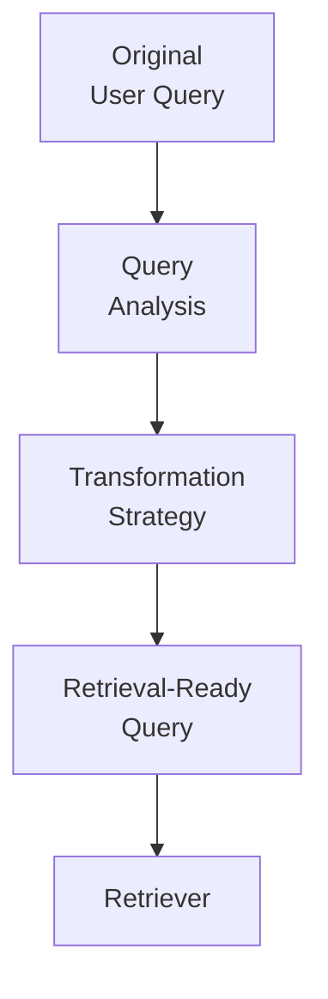
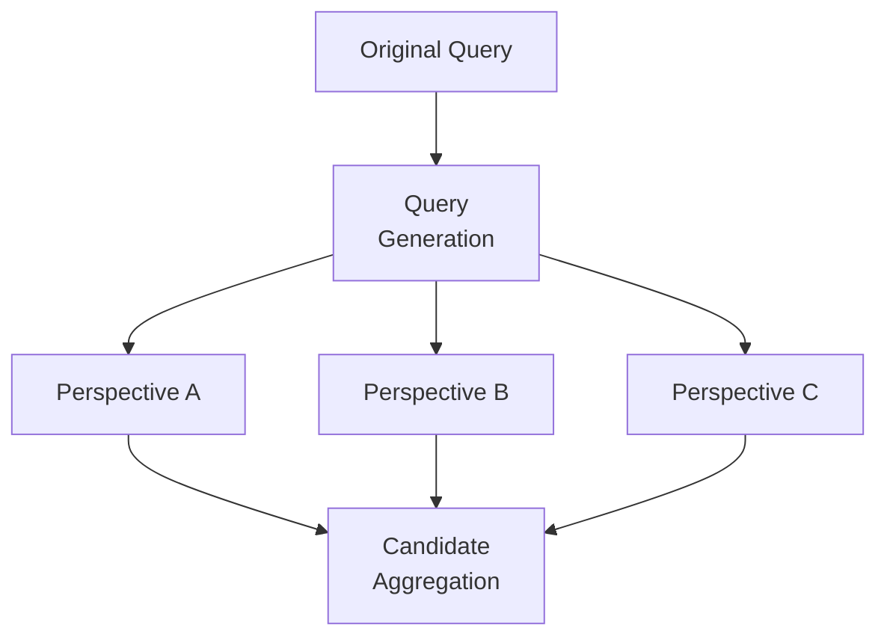
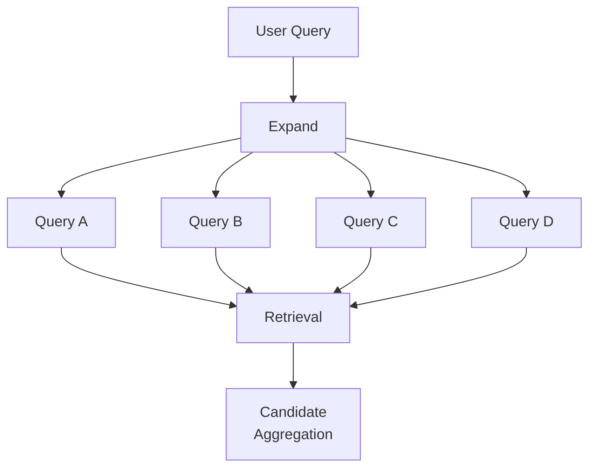
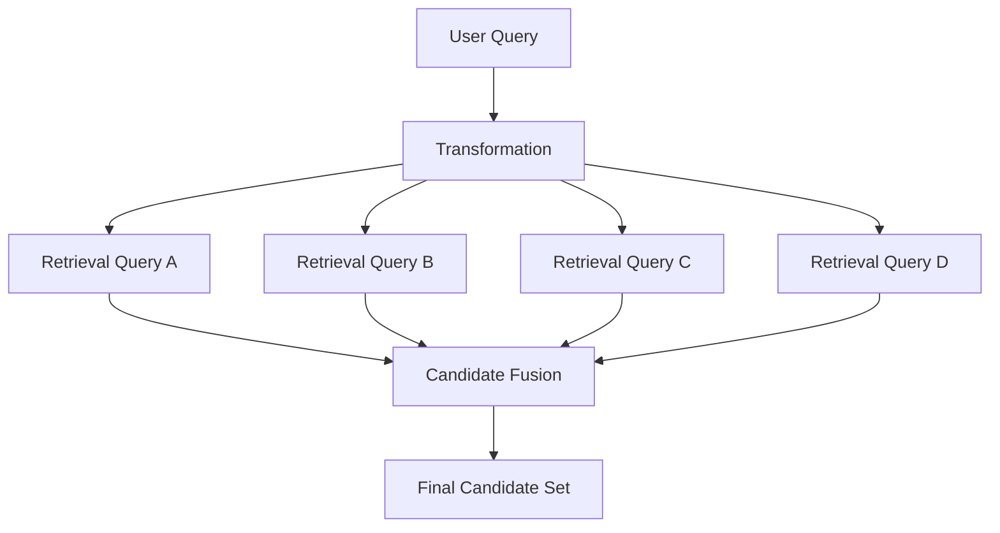
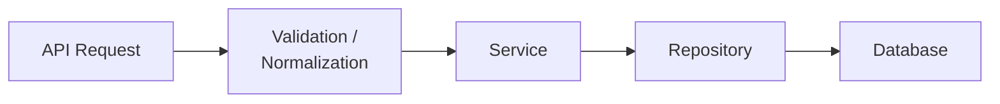
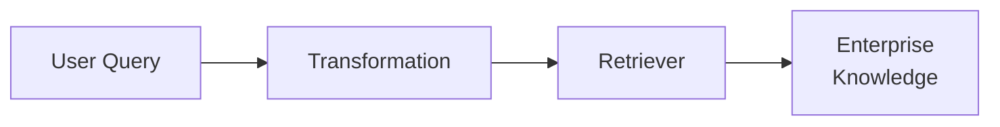

---

title: "Engineering Query Transformation Pipelines for Enterprise Retrieval"
description: "An architecture-focused guide to designing enterprise query transformation pipelines with query rewriting, query expansion, query decomposition, Multi-Query retrieval, candidate aggregation, retrieval coverage, and production trade-offs."
keywords:
  - Enterprise Query Transformation
  - Enterprise Retrieval Architecture
  - Enterprise RAG Architecture
  - Query Transformation Pipeline
  - Query Rewriting
  - Query Expansion
  - Query Decomposition
  - Multi-Query Retrieval
  - Candidate Aggregation
  - Retrieval Coverage
  - Retrieval Recall
  - Enterprise RAG
  - AI Architecture
  - Production RAG
  - Retrieval Optimization

---  

# Engineering Query Transformation Pipelines for Enterprise Retrieval

## Overview

In Enterprise RAG, the user's original question is not always the best query for the retrieval system.

Enterprise knowledge bases often contain their own terminology, document structures, policies, abbreviations, and domain-specific language. A user may ask a question using natural language that does not map cleanly to how the information is represented in the corpus.

This creates an architectural problem:

> How do we improve retrieval coverage without changing the user's intent?

The answer is to introduce **Query Transformation as an explicit architectural layer** between user intent and retrieval execution.

The goal is not to make queries more complicated.

The goal is to make the user's intent easier for the retrieval system to find.

---

# 1. Why Query Transformation Matters

A single query can be insufficient for several reasons.

### Ambiguous queries

The question may have multiple possible interpretations.

### Broad queries

A single question may contain several concepts that are difficult to retrieve through one search path.

### Underspecified queries

The user may use terminology that differs from the terminology used in enterprise documents.

For example:

> "Remote work policy in Germany?"

The enterprise corpus might use terms such as:

- Remote Work Policy
- International Remote Working
- Cross-Border Employment
- Germany Employee Mobility
- Work From Abroad

A conventional retrieval pipeline may retrieve only a subset of the relevant evidence.

Query transformation provides additional retrieval representations while preserving the original user intent.

---

# 2. Query Transformation as an Architectural Layer

The transformation layer should sit between **query understanding** and **retrieval execution**.



The important architectural boundary is:

**User Intent → Query Transformation → Retrieval**

The application should not need to know whether the retrieval system uses rewriting, expansion, decomposition, or Multi-Query generation.

That implementation detail belongs inside the transformation capability.

---

# 3. Core Transformation Strategies

Different query characteristics require different transformation strategies.

## Query Rewriting

Rewriting changes the wording of a query so that it aligns more closely with enterprise terminology.

Example:

```text
User:
"Remote work policy in Germany?"

↓

"Germany remote work policy"
```

The rewrite should improve retrieval alignment without silently changing the user's intent.

---

## Query Expansion

Expansion adds related terminology or concepts that may improve retrieval coverage.

For example:

```text
Remote work Germany
        ↓
Remote work
Germany
international remote work
cross-border work
employee mobility
```

Expansion is useful when the corpus expresses the same concept using different terminology.

---

## Query Decomposition

Complex questions can be divided into smaller retrieval problems.

For example:

```text
"What is the remote work policy for employees
working from Germany, and what tax restrictions apply?"
```

can become:

```text
Query A → Germany remote work policy
Query B → Germany employee tax restrictions
```

The resulting evidence can later be aggregated.

---

## Multi-Query Retrieval

Instead of relying on one retrieval representation, the system generates multiple perspectives of the same user intent.

This can improve candidate coverage when one query misses relevant terminology or context.

---

# 4. Original Query → Multiple Retrieval Queries



The architectural benefit is that multiple retrieval paths can explore different representations of the same intent.

However, every additional path introduces additional retrieval work.

Therefore, Multi-Query retrieval is a **coverage-versus-overhead decision**, not an automatic improvement.

---

# 5. Query Expansion and Candidate Aggregation

Transformation can widen retrieval while keeping the application contract unchanged.



The application still submits one user request.

The transformation layer determines whether that request should result in one or several retrieval operations.

This separation allows the retrieval strategy to evolve without forcing application-level changes.

---

# 6. Transformation → Retrieval → Fusion

When several transformed queries are executed, their results need to converge into a common candidate pipeline.



This creates an important architectural separation:

**Transformation generates retrieval paths.**

**Retrieval executes those paths.**

**Fusion brings their candidates back into a common evidence pipeline.**

The deeper implementation of candidate fusion belongs in the retrieval architecture rather than inside the application.

---

# 7. Coverage and Recall

The primary reason to transform queries is to improve **retrieval coverage and recall**.

With a single query:

```text
One representation
        ↓
One retrieval path
        ↓
Potentially limited candidate coverage
```

With transformed queries:

```text
Multiple representations
        ↓
Multiple retrieval paths
        ↓
Broader candidate coverage
        ↓
Aggregated candidate set
```

But more queries do not automatically mean better retrieval.

The objective is:

> **Better recall and candidate coverage without unnecessary retrieval overhead.**

Poor transformation can introduce irrelevant candidates, increase noise, or even move the query away from the user's actual intent.

---

# 8. Query Complexity Is an Architecture Decision

Transformation should be applied selectively.

A useful architecture considers:

| Factor | Architectural Question |
|---|---|
| Query complexity | Is one retrieval representation sufficient? |
| Ambiguity | Could multiple interpretations exist? |
| Corpus terminology | Does user wording differ from enterprise terminology? |
| Candidate coverage | Is the current retrieval path missing relevant evidence? |
| Recall | Would additional perspectives recover useful candidates? |
| Query drift | Could transformation change the original intent? |
| Overhead | Is the expected improvement worth the additional work? |

The system should avoid transforming every query simply because transformation is available.

---

# 9. Latency and Cost

Every additional transformation or retrieval path introduces overhead.

```text
Original Query
      ↓
Transformation
      ↓
Multiple Retrievals
      ↓
Aggregate / Fuse
      ↓
Evaluate Candidates
```

Additional work can include:

- extra model calls
- additional retrieval operations
- increased vector or search infrastructure usage
- candidate aggregation
- additional latency

Therefore, transformation should be evaluated using both **retrieval quality and system economics**.

A strategy that improves recall by a small amount but significantly increases latency may not be appropriate for every request.

This is particularly important in high-volume enterprise systems.

---

# 10. Keep Architecture Boundaries Explicit

The application should express business intent.

It should not own transformation implementation details.

```text
APPLICATION
    ↓
Business Intent
    ↓
TRANSFORMATION LAYER
    ↓
Rewrite / Expand / Decompose / Multi-Query
    ↓
RETRIEVAL LAYER
    ↓
Retriever Strategy
    ↓
Knowledge
```

### Application

Responsible for the user request and business workflow.

### Transformation Layer

Responsible for analyzing and transforming the retrieval representation.

### Retrieval Layer

Responsible for executing knowledge access and producing candidates.

This separation makes the transformation capability **replaceable, measurable, and independently evolvable**.

---

# 11. Transformation Is Not Authorization

Query transformation should never become a mechanism for deciding what the user is allowed to access.

A transformed query may broaden retrieval.

It must not broaden authorization.

The architecture should therefore maintain separate boundaries:

```text
User Identity
     ↓
Authorization / Access Control
     ↓
Query Transformation
     ↓
Retrieval
     ↓
Authorized Knowledge
```

Transformation answers:

> "How should we represent this intent for retrieval?"

Authorization answers:

> "What information is this user permitted to access?"

These are different architectural responsibilities.

---

# 12. Backend Architecture Parallel

The same separation exists in conventional backend systems.



Enterprise AI applies the same architectural principle:



A backend service does not normally embed database implementation details directly into the API layer.

Likewise, an Enterprise AI application should not hard-code retriever-specific query transformation logic.

The system should depend on **capabilities and interfaces rather than implementation details**.

---

# 13. A Simple Architectural Interface

The transformation capability can be represented conceptually as:

```java
interface QueryTransformer {

    TransformationResult transform(
        UserQuery query,
        RetrievalContext context
    );
}
```

Different strategies can then implement the same architectural capability:

```text
QueryTransformer
    ├── RewriteTransformer
    ├── ExpansionTransformer
    ├── DecompositionTransformer
    └── MultiQueryTransformer
```

The point is not the interface itself.

The important architectural idea is that **query transformation becomes an independently replaceable capability**.

---

# 14. Observability and Measurement

Because transformation affects retrieval quality, it should be measurable independently.

Useful signals include:

- original query
- transformed queries
- transformation strategy
- number of generated queries
- retrieval latency
- candidate count
- candidate coverage
- downstream relevance
- transformation failures
- query drift indicators
- model/token cost

This makes it possible to answer an important production question:

> Did transformation actually improve retrieval enough to justify its cost?

Without measurement, query transformation can easily become an opaque layer that adds complexity without demonstrable value.

---

# 15. Architect Takeaway

Query transformation is not merely a prompt-engineering trick.

It is an **architectural capability between user intent and enterprise retrieval**.

The core pattern is:

```text
USER INTENT
    ↓
TRANSFORMATION
    ↓
MULTIPLE RETRIEVAL PATHS
    ↓
CANDIDATE FUSION
    ↓
EVIDENCE
```

Use transformation when a single retrieval representation cannot provide sufficient coverage.

The architecture should continuously balance:

**Recall • Coverage • Latency • Cost • Complexity • Intent Preservation**

The strongest design is not the one that generates the most queries.

It is the one that generates **enough useful retrieval perspectives to improve evidence discovery without creating unnecessary system overhead**.

---

# 16. Further Reading

For deeper coverage of Core Retrieval Engineering, including VectorStore Retrieval, Multi-Query Retrieval, Self-Query Retrieval, Parent-Document Retrieval, retriever comparison, strategy selection, and production considerations:

[Advanced RAg Architetcure](https://enterpriseai.handbook.mihirkjha.com/05-advanced-retrieval-augmented-generation/)


**Enterprise AI Engineering Handbook — Core Retrieval Engineering**

---
