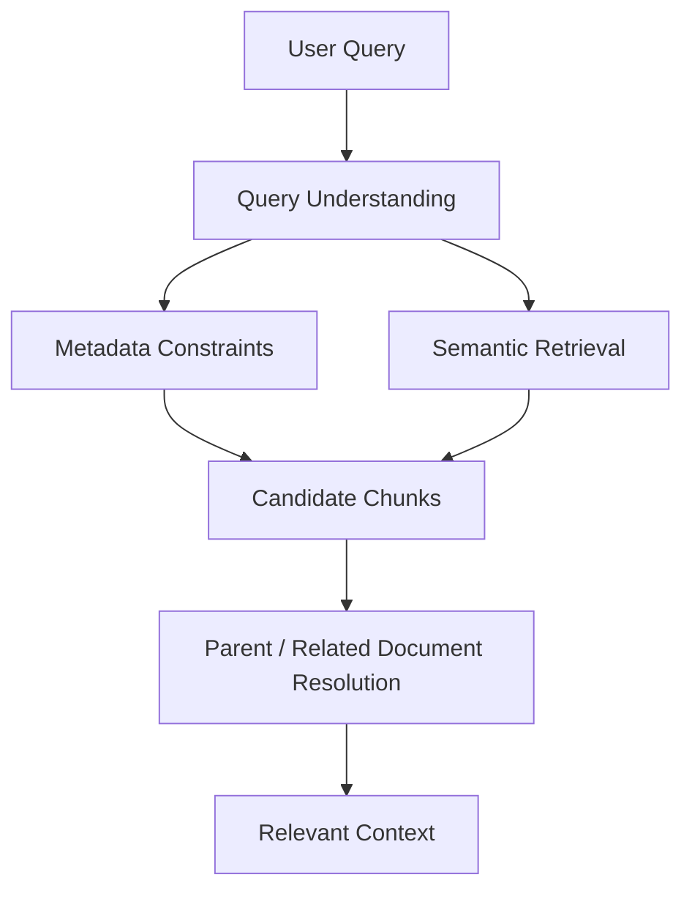
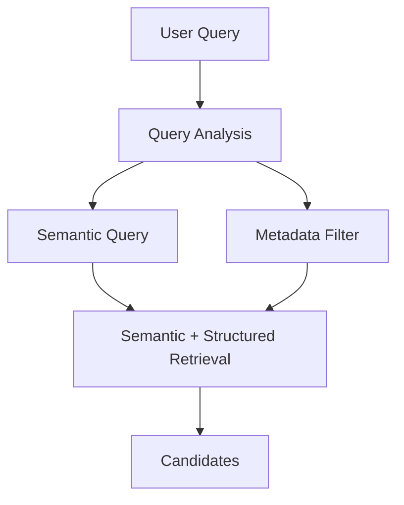
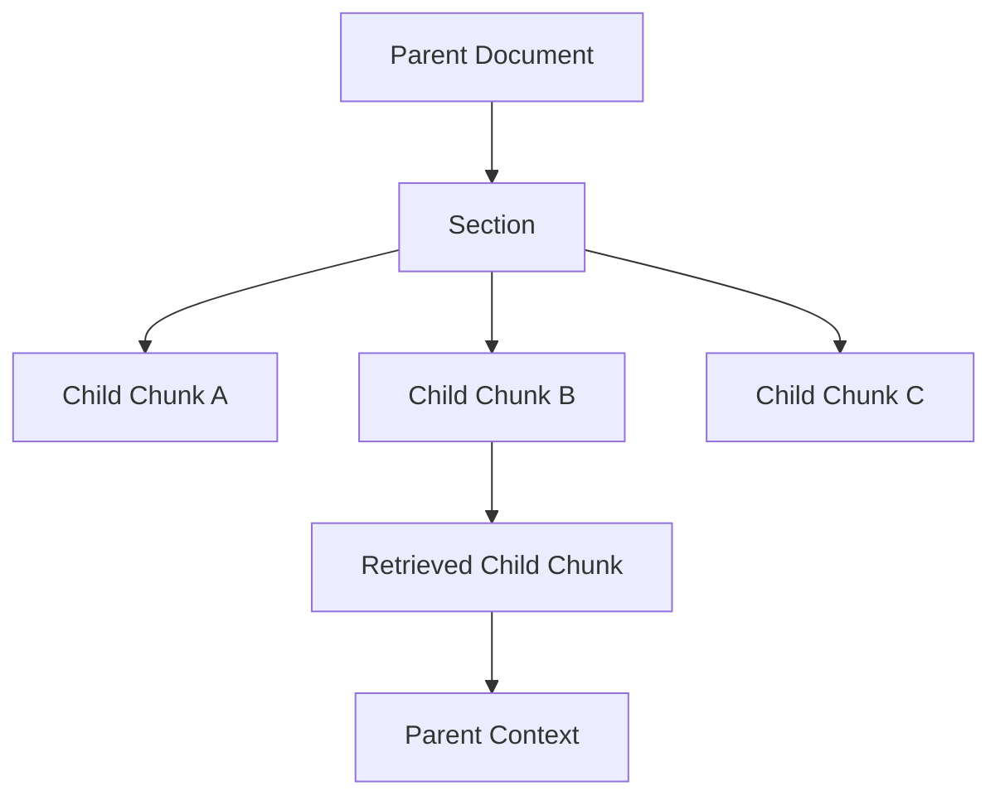
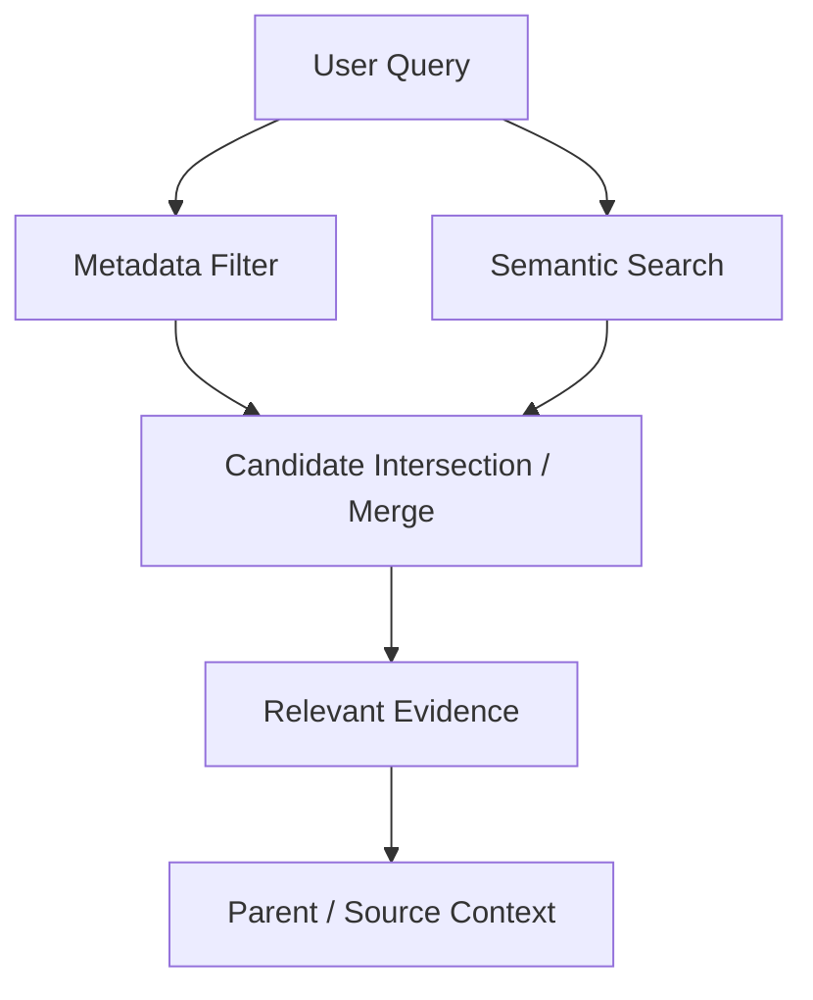

---

title: "Structuring Metadata & Document-Aware Retrieval"
description: "An architecture-focused guide to designing enterprise retrieval with metadata-aware filtering, Self-Query retrieval, document hierarchy, Parent-Document retrieval, structured and semantic signals, and source-document relationships."
keywords:
  - Metadata-Aware Retrieval
  - Document-Aware Retrieval
  - Enterprise Retrieval Architecture
  - Enterprise RAG Architecture
  - Enterprise AI Architecture
  - Self-Query Retrieval
  - Metadata Filtering
  - Parent-Document Retrieval
  - Document Hierarchy
  - Chunk to Parent Retrieval
  - Structured Retrieval
  - Semantic Retrieval
  - Enterprise RAG
  - Retrieval Engineering
  - Production RAG

---

# Structuring Metadata & Document-Aware Retrieval

## Overview

Enterprise RAG retrieval should not treat every chunk as an isolated piece of text.

Enterprise documents carry structure:

- Document
- Section
- Chunk
- Region or scope
- Version
- Effective date
- Owner
- Status
- Relationships to other documents

When retrieval ignores this structure, a semantically similar chunk can still be the wrong evidence because it may belong to the wrong document, region, version, or context.

A stronger retrieval architecture makes **metadata, hierarchy, and document relationships first-class retrieval signals**.

The goal is simple:

> **Retrieve the right evidence from the right document within the right enterprise context.**

---

# 1. Why Chunk-Only Retrieval Is Not Enough

Traditional semantic retrieval often follows:

```text
User Query
    ↓
Semantic Search
    ↓
Similar Chunks
    ↓
Context
```

This works when the meaning of a chunk is largely independent of its surrounding document.

Enterprise knowledge is often different.

A chunk may contain the answer but not contain:

- the document's effective date
- the policy's region or scope
- the parent section
- the source document
- the document's status
- the relationship to another document

For example:

> "What is the remote-work policy for employees in Germany?"

A retrieval system should not simply find chunks containing similar concepts.

It may need to identify:

```text
Country     = Germany
Document    = Remote Work Policy
Status      = Active
Version     = Current
Scope       = Employees
```

This changes retrieval from:

**"Find similar text."**

to:

**"Find relevant text within the correct enterprise context."**

---

# 2. Metadata-Aware Retrieval Architecture

The architecture introduces metadata alongside semantic retrieval.



The responsibilities are intentionally separated.

### Query Understanding

Determines what the user is asking and identifies useful retrieval constraints.

### Metadata Constraints

Applies structured conditions such as region, document type, status, version, or scope.

### Semantic Retrieval

Finds content based on meaning, terminology, and conceptual similarity.

### Candidate Chunks

Represents the initial evidence discovered by retrieval.

### Document Resolution

Restores parent or related document context.

This creates a retrieval architecture that combines **structured constraints with semantic understanding**.

---

# 3. Metadata as a Retrieval-Control Mechanism

Metadata should not be treated as passive information attached to a chunk.

It can actively control retrieval.

Four important uses are:

### Filter

Restrict candidates using attributes such as:

```text
region
document type
status
version
scope
```

### Rank

Use structured signals to influence candidate priority where appropriate.

### Expand

Move from a precise child chunk toward useful parent context.

### Resolve

Maintain the relationship between retrieved evidence and its source document.

The result is not simply "more metadata."

It is **more controlled retrieval**.

---

## Sample Metadata Model

A simple document metadata representation might look like:

```python
document_metadata = {
    "document_id": "policy-remote-work-2026",
    "document_type": "policy",
    "country": "Germany",
    "department": "HR",
    "status": "active",
    "version": "2026.1",
    "effective_date": "2026-01-01"
}
```

The important architectural point is not the dictionary itself.

It is that these attributes become **retrieval-relevant fields** with defined semantics.

A production system should establish consistent metadata definitions rather than allowing every ingestion pipeline to invent its own fields.

---

# 4. Self-Query Retrieval

Users naturally express structured constraints in ordinary language.

For example:

> "Show me the active remote-work policy for employees in Germany."

The query contains both:

### Semantic meaning

```text
remote-work policy
employees
```

and:

### Structured constraints

```text
country = Germany
status = active
```

A Self-Query retrieval architecture can translate these parts into a semantic query and metadata filter.



A framework-neutral abstraction could look like:

```python
query = "Active remote-work policy for employees in Germany"

structured_query = query_analyzer.parse(query)

results = retriever.search(
    query=structured_query.semantic_query,
    filters=structured_query.metadata_filters
)
```

The important architectural separation is:

**Natural Language → Query Analysis → Semantic Query + Metadata Filters → Retrieval**

Self-Query retrieval does not replace semantic retrieval.

It adds structured constraints to the retrieval operation.

---

# 5. Metadata Filtering

Metadata filtering can significantly narrow the candidate space.

Conceptually:

```text
Large Knowledge Base
        ↓
Metadata Constraints
        ↓
Eligible Candidate Space
        ↓
Semantic Retrieval
        ↓
Relevant Candidates
```

Possible metadata dimensions include:

| Metadata | Example |
|---|---|
| Region | Germany |
| Document Type | Policy |
| Status | Active |
| Version | Current |
| Department | HR |
| Scope | Employees |
| Effective Date | 2026-01-01 |

A compact retrieval interface might be:

```python
filters = {
    "country": "Germany",
    "status": "active",
    "document_type": "policy"
}

results = retriever.search(
    query="remote work policy",
    filters=filters,
    top_k=5
)
```

This demonstrates the architectural pattern:

**Semantic Query + Structured Constraints → Retrieval**

The exact filter implementation depends on the underlying retrieval technology, but the architectural contract remains the same.

---

# 6. Document Hierarchy

Enterprise documents are hierarchical.

A simplified structure is:

```text
Document
   ↓
Section
   ↓
Chunk
```

The chunk is often the retrieval unit because smaller units provide useful retrieval precision.

But the chunk may not contain enough context to support a reliable answer.

For example:

```text
Policy Document
    ↓
Remote Work
    ↓
Germany
    ↓
Eligibility Requirements
    ↓
Retrieved Chunk
```

The retrieved chunk may contain the relevant requirement while the parent section contains the conditions that define how that requirement should be interpreted.

Therefore, retrieval needs to preserve the relationship between:

**Child Evidence ↔ Parent Context**

---

# 7. Child Chunk → Parent Document Resolution

Parent-Document retrieval provides a way to preserve this relationship.



The basic flow is:

```text
Retrieve precise child chunk
        ↓
Identify parent relationship
        ↓
Resolve parent section/document
        ↓
Expand useful context
```

A simple conceptual implementation is:

```python
chunk = results[0]

parent = document_store.get(
    chunk.metadata["parent_document_id"]
)

context = {
    "evidence": chunk.text,
    "parent_document": parent.text,
    "source": parent.metadata
}
```

The important field is:

```text
parent_document_id
```

It preserves the relationship between the retrieved child and its source.

This gives the system both:

**Retrieval precision**

and

**Context completeness**

without losing source lineage.

---

# 8. Preserving Source Relationships

A retrieval system should maintain the relationship between retrieved evidence and its originating document.

Conceptually:

```text
Retrieved Chunk
      ↓
Section ID
      ↓
Document ID
      ↓
Document Metadata
```

This makes it possible to answer questions such as:

- Where did this evidence come from?
- Which document contains it?
- Which section contains it?
- Which version is it?
- What is its effective date?
- What scope does it apply to?

Source relationships become particularly important when the same concept exists across multiple documents.

---

# 9. Metadata + Semantic Retrieval

Enterprise retrieval often benefits from combining two complementary signals.

### Structured Signals

Metadata can represent:

```text
region
type
status
version
scope
```

### Unstructured Meaning

Semantic retrieval can represent:

```text
concepts
meaning
terminology
intent
```

The architecture therefore becomes:



Neither signal completely replaces the other.

Metadata provides **contextual control**.

Semantic retrieval provides **meaning-based matching**.

Together they provide a stronger retrieval decision.

---

# 10. Precision Improvement Through Context

Document-aware retrieval addresses several problems that chunk-only retrieval can introduce.

### Without document awareness

Semantically similar chunks may:

- come from the wrong region
- belong to an outdated policy version
- represent inactive information
- lack the surrounding context required for interpretation

The risk becomes:

> **Relevant text, wrong context.**

### With document-aware retrieval

The architecture can:

- constrain the candidate space using metadata
- restore useful parent context
- preserve source relationships

The objective is:

> **The right evidence in the right context.**

---

# 11. Structured + Unstructured Retrieval

The architecture can be viewed as a combination of two retrieval dimensions.

```text
                 Enterprise Query
                       │
          ┌────────────┴────────────┐
          ↓                         ↓
 Structured Signals          Unstructured Meaning
          │                         │
          │                         │
          └────────────┬────────────┘
                       ↓
                Retrieval Decision
                       ↓
                Relevant Evidence
```

Structured retrieval helps answer:

> **Where should we search?**

Semantic retrieval helps answer:

> **What content is relevant?**

Document relationships then help answer:

> **What surrounding context should accompany the evidence?**

This separation creates a more expressive retrieval architecture.

---

# 12. Architecture Boundaries

Several responsibilities must remain separate.

```text
USER / APPLICATION
        ↓
AUTHORIZATION
        ↓
QUERY / METADATA
        ↓
RETRIEVAL
        ↓
DOCUMENT CONTEXT
```

### User / Application

Owns business intent and the user request.

### Authorization

Determines what the user is allowed to access.

### Query / Metadata

Determines how the request becomes retrieval constraints.

### Retrieval

Discovers candidate evidence.

### Document Context

Expands evidence and traces it back to its source.

A critical rule is:

> **Retrieval filtering must operate inside the user's authorized knowledge boundary.**

Metadata filtering should never become an authorization mechanism.

A query can narrow retrieval.

It cannot grant access.

---

# 13. Backend Architecture Parallel

The same architectural principle exists in conventional backend systems.

```text
Traditional Backend

API Request
    ↓
Validation / Normalization
    ↓
Service
    ↓
Repository
    ↓
Enterprise Data
```

Enterprise AI follows a comparable separation:

```text
Enterprise AI

User Query
    ↓
Metadata / Transformation
    ↓
Retriever
    ↓
Enterprise Knowledge
```

The technology is different, but the architectural principle is familiar:

> **Isolate responsibilities and preserve replaceable capabilities.**

The application should not need to understand the internal implementation of metadata filtering, parent resolution, or retriever selection.

---

# 14. Architectural Design Principles

A production-oriented document-aware retrieval architecture should preserve several principles.

### 1. Make metadata explicit

Define important metadata fields as part of the retrieval model rather than treating them as arbitrary attributes.

### 2. Preserve hierarchy

Maintain relationships between:

```text
Document → Section → Chunk
```

### 3. Preserve lineage

Every retrieved chunk should be traceable to its source document and relevant metadata.

### 4. Combine signals deliberately

Use metadata and semantic retrieval for complementary purposes.

### 5. Keep authorization separate

Retrieval constraints must operate within established access boundaries.

### 6. Make context expansion intentional

Do not automatically return an entire document when a smaller parent context is sufficient.

The architecture should expand context because it improves evidence quality, not simply because more context is available.

---

# 15. Observability

Because metadata and document-aware retrieval influence retrieval behavior, they should be observable.

Useful signals include:

```text
Query
Metadata filters
Retriever strategy
Candidate count
Filtered candidate count
Retrieved chunk IDs
Parent document IDs
Metadata match rate
Retrieval latency
Context expansion size
Source lineage
```

This allows architects to investigate questions such as:

> Why was this document retrieved?

> Why was another document excluded?

> Which metadata filter affected the candidate set?

> Did parent-document expansion improve the final context?

Observability turns document-aware retrieval from an opaque mechanism into an explainable system capability.

---

# 16. Architect Takeaway

Document-aware retrieval moves Enterprise RAG beyond isolated chunk similarity.

The architecture can be summarized as:

```text
USER QUERY
    ↓
METADATA + SEMANTIC RETRIEVAL
    ↓
CANDIDATE CHUNKS
    ↓
PARENT / RELATED DOCUMENT RESOLUTION
    ↓
RELEVANT CONTEXT
```

The key signals are:

**Metadata • Hierarchy • Context • Source Relationships**

The goal isn't simply to retrieve similar text.

It is to retrieve:

**the right evidence,  
from the right document,  
within the right enterprise context.**

> **Enterprise retrieval becomes stronger when metadata, hierarchy, and document relationships are treated as first-class retrieval signals rather than information stored alongside the text.**

---

## 17. Further Reading

For deeper coverage of Core Retrieval Engineering, including VectorStore Retrieval, Multi-Query Retrieval, Self-Query Retrieval, Parent-Document Retrieval, retriever comparison, strategy selection, and production considerations:

[Advanced RAG Architetcure](https://enterpriseai.handbook.mihirkjha.com/05-advanced-retrieval-augmented-generation/)


**Enterprise AI Engineering Handbook — Core Retrieval Engineering**

---
