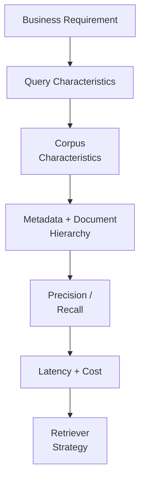
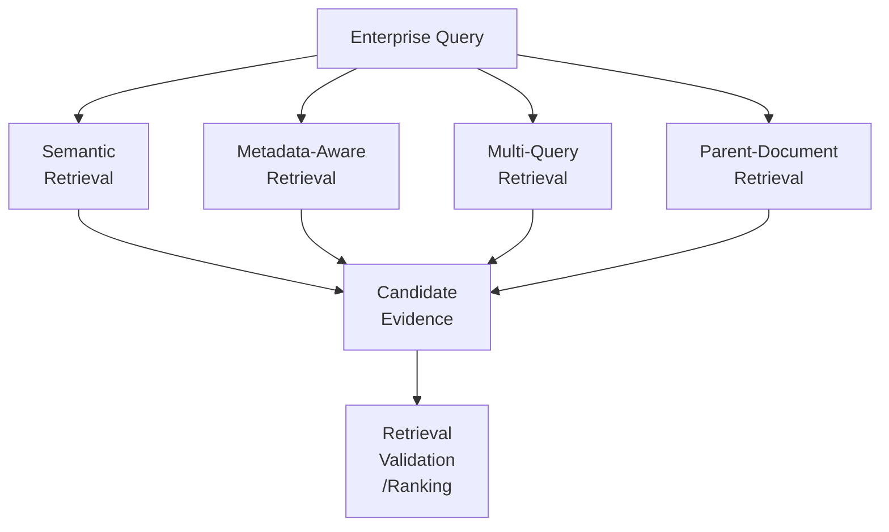
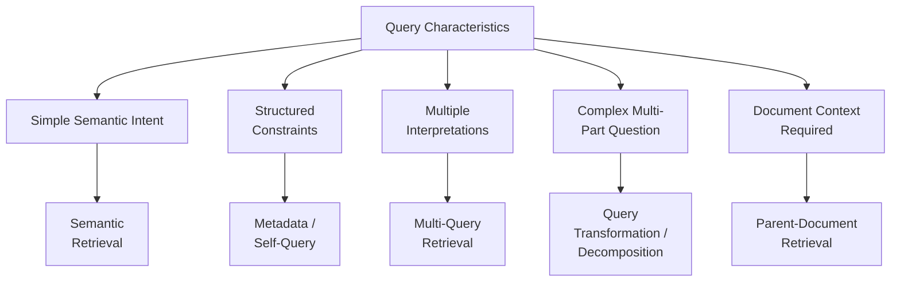
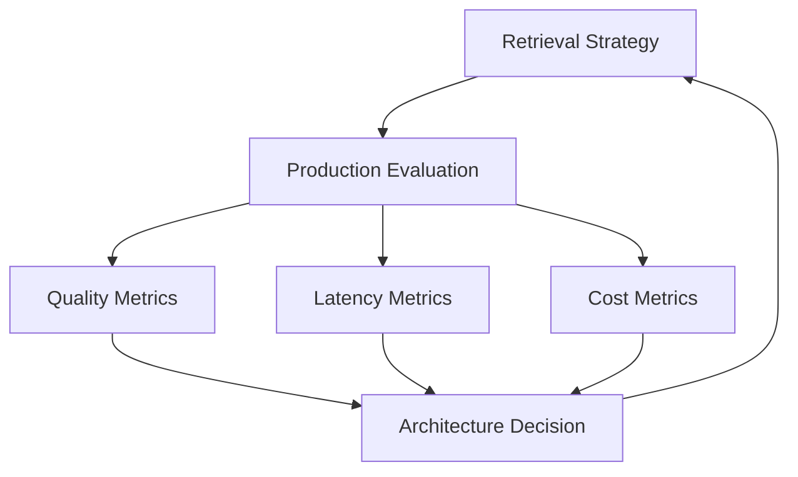
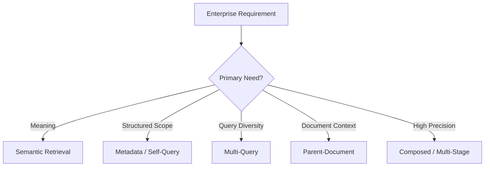

# 2.5 — Architecting Retriever Selection: An Enterprise Decision Framework

## Overview

There is no universally best retriever for Enterprise RAG.

Retriever selection is an **architecture decision** based on the actual enterprise problem:

- Query behavior
- Corpus characteristics
- Metadata availability
- Document hierarchy
- Precision requirements
- Recall requirements
- Knowledge volatility
- Latency
- Cost
- Operational complexity

The objective is not to choose the most sophisticated retriever.

The objective is to choose — and when necessary compose — the retrieval strategy that provides the required quality within acceptable operational constraints.

```text
Business Requirement
        ↓
Query Characteristics
        ↓
Corpus Characteristics
        ↓
Metadata + Document Structure
        ↓
Precision / Recall Requirements
        ↓
Latency + Cost Constraints
        ↓
Retriever Strategy
```

This chapter builds on the retrieval capabilities covered earlier in the Enterprise AI Systems Architecture Insights:

- Semantic Retrieval
- Query Transformation
- Metadata-Aware Retrieval
- Self-Query Retrieval
- Parent-Document Retrieval

The next architectural question is:

> **How do we decide which retrieval strategy should actually be used?**

---

## 1. Why There Is No Universally Best Retriever

Different enterprise questions create different retrieval requirements.

A simple question such as:

> "What is our parental leave policy?"

may be well served by semantic retrieval.

A constrained question such as:

> "What is the active remote-work policy for employees in Germany?"

introduces metadata requirements.

A complex question may require query transformation or decomposition.

A question about a long policy document may require retrieving a precise child chunk and then resolving its parent document for additional context.

Therefore, the architecture should begin with:

```text
Problem
   ↓
Requirements
   ↓
Retrieval Strategy
```

rather than:

```text
Popular Technique
   ↓
Force Every Query Through It
```

The core principle is:

> **Choose the retrieval strategy because the problem requires it, not because the technique is popular.**

Retriever selection should be treated similarly to other backend architecture decisions.

A backend architect does not choose a database, cache, or messaging system simply because it is popular.

The decision starts with the workload.

Retrieval should follow the same discipline.

---

## 2. Diagram 1 — Enterprise Retriever Selection Decision Flow



Each stage contributes evidence to the retrieval decision.

### Query Characteristics

Consider:

- Is the query simple or multi-part?
- Does it contain explicit constraints?
- Does it require multiple interpretations?
- Does it require broad evidence coverage?
- Does it depend on document relationships?

### Corpus Characteristics

Consider:

- Is the corpus homogeneous or heterogeneous?
- Is the content structured or unstructured?
- Is metadata reliable?
- Is the knowledge stable or frequently changing?
- Are parent-child document relationships available?

### Quality Requirements

Consider:

- Is recall more important?
- Is precision more important?
- How much irrelevant evidence is acceptable?
- How much relevant evidence can safely be missed?

### Operational Requirements

Consider:

- Maximum acceptable latency
- Number of model calls
- Number of retrieval calls
- Infrastructure cost
- Failure modes
- Observability requirements
- Operational complexity

Retriever selection should therefore be made across **business, data, quality, and operational dimensions**.

---

## 3. Retriever Comparison

Different retrieval strategies are architectural building blocks rather than competing products.

| Strategy | Strong Fit | Main Trade-off |
|---|---|---|
| Semantic Retrieval | Meaning-focused queries | May miss structured constraints |
| Metadata-Aware / Self-Query | Structured enterprise scope | Depends on metadata quality |
| Multi-Query Retrieval | Multiple query perspectives | More retrieval work |
| Parent-Document Retrieval | Hierarchical documents | Requires document lineage |
| Composed Retrieval | High-quality production retrieval | Higher operational complexity |

This is not a ranking.

A strategy that is excellent for one workload may be unnecessary or even counterproductive for another.

For example, adding Multi-Query retrieval to every request can increase retrieval coverage, but it also increases:

- Retrieval operations
- Candidate processing
- Latency
- Cost
- Failure surface
- Observability requirements

Similarly, aggressive metadata filtering can improve precision while accidentally reducing recall if metadata is incomplete.

The correct question is therefore not:

> "Which retriever is best?"

It is:

> **"Which retrieval strategy best matches this enterprise workload?"**

---

## 4. Diagram 2 — Retriever Comparison Architecture



Different retrieval capabilities can participate in the same enterprise retrieval architecture.

A production system can compose them:

```text
Enterprise Query
      ↓
Query Analysis
      ↓
Metadata Filtering
      ↓
Semantic / Multi-Query Candidate Generation
      ↓
Candidate Aggregation
      ↓
Parent Resolution
      ↓
Ranking
      ↓
Evidence
```

This is an important architectural transition.

A retriever does not always have to be a single mechanism.

It can become a **retrieval pipeline composed of multiple capabilities**.

However:

> **Add complexity only when it solves a measurable retrieval problem.**

---

## 5. Query Characteristics → Retrieval Strategy

A useful architectural mapping is:

```text
Simple semantic intent
        ↓
Semantic Retrieval


Structured constraints
        ↓
Metadata-Aware / Self-Query Retrieval


Multiple interpretations
        ↓
Multi-Query Retrieval


Complex multi-part question
        ↓
Query Transformation / Decomposition


Need broader evidence coverage
        ↓
Candidate Expansion + Aggregation


Document context matters
        ↓
Parent-Document Retrieval
```

### Simple Semantic Intent

When the primary requirement is understanding meaning or topical similarity, semantic retrieval may be sufficient.

Example:

```text
"What is our parental leave policy?"
```

The primary retrieval signal is semantic similarity.

### Structured Constraints

When a query contains constraints such as:

- Country
- Department
- Document type
- Status
- Version
- Effective date

metadata-aware retrieval becomes more valuable.

Example:

```text
"Active remote-work policy for employees in Germany"
```

The retrieval system should understand both:

```text
Semantic Intent
+
Structured Constraints
```

### Multiple Interpretations

When the same user intent can be expressed in several ways, Multi-Query retrieval can generate multiple retrieval perspectives.

This can improve candidate coverage.

The trade-off is additional retrieval work.

### Complex Multi-Part Questions

When a question contains multiple sub-problems, query transformation or decomposition may improve retrieval coverage.

For example:

```text
Question
   ↓
Sub-question A
Sub-question B
Sub-question C
   ↓
Individual Retrieval
   ↓
Candidate Aggregation
```

### Document Context

When precise evidence exists inside a larger hierarchical document, Parent-Document retrieval can reconnect the evidence with its source context.

The retrieval architecture therefore becomes aware of:

```text
Document
   ↓
Section
   ↓
Chunk
   ↓
Evidence
```

rather than treating every chunk as an isolated piece of text.

---

## 6. Diagram 3 — Query Characteristics → Retrieval Strategy



The important architectural point is:

> **Retrieval strategy should be driven by query characteristics.**

The system should not assume that every query needs the same retrieval pipeline.

These mappings are architectural heuristics rather than rigid rules.

Production evaluation should determine whether a strategy actually improves retrieval outcomes.

---

## 7. Precision vs Recall

Retriever selection is strongly influenced by whether the system is more sensitive to:

- Missing relevant evidence
- Retrieving irrelevant evidence

### Recall-Oriented Retrieval

When missing relevant information is expensive, the architecture may favor:

- Broader candidate generation
- Multiple query perspectives
- Query expansion
- Larger candidate sets
- Candidate aggregation

The objective is broader evidence coverage.

The trade-off is additional retrieval work and potentially higher ranking cost.

### Precision-Oriented Retrieval

When irrelevant evidence is expensive, the architecture may favor:

- Strong metadata constraints
- Tighter filtering
- Ranking
- Multi-stage retrieval
- Selective candidate sets

The objective is a cleaner candidate set.

The trade-off is that aggressive filtering can remove useful evidence.

```text
Higher Recall
     ↕
More Candidates
     ↕
More Cost / Latency


Higher Precision
     ↕
Stronger Filtering
     ↕
Potential Recall Loss
```

This is not a choice between "good" and "bad."

It is an architecture trade-off.

A production system should identify the quality characteristics required by the business use case and optimize accordingly.

---

## 8. Corpus Characteristics Matter

Retriever selection cannot be separated from the characteristics of the enterprise corpus.

### Stable and Structured Knowledge

Metadata and document hierarchy can become strong retrieval signals.

Examples include:

- Policies
- Product documentation
- Standard operating procedures
- Regulatory documents

### Highly Volatile Knowledge

Freshness-related metadata becomes increasingly important.

Examples include:

- Effective date
- Version
- Document status
- Publication timestamp

### Large and Heterogeneous Knowledge

A composed retrieval architecture or routing strategy may become more valuable because different knowledge domains can have different retrieval characteristics.

### Weak Metadata

If metadata is incomplete or unreliable, the architecture should not depend heavily on metadata filtering.

This leads to an important principle:

> **The corpus is part of the retrieval architecture.**

The same query may require different retrieval strategies depending on the knowledge source being searched.

---

## 9. Knowledge Volatility as a Retrieval Consideration

Enterprise knowledge is not always static.

Consider:

```text
Policy
   ↓
Version 2025
   ↓
Version 2026
   ↓
Current Active Version
```

A query asking for the "current" policy introduces a different retrieval requirement from a query asking for historical policy information.

The architecture may therefore need signals such as:

```text
Document Status
Effective Date
Version
Publication Date
```

This is another reason why retriever selection cannot be based only on semantic similarity.

The retrieval strategy must reflect the characteristics of the knowledge being searched.

---

## 10. Code Example — Strategy Selection as an Explicit Policy

A simple strategy-selection policy makes the architecture explicit:

```python
def select_strategy(query):
    if query.has_structured_constraints:
        return "metadata_aware"

    if query.is_multi_part:
        return "query_transformation"

    if query.needs_multiple_perspectives:
        return "multi_query"

    if query.requires_document_context:
        return "parent_document"

    return "semantic"
```

This example is intentionally simple.

The important design decision is not the exact implementation.

It is the existence of an explicit **decision boundary** between:

```text
Query Understanding
        ↓
Retriever Selection
        ↓
Retrieval Execution
```

In production, this decision can evolve into:

- Configuration-driven routing
- Policy-based routing
- Domain-specific routing
- Evaluation-driven routing
- Adaptive retrieval selection

The routing mechanism should remain observable and replaceable.

---

## 11. Code Example — Retriever Abstraction

A stable retrieval abstraction allows the underlying strategy to evolve without changing the application-facing contract.

```python
class Retriever:
    def retrieve(self, query, *, top_k=5):
        raise NotImplementedError


class RetrievalService:
    def __init__(self, strategy):
        self.strategy = strategy

    def retrieve(self, query, top_k=5):
        return self.strategy.retrieve(query, top_k=top_k)
```

This allows the architecture to evolve from:

```text
Semantic Retrieval
```

to:

```text
Metadata + Semantic Retrieval
```

and eventually:

```text
Query Transformation
        ↓
Multi-Query Retrieval
        ↓
Candidate Aggregation
        ↓
Ranking
```

without forcing the rest of the application to understand every retrieval implementation.

This mirrors a common backend architecture principle:

> **Depend on a capability contract rather than a concrete implementation.**

---

## 12. Composing Retrieval Strategies

Enterprise retrieval strategies can be composed when a single technique cannot satisfy all requirements.

For example:

```text
User Query
    ↓
Query Analysis
    ↓
Structured Constraints?
    ↓
Metadata Filtering
    ↓
Query Transformation
    ↓
Multiple Retrieval Queries
    ↓
Candidate Aggregation
    ↓
Parent Resolution
    ↓
Ranking
    ↓
Evidence
```

Each stage solves a different retrieval concern.

However, composition increases architecture complexity.

A useful mental model is:

```text
More Retrieval Capability
          ↓
More Candidate Coverage
          ↓
Potentially Better Quality
          ↓
More Operations
          ↓
More Latency + Cost
```

The architecture should therefore remain intentional.

Do not introduce every available retrieval technique simply because it exists.

---

## 13. Latency, Cost and Operational Complexity

More retrieval intelligence does not come for free.

Consider:

```text
Query
  ↓
Transformation
  ↓
3 Retrieval Queries
  ↓
Candidate Aggregation
  ↓
Parent Resolution
  ↓
Ranking
```

This architecture may improve evidence coverage and retrieval quality.

But it also introduces:

- Additional model or transformation work
- Multiple retrieval calls
- Candidate processing
- Increased latency
- Infrastructure cost
- Additional failure modes
- More observability requirements
- Greater operational complexity

The key architecture question is:

> **Does the retrieval quality improvement justify the additional operational cost?**

This should be measured rather than assumed.

A more sophisticated retrieval architecture is valuable only when its additional complexity produces meaningful business or retrieval-quality improvement.

---

## 14. Code Example — Making Trade-offs Observable

Retriever selection should be measurable.

```python
result = retriever.retrieve(query)

metrics.record(
    strategy=retriever.name,
    latency_ms=result.latency_ms,
    candidates=len(result.documents),
    cost=result.estimated_cost,
    quality_score=result.quality_score,
)
```

Useful dimensions include:

| Dimension | Why It Matters |
|---|---|
| Strategy | Shows which retrieval path was used |
| Latency | Measures performance impact |
| Candidate Count | Shows retrieval breadth |
| Retrieval Quality | Measures evidence usefulness |
| Estimated Cost | Quantifies operational impact |
| Failure Rate | Shows reliability of the retrieval path |

This turns retriever selection from a static architecture decision into an **observable and continuously improvable system capability**.

---

## 15. Evaluation Should Drive Retrieval Evolution

A retrieval strategy should not be selected once and forgotten.

Production evaluation can expose patterns such as:

```text
Low Recall
   ↓
Need Broader Candidate Generation
```

or:

```text
High Candidate Noise
   ↓
Need Stronger Filtering / Ranking
```

or:

```text
Good Quality
+
High Latency
   ↓
Need Retrieval Simplification / Optimization
```

or:

```text
Metadata Filtering
+
Incomplete Metadata
   ↓
Potential Recall Loss
```

This creates a feedback loop:



The retrieval architecture should therefore evolve based on evidence rather than assumptions.

---

## 16. Diagram 4 — Enterprise Retrieval Decision Matrix



A practical starting matrix is:

| Requirement | Primary Signal | Candidate Strategy |
|---|---|---|
| Meaning-focused | Semantic similarity | Semantic Retrieval |
| Structured enterprise scope | Metadata constraints | Metadata-Aware / Self-Query |
| Multiple perspectives | Query diversity | Multi-Query |
| Document context | Hierarchy / lineage | Parent-Document |
| High precision | Filtering + ranking | Composed / Multi-Stage |

This matrix is a starting point, not a universal prescription.

The actual selection should be validated against production-like evaluation data.

---

## 17. Retrieval Architecture Can Evolve

Enterprise retrieval architectures should not be designed as though the first implementation will remain unchanged forever.

A realistic evolution can look like:

```text
Stage 1
Semantic Retrieval
        ↓
Stage 2
Metadata + Semantic Retrieval
        ↓
Stage 3
Query Transformation / Multi-Query
        ↓
Stage 4
Composed Retrieval + Ranking
```

Each stage should be justified by an observed limitation in the previous architecture.

For example:

```text
Semantic Retrieval
       ↓
Structured constraints are frequently missed
       ↓
Introduce Metadata-Aware Retrieval
```

Then:

```text
Metadata + Semantic Retrieval
       ↓
Single query misses relevant perspectives
       ↓
Introduce Multi-Query Retrieval
```

Then:

```text
Multiple Retrieval Paths
       ↓
Candidate set contains too much irrelevant evidence
       ↓
Introduce Ranking / Multi-Stage Retrieval
```

This creates an evidence-driven evolution path.

The goal is to:

- Avoid premature complexity
- Preserve architectural flexibility
- Introduce capabilities when justified
- Measure the impact of each change

---

## 18. Backend Architecture Parallel

Traditional backend architecture often follows:

```text
API Request
     ↓
Validation / Normalization
     ↓
Service
     ↓
Repository
     ↓
Data Store
```

Enterprise retrieval follows a similar architectural discipline:

```text
User Query
     ↓
Query / Metadata Analysis
     ↓
Retriever
     ↓
Enterprise Knowledge
```

Backend engineers typically select infrastructure based on:

```text
Workload
   ↓
Data
   ↓
Scale
   ↓
Latency
   ↓
Cost
   ↓
Operational Constraints
```

Retriever selection deserves the same discipline.

The architecture should not begin with:

> "Which retriever library should we use?"

It should begin with:

> **"What retrieval problem are we solving?"**

Only then should implementation technology be selected.

---

## 19. Architecture Boundary

Retriever selection should remain separated from other Enterprise AI concerns.

For example:

```text
User Query
     ↓
Query Understanding
     ↓
Retriever Selection
     ↓
Retrieval
     ↓
Evidence
```

Authorization remains a separate architectural boundary:

```text
Identity
   ↓
Authorization
   ↓
Permitted Knowledge Scope
   ↓
Retrieval
```

Retriever selection should not become a substitute for enterprise access control.

The retrieval architecture determines **how relevant knowledge is found**.

Authorization determines **what knowledge the user is permitted to access**.

Keeping these boundaries explicit reduces architectural coupling and makes the system easier to reason about.

---

## 20. Architectural Design Principles

### 1. Start With the Problem

Define the business and retrieval requirement before selecting a technique.

```text
Business Need
     ↓
Retrieval Requirement
     ↓
Strategy
```

### 2. Treat Retrievers as Composable Capabilities

Semantic retrieval, metadata-aware retrieval, Multi-Query retrieval, Parent-Document retrieval, and ranking can form a larger retrieval pipeline.

### 3. Keep the Retrieval Boundary Replaceable

The application should depend on a retrieval capability rather than a specific implementation.

### 4. Balance Quality Against Operations

A retrieval quality improvement must justify the additional:

- Latency
- Cost
- Complexity
- Failure surface
- Observability requirements

### 5. Evolve Based on Evidence

Introduce additional sophistication when evaluation demonstrates a retrieval gap.

### 6. Let the Corpus Influence the Decision

Metadata quality, document structure, knowledge volatility, and corpus heterogeneity all influence retriever selection.

### 7. Make Strategy Selection Observable

The system should be able to answer:

```text
Which strategy was selected?
Why was it selected?
How many candidates were retrieved?
How long did retrieval take?
What did it cost?
Did retrieval quality improve?
```

That is how retrieval becomes an engineering discipline rather than a collection of retrieval techniques.

---

# Architect Takeaway

**Retriever selection is an architecture decision, not a library decision.**

The right strategy depends on:

```text
Query
  →
Corpus
  →
Metadata
  →
Hierarchy
  →
Quality
  →
Latency
  →
Cost
```

The goal is not to build the most sophisticated retriever.

The goal is to build the **right retrieval architecture for the actual enterprise problem**.

> **Design for the problem. Measure the outcome. Evolve the retrieval architecture.**

---

# 21. Further Reading

For deeper coverage of Core Retrieval Engineering, including VectorStore Retrieval, Multi-Query Retrieval, Self-Query Retrieval, Parent-Document Retrieval, retriever comparison, strategy selection, and production considerations:

[Enterprise AI Systems Hanbook](https://enterpriseai.handbook.mihirkjha.com/)

**Enterprise AI Engineering Handbook — Core Retrieval Engineering**