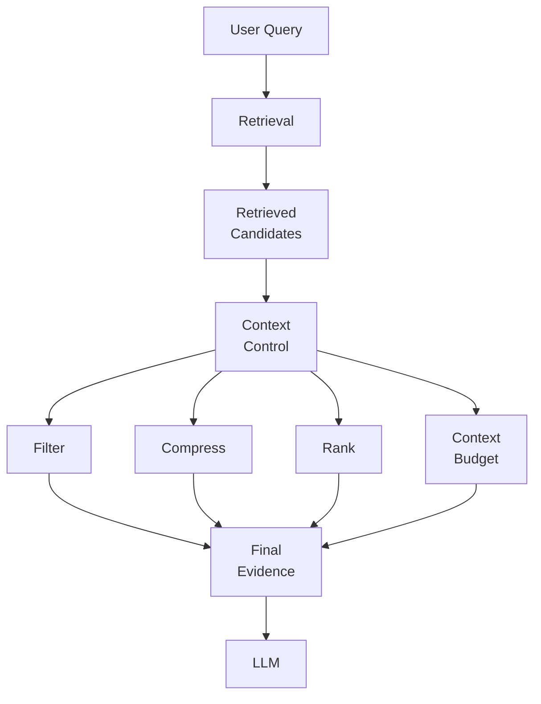
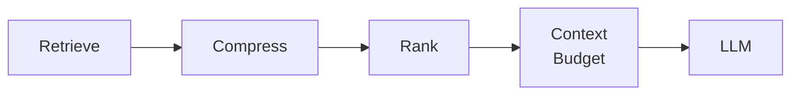
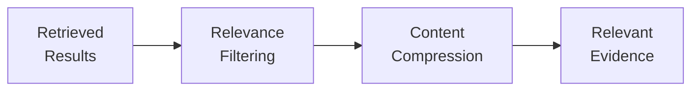
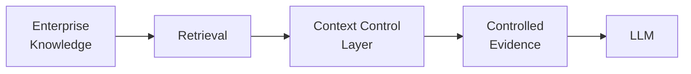
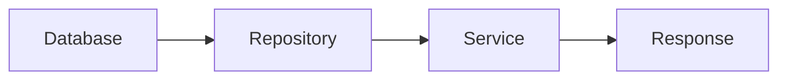
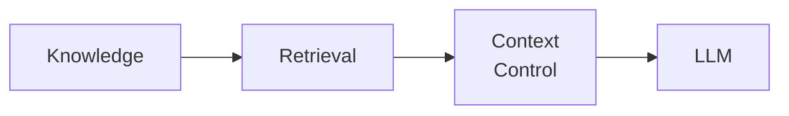

# 3.1 — Engineering the Context Control Layer for Enterprise Retrieval

## Overview

Retrieval produces candidates, but not every retrieved candidate should reach the generation layer.

Enterprise retrieval can return older documents, related information, duplicate evidence, or content that is only partially relevant to the user's question.

This creates an architectural requirement:

> **Control retrieved information before it reaches the LLM.**

The **Context Control Layer** sits between retrieval and generation and is responsible for turning retrieved candidates into deliberate, usable evidence.

The core flow is:

```text
User Query
    ↓
Retrieval
    ↓
Retrieved Candidates
    ↓
Context Control
    ↓
Final Evidence
    ↓
LLM
```

---

# 1. Why Retrieval Results Are Not Final Context

A retriever may return many potentially relevant candidates.

For example:

> "What are the current remote-work requirements for employees in Germany?"

Retrieval could return:

- Current Germany remote-work policy
- Older policy versions
- Global remote-work guidelines
- HR FAQs
- Related employee mobility documents

Sending everything to the LLM can increase noise, token consumption, latency, and cost.

The architecture therefore separates:

```text
Retrieval
    ↓
Candidate Evidence

Context Control
    ↓
Final Evidence
```

Retrieval answers:

> **What could be relevant?**

Context control answers:

> **What should actually reach generation?**

---

# 2. Context Control Layer

The Context Control Layer introduces explicit control between retrieval and generation.



The layer can perform four major responsibilities:

### Filtering

Remove clearly irrelevant, duplicate, or low-value candidates.

### Compression

Reduce retrieved content while preserving useful evidence.

### Ranking

Prioritize the strongest evidence for the final context.

### Context Budgeting

Enforce limits based on tokens, latency, cost, or model context capacity.

The objective is not maximum context.

It is **maximum useful evidence within a controlled context budget**.

---

# 3. Retrieve → Compress → Rank → Context

A useful conceptual pipeline is:



Each stage reduces uncertainty or unnecessary context before generation.

```text
Retrieve
   ↓
Broad candidate set

Compress
   ↓
Reduced evidence

Rank
   ↓
Strongest evidence first

Context Budget
   ↓
Controlled final context

LLM
```

The separation is important because retrieval quality and generation context quality are related, but they are not the same concern.

---

# 4. Retrieval Results → Relevant Evidence

The Context Control Layer transforms a potentially noisy retrieval result into a smaller evidence set.



A simplified implementation could be:

```python
def build_context(query, candidates, max_tokens):
    relevant = filter_relevant(query, candidates)

    compressed = compress_context(relevant)

    ranked = rank_evidence(query, compressed)

    return apply_context_budget(
        ranked,
        max_tokens
    )
```

The application can then keep generation separate:

```python
candidates = retriever.retrieve(query)

context = build_context(
    query,
    candidates,
    max_tokens=2000
)

response = llm.generate(
    query=query,
    context=context
)
```

This keeps the architectural boundary explicit:

```text
Retriever
    ↓
Candidates

Context Controller
    ↓
Controlled Evidence

LLM
    ↓
Generation
```

---

# 5. Context Quality vs Context Quantity

More context does not automatically mean better generation.

There are three broad situations:

```text
Too Little Context
    ↓
Missing Evidence
    ↓
Lower Recall
```

```text
Controlled Context
    ↓
Relevant Evidence
    ↓
Better Evidence Utilization
```

```text
Too Much Context
    ↓
Noise + More Tokens
    ↓
Higher Cost + Latency
```

The architecture therefore needs to balance:

**Recall • Relevance • Context Size • Cost • Latency**

The target is not to minimize context blindly.

The target is to remove unnecessary context while preserving answer-bearing evidence.

---

# 6. Contextual Compression

Compression can reduce the amount of retrieved content presented to the LLM.

For example:

```text
Retrieved Document
        ↓
Relevant Sections
        ↓
Relevant Sentences
        ↓
Compact Evidence
```

A conceptual interface could be:

```python
class ContextCompressor:

    def compress(self, query, candidates):
        return [
            self.extract_relevant_content(
                query,
                candidate
            )
            for candidate in candidates
        ]
```

The implementation can later evolve to use rule-based extraction, model-assisted compression, sentence selection, or other techniques without changing the surrounding architecture.

The architectural responsibility remains:

> **Reduce unnecessary content while preserving useful evidence.**

---

# 7. Ranking Before Context Construction

After filtering and compression, evidence can be ranked before applying the final context budget.

```python
def rank_evidence(query, candidates):
    return sorted(
        candidates,
        key=lambda candidate: candidate.relevance_score,
        reverse=True
    )
```

The strongest candidates can then be selected:

```python
ranked = rank_evidence(query, candidates)

context = ranked[:10]
```

In a production architecture, ranking can incorporate multiple signals. The important point for this layer is that **context selection should be deliberate rather than simply passing the raw retriever output forward**.

---

# 8. Context Budgeting

Context is an operational resource.

A context budget can be defined by:

- Maximum tokens
- Maximum number of documents
- Maximum number of chunks
- Latency constraints
- Model cost
- Model context capacity

A simple abstraction:

```python
def apply_context_budget(candidates, max_tokens):
    selected = []
    token_count = 0

    for candidate in candidates:
        if token_count + candidate.tokens > max_tokens:
            break

        selected.append(candidate)
        token_count += candidate.tokens

    return selected
```

This turns context size into an explicit architecture control rather than an accidental result of retrieval.

---

# 9. Context Control Before Generation

The complete architecture is:



The generation layer should receive **controlled evidence**, not the raw retrieval result.

This creates a clear boundary:

```text
RETRIEVAL
Find candidate evidence
        ↓
CONTEXT CONTROL
Filter • Compress • Rank • Budget
        ↓
GENERATION
Generate from controlled evidence
```

---

# 10. Backend Architecture Parallel

The same principle exists in conventional backend architecture.



The database may contain many records, but the service layer determines what should become part of the final response.

Enterprise AI applies a similar separation:



The parallel is:

```text
Database
    ↓
Repository
    ↓
Service
    ↓
Response
```

versus:

```text
Enterprise Knowledge
    ↓
Retrieval
    ↓
Context Control
    ↓
LLM
```

The architectural principle is the same:

> **Separate data access from downstream decision and response behavior.**

---

# 11. Retrieval–Generation Boundary

The Context Control Layer should remain an explicit capability.

```python
class ContextController:

    def build_context(
        self,
        query,
        candidates,
        token_budget
    ):
        filtered = self.filter(
            query,
            candidates
        )

        compressed = self.compress(
            query,
            filtered
        )

        ranked = self.rank(
            query,
            compressed
        )

        return self.apply_budget(
            ranked,
            token_budget
        )
```

The application contract can therefore remain simple:

```python
candidates = retriever.retrieve(query)

context = context_controller.build_context(
    query,
    candidates,
    token_budget=2000
)

response = llm.generate(
    query=query,
    context=context
)
```

This makes context control **replaceable, measurable, and independently evolvable**.

---

# 12. Operational Considerations

Context control should be evaluated using both quality and system economics.

Useful signals include:

- Retrieved candidate count
- Filtered candidate count
- Compression ratio
- Final context size
- Context token count
- Context selection latency
- Retrieval-to-context reduction
- Model input token cost
- Downstream answer relevance

A useful production question is:

> **Did context control improve the evidence delivered to the LLM enough to justify its processing cost?**

Without measurement, compression and filtering can become another opaque layer of system complexity.

---

# 13. Architect Takeaway

The Context Control Layer creates an explicit boundary between retrieval and generation.

```text
USER QUERY
    ↓
RETRIEVAL
    ↓
CANDIDATE EVIDENCE
    ↓
CONTEXT CONTROL
    ├── Filter
    ├── Compress
    ├── Rank
    └── Budget
    ↓
FINAL EVIDENCE
    ↓
LLM
```

The core principle is:

> **Retrieval produces candidates. Context Control decides what becomes evidence. Generation consumes the controlled evidence.**

The strongest Enterprise AI architecture is not the one that retrieves the most information.

It is the one that delivers the **right evidence, at the right level of detail, within the right context budget**.

---

# 14. Further Reading

For deeper coverage of Core Retrieval Engineering, including VectorStore Retrieval, Multi-Query Retrieval, Self-Query Retrieval, Parent-Document Retrieval, retriever comparison, strategy selection, and production considerations:

[Enterprise AI Systems Hanbook](https://enterpriseai.handbook.mihirkjha.com/)

**Enterprise AI Engineering Handbook — Core Retrieval Engineering**