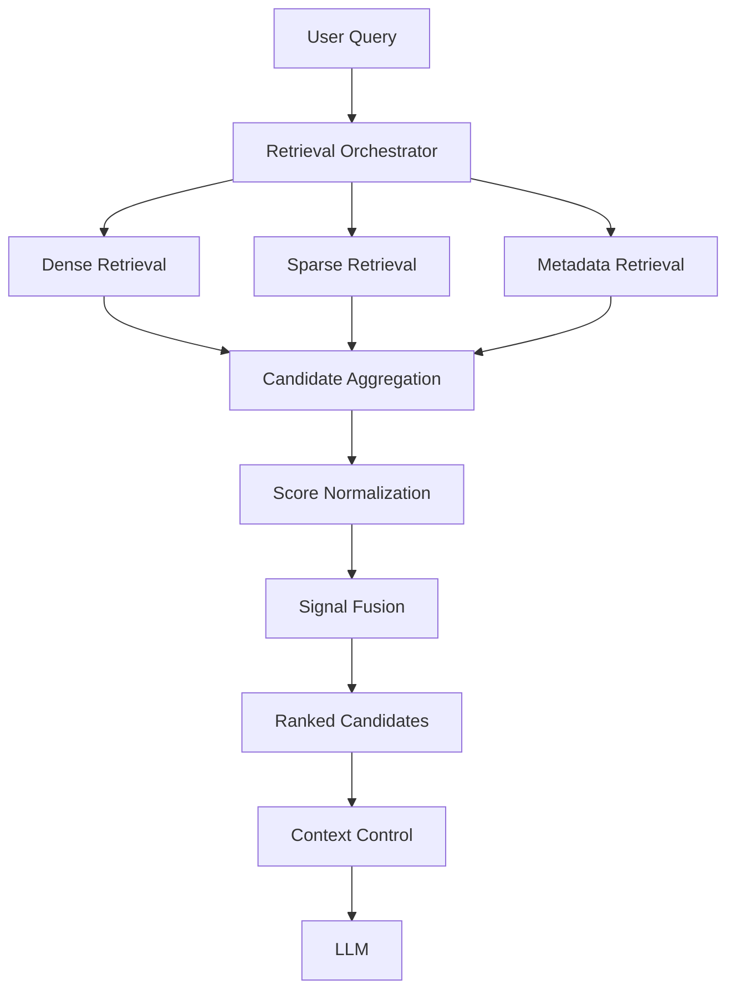

# 3.2 — Architecting Multi-Signal Retrieval for Enterprise AI

## 1. Overview

There is rarely a single retrieval signal that works well for every enterprise query.

Dense retrieval is strong at semantic similarity. Sparse retrieval is useful for exact terms, identifiers, and keywords. Metadata retrieval provides structured constraints.

Enterprise retrieval becomes stronger when these signals are treated as complementary capabilities and combined through an explicit orchestration and fusion layer.

```text
User Query
    ↓
Retrieval Orchestrator
    ↓
┌────────────┬────────────┬──────────────┐
│   Dense    │   Sparse   │   Metadata   │
│ Retrieval  │ Retrieval  │  Retrieval   │
└────────────┴────────────┴──────────────┘
          ↓
    Candidate Aggregation
          ↓
      Score Fusion
          ↓
    Ranked Candidates
          ↓
     Context Control
          ↓
          LLM
```

The important architectural shift is:

> Retrieval is no longer one search operation. It becomes coordinated evidence discovery.

---

## 2. Why One Retrieval Signal Is Not Always Enough

Consider:

> "Find the current Germany remote-work policy for engineering."

A dense retriever may identify semantically relevant policy content.

A sparse retriever may be better at matching exact terms such as `remote-work` or `engineering`.

Metadata can constrain the candidate space using:

```text
country = Germany
department = Engineering
status = Active
```

Each signal solves a different retrieval problem.

```text
Dense     → Meaning
Sparse    → Exact terminology
Metadata  → Structured constraints
```

The architecture should therefore combine signals instead of expecting one retrieval mechanism to provide every form of relevance.

---

## 3. Multi-Signal Retrieval Architecture

The retrieval orchestrator becomes the control point for multiple retrieval capabilities.



The orchestrator should not contain the implementation details of every retriever.

Instead, retrieval strategies should expose a common capability.

This keeps individual retrieval mechanisms independently replaceable.

---

## 4. Retrieval Signal Abstraction

A common interface creates an architectural boundary between orchestration and retrieval implementation.

```python
from abc import ABC, abstractmethod


class RetrievalSignal(ABC):

    @abstractmethod
    def retrieve(self, query: str) -> list["Candidate"]:
        """Return candidates produced by this retrieval signal."""
        raise NotImplementedError
```

Concrete implementations can remain independent:

```python
class DenseSignal(RetrievalSignal):

    def retrieve(self, query: str) -> list["Candidate"]:
        return dense_search(query)


class SparseSignal(RetrievalSignal):

    def retrieve(self, query: str) -> list["Candidate"]:
        return sparse_search(query)


class MetadataSignal(RetrievalSignal):

    def retrieve(self, query: str) -> list["Candidate"]:
        return metadata_search(query)
```

The orchestration layer depends on `RetrievalSignal`, not on a particular search technology.

This is important when evolving the system from one retrieval mechanism to an ensemble.

---

## 5. Ensemble Retrieval

An ensemble executes multiple retrieval signals against the same request and creates a unified candidate pool.

```python
class RetrievalOrchestrator:

    def __init__(self, signals: dict[str, RetrievalSignal]):
        self.signals = signals

    def retrieve(self, query: str):
        return {
            name: signal.retrieve(query)
            for name, signal in self.signals.items()
        }
```

The output remains separated by signal:

```text
{
    "dense": [...],
    "sparse": [...],
    "metadata": [...]
}
```

This allows the fusion layer to understand where every candidate originated.

It also enables signal-level observability:

```text
dense candidates     = 20
sparse candidates    = 15
metadata candidates  = 8
unique candidates    = 29
```

---

## 6. Candidate Aggregation

Multiple signals can return the same document or chunk.

Therefore, simply concatenating results is insufficient.

```text
Dense
 ├── A
 ├── B
 └── C

Sparse
 ├── B
 ├── C
 └── D

Metadata
 ├── C
 └── E
```

The candidate pool should become:

```text
A, B, C, D, E
```

while preserving which signals contributed to each candidate.

```python
from dataclasses import dataclass, field


@dataclass
class Candidate:
    id: str
    text: str
    score: float
    signals: set[str] = field(default_factory=set)
```

Aggregation:

```python
def aggregate(results):
    candidates = {}

    for signal, items in results.items():
        for item in items:
            candidate = candidates.setdefault(
                item.id,
                Candidate(
                    id=item.id,
                    text=item.text,
                    score=0.0
                )
            )

            candidate.signals.add(signal)

    return list(candidates.values())
```

A production implementation should preserve the original signal-specific scores as well.

---

## 7. Score Normalization

Scores from different retrieval mechanisms may not be directly comparable.

For example:

```text
Dense similarity → 0.0–1.0
Sparse score     → different scale
Metadata score   → rule-based value
```

Adding these values directly can produce misleading rankings.

Therefore:

```text
Signal Scores
      ↓
Normalization
      ↓
Comparable Scores
      ↓
Fusion
```

A simple normalization boundary might be:

```python
def normalize(score: float, minimum: float, maximum: float) -> float:
    if maximum == minimum:
        return 1.0

    return (score - minimum) / (maximum - minimum)
```

The exact normalization technique depends on the retrieval system and evaluation data.

The architectural principle is:

> Do not assume that scores from different retrieval systems have the same meaning.

---

## 8. Result Fusion

After normalization, the system can combine signals through weighted fusion.

```python
class WeightedFusion:

    def __init__(self, weights: dict[str, float]):
        self.weights = weights

    def merge(self, results):
        scores = {}
        documents = {}

        for signal, candidates in results.items():
            for candidate in candidates:
                documents[candidate.id] = candidate

                score = normalize_candidate(candidate)

                scores[candidate.id] = (
                    scores.get(candidate.id, 0.0)
                    + self.weights.get(signal, 0.0) * score
                )

        return sorted(
            documents.values(),
            key=lambda c: scores[c.id],
            reverse=True
        )
```

Example configuration:

```python
fusion = WeightedFusion(
    weights={
        "dense": 0.5,
        "sparse": 0.3,
        "metadata": 0.2
    }
)
```

These values should not be treated as universal defaults.

Weights should be evaluated against representative queries and business requirements.

---

## 9. Recall, Precision and Diversity

Multi-signal retrieval is useful because different retrieval mechanisms can contribute different candidates.

This can improve:

### Recall

More potentially relevant documents can enter the candidate pool.

### Diversity

Different retrieval mechanisms may discover different evidence.

### Precision

Structured constraints can eliminate clearly irrelevant candidates.

However, adding signals does not automatically improve every metric.

A poorly configured ensemble can produce:

- duplicate candidates
- noisy candidates
- excessive candidate volume
- higher latency
- higher infrastructure cost
- unstable rankings

Retrieval quality therefore needs to be evaluated at the combined pipeline level, not only at individual retriever level.

---

## 10. Signal Weighting Should Be Evidence-Driven

A common mistake is to assume fixed weights such as:

```text
Dense = 50%
Sparse = 30%
Metadata = 20%
```

and consider the problem solved.

The appropriate contribution of each signal can vary by workload.

```text
Semantic question
→ Dense contribution may be important

Exact identifier query
→ Sparse contribution may be important

Highly constrained query
→ Metadata contribution may be important
```

The architecture should therefore make signal weighting configurable:

```python
weights = config.retrieval.signal_weights
```

This allows experimentation without changing orchestration code.

---

## 11. Query-Dependent Signal Selection

A further evolution is to avoid executing every signal for every query.

```text
Query
  ↓
Query Analysis
  ↓
Signal Selection
  ├── Dense
  ├── Sparse
  ├── Metadata
  └── Combination
```

Conceptually:

```python
signals = selector.select(query)

results = {
    name: signal.retrieve(query)
    for name, signal in signals.items()
}
```

For example, a query containing a precise identifier may not require an expensive multi-signal retrieval path.

This reduces unnecessary retrieval operations and naturally leads toward dynamic retriever selection.

---

## 12. Latency, Cost and Failure Isolation

Multi-signal retrieval introduces additional operational cost.

Sequential execution:

```text
Dense
  ↓
Sparse
  ↓
Metadata
  ↓
Fusion
```

can accumulate latency.

Parallel execution can reduce overall latency:

```text
        ┌── Dense ────┐
Query ──┼── Sparse ───┼── Fusion
        └── Metadata ─┘
```

But parallel execution introduces:

- concurrency limits
- resource consumption
- timeout handling
- partial failures
- cancellation
- observability requirements

One failed retrieval signal should not necessarily destroy the entire request.

```text
Dense       → Success
Sparse      → Timeout
Metadata    → Success
              ↓
          Partial Fusion
```

Whether partial results are acceptable depends on application quality and safety requirements.

---

## 13. Retrieval → Fusion → Context Control Boundary

Multi-signal retrieval should stop at a clear architectural boundary.

```text
Multiple Retrievers
       ↓
Candidate Set
       ↓
Fusion
       ↓
Ranked Candidates
       ↓
Context Control
       ↓
Final Evidence
       ↓
LLM
```

Responsibilities remain separate:

```text
Retrieval
→ Find candidates

Fusion
→ Combine retrieval signals

Context Control
→ Decide what evidence reaches generation

LLM
→ Generate from controlled evidence
```

This prevents retrieval logic from becoming tightly coupled to prompt construction or model invocation.

---

## 14. Backend Architecture Parallel

There is a useful parallel with conventional backend architecture.

```text
Service
   ↓
Repository A
Repository B
Repository C
   ↓
Aggregation
   ↓
Response
```

Enterprise AI can follow a similar pattern:

```text
Query
   ↓
Retrieval Orchestrator
   ↓
Dense + Sparse + Metadata
   ↓
Fusion
   ↓
Evidence
```

The architectural principle is similar:

> Multiple specialized sources can be coordinated behind a stable application boundary.

---

## 15. Implementing Multi-Signal Retrieval Orchestration

For `genai-youtube-analyzer`, the implementation should evolve incrementally from the existing retrieval provider abstraction.

A useful target structure is:

```text
retrieval/
├── base.py
├── candidate.py
├── orchestrator.py
├── signals/
│   ├── dense.py
│   ├── sparse.py
│   └── metadata.py
├── fusion/
│   ├── base.py
│   └── weighted.py
└── ranking/
```

The orchestration flow becomes:

```python
class RetrievalPipeline:

    def __init__(self, orchestrator, fusion, context_controller):
        self.orchestrator = orchestrator
        self.fusion = fusion
        self.context_controller = context_controller

    def execute(self, query: str):
        results = self.orchestrator.retrieve(query)
        ranked = self.fusion.merge(results)

        return self.context_controller.build(ranked)
```

This is intentionally separated from the LLM.

The final context can then be passed to the generation layer:

```python
context = retrieval_pipeline.execute(query)

response = llm.generate(
    query=query,
    context=context
)
```

The result is a clean pipeline:

```text
Query
 ↓
Retrieval Orchestration
 ↓
Multiple Signals
 ↓
Aggregation
 ↓
Fusion
 ↓
Context Control
 ↓
LLM
```

---

## 16. Observability

A multi-signal architecture should expose signal-level measurements.

Useful metrics include:

```text
retrieval.latency.dense
retrieval.latency.sparse
retrieval.latency.metadata

retrieval.candidates.dense
retrieval.candidates.sparse
retrieval.candidates.metadata

retrieval.unique_candidates
retrieval.fused_candidates
retrieval.final_candidates
```

It is also useful to record which signals contributed to the final evidence.

This helps answer:

> Did sparse retrieval actually contribute anything to this query?

That is more actionable than monitoring only the final LLM response.

---

## 17. Architect Takeaway

Multi-Signal Retrieval is not about adding more retrievers.

It is about combining **complementary retrieval behaviors** behind an explicit architecture.

The key flow is:

```text
Query
 ↓
Signal Selection
 ↓
Multiple Retrievers
 ↓
Candidate Aggregation
 ↓
Normalization
 ↓
Fusion
 ↓
Ranking
 ↓
Context Control
 ↓
Evidence
```

The architectural goal is not maximum retrieval complexity.

It is to improve evidence quality while keeping **quality, latency, cost, and operational complexity** under control.

This becomes the foundation for the next stages of Enterprise Retrieval Architecture:

**multi-stage retrieval, multi-representation retrieval, adaptive retrieval, and retrieval optimization.**

## Further Reading

- Enterprise RAG Architecture
- Retrieval Layer Architecture
- Query Transformation Pipelines
- Metadata & Document-Aware Retrieval
- Retriever Selection