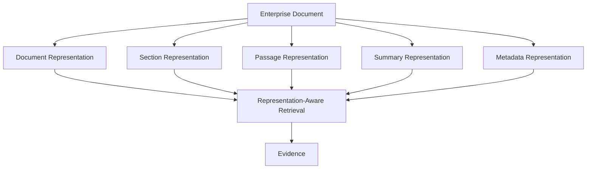
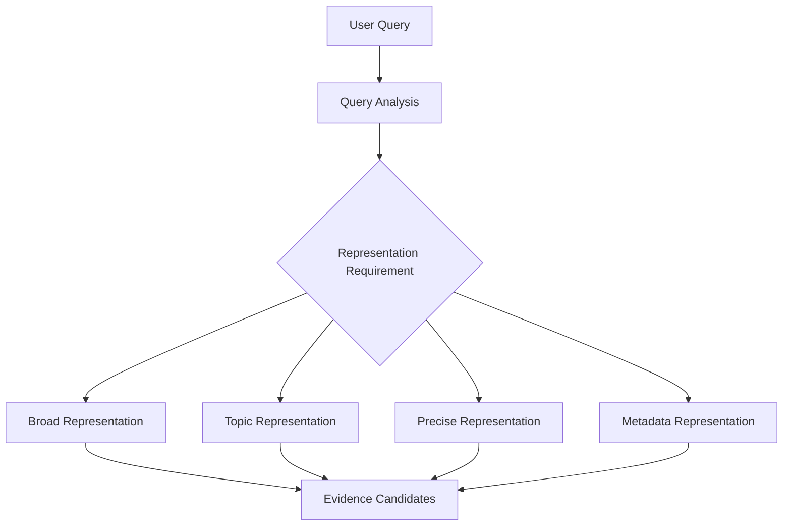
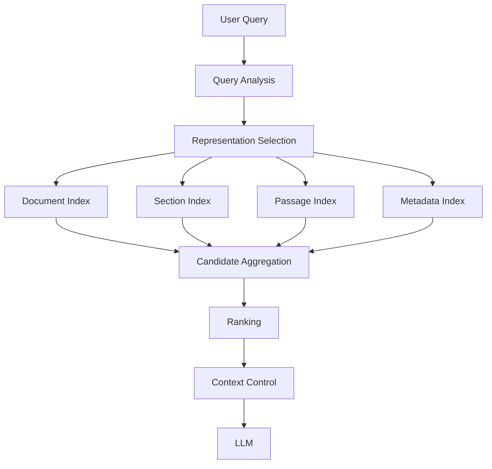

# 3.3 — Architecting Multi-Representation Knowledge Retrieval

## Architecture Insight

Enterprise knowledge rarely fits into a single representation.

A document can contain broad business meaning, structured sections, precise evidence, summaries, metadata, and relationships between those elements. A retrieval system that represents all of this knowledge in exactly the same way may work for simple queries, but becomes restrictive as enterprise questions become more specific.

The architectural question is therefore not:

> “How many vectors should we create?”

It is:

> “Which representation of enterprise knowledge best matches the retrieval requirement?”

---

## 1. The Architecture Problem

Consider an enterprise remote-work policy.

The same source may contain:

- A complete policy document
- Individual sections
- Specific passages
- A generated summary
- Metadata such as country, department, version and effective date

Different questions may require different representations.

```text
“What does the remote-work policy cover?”
        ↓
Document / Summary representation

“What approval is required for an employee
working remotely from Germany?”
        ↓
Passage + Metadata representation
```

The underlying knowledge has not changed.

The representation required to retrieve useful evidence has.

This is the architectural motivation behind multi-representation retrieval.

---

## 2. From One Representation to Multiple Representations

A traditional RAG pipeline often follows:

```text
Document
   ↓
Chunk
   ↓
Embedding
   ↓
Vector Index
   ↓
Similarity Search
```

Multi-representation retrieval expands this model:



The goal is not to create representations simply because technology allows it.

Each representation should exist because it supports a meaningful retrieval pattern.

---

## 3. Representation Granularity

Granularity is one of the most important architectural decisions.

A broad representation provides context but may be too coarse for precise questions.

A highly granular representation provides precise evidence but may lose surrounding context.

```text
                    Knowledge
                       │
        ┌──────────────┼──────────────┐
        ↓              ↓              ↓
    Document         Section        Passage
    broad view       topic view     precise evidence
        │              │              │
        └──────────────┼──────────────┘
                       ↓
                    Retrieval
```

For example:

```text
Broad question
→ Document / Summary

Topic-oriented question
→ Section

Specific factual question
→ Passage

Constraint-driven question
→ Passage + Metadata
```

This also creates an important relationship with the Parent-Document pattern discussed earlier: a small retrieved passage may provide the evidence, while its parent representation provides the surrounding context.

---

## 4. Multi-Vector Retrieval

Multi-vector retrieval is one implementation pattern for this architecture.

Instead of assigning one vector representation to an entire knowledge object, multiple vectors can represent different semantic views.

```text
Knowledge Object
      │
      ├── Vector A → Document meaning
      ├── Vector B → Section meaning
      ├── Vector C → Passage meaning
      └── Vector D → Summary meaning
```

A retrieval request can then search one or more of these representations depending on the query.

The important distinction is:

**Multi-vector retrieval is an implementation technique.**

**Multi-representation retrieval is the broader architectural concept.**

The architecture should remain independent of the underlying vector database or framework.

---

## 5. Representation Selection

More representations do not automatically mean better retrieval.

The system needs a way to determine which representation should participate in retrieval.



Representation selection can consider:

- Query intent
- Required level of detail
- Document structure
- Metadata constraints
- Expected evidence granularity
- Retrieval latency
- Cost
- Available indexes

This is different from retriever selection.

**Retriever selection asks:**  
Which retrieval mechanism should execute?

**Representation selection asks:**  
Which view of the knowledge should that mechanism search?

The two decisions can work together.

---

## 6. Representation Selection vs Retriever Selection

For example:

```text
Query:
“What approval is required for remote work in Germany?”

Representation:
Passage + Metadata

Retriever:
Hybrid / Metadata-aware retrieval

Ranking:
Precision-oriented ranking

Context:
Relevant passage + parent context
```

This separation gives the architecture more flexibility.

A future implementation could change the vector database, embedding model, or retrieval framework without changing the conceptual representation model.

---

## 7. Multi-Representation vs Multi-Signal Retrieval

These concepts are related, but they solve different problems.

### Multi-Signal Retrieval

Combines different signals for the same retrieval problem.

```text
Dense score
Sparse score
Metadata signal
      ↓
Signal Fusion
      ↓
Ranked Candidates
```

### Multi-Representation Retrieval

Provides different views of the same knowledge.

```text
Document
Section
Passage
Summary
      ↓
Representation Selection
      ↓
Retrieval
```

They can also be combined:

```text
Query
  ↓
Representation Selection
  ↓
Dense + Sparse + Metadata Signals
  ↓
Fusion
  ↓
Ranked Evidence
```

This composition is useful for complex enterprise retrieval systems.

---

## 8. Backend Architecture Parallel

There is a useful parallel with backend system design.

A single business entity can have different representations depending on the access pattern:

```text
Domain Model
     ↓
Read Model
     ↓
Search Projection
     ↓
Database Representation
     ↓
API Response Model
```

The same business information may therefore be represented differently for:

- Transaction processing
- Search
- Reporting
- Caching
- APIs

Enterprise AI faces a similar architectural problem.

```text
Enterprise Knowledge
        ↓
Multiple Representations
        ↓
Different Retrieval Paths
        ↓
Evidence
        ↓
Generation
```

The principle is familiar from distributed-system design:

**Representation should serve the access pattern.**

---

## 9. Production Architecture Considerations

Multi-representation retrieval introduces flexibility, but also operational cost.

### Storage

More vectors and indexes increase storage requirements.

### Indexing

A source update may require multiple representations to be regenerated or re-indexed.

### Consistency

Representations must remain associated with the same source document, version and lifecycle state.

```text
Document v12
   ├── Section representations
   ├── Passage representations
   ├── Summary representation
   └── Metadata
```

If the source becomes version 13, stale representations should not silently remain active.

### Observability

Production systems should be able to answer:

```text
Which representation was searched?
Which index returned the candidate?
Which representation produced the evidence?
Which version of the source was used?
```

This makes retrieval behavior explainable and easier to debug.

---

## 10. Code Implementation

A framework-agnostic abstraction keeps representation logic separate from retrieval infrastructure.

```python
from dataclasses import dataclass
from typing import Protocol


@dataclass
class Representation:
    id: str
    type: str
    content: str
    source_id: str
    metadata: dict


class RepresentationStore(Protocol):

    def search(
        self,
        query: str,
        representation_type: str,
        top_k: int = 10
    ) -> list[Representation]:
        ...
```

Representation selection can then be explicit:

```python
def select_representations(query: str) -> list[str]:
    q = query.lower()

    if "what does" in q or "overview" in q:
        return ["document", "summary"]

    if "approval" in q or "required" in q:
        return ["passage", "metadata"]

    return ["section", "passage"]
```

The retrieval orchestration layer remains independent:

```python
def retrieve(query, store, top_k=5):
    representations = select_representations(query)

    candidates = []

    for representation in representations:
        candidates.extend(
            store.search(
                query=query,
                representation_type=representation,
                top_k=top_k
            )
        )

    return candidates
```

In production, the selection logic can evolve from rules into a classifier, policy engine, learned router, or model-assisted decision layer.

The architectural boundary should remain the same.

---

## 11. Real Retrieval Flow

A realistic enterprise flow can therefore look like:



Notice that representation selection happens before final evidence construction.

This keeps the architecture modular:

```text
Representation
      ↓
Retrieval
      ↓
Ranking
      ↓
Context Control
      ↓
Generation
```

Each stage has a distinct responsibility.

---

## 12. Representation Lifecycle

One additional production concern is lifecycle management.

Representations should not be treated as permanent artifacts.

A practical pipeline is:

```text
Source Document
      ↓
Change Detection
      ↓
Representation Generation
      ↓
Validation
      ↓
Index Update
      ↓
Activation
```

This becomes particularly important when representations include generated summaries or other derived content.

A generated representation should retain lineage back to its source:

```text
Representation
 ├── source_id
 ├── source_version
 ├── representation_type
 ├── model_version
 ├── created_at
 └── status
```

This allows teams to invalidate or rebuild derived representations without rebuilding unrelated knowledge.

It also provides a foundation for reproducibility when retrieval quality changes after an indexing or model update.

---

## 13. Architecture Boundary

Multi-representation retrieval should not become a replacement for every other retrieval capability.

It answers:

> “Which representation of knowledge should participate in retrieval?”

It does not replace:

- Metadata filtering
- Hybrid retrieval
- Multi-stage ranking
- Context control
- Retrieval routing
- Authorization
- Response validation

For example:

```text
Representation Selection
        ↓
Metadata Filtering
        ↓
Hybrid Retrieval
        ↓
Re-Ranking
        ↓
Context Control
        ↓
LLM
```

Each layer remains responsible for a different architectural concern.

That separation prevents the retrieval layer from becoming a single oversized component.

---

## 14. Key Architecture Takeaway

The important shift is from:

```text
One Document
     ↓
One Embedding
     ↓
One Retrieval Path
```

to:

```text
Enterprise Knowledge
        ↓
Multiple Useful Representations
        ↓
Representation Selection
        ↓
Retrieval Strategy
        ↓
Evidence
        ↓
Context Control
        ↓
Generation
```

The goal is not to create the maximum number of vectors.

The goal is to make enterprise knowledge retrievable from the representation that best matches the question.

That makes representation design an **architecture decision**, not simply an embedding decision.

---

# 15. Further Reading

For deeper coverage of Core Retrieval Engineering, including VectorStore Retrieval, Multi-Query Retrieval, Self-Query Retrieval, Parent-Document Retrieval, retriever comparison, strategy selection, and production considerations:

[Enterprise AI Systems Hanbook](https://enterpriseai.handbook.mihirkjha.com/)

**Enterprise AI Engineering Handbook — Core Retrieval Engineering**