# 3.4 - Engineering Hybrid Retrieval: Sparse + Dense Search

Enterprise retrieval rarely has a single definition of “relevant.”

A user query may contain exact terminology, identifiers, acronyms, product names, or policy references while also expressing an underlying concept in natural language.

For example:

> “What is the PCI-DSS tokenization requirement for payment transactions?”

A lexical retriever can strongly match terms such as `PCI-DSS`, `tokenization`, and `payment transactions`. A dense retriever can also discover documents that explain the same concept using different wording.

This creates a useful architectural boundary:

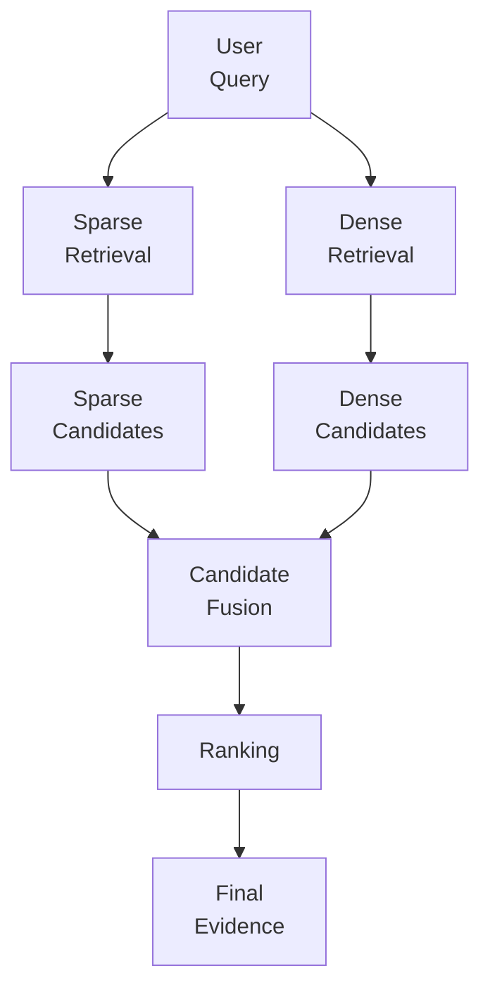

The goal is not to make sparse and dense retrieval compete.

The goal is to let each retrieval path contribute the type of matching it is good at, then combine their candidates into a stronger result set.

---

## 1. Sparse Retrieval

Sparse retrieval is primarily lexical. It looks for relationships between the terms in the query and terms appearing in indexed documents.

BM25 is a common example.

A sparse retriever is particularly useful when exact terminology matters:

- Policy IDs
- Product names
- Error codes
- Acronyms
- Technical identifiers
- Legal or regulatory terminology
- Exact configuration names
- Domain-specific phrases

A simplified architecture looks like this:


The important characteristic is that sparse retrieval preserves the value of the actual words used by the user.

For example:

> “What does policy SEC-204 require?”

A semantic retriever may understand the broader concept, but a lexical retriever has a direct opportunity to locate documents containing `SEC-204`.

This makes sparse retrieval valuable in enterprise environments where terminology is often precise and operational.

---

## 2. Dense Retrieval

Dense retrieval represents queries and documents as vectors and compares them using a similarity function.

Its strength is semantic matching.

Consider:

> “How are card payments protected from exposing the original card number?”

A relevant document might never use exactly the same wording. It could instead discuss:

> “Tokenization replaces sensitive payment credentials with surrogate values.”

A dense retriever can connect these expressions because they represent a related concept.


Dense retrieval is therefore useful for:

- Paraphrased questions
- Natural-language queries
- Conceptual similarity
- Related terminology
- Questions where exact wording differs from the source

The architectural distinction is simple:

**Sparse retrieval emphasizes the words. Dense retrieval emphasizes the meaning.**

---

## 3. Why Combine Sparse and Dense Retrieval?

Neither retrieval mode consistently covers every enterprise query.

| Retrieval path | Strong at | Typical weakness |
|---|---|---|
| Sparse | Exact terminology, IDs, acronyms, phrases | Weak semantic matching |
| Dense | Meaning, paraphrases, conceptual similarity | Can miss exact terminology |
| Hybrid | Complementary lexical + semantic coverage | More complexity and latency |

The hybrid architecture keeps the retrieval paths independent until the candidate set is produced:

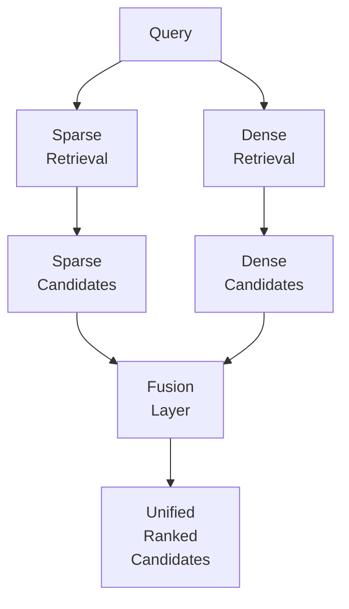

This separation matters.

Sparse and dense retrieval are not simply two implementations of the same algorithm. They produce signals with different behavior. The fusion layer becomes the architectural boundary where those differences are handled.

---

## 4. Candidate Fusion

Assume sparse retrieval returns:

`S = [D1, D4, D7, D12]`

and dense retrieval returns:

`D = [D3, D4, D8, D12]`

The fusion layer can:

1. Merge both candidate sets.
2. Remove duplicates.
3. Preserve retrieval scores or ranks.
4. Combine the signals.
5. Produce a unified ranking.

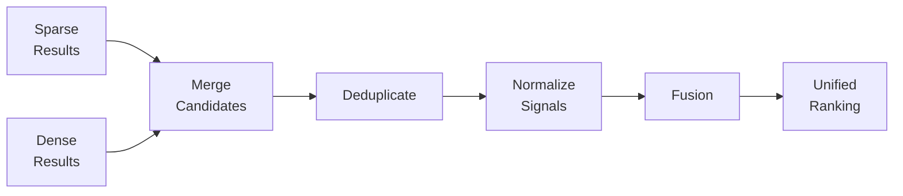

A simple score-based approach can be represented as:

```text
hybrid_score =
    alpha * dense_score +
    (1 - alpha) * sparse_score
```

Here, `alpha` controls the relative contribution of the dense signal.

A higher `alpha` gives more influence to semantic similarity. A lower `alpha` gives more influence to lexical matching.

However, this formula has an important architectural caveat:

**Sparse and dense scores may not live on comparable scales.**

A dense similarity of `0.82` and a BM25 score of `12.5` cannot automatically be treated as equivalent numerical signals.

Therefore, practical hybrid systems often need normalization, calibration, or rank-based fusion.

---

## 5. Score Fusion vs Rank Fusion

There are two useful architectural approaches.

### Score-based fusion

Score fusion combines retrieval scores after making them comparable.

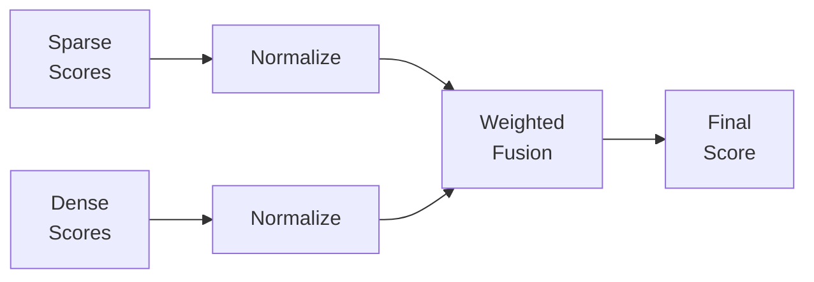

This approach can preserve more information from the original retrieval scores, but its quality depends on how well those scores are calibrated.

### Rank-based fusion

Rank fusion uses the position of a document in each result list instead of directly combining raw scores.

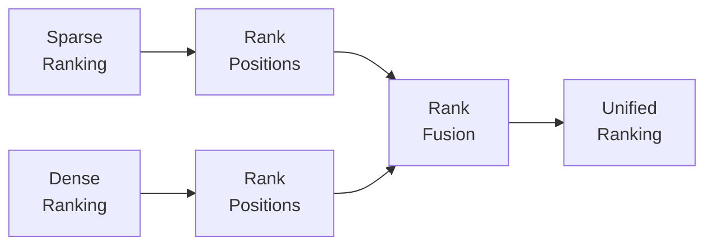

Rank fusion can be attractive when the underlying systems have incompatible score distributions.

The architectural principle is more important than the specific formula:

**Fusion should respect the behavior of the signals being combined.**

---

## 6. Compact Implementation Example

A simple abstraction can keep sparse, dense, and hybrid retrieval independently replaceable:

```python
class SparseRetriever:
    def search(self, query, k=10):
        return lexical_index.search(query, k)


class DenseRetriever:
    def search(self, query, k=10):
        return vector_index.similarity_search(query, k)


class HybridRetriever:
    def __init__(self, sparse, dense, alpha=0.5):
        self.sparse = sparse
        self.dense = dense
        self.alpha = alpha

    def search(self, query, k=10):
        sparse_results = self.sparse.search(query, k)
        dense_results = self.dense.search(query, k)

        candidates = merge_candidates(
            sparse_results,
            dense_results
        )

        normalized = normalize_scores(candidates)

        return rank_by_weighted_score(
            normalized,
            alpha=self.alpha,
            top_k=k
        )
```

The important design decision is the abstraction boundary.

The application should not need to know whether sparse retrieval is implemented with BM25, Elasticsearch/OpenSearch, PostgreSQL full-text search, or another lexical engine.

Likewise, the dense implementation could use an approximate nearest-neighbor index, vector database, or managed search service.

The retrieval contract remains stable while the underlying strategy can evolve.

---

## 7. Query Characteristics Matter

A fixed sparse/dense weighting is useful as a starting point, but enterprise workloads are rarely uniform.

Consider three query types.

### Query A — Exact terminology

> “Show policy SEC-204 for account suspension.”

Exact identifiers and policy terminology make lexical matching particularly valuable.

### Query B — Semantic question

> “How do we temporarily prevent an account from being used?”

The user expresses the concept without necessarily using the wording found in the source. Dense retrieval can contribute more strongly here.

### Query C — Mixed query

> “What is the PCI-DSS requirement for protecting card numbers?”

This contains both exact domain terminology and semantic intent.

This suggests a possible evolution:

```text
Query
  ↓
Query Characteristics
  ↓
Retrieval Weighting
  ↓
Sparse + Dense
```

The weighting could eventually be influenced by query characteristics rather than being globally fixed.

This is an architectural extension, not a requirement that every system must dynamically tune `alpha`.

---

## 8. Failure Modes and Trade-offs

Hybrid retrieval is not automatically better simply because it uses two retrieval mechanisms.

### One signal dominates

If one signal consistently overwhelms the other, the system may effectively behave like a single retriever.

### Score incompatibility

Combining raw sparse and dense scores without normalization can produce misleading rankings.

### Duplicate candidates

The same document may appear in both result sets. Deduplication becomes necessary before downstream ranking.

### Higher latency

Two retrieval paths generally mean more work:

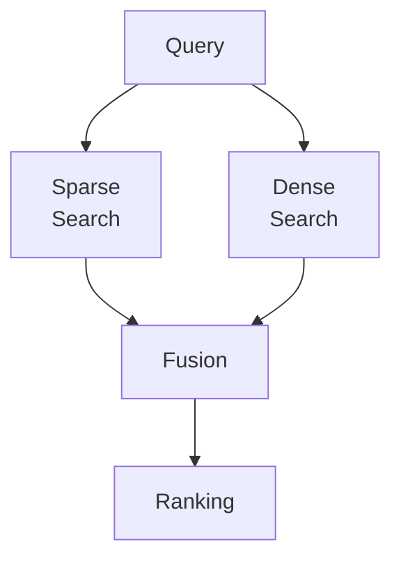

The searches can often execute in parallel, but the system still has additional retrieval and fusion work.

### More candidates, but not better evidence

Hybrid retrieval can increase recall without improving the quality of the final context.

That distinction matters because retrieval quality must ultimately be evaluated at the evidence and answer level, not only by candidate count.

The architectural trade-off is therefore:

**Coverage ↑ → Complexity ↑ → Latency/Cost may ↑**

The objective is not maximum retrieval volume. It is useful evidence.

---

## 9. Backend Architecture Parallel

A similar pattern appears in backend systems.

A service may expose different access paths over the same business data depending on the lookup requirement.

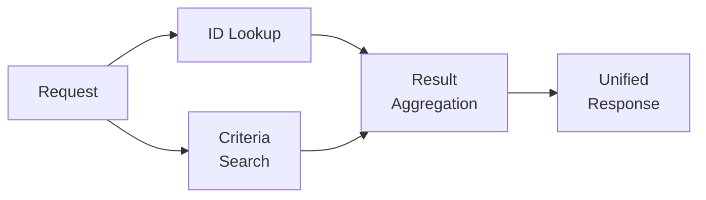

The retrieval equivalent is:

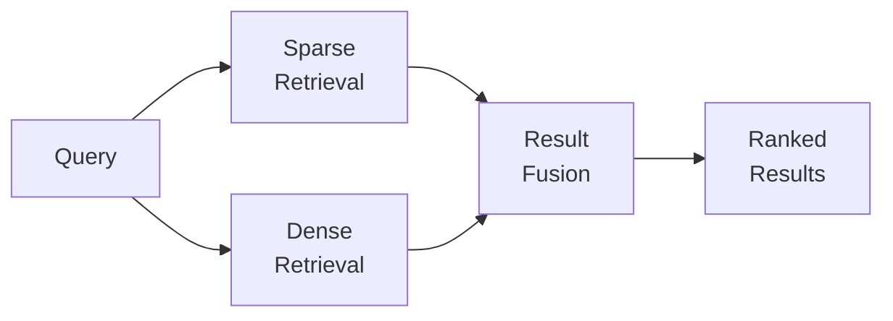

The common architecture pattern is:

**Multiple access paths → combine outputs → produce a coherent result.**

This is one reason hybrid retrieval maps naturally to backend architecture thinking. The system is not replacing one access path with another; it is coordinating complementary paths behind a stable interface.

---

## 10. Hybrid Retrieval vs Multi-Signal Retrieval

[Architecting Multi-Signal Retrieval for Enterprise AI](https://enterpriseai.blog.mihirkjha.com/architecture-insights/genai-and-rag/3.2-architecting-multi-signal-retrieval-for-enterprise-ai/)  introduced the broader idea of **multi-signal retrieval**: multiple retrieval signals can contribute different evidence to the retrieval process.

Hybrid retrieval is a focused case of that broader architecture.

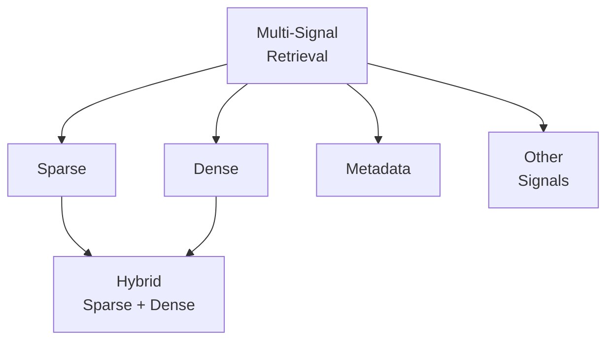

The distinction is important for architectural clarity:

- [Architecting Multi-Signal Retrieval for Enterprise AI](https://enterpriseai.blog.mihirkjha.com/architecture-insights/genai-and-rag/3.2-architecting-multi-signal-retrieval-for-enterprise-ai/) focuses on the broader pattern of combining multiple retrieval signals.
- In here it goes deeper into the specific Sparse + Dense combination.
- Metadata and other signals can remain independent dimensions of the larger retrieval architecture.

This prevents “hybrid retrieval” from becoming a generic label for every multi-signal design.

---

## 11. Enterprise Retrieval Architecture

In a production architecture, hybrid retrieval should sit behind a strategy-driven retrieval interface.

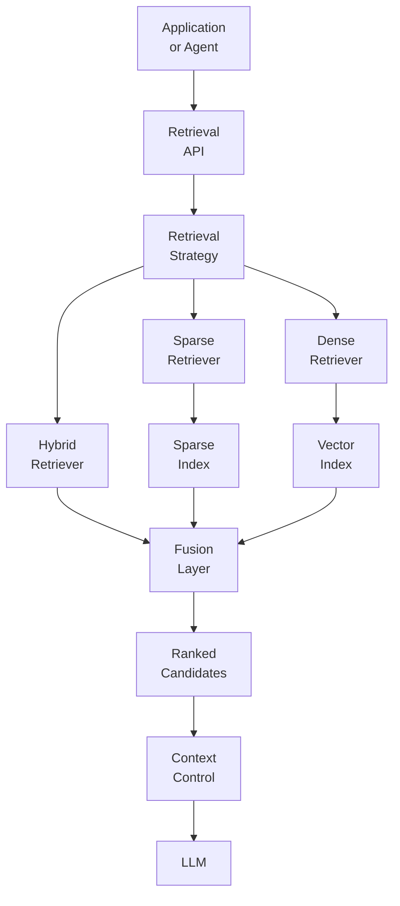

This architecture provides several benefits:

- Retrieval strategy is isolated from application logic.
- Sparse and dense implementations can evolve independently.
- Fusion becomes an explicit architectural component.
- Retrieval can be instrumented without changing the application layer.
- Additional retrieval strategies can be introduced later without rewriting consumers.

The key is to treat retrieval as an architectural subsystem rather than embedding search logic directly inside the generation workflow.

---

## 12. Evaluation and Observability

Hybrid retrieval needs visibility into both retrieval paths.

Useful metrics include:

- Sparse candidate count
- Dense candidate count
- Candidate overlap
- Sparse retrieval latency
- Dense retrieval latency
- Fusion latency
- Score distributions
- Rank positions
- Final candidate quality
- Context quality

Candidate overlap is particularly informative.

If sparse and dense retrieval repeatedly return exactly the same documents, the second signal may provide limited additional coverage.

If their results are completely different, the system may gain recall, but it also needs to verify whether those additional candidates are actually useful.

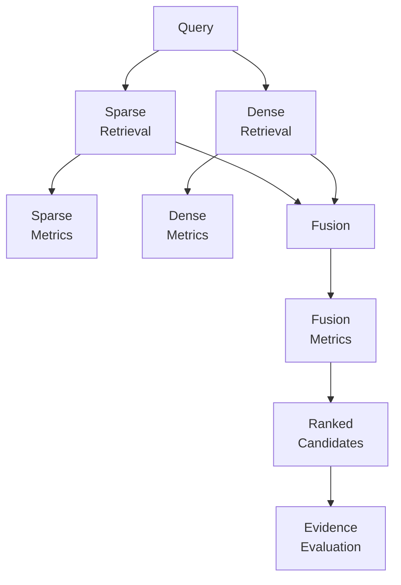

This creates an important operational distinction:

**Measure not only what each retriever returns, but what the combination contributes.**

That contribution can be evaluated through retrieval metrics, overlap analysis, ranking quality, downstream context quality, and eventually answer quality.

---

## 13. Architecture Takeaways

Hybrid retrieval is fundamentally an architecture for combining complementary retrieval behavior.

1. **Sparse retrieval is strong for exact terminology and lexical matching.**
2. **Dense retrieval is strong for semantic similarity and paraphrased queries.**
3. **Hybrid retrieval keeps both paths independent until candidate fusion.**
4. **Fusion must account for incompatible score distributions.**
5. **Score fusion and rank fusion solve different architectural problems.**
6. **Query characteristics can influence retrieval strategy and weighting.**
7. **Hybrid retrieval increases coverage, but also introduces latency and complexity.**
8. **Observability should measure the contribution of each retrieval path.**
9. **A stable retrieval abstraction allows implementations to evolve independently.**
10. **The final objective is useful evidence, not simply more candidates.**

The progression is:


The architectural lesson is simple:

**Use different retrieval mechanisms for different matching behaviors, combine their strengths deliberately, and make the fusion boundary explicit.**

---

# 14. Further Reading

For deeper coverage across AI Engineering — from ML and Deep Learning to LLMs, RAG, Generative AI, and Agentic AI — explore the AI Engineering Handbook for concepts, engineering patterns, architecture, and production considerations.

[Enterprise AI Systems Hanbook](https://enterpriseai.handbook.mihirkjha.com/)