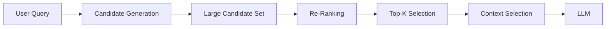
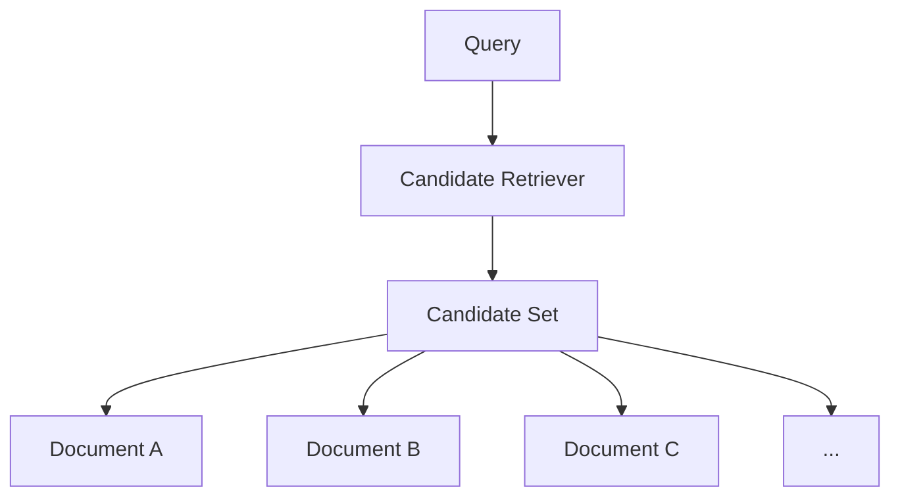
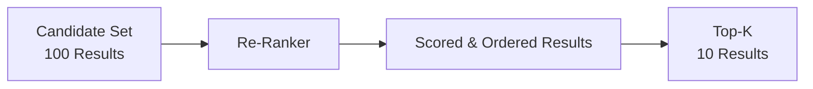
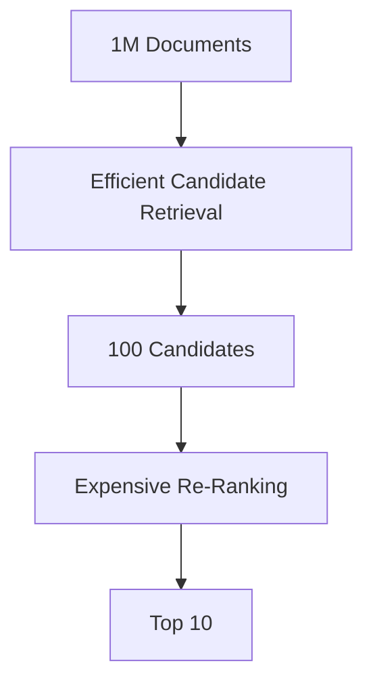
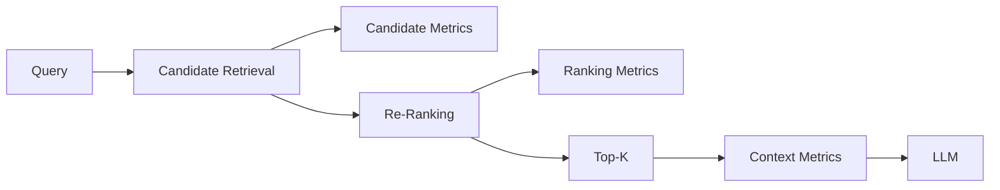
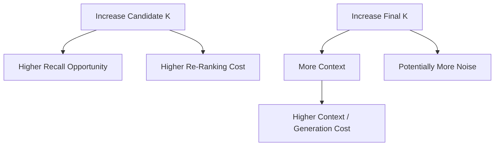

# Architecting Multi-Stage Retrieval: From Recall to Precision

## 1. The Recall vs Precision Problem

One of the most important architectural decisions in enterprise retrieval is recognizing that **finding relevant documents** and **finding the best evidence** are not necessarily the same problem.

A retrieval system may operate over thousands or millions of documents. If it retrieves only a few candidates, potentially useful evidence can be missed. If it retrieves too many, more noise, ranking work, latency, and context-selection overhead move through the pipeline.

This creates a tension between **recall** and **precision**.

```text
Small Candidate Set
       |
       +--> Lower Cost
       +--> Lower Latency
       +--> Higher Risk of Missing Evidence

Large Candidate Set
       |
       +--> Wider Recall
       +--> Higher Ranking Cost
       +--> More Noise
```

The architectural response is to separate these responsibilities rather than forcing one retrieval operation to optimize everything.

```text
Stage 1 → Optimize Recall
Stage 2 → Optimize Precision
```

This is the core idea behind **multi-stage retrieval**.

---

## 2. Multi-Stage Retrieval Architecture

A typical enterprise retrieval pipeline can be represented as:



The stages have deliberately different responsibilities:

1. **Candidate generation** — retrieve a broad set of potentially relevant evidence.
2. **Re-ranking** — apply a more precision-oriented ranking mechanism.
3. **Top-K selection** — retain the strongest candidates.
4. **Context selection** — determine which evidence should actually reach the LLM.

The important architectural shift is that retrieval is no longer treated as a single operation.

It becomes a **pipeline of specialized stages**.

---

## 3. Stage 1 — Candidate Generation

The first stage is primarily concerned with **recall**.

The objective is not necessarily to produce the perfect ranking. Instead, it should cast a sufficiently wide net so that potentially useful evidence is present in the candidate set.

Candidate generation could use:

- Dense retrieval
- Sparse retrieval
- Hybrid retrieval
- Metadata filtering
- Other retrieval strategies

For example:



At this point, the system is asking:

> **Which documents might be relevant?**

It is not yet asking:

> **Which documents are the strongest evidence for this query?**

That distinction matters.

The candidate stage should be efficient because it operates over the larger search space. A dense, sparse, or hybrid retriever can quickly narrow millions of documents into a manageable candidate set.

For example:

```text
Enterprise Knowledge Base
        |
        v
Candidate Retrieval
        |
        v
100 Candidates
```

The number 100 is illustrative, not a universal recommendation. The appropriate value depends on the corpus, retrieval quality, latency target, and ranking strategy.

---

## 4. Stage 2 — Re-Ranking

Once the system has a manageable candidate set, it can spend more computation evaluating those candidates.



The re-ranker focuses on **precision**.

Instead of comparing every document in the enterprise corpus, it evaluates only the candidates produced by the first stage.

Conceptually:

```text
Large Knowledge Base
        |
        v
Efficient Candidate Retrieval
        |
        v
Smaller Candidate Set
        |
        v
Precision-Oriented Ranking
        |
        v
Best Evidence
```

This allows the architecture to use different performance characteristics at different stages.

The first stage can prioritize efficient broad retrieval.

The second stage can use a more expensive ranking mechanism because its input is much smaller.

The important design principle is:

> **Do not make one retrieval stage responsible for both broad discovery and expensive precision ranking when the search space makes that impractical.**

---

## 5. Candidate K vs Final K

One of the most important parameters in a multi-stage architecture is the distinction between **candidate K** and **final K**.

Consider:

```text
candidate_k = 100
final_k     = 10
```

These parameters answer different questions.

**Candidate K:**

> How many potentially relevant results should enter the precision stage?

**Final K:**

> How many ranked results should continue toward context construction?

This can be visualized as:


Increasing candidate K can improve the opportunity to recover relevant evidence, but it also increases ranking work.

Increasing final K may provide more evidence to the context layer, but can also increase context size and noise.

Therefore, the two parameters should not be treated as the same tuning knob.

---

## 6. A Simple Multi-Stage Retrieval Implementation

A clean implementation can represent candidate retrieval and re-ranking as separate components.

```python
from dataclasses import dataclass


@dataclass
class RetrievalResult:
    document_id: str
    score: float
    content: str


class CandidateRetriever:

    def search(
        self,
        query: str,
        top_k: int = 100,
    ) -> list[RetrievalResult]:

        # Dense, sparse, or hybrid retrieval
        ...


class ReRanker:

    def rank(
        self,
        query: str,
        candidates: list[RetrievalResult],
    ) -> list[RetrievalResult]:

        # Cross-encoder, model-based,
        # or other precision-oriented ranking
        ...


class MultiStageRetriever:

    def __init__(
        self,
        retriever: CandidateRetriever,
        reranker: ReRanker,
    ):
        self.retriever = retriever
        self.reranker = reranker

    def search(
        self,
        query: str,
        candidate_k: int = 100,
        final_k: int = 10,
    ) -> list[RetrievalResult]:

        candidates = self.retriever.search(
            query,
            candidate_k,
        )

        ranked = self.reranker.rank(
            query,
            candidates,
        )

        return ranked[:final_k]
```

The important architectural characteristic is the separation of responsibilities.

`CandidateRetriever` handles broad retrieval.

`ReRanker` handles precision-oriented ordering.

`MultiStageRetriever` orchestrates the stages.

In a production implementation, these components can be backed by different retrieval and ranking technologies without changing the orchestration contract.

---

## 7. Why Not Re-Rank Everything?

A natural question is:

> Why not apply the sophisticated re-ranker to the entire knowledge base?

The problem is the size of the search space.

```text
1,000,000 Documents
        |
        v
Expensive Ranking
        |
        v
Top 10
```

The architecture becomes much more manageable when the search space is narrowed first:



The expensive operation is now applied only where it provides the most value.

This reflects a broader systems principle:

> **Use an efficient mechanism to narrow the search space before applying expensive processing.**

This is not unique to RAG. The same pattern appears in database query planning, search systems, recommendation systems, fraud detection, and backend filtering pipelines.

---

## 8. Designing the Stage Boundary

The boundary between candidate generation and re-ranking is an architectural decision.

The first stage should answer:

> **Can I retrieve enough potentially useful evidence efficiently?**

The second stage should answer:

> **Given these candidates, which ones deserve priority?**

If the candidate stage is too aggressive, relevant evidence may never reach the re-ranker.

If the candidate stage is too broad, ranking becomes unnecessarily expensive.

A useful mental model is:

```text
Candidate Generation
        |
        |  Optimize search efficiency
        |  Protect recall
        v
Candidate Boundary
        |
        |  Control ranking workload
        v
Re-Ranking
        |
        |  Optimize ordering
        |  Improve precision
        v
Final Evidence
```

This boundary also creates a useful observability point. Engineers can measure retrieval quality before and after ranking rather than looking only at the final answer.

---

## 9. Failure Modes in Multi-Stage Retrieval

Adding stages does not automatically improve retrieval quality.

Several failure modes are possible.

### Candidate generation misses the evidence

If the relevant document is absent from the candidate set, the re-ranker cannot recover it.

```text
Relevant Document
       X
       |
       | Not Retrieved
       v
Candidate Set
       |
       v
Re-Ranker
```

This is why candidate generation remains primarily a **recall problem**.

### Re-ranking produces a poor ordering

The relevant evidence may be present but receive a low ranking score.

```text
Relevant Evidence
       |
       v
Candidate Set
       |
       v
Poor Re-Ranking
       |
       v
Excluded from Final K
```

This becomes a **precision/ranking problem**.

### Final K is too large

Even good candidates can become noisy when too much evidence is passed downstream.

```text
Strong Candidates
       |
       v
Very Large Final K
       |
       v
More Context Noise
```

Therefore, retrieval quality must be considered across the complete pipeline rather than judged from one stage alone.

---

## 10. Re-Ranking → Top-K → Context

After re-ranking, the system normally selects a much smaller set of results.


For example:

```text
Candidate K = 100
Final K     = 10
```

The retrieval layer may discover many potentially relevant documents, but the generation layer should receive only evidence that fits the application's context and quality requirements.

This connects naturally to the **context control layer** introduced earlier in the architecture journey.

Retrieval finds candidates.

Re-ranking improves ordering.

Context selection determines what is passed forward.

The stages should remain conceptually separate even when implemented within the same service.

---

## 11. Observability Across Retrieval Stages

Multi-stage retrieval also changes what should be measured.

Looking only at the final generated answer can hide where retrieval quality was lost.

A useful architecture exposes stage-level signals:



Useful measurements include:

- Candidate count
- Candidate retrieval latency
- Re-ranking latency
- Final K
- Score distributions
- Evidence overlap
- Retrieval recall measurements
- Ranking quality measurements
- Context size
- Token usage

This makes the architecture easier to diagnose.

For example, if relevant evidence is consistently missing before re-ranking, improving the re-ranker will not solve the underlying problem.

If the candidate set is strong but final results are poor, attention should move toward ranking or selection.

This is one of the practical benefits of separating retrieval into explicit stages: **quality problems become easier to localize**.

---

## 12. Backend Architecture Parallel

This pattern appears frequently in backend systems.

A backend search flow can separate broad filtering from more expensive business processing:


The common architectural pattern is:

```text
Large Search Space
        |
        v
Efficient Narrowing
        |
        v
Manageable Candidate Set
        |
        v
Precise Processing
        |
        v
Final Results
```

The same pattern appears in enterprise retrieval:

```text
Knowledge Base
        |
        v
Candidate Retrieval
        |
        v
Candidate Set
        |
        v
Re-Ranking
        |
        v
Final Evidence
```

The parallel is useful because it reframes RAG retrieval as a systems architecture problem rather than a single model call.

Different stages have different responsibilities, performance characteristics, and operational concerns.

---

## 13. Latency and Cost Considerations

Multi-stage retrieval introduces additional processing, so the architecture should make the cost boundary explicit.

A simplified model is:

```text
Total Retrieval Latency
    =
Candidate Retrieval
    +
Re-Ranking
    +
Context Selection
```

A larger candidate set can increase ranking latency.

A larger final K can increase context processing and generation cost.



The goal is therefore not to maximize every parameter.

The goal is to establish a **useful balance between recall, precision, latency, cost, and context quality**.

---

## 14. Architecture Takeaways

Instead of thinking about retrieval as:

```text
Query → Retrieval → Top-K
```

enterprise systems can treat it as:


The key architectural principles are:

1. **Separate recall from precision.**
2. **Use efficient retrieval to generate candidates.**
3. **Apply expensive ranking only to a manageable candidate set.**
4. **Treat candidate K and final K as separate architectural parameters.**
5. **Keep ranking separate from final context selection.**
6. **Measure retrieval quality at each stage.**
7. **Balance recall, precision, latency, ranking cost, and context size.**

Part 3.4 showed how **Sparse + Dense Retrieval** can strengthen candidate generation.

Part 3.5 takes the next step:

**Once we have the candidates, how do we decide which evidence actually deserves to reach the LLM?**

That is the architectural role of **multi-stage retrieval**.


# 15. Further Reading

For deeper coverage across AI Engineering — from ML and Deep Learning to LLMs, RAG, Generative AI, and Agentic AI — explore the AI Engineering Handbook for concepts, engineering patterns, architecture, and production considerations.

[Enterprise AI Systems Hanbook](https://enterpriseai.handbook.mihirkjha.com/)