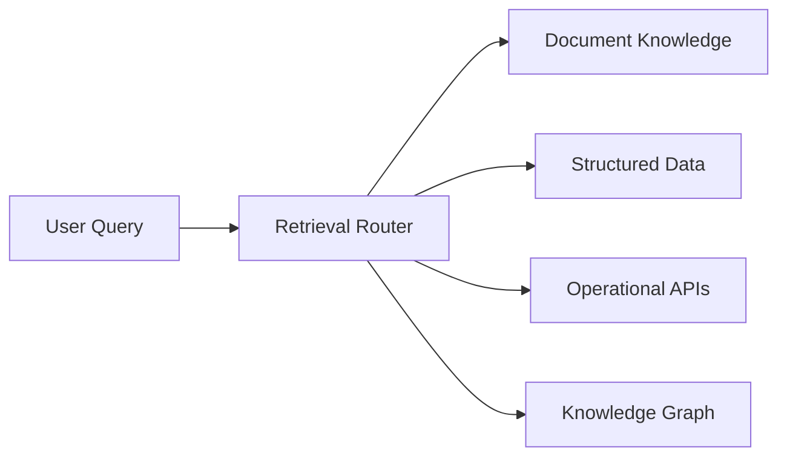
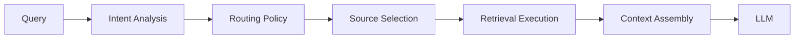
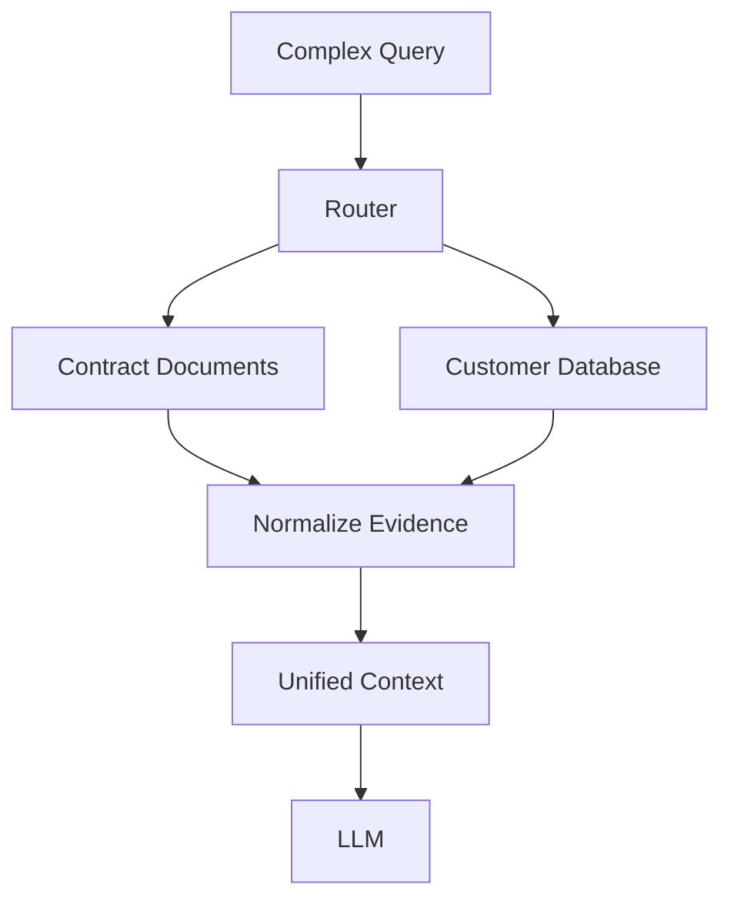
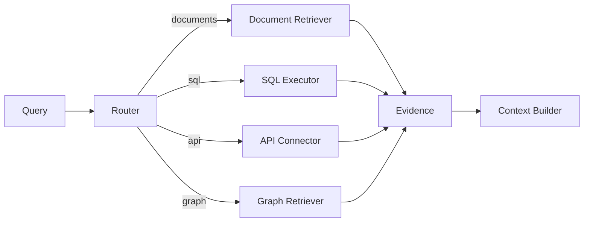
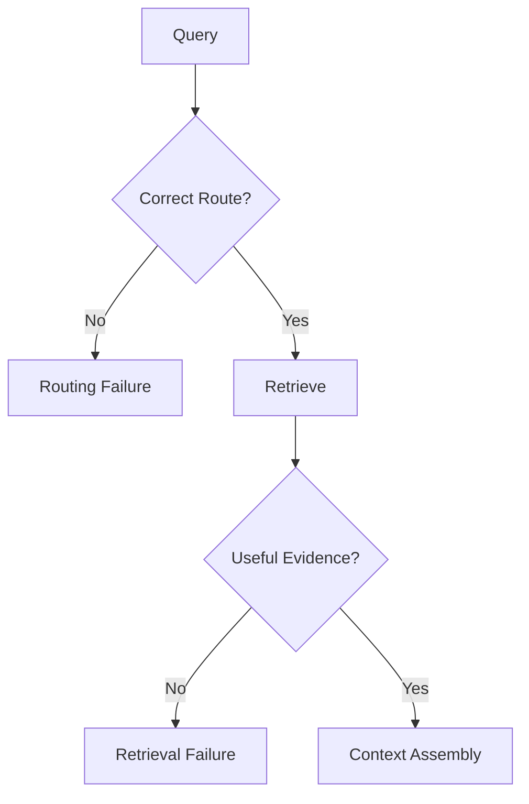
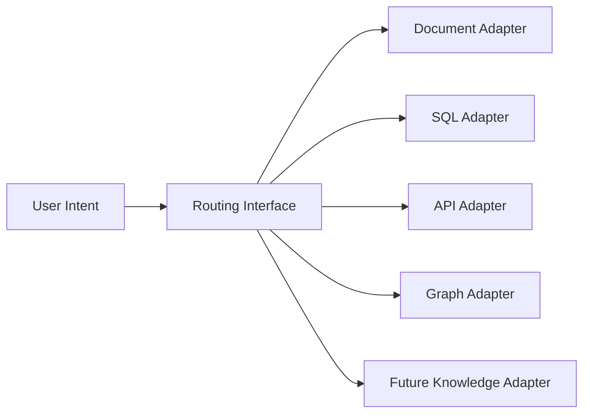
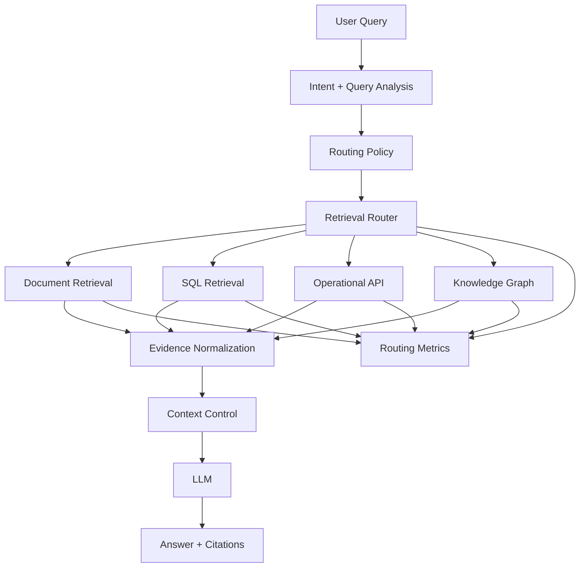

# Orchestrating Retrieval Across Enterprise Knowledge

A production enterprise AI system eventually runs into a problem that a single retrieval pipeline cannot solve well:

**the answer may not live in one knowledge system.**

A policy might live in a document repository. A transaction may live in a relational database. Current order status may only be available through an operational API. Relationships between customers, products, systems, and processes may be represented more naturally in a knowledge graph.

At that point, retrieval is no longer only about ranking documents.

It becomes an **orchestration problem**:

> Given this request, which knowledge source should be used, and what retrieval strategy should be applied?

This is the role of a **retrieval router**.

A router sits between user intent and enterprise knowledge. It decides which path should handle a request, while the downstream retriever or connector performs the actual data access.

That separation is important in production systems because source selection, retrieval execution, authorization, failure handling, and context assembly are different responsibilities.

---

## 1. Why One Knowledge Source Is Not Enough

A typical RAG architecture often assumes a flow like:

```text
Query → Retriever → Documents → Context → LLM
```

That model works when the useful knowledge is primarily contained in documents.

Enterprise environments are different.

A single business question can span several knowledge representations:

- Policies and manuals
- Product documentation
- Customer records
- Transactions
- Operational systems
- External services
- Search indexes
- Knowledge graphs

Consider a customer-support assistant.

A user asks:

> "Why was my payment declined, and what does our policy say about retrying it?"

There are potentially two different sources involved.

The payment status may come from a transaction system, while the retry policy may live in documentation.

Trying to force both questions through document retrieval creates unnecessary coupling. Likewise, sending every question to SQL is not a solution.

The architecture needs a decision boundary before retrieval execution.



The router does not need to understand every detail of every source.

Its job is to determine the **appropriate access path**.

---

## 2. Retrieval Routing as an Architectural Boundary

The router should be treated as an architectural component rather than a utility function buried inside application code.

A clean enterprise boundary looks like this:



This separation gives the system room to evolve.

For example, the organization may initially support:

```text
Documents
SQL
APIs
```

Later it may add:

```text
Knowledge Graph
Enterprise Search
Specialized Vector Index
External Knowledge Service
```

If routing is represented by a stable interface, adding a new source does not require rewriting the entire generation pipeline.

This is the same architectural principle used in well-designed backend systems: isolate the decision about **where to execute** from the implementation of **how the execution happens**.

---

## 3. What Should Drive the Routing Decision?

Routing should not be based only on keywords.

A production router can consider several dimensions.

### Intent

What is the user asking?

A question may request:

- Explanation
- Lookup
- Aggregation
- Current status
- Relationship discovery
- Policy interpretation

Intent is often more useful than individual words.

### Data shape

Does the answer require:

- Unstructured text?
- Structured records?
- Relationships?
- Live operational state?

The data shape strongly influences the access mechanism.

### Freshness

Some knowledge changes slowly.

Other information becomes stale within seconds.

A policy document may be acceptable for a cached retrieval path, while an order-status question may require a live API.

### Domain

Large organizations often have domain-specific systems.

Finance, HR, supply chain, customer support, and engineering may have completely different sources.

Domain-aware routing can reduce unnecessary searches across unrelated knowledge.

### Authorization

The router must operate within the user's access boundary.

A technically relevant source is not necessarily an authorized source.

Authorization should therefore be enforced independently of the model's routing decision.

---

## 4. Structured, Unstructured and Operational Knowledge

One useful way to think about routing is to classify knowledge by how it is represented.

### Unstructured knowledge

Documents are useful for policies, manuals, architecture documents, procedures, and explanatory material.

Typical retrieval mechanisms include lexical search, dense retrieval, and hybrid search.

### Structured knowledge

SQL databases are better suited to exact records, filtering, aggregation, joins, and transactional facts.

For example:

> "How many failed payments occurred yesterday?"

This is fundamentally different from:

> "What does the failed-payment policy say?"

The first requires structured computation. The second requires textual evidence.

### Operational knowledge

Some answers should come from live services.

For example:

> "Is shipment 48392 currently delayed?"

A historical document about shipping delays cannot substitute for the operational system of record.

### Relationship knowledge

Knowledge graphs become useful when the question depends heavily on relationships:

> "Which applications depend on this service?"

The answer may require traversing relationships rather than finding semantically similar paragraphs.

The important architectural lesson is that **retrieval strategy should follow knowledge characteristics**.

---

## 5. From Single-Source Retrieval to Multi-Source Retrieval

Routing does not always mean choosing exactly one source.

Some enterprise questions genuinely require multiple sources.

For example:

> "Show the customer's current subscription and explain which contract clause governs the cancellation."

The subscription state may come from a database or API, while the contractual rule may come from documents.

The router can therefore produce a retrieval plan instead of a single destination.



This introduces another architectural responsibility:

**evidence normalization.**

Different systems return different structures.

A SQL result may contain rows and columns.

A document retriever may return chunks, metadata, and scores.

An API may return JSON.

A graph query may return entities and relationships.

Before these results reach the generation layer, the system should convert them into a common evidence representation.

---

## 6. A Common Evidence Contract

A production system benefits from a normalized internal representation.

For example:

```python
from dataclasses import dataclass
from typing import Any

@dataclass
class Evidence:
    source: str
    content: Any
    metadata: dict
    confidence: float | None = None
```

Now different connectors can produce the same internal object.

```python
Evidence(
    source="policy_documents",
    content="Payments may be retried...",
    metadata={"document_id": "POL-102", "version": "7"},
)

Evidence(
    source="payment_api",
    content={"status": "DECLINED", "reason": "INSUFFICIENT_FUNDS"},
    metadata={"transaction_id": "TX-8842"},
)
```

The generation layer does not need to understand the implementation details of each connector.

It consumes normalized evidence.

This is an important production boundary because it prevents source-specific formats from leaking throughout the application.

---

## 7. Designing the Router Interface

The router itself can remain intentionally small.

```python
from dataclasses import dataclass
from typing import Protocol

@dataclass
class RouteDecision:
    sources: list[str]
    strategy: str
    reason: str

class RetrievalRouter(Protocol):
    def route(self, query: str) -> RouteDecision:
        ...
```

A simple rule-based implementation might look like:

```python
class EnterpriseRouter:
    def route(self, query: str) -> RouteDecision:
        q = query.lower()

        if any(x in q for x in ["transaction", "payment amount", "balance"]):
            return RouteDecision(
                sources=["sql"],
                strategy="structured_query",
                reason="Structured transactional information"
            )

        if any(x in q for x in ["current status", "where is", "live status"]):
            return RouteDecision(
                sources=["api"],
                strategy="live_lookup",
                reason="Real-time operational information"
            )

        if any(x in q for x in ["depends on", "connected to", "related systems"]):
            return RouteDecision(
                sources=["knowledge_graph"],
                strategy="graph_traversal",
                reason="Relationship-oriented question"
            )

        return RouteDecision(
            sources=["documents"],
            strategy="hybrid_search",
            reason="Unstructured knowledge"
        )
```

This example is deliberately simple.

Production systems should not assume that keyword rules alone are sufficient.

The interface is more important than the initial classifier.

The classifier can later evolve into a model-based intent classifier, policy engine, or agentic planner without changing the downstream retrieval contract.

---

## 8. Router → Retriever / Connector Execution

Once the route is selected, execution should remain separate.



This distinction is valuable.

The router answers:

**Where should this request go?**

The retriever answers:

**How do I obtain the relevant evidence from that source?**

The context layer answers:

**How should the returned evidence be prepared for generation?**

Keeping these responsibilities separate makes the architecture easier to test and operate.

---

## 9. Routing Policies Matter More Than Routing Alone

A mature router should not only classify queries.

It should apply enterprise policies.

For example:

```text
IF source = customer_db
AND user lacks customer-data permission
→ deny

IF source = operational_api
AND freshness = real_time
→ bypass cached document retrieval

IF source = documents
AND domain = finance
→ restrict to approved finance repositories

IF primary source unavailable
→ use approved fallback
```

These policies are especially important because routing decisions can determine which data enters the LLM context.

A routing layer therefore becomes part of the enterprise security boundary.

It should work with identity, authorization, data classification, tenant isolation, and audit logging rather than relying on the LLM to enforce those controls.

---

## 10. Routing Failures Are Different from Retrieval Failures

A useful production distinction is between **routing failure** and **retrieval failure**.

Routing failure:

> The system chose the wrong knowledge source.

Retrieval failure:

> The correct source was selected, but relevant evidence was not returned.

These failures require different diagnostics.



This distinction is extremely useful during incident analysis.

If answer quality suddenly drops, asking only "Did retrieval work?" is insufficient.

The team should also ask:

**Did we send the request to the right system?**

---

## 11. Fallbacks and Degraded Modes

Enterprise systems cannot assume every source will always be available.

A production routing architecture needs explicit degraded modes.

For example:

```text
Primary API
    ↓ unavailable
Approved cached snapshot
    ↓ unavailable
Informational response without live status
```

The important point is that fallback should be **policy-driven**.

A system should not silently substitute an older source when freshness is critical.

For a policy question, a previous approved document version may be acceptable if clearly identified.

For a live transaction status, it may not be acceptable at all.

Therefore, fallback policy should depend on:

- Source criticality
- Freshness requirement
- Data sensitivity
- Business impact
- Acceptable staleness

---

## 12. Observability: Measure the Routing Decision

Routing becomes difficult to improve if the system records only the final answer.

Production telemetry should capture the journey.

Useful signals include:

- Selected source
- Selected strategy
- Routing confidence
- Route latency
- Fallback count
- Source availability
- Retrieval latency
- Authorization denials
- Number of sources used
- Evidence contribution by source
- Final context quality
- Answer evaluation

A particularly useful metric is **route distribution**.

If 80% of questions unexpectedly route to a document store, the router may be overusing the default path.

Another useful signal is **fallback frequency**.

Frequent fallback can indicate an availability problem, poor source selection, or an unrealistic routing policy.

---

## 13. Evaluating the Router

Router evaluation should be treated separately from answer evaluation.

A useful evaluation dataset can contain representative enterprise questions with expected routing outcomes.

For each query, evaluate:

```text
Expected source
Actual source
Expected strategy
Actual strategy
Required freshness
Authorization result
Final answer quality
```

This enables teams to identify whether a bad answer came from:

1. Wrong source selection
2. Poor retrieval within the selected source
3. Bad context assembly
4. Generation problems

Without this separation, all failures tend to look like "RAG quality problems."

That makes debugging much harder.

---

## 14. Backend Architecture Parallel

The architecture has a familiar backend shape.

A traditional backend may use:

```text
Request
   ↓
Routing Logic
   ↓
Service / Repository
   ↓
Response
```

Enterprise AI extends the same principle:

```text
Query
   ↓
Retrieval Router
   ↓
Documents / SQL / APIs / Graph
   ↓
Evidence Normalization
   ↓
Unified Context
   ↓
LLM
```

The interesting part is that the router is not replacing retrieval.

It is **orchestrating access to retrieval capabilities**.

That distinction keeps the architecture modular.

---

## 15. Designing for Growth

A production enterprise AI platform should expect its knowledge landscape to change.

New sources will appear.

Existing systems will be replaced.

Some domains will introduce specialized search infrastructure.

The router should therefore depend on stable abstractions rather than concrete technologies.



This makes the retrieval layer extensible without forcing the application to understand every backend.

The architectural goal is not to predict every future source.

It is to make adding one **cheap and controlled**.

---

## 16. Production Architecture

Putting the pieces together:



Notice that routing is only one part of the architecture.

It connects intent to knowledge, while retrieval, evidence normalization, context control, generation, and observability remain separate concerns.

That separation is what makes the design suitable for production evolution.

---

## 17. Architecture Takeaways

A retrieval router becomes valuable when enterprise knowledge is distributed across systems with different access patterns.

The key principles are:

1. **Source selection is an architectural concern.**
2. **Different knowledge shapes require different retrieval mechanisms.**
3. **Routing should consider intent, freshness, domain, authorization, and strategy.**
4. **A complex query may require multiple sources rather than one destination.**
5. **Normalize heterogeneous results before sending them into the generation layer.**
6. **Keep routing separate from retrieval execution.**
7. **Treat routing failures differently from retrieval failures.**
8. **Make fallback behavior explicit and policy-driven.**
9. **Measure routing decisions independently from final answer quality.**
10. **Use stable interfaces so new enterprise knowledge sources can be added safely.**

The deeper architectural shift is this:

**Enterprise retrieval is not simply a search problem.**

It is a controlled process of connecting **user intent → the right knowledge system → the right retrieval strategy → trustworthy evidence → useful context**.

Once that routing boundary is designed well, the enterprise AI platform can grow its knowledge landscape without turning every new source into another tightly coupled integration.


# 18. Further Reading

For deeper coverage across AI Engineering — from ML and Deep Learning to LLMs, RAG, Generative AI, and Agentic AI — explore the AI Engineering Handbook for concepts, engineering patterns, architecture, and production considerations.

[Enterprise AI Handbook](https://enterpriseai.handbook.mihirkjha.com/)