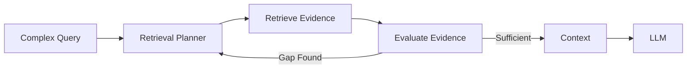
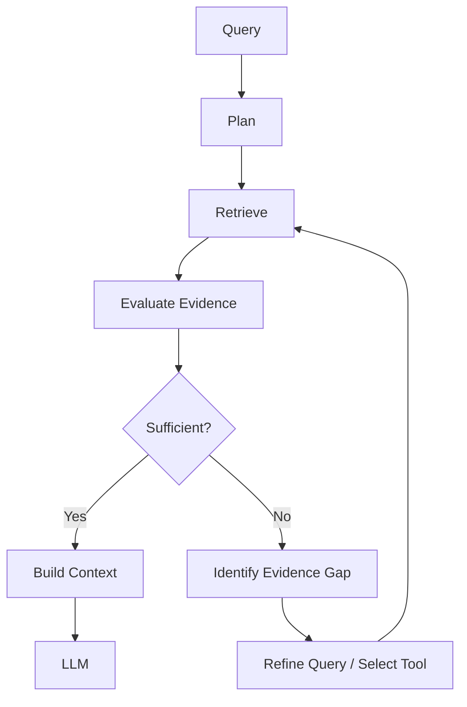
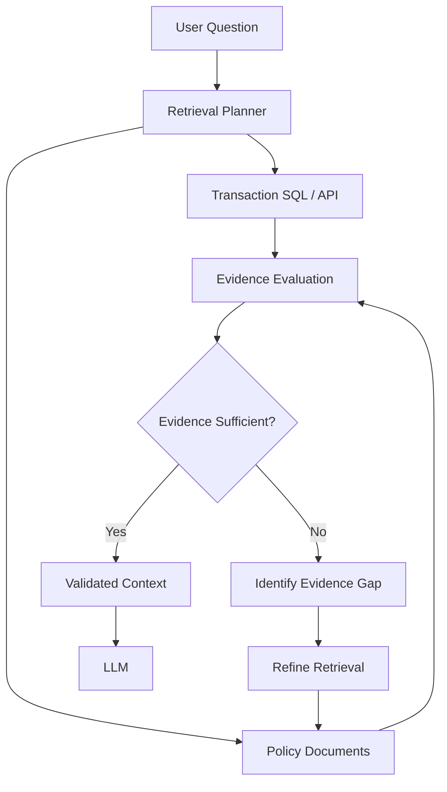
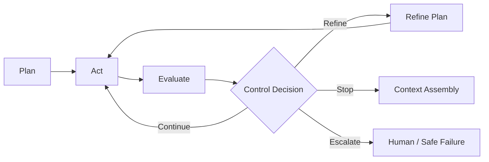
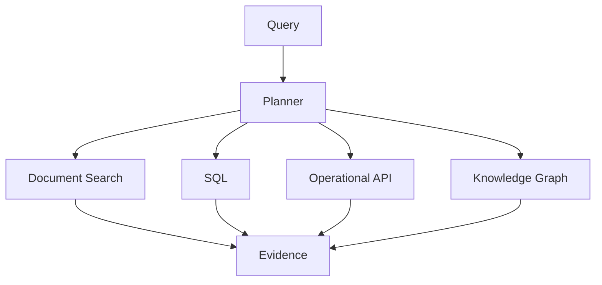
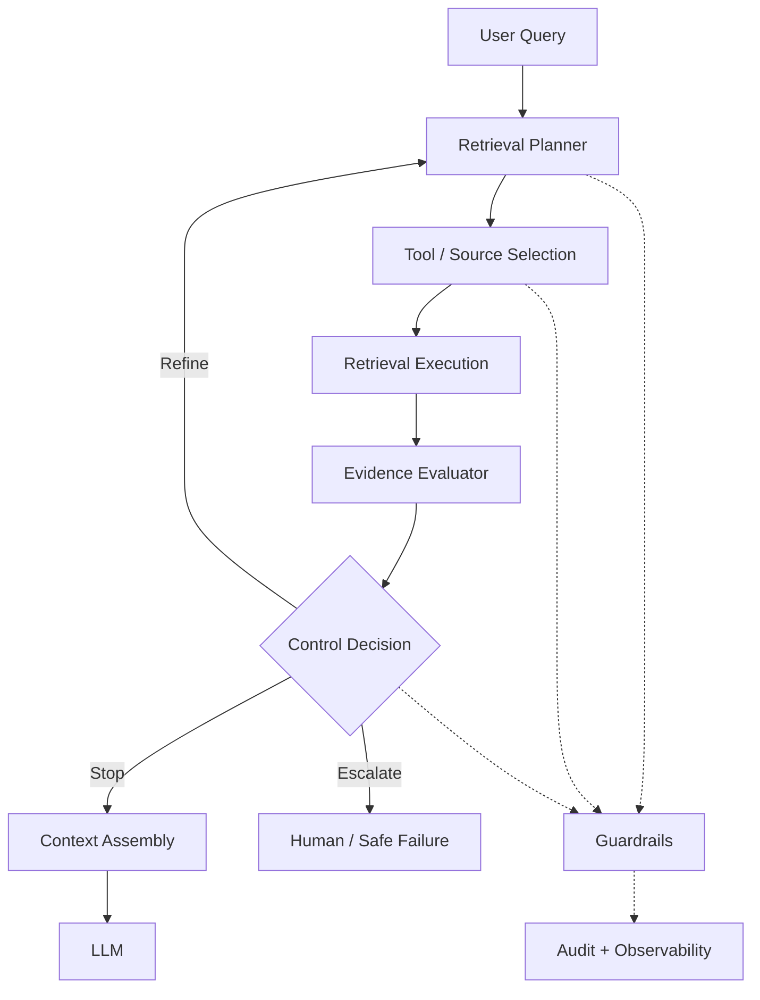

# Architecting Agentic Retrieval: Planning, Evidence & Control

A conventional retrieval pipeline is intentionally simple:

```text
Query → Retrieve → Context → LLM
```

That works when one retrieval path can provide enough evidence. Enterprise questions are often different. The answer may span several sources, require query refinement, or expose an information gap after the first retrieval step.

The architectural shift is therefore:

```text
Plan → Retrieve → Evaluate Evidence → Refine or Stop
```

The important word is **controlled**. Agentic retrieval should make retrieval adaptive without turning it into an unrestricted search loop.

---

## 1. Why Agentic Retrieval?

Consider:

> "Compare the customer's current payment status with the applicable retry policy and explain what should happen next."

This may require current payment data, policy evidence, identification of the applicable rule, and validation that the evidence is sufficient.



The planner does not answer the question. It determines **what retrieval work is required**.

---

## 2. Retrieval Planning

Planning gives the retrieval process an explicit objective before tools are called.

A plan can capture:

- Required information
- Candidate knowledge sources
- Retrieval steps or decomposition
- Evidence requirements
- Iteration limits

```python
from dataclasses import dataclass

@dataclass
class RetrievalPlan:
    steps: list[str]
    required_evidence: list[str]
    max_iterations: int = 3
```

For example:

```python
plan = RetrievalPlan(
    steps=[
        "Get current payment status",
        "Retrieve applicable retry policy",
        "Check policy applicability"
    ],
    required_evidence=["payment_status", "applicable_policy"]
)
```

The planner can be rule-based, model-assisted, or hybrid. The architectural contract should remain independent of that implementation choice.

---

## 3. Agentic Retrieval vs Fixed Retrieval

A fixed retrieval pipeline usually follows a predefined sequence:

```text
Query → Retrieve → Rank → Context
```

Agentic retrieval introduces a decision point after evidence is retrieved:

```text
Query
  ↓
Plan
  ↓
Retrieve
  ↓
Evaluate Evidence
  ↓
Decide
  ├── Sufficient → Context
  └── Insufficient → Refine / Retrieve Again
```

The important distinction is not simply that an LLM or agent is involved.

The architectural difference is that the system can **choose the next retrieval action based on the evidence obtained so far**.

This matters when the question requires multiple sources, different retrieval strategies, or another step after the first result reveals what is still missing.

The agent therefore becomes part of the **retrieval control plane**, rather than simply another component generating text.

The goal is not maximum autonomy. It is **adaptive retrieval within explicit architectural boundaries**.

---

## 4. Retrieval as an Iterative Process

Iteration should have a reason. A first retrieval may establish that a payment failed but not identify the policy governing retries. That missing evidence becomes the reason for the next action.



This is fundamentally different from telling an agent to simply "search again."

---

## 5. Evidence Evaluation

Retrieved content is not automatically usable evidence. Evaluation should consider:

- Relevance
- Completeness
- Source authority
- Freshness
- Conflicts
- Missing information

```python
from dataclasses import dataclass

@dataclass
class EvidenceAssessment:
    sufficient: bool
    missing: list[str]
    conflicts: list[str]

def evaluate_evidence(evidence, required):
    found = {item["type"] for item in evidence}
    missing = [item for item in required if item not in found]

    return EvidenceAssessment(
        sufficient=not missing,
        missing=missing,
        conflicts=[]
    )
```

Production evaluation can combine deterministic rules, source metadata, retrieval scores, model-based assessment, and domain validation.

The architectural boundary is the important part: **evidence evaluation is separate from retrieval execution**.

---

## 6. Enterprise Example: Retrieval Driven by Evidence Gaps

Consider an enterprise payment-support question:

> "Why was this payment declined, and which policy applies to the decision?"

The answer may require both transaction evidence and policy evidence.



The important behavior is the **evidence gap**.

If the transaction record explains the decline but the applicable policy is missing, the system should not simply generate an answer from incomplete context.

Instead, the missing evidence becomes an input to the next retrieval decision:

```text
Retrieve
   ↓
Evaluate
   ↓
Identify Gap
   ↓
Refine
   ↓
Retrieve Again
   ↓
Validate
   ↓
Stop
```

The system is adapting its retrieval behavior based on what it already knows, rather than repeatedly searching without a clear objective.

---

## 7. The Control Loop

Agentic retrieval needs an explicit controller so that the system can decide whether to continue, refine, stop, or escalate.



Typical boundaries include:

- Maximum iterations
- Token and cost budgets
- Latency budget
- Allowed tools and sources
- Evidence sufficiency
- Authorization and safety policies

This turns autonomy into **bounded autonomy**.

---

## 8. Compact Agentic Retrieval Implementation

The core orchestration can remain small when responsibilities are separated:

```python
def agentic_retrieve(query, planner, retriever, evaluator, controller):
    state = {"query": query, "evidence": [], "iteration": 0}

    while controller.can_continue(state):
        plan = planner.plan(
            state["query"],
            state["evidence"]
        )

        state["evidence"].extend(
            retriever.execute(plan)
        )

        assessment = evaluator.evaluate(
            state["evidence"],
            plan.required_evidence
        )

        if assessment.sufficient:
            return state["evidence"]

        state["query"] = planner.refine(
            state["query"],
            assessment.missing
        )

        state["iteration"] += 1

    return state["evidence"]
```

The architectural responsibilities are explicit:

**Planner → Retriever → Evaluator → Controller**

That makes each capability independently testable and replaceable.

---

## 9. Preventing Uncontrolled Retrieval Loops

Without boundaries, every result can create another search:

```text
Search → New Term → Search → New Source → Search → ...
```

A controller should make continuation explicit:

```python
class RetrievalController:

    def __init__(self, max_iterations=4, max_cost=1.0):
        self.max_iterations = max_iterations
        self.max_cost = max_cost

    def can_continue(self, state):
        return (
            state["iteration"] < self.max_iterations
            and state.get("estimated_cost", 0) < self.max_cost
        )
```

Production controls can add latency limits, tool-specific quotas, risk levels, and source policies.

---

## 10. Refinement Should Follow Evidence Gaps

The refinement loop should be evidence-driven:

```text
Query → Retrieve → Evaluate → Missing Evidence → Targeted Refinement → Retrieve
```

For example:

```python
missing = ["applicable_retry_policy"]

refined_query = (
    "Find the approved retry policy applicable "
    "to the current payment failure."
)
```

The key is not generating another query. It is generating the **right next retrieval action because the system knows what is missing**.

---

## 11. Tool Selection and Safety Boundaries

Agentic retrieval may choose among documents, SQL, APIs, enterprise search, or knowledge graphs.



However, tool selection is not authorization. Access should be constrained by:

- User permissions
- Tenant boundaries
- Data classification
- Domain policy
- Source criticality
- Business risk

**Model decision ≠ authorization decision.** The platform must enforce the boundary.

---

## 12. Failure Handling and Human Escalation

Another retrieval loop is not always the correct recovery path.

Escalation or safe failure may be appropriate for:

- Conflicting authoritative sources
- Missing high-value evidence
- Sensitive business decisions
- Repeated retrieval failure
- Exceeded cost or latency budgets
- Ambiguous intent

The control outcomes are therefore:

```text
SUFFICIENT → Generate Answer

RECOVERABLE GAP → Refine / Retrieve Again

HIGH-RISK OR UNRESOLVED → Escalate / Fail Safely
```

For enterprise systems, an explicit inability to answer can be safer than a confident answer built on insufficient evidence.

---

## 13. Observability and Evaluation

Agentic retrieval should be measured as its own architectural capability.

Useful telemetry includes:

- Iteration count
- Tools and sources selected
- Retrieval latency per step
- Evidence added per iteration
- Evidence assessment result
- Refinement reason
- Token and cost consumption
- Stop reason
- Escalation frequency

A particularly useful signal is **evidence gained per iteration**. If later iterations add almost nothing, the controller may be too permissive.

Evaluation should also ask:

- Did the planner choose a sensible sequence?
- Did refinement improve evidence quality?
- Did the system stop at the right time?
- Was additional retrieval worth its cost?
- Were policy and access boundaries respected?

This separates **retrieval-loop quality** from final answer quality.

---

## 14. Backend Architecture Parallel

The pattern is familiar from backend workflow orchestration:

```text
Request → Execute → Validate → Retry / Continue → Response
```

Agentic retrieval applies the same control structure to knowledge acquisition:

```text
Query → Retrieve → Evaluate Evidence → Refine / Continue → Context
```

The common architectural pattern is:

**Decision → Execute → Evaluate → Continue or Stop**

The difference is that the execution target is retrieval rather than a conventional business workflow.

---

## 15. Production Architecture



The architecture keeps **planning, execution, evaluation, and control** separate. This gives the platform explicit places to enforce budgets, permissions, safety policies, audit requirements, and operational limits without putting all control inside the model prompt.

---

## 16. Architecture Takeaways

1. **Plan complex retrieval instead of treating it as one operation.**
2. **Make evidence evaluation a first-class architectural stage.**
3. **Refine because of identified evidence gaps, not because another iteration is available.**
4. **Separate planner, retriever, evaluator, and controller responsibilities.**
5. **Bound autonomy with iteration, cost, latency, and tool limits.**
6. **Enforce permissions and safety at the platform boundary.**
7. **Define explicit stop, escalation, and safe-failure conditions.**
8. **Measure the value contributed by each retrieval iteration.**

The goal is not maximum retrieval.

It is **adaptive retrieval that can handle complex enterprise questions while remaining predictable, auditable, and controlled in production.**

---

## 17. Further Reading

For deeper coverage across AI Engineering — from ML and Deep Learning to LLMs, RAG, Generative AI, and Agentic AI — explore the AI Engineering Handbook for concepts, engineering patterns, architecture, and production considerations.

[Enterprise AI Handbook](https://enterpriseai.handbook.mihirkjha.com/)
