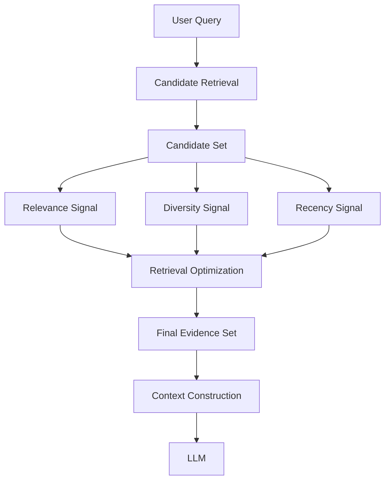
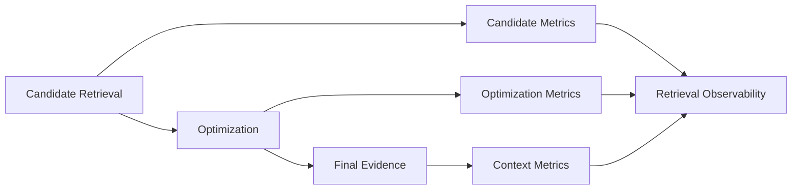

# Optimizing Retrieval Architecture: Relevance, Diversity & Recency

Retrieval is often treated as successful once the system finds relevant documents.

In production enterprise AI, that is only part of the problem.

A retrieval system can return highly relevant candidates and still produce poor context for the LLM if those candidates are repetitive, stale, or poorly balanced.

The architectural question therefore becomes:

> How do we turn a good candidate set into a good evidence set?

A useful mental model is:

```text
Candidate Set
      ↓
Relevance + Diversity + Recency
      ↓
Retrieval Optimization
      ↓
Final Evidence Set
      ↓
Context
      ↓
LLM
```

The goal is not simply to maximize the score of each document independently. The goal is to construct a useful evidence set collectively.

---

## 1. The Problem with Relevance-Only Retrieval

Traditional vector retrieval often starts with a straightforward assumption:

> Find the documents most similar to the query.

That works well as a foundation, but it can produce an undesirable result.

Suppose a query retrieves ten highly relevant chunks:

```text
Chunk 1 — Policy document, section A
Chunk 2 — Policy document, section B
Chunk 3 — Policy document, section C
Chunk 4 — Same policy, repeated explanation
Chunk 5 — Same policy, repeated explanation
...
```

The individual similarity scores may be excellent.

But the final context may contain very little additional information.

This creates three common problems:

- **Redundancy** — several chunks communicate the same information.
- **Staleness** — older evidence may outrank a newer version.
- **Poor evidence coverage** — the final context may represent only one source or perspective.

So retrieval quality needs to be evaluated at two levels:

```text
Individual Result Quality
        +
Evidence Set Quality
```

The second level is where retrieval optimization becomes important.

---

## 2. Retrieval Optimization as an Architectural Layer

Rather than embedding every ranking decision inside the retriever, a dedicated optimization layer can sit between candidate retrieval and context construction.



This separation is useful architecturally because candidate generation and final evidence selection have different responsibilities.

The retriever should provide a sufficiently strong candidate pool.

The optimization layer decides which candidates should actually make it into the final context.

This also gives engineering teams a clear place to tune relevance, diversity and freshness policies without redesigning the entire retrieval pipeline.

---

## 3. Relevance Remains the Foundation

Relevance answers the simplest question:

> Does this candidate help answer the query?

It should remain the primary signal.

For example:

```text
Query:
"What is the current PCI-DSS tokenization requirement?"

Relevant evidence:
- PCI-DSS tokenization policy
- Card-data protection requirements
- Current payment security procedure
```

However, relevance scores alone do not tell us whether the selected documents complement one another.

Five chunks from the same paragraph can all be highly relevant.

That is why retrieval optimization should not replace relevance. It should build on it.

A simplified architecture is:

```text
Candidate Retrieval
        ↓
High-relevance candidates
        ↓
Optimize composition
        ↓
Useful evidence set
```

---

## 4. Diversity with Maximum Marginal Relevance

One of the most useful approaches for reducing redundancy is **Maximum Marginal Relevance (MMR)**.

The basic idea is simple:

> Prefer candidates that are relevant to the query but also add information that is different from what has already been selected.

A simplified MMR formulation is:


### MMR Formula

**MMR(d) = λ × Relevance(d,q) − (1−λ) × max Similarity(d,d′)**

- **MMR(d)** → Overall score of candidate document `d`.
- **d** → Candidate document/chunk being evaluated.
- **q** → User's query.
- **λ (lambda)** → Controls the balance between relevance and diversity.
  - Higher λ → more relevance
  - Lower λ → more diversity
- **Relevance(d,q)** → How relevant `d` is to the query.
- **d′** → A document/chunk already selected.
- **Similarity(d,d′)** → How similar the candidate is to an already-selected document.
- **max Similarity** → Highest similarity with any selected document; this represents the strongest redundancy.
- **(1−λ)** → Weight given to the redundancy/diversity penalty.

### Core Idea

> **Select documents that are relevant to the query while avoiding unnecessary repetition.**

The important architectural point is that MMR evaluates the **relationship between candidates**, rather than treating every candidate independently.

---

## 5. Recency and Freshness

Enterprise knowledge is not static.

Policies change. Pricing changes. Regulations change. Operational information changes.

That means a highly relevant document can still be the wrong evidence if it is outdated.

A retrieval system can therefore introduce a freshness signal.

For example:

```text
Final ranking signal
    =
Relevance
    +
Diversity
    +
Recency
```

A simple time-decay function might look like:

```text
recency_score = exp(-λ × age_days)
```

The exact formula is less important than the architectural decision: **how much should freshness influence evidence selection?**

Not every domain should use the same policy.

For stable technical documentation, recency may be a small preference.

For policies, pricing or regulatory information, freshness may be much more important.

In some cases, freshness should become a constraint rather than merely a ranking bonus.

---

## 6. Combining the Signals

A conceptual optimization model can combine normalized signals:

```text
final_score =
    α × relevance
    +
    β × diversity
    +
    γ × recency
```

However, production systems should be careful about directly adding raw scores.

Different retrievers and ranking mechanisms can produce scores on different scales.

For example:

```text
Dense similarity:     0.82
BM25 score:           17.4
Recency score:        0.71
```

These values cannot automatically be compared or added meaningfully.

A production architecture may therefore use:

- score normalization
- rank-based fusion
- calibrated signals
- explicit thresholds
- business rules
- hard constraints for freshness or access

The optimization layer is therefore not just a mathematical formula. It is a policy boundary.

---

## 7. Compact Implementation Example

The implementation below keeps the architecture intentionally simple. The retriever produces candidates, while the optimizer is responsible for selecting the final evidence set.

```python
from dataclasses import dataclass
import math


@dataclass
class Candidate:
    id: str
    text: str
    relevance: float
    similarity_to_selected: float
    age_days: float


class RetrievalOptimizer:

    def __init__(
        self,
        relevance_weight=0.6,
        diversity_weight=0.25,
        recency_weight=0.15
    ):
        self.relevance_weight = relevance_weight
        self.diversity_weight = diversity_weight
        self.recency_weight = recency_weight

    def recency_score(self, age_days, decay=0.03):
        return math.exp(-decay * age_days)

    def optimize(self, candidates, top_k=5):
        selected = []

        while candidates and len(selected) < top_k:

            def score(candidate):
                diversity = 1 - candidate.similarity_to_selected
                recency = self.recency_score(candidate.age_days)

                return (
                    self.relevance_weight * candidate.relevance
                    + self.diversity_weight * diversity
                    + self.recency_weight * recency
                )

            best = max(candidates, key=score)
            selected.append(best)
            candidates.remove(best)

        return selected
```

This is intentionally a compact architectural example rather than a production-ready ranking engine.

A real implementation would normally include normalized scores, document/version metadata, source diversity, access constraints, observability and evaluation.

---

## 8. Evidence-Set Optimization

The important shift is from:

```text
"Which document has the highest score?"
```

to:

```text
"Which combination of documents gives the best evidence?"
```

Consider an enterprise policy query.

A useful final set might contain:

```text
1. Current policy
2. Relevant exception
3. Effective-date information
4. Supporting implementation procedure
```

Selecting four nearly identical chunks from the current policy may have a higher average relevance score, but it provides weaker evidence coverage.

The optimization layer should therefore consider the **composition of the set**, not just the score of individual candidates.

---

## 9. Backend Architecture Parallel

The same idea exists in conventional backend systems.

A database query may return hundreds of matching records.

A production API does not necessarily return every match.

It may apply:

- filtering
- prioritization
- deduplication
- freshness rules
- pagination
- response shaping

before sending the final response.

The RAG equivalent is:

```text
Backend

Request
   ↓
Query / Search
   ↓
Matching Records
   ↓
Filter + Prioritize + Shape
   ↓
Response


Enterprise RAG

Query
   ↓
Candidate Retrieval
   ↓
Candidate Set
   ↓
Optimize Evidence
   ↓
Final Context
```

The common architectural pattern is:

> Retrieve broadly, then shape the result for the consumer.

For RAG, the consumer is the context-building layer and ultimately the LLM.

---

## 10. Architecture Trade-offs

Adding more ranking signals improves control, but it also introduces complexity.

### Relevance vs Diversity

Too much emphasis on relevance can create repetitive evidence.

Too much diversity can introduce less relevant information.

### Relevance vs Recency

A recent document is not automatically more authoritative.

An older version may still contain important historical or foundational information.

### Recency vs Authority

Freshness should not blindly replace source authority.

For regulated environments, the system may need both:

```text
Freshness Requirement
        +
Authoritative Source
        +
Relevance
```

### Optimization vs Latency

Every additional ranking calculation increases processing cost.

This matters when candidate sets are large or retrieval operates at high request volume.

The architecture should therefore optimize only as much as the quality requirement justifies.

---

## 11. Production Observability

Retrieval optimization should be observable as its own stage.

Useful signals include:

- relevance-score distribution
- duplicate ratio
- source diversity
- document-version distribution
- evidence freshness
- final context size
- optimization latency
- percentage of candidates discarded
- evidence coverage for evaluated queries

A useful production view is:



This makes it possible to distinguish:

```text
Bad candidates
        vs
Bad evidence selection
```

That distinction becomes important when debugging production RAG quality.

---

## 12. Architecture Takeaways

Retrieval does not end when the system finds relevant candidates.

The final evidence set should be:

- relevant to the query
- diverse enough to avoid unnecessary repetition
- sufficiently fresh for the domain
- small enough to fit the context budget
- strong enough to support the final answer

The architecture can be summarized as:

```text
Candidate Set
      ↓
Relevance
      +
Diversity
      +
Recency
      ↓
Optimization Policy
      ↓
Final Evidence Set
      ↓
Context
```

The key architectural shift is:

> **Optimize the evidence set, not just the individual document score.**

For enterprise AI, retrieval quality is ultimately about the quality of the information that reaches the model.

---

## 13. Further Reading

For deeper coverage across AI Engineering — from ML and Deep Learning to LLMs, RAG, Generative AI, and Agentic AI — explore the AI Engineering Handbook for concepts, engineering patterns, architecture, and production considerations.

[Enterprise AI Handbook](https://enterpriseai.handbook.mihirkjha.com/)
