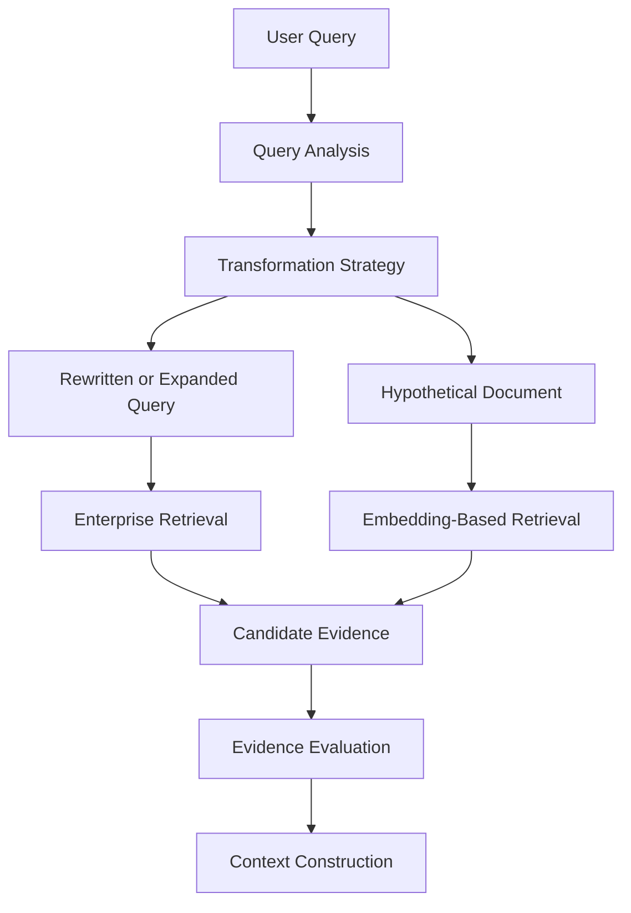
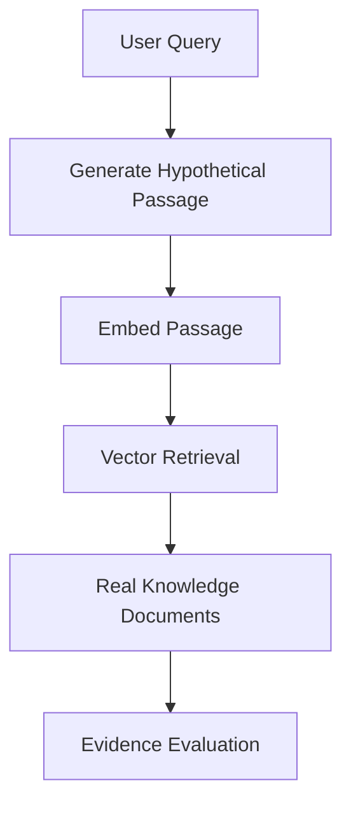
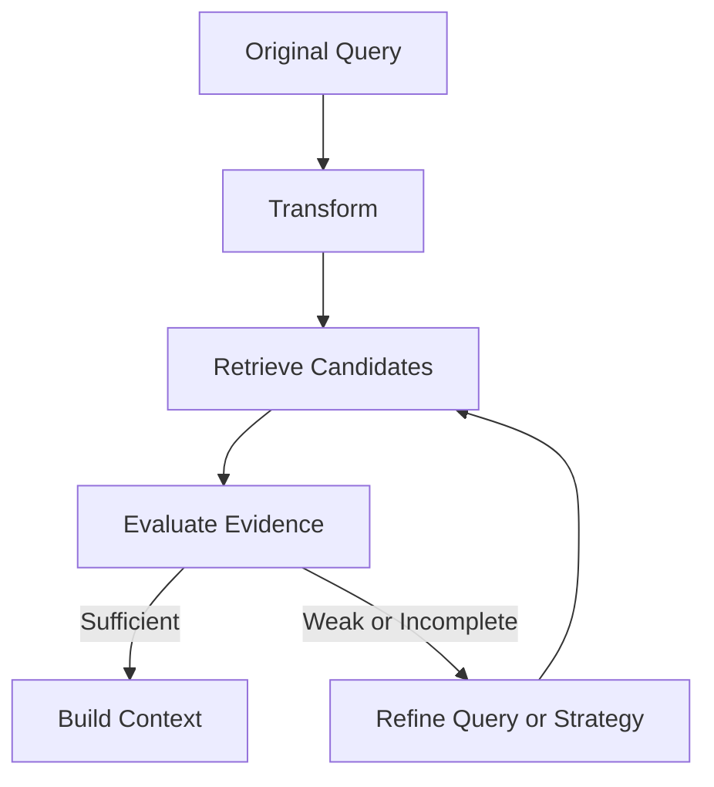

# Engineering Query-to-Knowledge Alignment

Sometimes, the information an enterprise AI system needs is already in the knowledge base, but retrieval still fails to find it.

The reason may be surprisingly simple: the user and the documents describe the same concept in different ways.

A user asks, “Why was my payment declined?” The relevant procedure may use phrases such as “issuer authorization failure” or “transaction rejection code.”

The intent is related, but the wording does not line up.

Query-to-knowledge alignment addresses this gap. It transforms the query when useful, while preserving what the user actually wants to know.

```text
User Query
    ↓
Query Analysis
    ↓
Transformation Strategy
    ↓
Enterprise Retrieval
    ↓
Evidence Evaluation
    ↓
Context Construction
```

The objective is not to make every query longer or more complicated. It is to give retrieval a better representation of the user's intent.

---

## 1. Why Query-to-Knowledge Mismatch Matters

Enterprise knowledge is written for different audiences and purposes. A support ticket, technical runbook, database field, policy document and API response may describe the same event using different terminology.

For example:

```text
User wording:       "Why did my payment fail?"
Support wording:   "Card transaction declined"
Technical wording: "Issuer authorization failure"
System field:      "authorization_status = REJECTED"
```

A retriever may connect some of these representations, especially when semantic search is effective. But no single retrieval method handles every terminology gap equally well.

This is why query transformation belongs in the retrieval architecture. It gives the system a chance to bridge the mismatch before concluding that the knowledge is missing.

The distinction matters: **missing evidence and poorly aligned queries are different failure modes.**

---

## 2. Query Transformation as an Architectural Layer

A dedicated transformation stage can sit between query intake and retrieval.



Not every request needs every transformation. A straightforward query may go directly to retrieval. More ambiguous queries may benefit from rewriting or expansion. HyDE can help when the language of the expected evidence differs substantially from the user's phrasing.

This layer should be treated as a strategy decision, not a mandatory LLM call on every request.

---

## 3. Query Rewriting

Query rewriting expresses the user's original intent in a form that may work better for retrieval.

Original:

```text
"Why was my payment declined?"
```

Possible rewrite:

```text
"Common reasons for issuer authorization failure in card payments"
```

The rewrite introduces terminology that may appear in payment documentation, while staying close to the user's question.

A good rewrite should:
- preserve the original intent
- make the retrieval target clearer
- avoid adding unsupported assumptions
- retain important identifiers, dates or constraints

The original query should remain available for traceability and evaluation. A rewrite is an alternative retrieval representation, not a replacement for what the user actually asked.

---

## 4. Query Expansion

Query expansion adds useful terms that may appear in the knowledge source.

For example:

```text
Original:
"payment declined"

Expanded terms:
"payment declined", "transaction rejection",
"issuer authorization failure", "decline code"
```

Expansion can improve recall when enterprise documents use synonyms, acronyms or domain-specific vocabulary.

But more terms do not automatically mean better retrieval. Expanding a query too broadly can introduce unrelated concepts and dilute the user's intent.

A practical design is to preserve the original query and use a small, controlled set of additional terms. The system can retrieve with both representations and combine the resulting candidates before evidence selection.

---

## 5. HyDE: Hypothetical Document Embeddings

HyDE stands for **Hypothetical Document Embeddings**.

Instead of only rewriting the query, the system generates a hypothetical answer-like passage describing what a relevant document might say. It then embeds that passage and uses the embedding to search for real documents.



For example, a question about a declined payment may produce a hypothetical passage mentioning issuer authorization, decline codes and card transaction validation. Its embedding can help locate documentation that uses similar technical language.

An important boundary: **the hypothetical passage is a retrieval aid, not evidence.** It may contain inaccurate or invented details. The final answer must be grounded in retrieved enterprise sources, not in the generated passage itself.

HyDE can help with representation mismatch, but it adds generation and embedding work. It should be used when its expected retrieval benefit justifies the extra latency and cost.

---

## 6. Choosing the Right Transformation

The transformation strategy should match the problem.

| Situation | Possible approach |
|---|---|
| Query is vague or poorly phrased | Query rewriting |
| Documents use known synonyms or technical terms | Query expansion |
| Query and document styles differ substantially | Consider HyDE |
| Query already matches the knowledge vocabulary | Retrieve directly |

These are design guidelines, not rigid rules. Systems can use query classification, simple heuristics or evaluation results to decide when transformation is worth attempting.

Avoid applying all techniques to every request. More transformations create more candidate paths, but also add complexity and can make the final evidence set noisier.

---

## 7. Compact Python Implementation

This example keeps the components separate: a transformation strategy prepares retrieval variants, and a retrieval component searches each variant. The retrieval function is represented by a placeholder because the actual implementation depends on the chosen search engine.

```python
from dataclasses import dataclass


@dataclass
class QueryPlan:
    original: str
    variants: list[str]


class QueryTransformer:
    def rewrite(self, query: str) -> str:
        # Replace with an LLM prompt or domain-specific logic.
        return query.strip()

    def expand(self, query: str) -> list[str]:
        # In production, generate controlled synonyms or domain terms.
        return [query.strip()]

    def prepare(self, query: str) -> QueryPlan:
        rewritten = self.rewrite(query)
        variants = list(dict.fromkeys(
            [query.strip(), rewritten, self.expand(query)]
        ))
        return QueryPlan(original=query, variants=variants)


def retrieve_candidates(query: str):
    # Replace with vector, lexical, or hybrid retrieval.
    raise NotImplementedError


def aligned_retrieve(query: str):
    transformer = QueryTransformer()
    plan = transformer.prepare(query)

    candidates = []
    for variant in plan.variants:
        candidates.extend(retrieve_candidates(variant))

    # Deduplicate by stable document/chunk ID before ranking.
    unique = {item["id"]: item for item in candidates}
    return list(unique.values())
```

This is an architectural skeleton, not a complete production implementation. The example deliberately avoids pretending that an identity rewrite or a placeholder expansion improves retrieval by itself. The transformation methods need a real model or domain-specific implementation, and candidate results need ranking, access checks and evidence evaluation.

For HyDE, add a separate strategy that generates a hypothetical passage, embeds it and retrieves candidates from that embedding. Do not add the hypothetical passage to the trusted evidence list.

---

## 8. Retrieval Feedback and Controlled Refinement

Transformation should not stop at generating a query variant. The system also needs a way to judge whether retrieval produced useful evidence.



Evidence evaluation might consider whether results are relevant, whether required topics are covered, and whether the returned documents satisfy freshness and access requirements.

A refinement loop needs explicit limits:
- maximum transformation or retrieval attempts
- latency and token budgets
- allowed retrieval strategies
- a clear evidence-sufficiency condition
- a stop or escalation path when evidence remains weak

Without these boundaries, the system can repeatedly rewrite a query without improving the evidence.

Retrieval feedback should also be interpreted carefully. Weak results do not always mean the query needs another rewrite. The knowledge base may genuinely lack the answer, the user may have omitted a critical detail, or a source may be unavailable.

---

## 9. Preserving Intent and Managing Trade-offs

The main risk is over-transformation.

A query such as “Why was this payment declined yesterday?” contains a time constraint. A rewrite that drops “yesterday” may retrieve a general explanation while missing the specific incident.

Likewise, adding a technical assumption that the user never made can push retrieval toward the wrong documents.

A robust design should preserve the original query, important entities and constraints, and record which transformation produced each candidate. This makes results easier to debug and compare.

Transformation also has a cost:
- LLM calls increase latency and token usage.
- Multiple query variants can multiply retrieval work.
- Broad expansion can increase duplicate or irrelevant candidates.
- HyDE introduces generated text that must never be treated as verified evidence.

Use the simplest strategy likely to solve the mismatch, and measure whether it improves retrieval quality.

---

## 10. Backend Architecture Parallel

Backend systems often translate user-facing requests into internal search criteria, domain identifiers or service parameters.

```text
Backend
Request
   ↓
Normalize / Map Intent
   ↓
Internal Search Criteria
   ↓
Repository or Service
   ↓
Response

Enterprise RAG
User Query
   ↓
Query Transformation
   ↓
Retrieval Representation
   ↓
Knowledge Retrieval
   ↓
Evidence
```

The common pattern is to preserve the caller's intent while adapting the request to the representation expected by the downstream system.

The transformation stage should not make business decisions that belong elsewhere, bypass access controls or invent facts. Its job is to improve the path to relevant evidence.

---

## 11. Production Observability

To know whether alignment is helping, track more than whether the transformation ran.

Useful measures include:
- retrieval relevance and evidence coverage before and after transformation
- duplicate and irrelevant candidate rates
- transformation method selected
- latency and token cost per strategy
- how often refinement is triggered
- how often refinement actually improves evidence
- cases where the system stops because evidence is insufficient

These measurements help teams decide whether rewriting, expansion or HyDE is worth keeping for a given query class.

---

## 12. Architecture Takeaways

Query-to-knowledge alignment addresses a practical problem: users and enterprise knowledge often express related concepts in different ways.

- **Rewriting** clarifies the query.
- **Expansion** adds useful vocabulary.
- **HyDE** uses a hypothetical passage to guide embedding-based retrieval.
- **Retrieval feedback** helps determine whether another attempt is justified.

The architecture should preserve the original intent, choose transformations selectively, evaluate the real evidence and stop when the evidence is sufficient—or acknowledge that it is not.

> **Better retrieval does not always start with a better retriever. Sometimes, it starts with a better representation of the question.**

---

## 13. Further Reading

For deeper coverage across AI Engineering — from ML and Deep Learning to LLMs, RAG, Generative AI, and Agentic AI — explore the AI Engineering Handbook for concepts, engineering patterns, architecture, and production considerations.

[Enterprise AI Handbook](https://enterpriseai.handbook.mihirkjha.com/)
