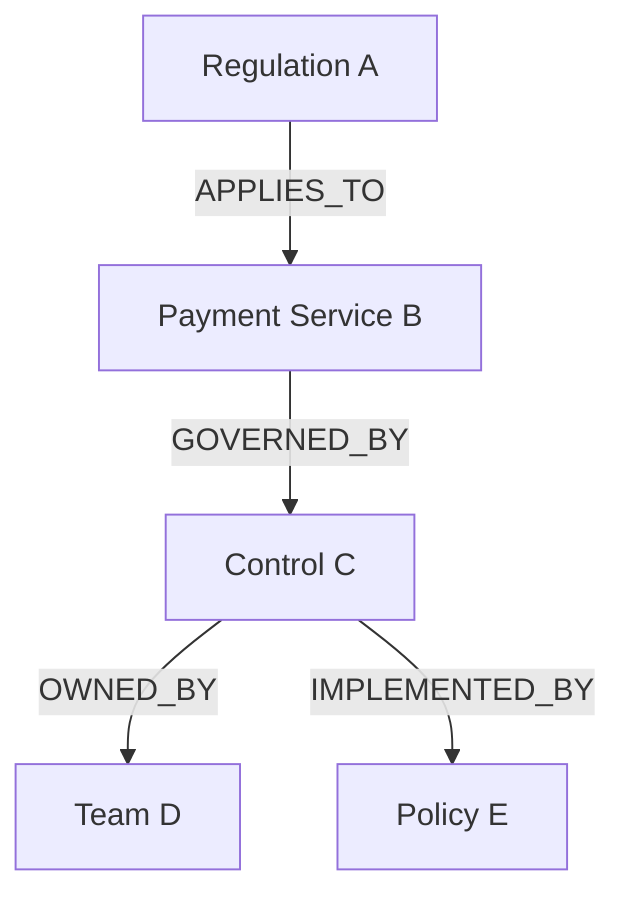
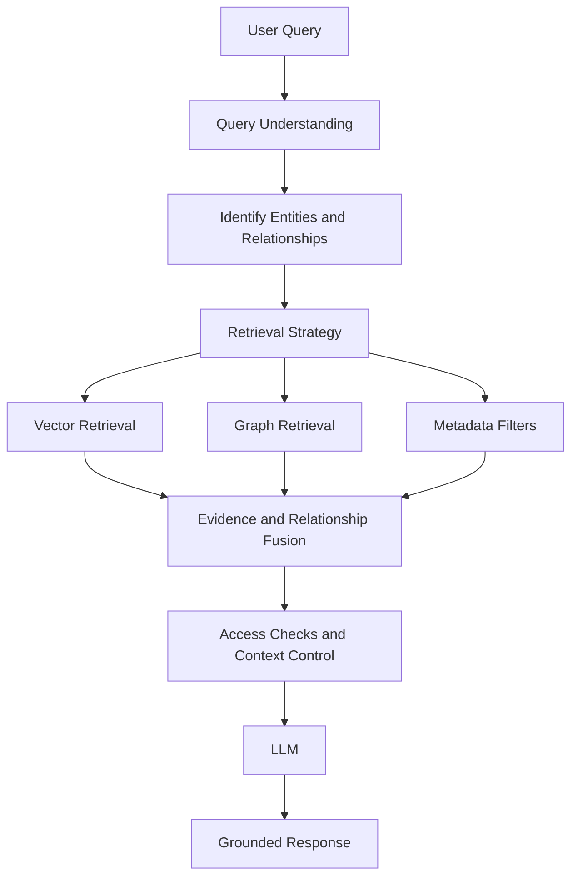
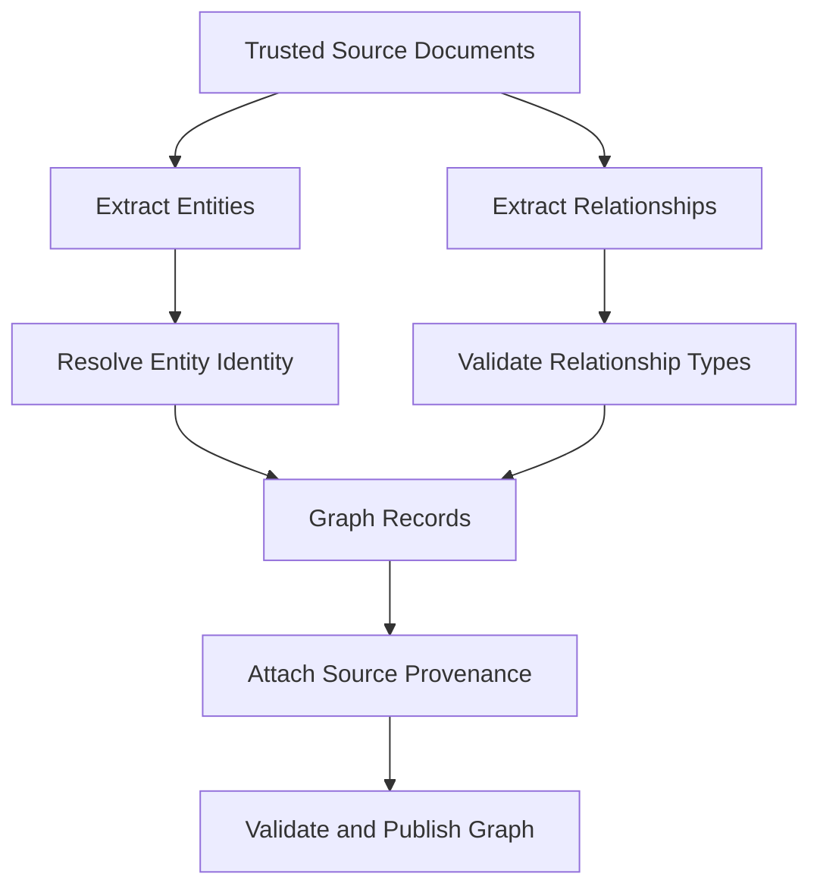
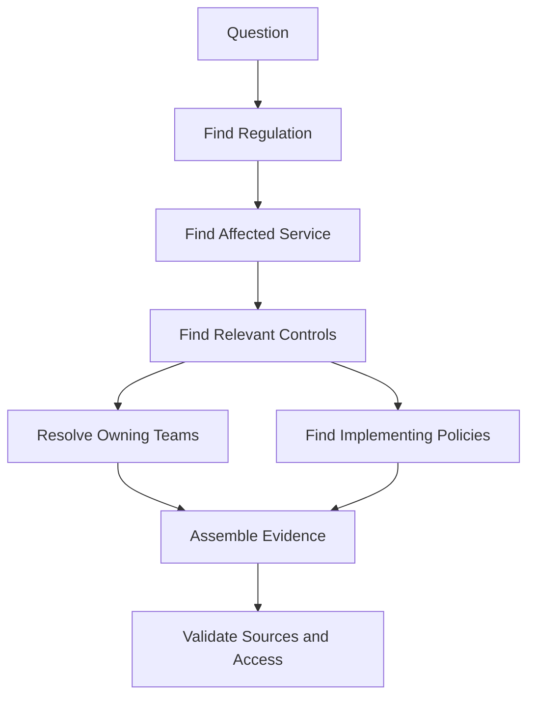
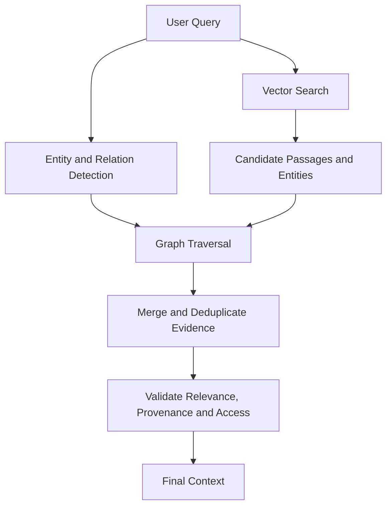
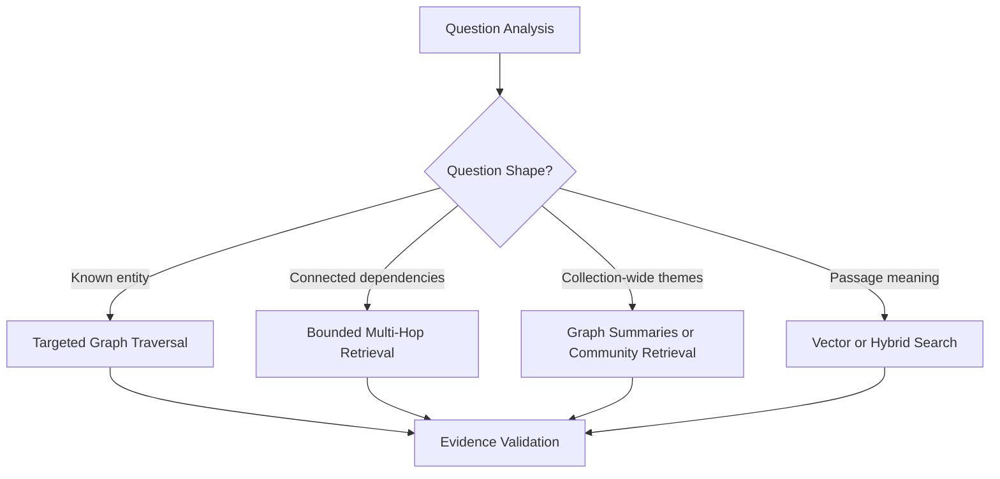
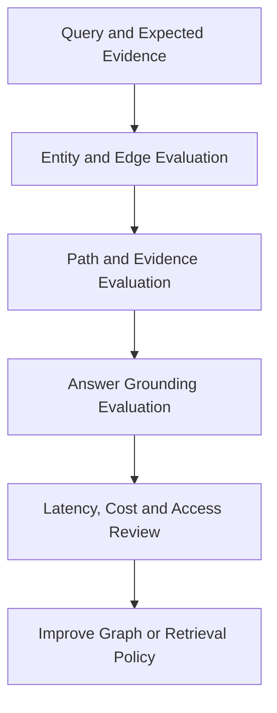
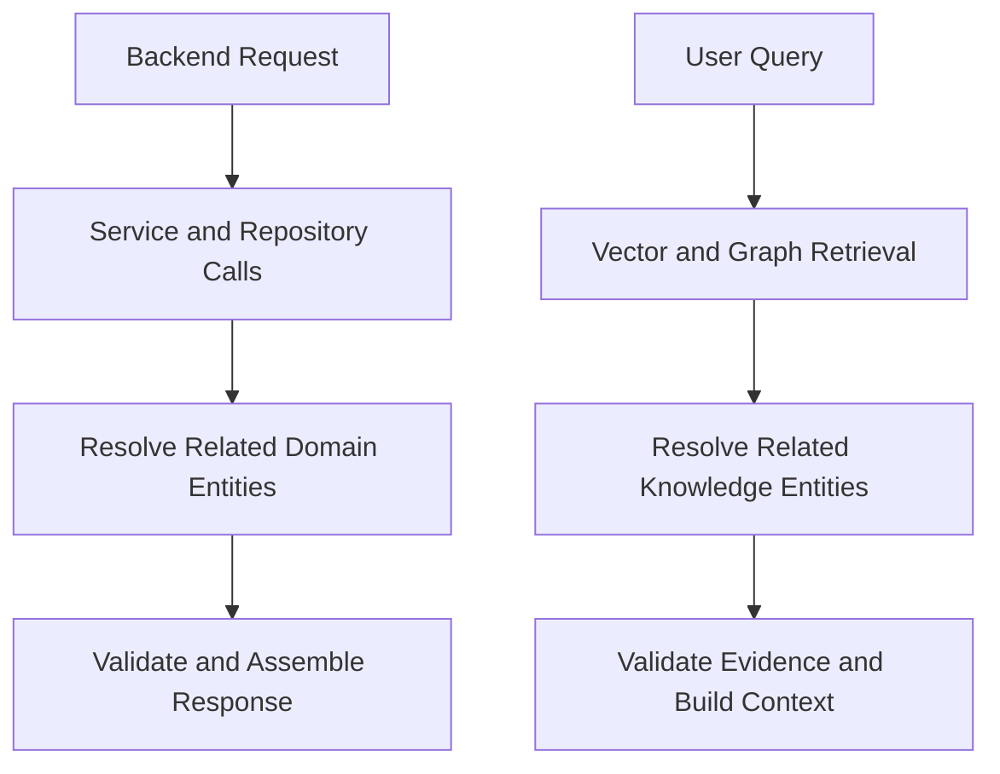

# 4.1 — Architecting Graph RAG for Relationship-Aware Enterprise Knowledge

**Series:** Enterprise AI Systems Architecture Stack  
**Section:** Advanced Knowledge Retrieval Architectures  
**GitHub Project:** `enterprise-rag-platform`

## Architecture Insight

A familiar enterprise question can expose a weakness in a straightforward RAG pipeline.

Imagine someone asks:

> Which European regulations affect our payment services, which teams own the affected controls, and which internal policies implement them?

A vector retriever may find a regulation document, a control description, a team page, and an internal policy. Each result may be relevant. But the system still has to establish which regulation applies to which service, which control addresses the obligation, who owns that control, and which policy implements it.

**Finding related documents and connecting the facts across those documents are two different problems.**

That distinction is the starting point for Graph RAG.

Traditional retrieval commonly represents knowledge as chunks of text with metadata and embeddings. Graph RAG adds an explicit representation of entities and their relationships. Instead of only asking, “Which passages resemble this question?”, the system can also ask, “Which entities are connected, and what path links them?”

It does not replace vector search; it adds another way to connect evidence when relationships matter.

## 1. The Architectural Boundary: Similarity Is Not a Relationship

Vector retrieval is useful when a query and a passage express similar meaning, even if they use different words. But similarity alone does not prove that two entities are connected.

Suppose the knowledge base contains these facts:

- Regulation A applies to Payment Service B.
- Control C implements an obligation for Payment Service B.
- Team D owns Control C.
- Policy E describes how Control C is implemented.

A vector search might retrieve all five items. Yet the answer requires the system to preserve the links between them. Without those links, a language model may infer a relationship that the source material never established.

A knowledge graph represents the facts as **nodes** and **edges**:

- **Node:** an entity, such as a regulation, service, control, team, or policy.
- **Edge:** a typed relationship between entities, such as `APPLIES_TO`, `GOVERNED_BY`, `OWNED_BY`, or `IMPLEMENTED_BY`.
- **Properties:** attributes such as an identifier, region, status, effective date, or source reference.



The graph makes the path explicit, but nodes and edges still need validation, maintenance, and trustworthy sources.

## 2. What Graph RAG Adds to the Retrieval Architecture

Graph RAG combines retrieval with a graph representation of knowledge. Implementations differ: some traverse a graph at query time; others combine graph search with vector retrieval, graph-derived summaries, or precomputed structures. The design should follow the question and the shape of the available knowledge.

A common enterprise pattern looks like this:



Each path contributes something different:

- **Vector retrieval** finds semantically relevant passages.
- **Graph retrieval** follows explicit relationships between entities.
- **Metadata filtering** narrows results by constraints such as region, document type, status, or version.
- **Evidence fusion** combines the useful results without losing their provenance.
- **Context control** removes irrelevant or unauthorized material and prepares a focused evidence set for generation.

Not every query needs every path. Use conventional retrieval for simple questions and graph traversal when relationships matter. Select the least complex reliable strategy.

## 3. Build the Graph Before Depending on It

A graph is only useful if it represents the domain accurately. Graph construction is therefore a data-engineering problem, not just a prompting task.

A practical ingestion path looks like this:



The important steps are entity and relationship extraction, identity resolution, relationship validation, provenance capture, and ongoing updates. For example, “Payments Platform” and “Payment Platform” may refer to the same system, while two similarly named controls may not.

For regulated knowledge, preserve each relationship's source, extraction method, validation status, and confidence where appropriate. A generated graph can contain mistakes just as a document index can contain stale content.

### A small, framework-independent graph model

The following Python example illustrates the minimum information an application may preserve. It is an architectural model, not a complete graph database implementation.

```python
from dataclasses import dataclass


@dataclass(frozen=True)
class Entity:
    id: str
    label: str
    entity_type: str


@dataclass(frozen=True)
class Relationship:
    source_id: str
    relation: str
    target_id: str
    source_document_id: str
    source_passage_id: str
```

The stable IDs matter. Labels can change or have synonyms; identity should not depend only on display text. Provenance matters just as much: a graph path is more useful when the system can show which source supports each edge.

## 4. Multi-Hop Retrieval: Follow the Evidence Path

Some questions require one relationship—“Which team owns Control C?” Others require several connected steps. These are **multi-hop questions**.

For the payment example, the retrieval plan might be:

1. Identify the regulation in scope.
2. Find the payment service to which it applies.
3. Find the controls associated with that service and obligation.
4. Resolve the team responsible for each control.
5. Retrieve the internal policy linked to the control.
6. collect the source passages supporting the path.



Each hop can fail: a relationship may be missing, ambiguous, outdated, or valid only for a particular region or period. If the graph does not support a necessary link, retrieve source material through another permitted path or report that the relationship could not be verified—do not fill the gap with an assumption.

### Keep traversal bounded

Unrestricted traversal can expand quickly. Starting from one entity and following every edge for several hops may return a large, noisy subgraph. A production design should define allowed relationship types, direction, hop limits, candidate limits, tenant or domain boundaries, and access rules.

```python
def retrieve_related_evidence(
    graph,
    entity_id: str,
    allowed_relations: set[str],
    max_hops: int = 2,
):
    """Illustrative interface; graph implements bounded traversal."""
    return graph.traverse(
        start_id=entity_id,
        relations=allowed_relations,
        max_hops=max_hops,
    )
```

This code intentionally delegates traversal to a graph adapter. Query syntax and optimization depend on the graph technology and schema.

## 5. Combine Graph Retrieval with Vector Search

Graph retrieval works well when entities and relationships are represented. Vector retrieval helps when the query is expressed in natural language or the relevant passage is hard to identify by name. A hybrid design can use both:

- Vector search discovers relevant passages and candidate entities.
- Graph traversal expands from suitable entities to connected facts.
- Metadata filters constrain the search to the correct domain, date, region, or document status.
- A fusion step combines results and removes duplicates.
- Evidence evaluation checks whether the resulting material actually answers the question.



Fusion is more than concatenating results. Deduplicate by stable evidence IDs, apply access checks, and preserve the difference between a direct source statement and a relationship inferred from multiple statements.

An evidence record could contain:

```python
from dataclasses import dataclass


@dataclass(frozen=True)
class Evidence:
    evidence_id: str
    text: str
    source_document_id: str
    source_passage_id: str
    retrieval_method: str  # "vector", "graph", or "metadata"
    entity_ids: tuple[str, ...] = ()
```

Retrieval method and source references support debugging and let generation trace graph results back to original evidence.

## 6. A Simple Retrieval Orchestrator

The following example shows the shape of a small orchestration layer. It deliberately leaves the vector index, graph database, authorization service, and ranking model behind interfaces. Those are implementation choices, and a production system should not hide them inside one large function.

```python
def retrieve_evidence(query, vector_store, graph, policy, top_k=8):
    # 1. Find semantically relevant passages.
    passages = vector_store.search(query=query, top_k=top_k)

    # 2. Derive candidate entity IDs from retrieved passages.
    entity_ids = {
        entity_id
        for passage in passages
        for entity_id in passage.entity_ids
    }

    # 3. Expand only through approved relationship types.
    graph_facts = []
    for entity_id in entity_ids:
        graph_facts.extend(
            graph.traverse(
                start_id=entity_id,
                relations=policy.allowed_relations,
                max_hops=policy.max_hops,
            )
        )

    # 4. Normalize, deduplicate, and authorize before use.
    candidates = policy.merge_and_deduplicate(passages, graph_facts)
    authorized = policy.filter_authorized(candidates)

    # 5. Return evidence for a separate relevance/quality check.
    return policy.rank(authorized)[:top_k]
```

This is a teaching skeleton, not drop-in production code: it assumes compatible adapter records and a policy object implementing the shown methods. Production code also needs timeouts, tenant isolation, query limits, observability, freshness rules, and defined behavior when a retrieval path fails.

Keep the boundary clear: **retrieval returns candidate evidence; a separate step checks whether it is sufficient.** Weak evidence may trigger refinement, another retrieval path, or a clarification request. Graph connectivity is not a substitute for evidence quality.

## 7. Local Questions, Global Questions, and Choosing the Right Pattern

“Graph RAG” is an umbrella term, not one algorithm. Choose the pattern based on the question:

- **Local/entity-focused:** “Who owns Control C?” Targeted traversal may be enough.
- **Multi-hop:** “Which team owns the control implementing this obligation?” Follow a bounded path.
- **Collection-level:** questions about themes across a large corpus may benefit from graph-derived communities or summaries, backed by source evidence.



Do not choose a graph-based approach just because the question sounds complex. If a conventional search can answer it reliably, the graph may add cost without adding value. Start with the simplest retrieval pattern that meets the quality requirement, then introduce graph capabilities where the evidence demands them.

## 8. Production Trade-Offs and Failure Modes

Graph RAG shifts complexity into knowledge modeling and graph operations. Make the trade-offs explicit.

| Concern | What can go wrong | Architectural response |
|---|---|---|
| Entity resolution | Duplicate or incorrectly merged entities | Stable IDs, alias management, validation |
| Relationship extraction | Incorrect or missing edges | Provenance, confidence, domain rules, review |
| Graph freshness | Old relationships remain queryable | Versioning, update pipelines, expiry or validity dates |
| Traversal growth | Too many connected nodes and irrelevant facts | Hop limits, relation allowlists, candidate budgets |
| Access control | A connected node exposes restricted information | Enforce authorization during retrieval and before context construction |
| Grounding | A plausible path is mistaken for proof | Require source-backed evidence for material claims |
| Latency and cost | Graph expansion adds slow queries or too much context | Bound traversal, cache carefully, measure each stage |
| Partial failure | Graph or vector retrieval is unavailable | Define fallback behavior and communicate reduced coverage |

**Authorization must apply to retrieved evidence, not just the initial query.** A user may access a regulation but not a connected incident or restricted policy, so retrieved nodes, edges, and passages must follow the access-control model.

Relationships also change. Teams move, policies are superseded, and regulations have effective dates. Model validity and version information when time affects the answer.

## 9. What to Measure

Evaluate whether retrieval found the right entities, relationships, and source evidence—not just whether the final answer sounds good.

Useful signals include:

- **Entity resolution accuracy:** were the correct entities identified?
- **Relationship precision and recall:** were relevant edges correct and complete?
- **Path validity:** does each relationship in a returned path have support?
- **Evidence recall:** did retrieval find the sources needed to answer?
- **Answer grounding:** can important claims be traced to source passages?
- **Latency and cost:** how much time and computation did graph expansion add?
- **Freshness and authorization:** were current, permitted facts used?



Test missing edges, ambiguous names, stale policies, restricted documents, and unanswerable questions. The system must admit when evidence is insufficient.

## 10. Backend Architecture Parallel

Backend systems often resolve a customer, load accounts, find transactions, and assemble a response across services. The challenge is not just retrieving records; it is following the right domain relationships. Graph RAG applies a related idea to knowledge retrieval:



The analogy has a limit: backend services often use explicit domain contracts, while Graph RAG may rely on relationships extracted from unstructured text. Provenance, freshness, and validation therefore matter.

## Architecture Takeaways

- Use Graph RAG when the answer depends on explicit relationships, dependencies, or multi-hop connections.
- Keep vector retrieval for semantic similarity; combine it with graph traversal when both meaning and relationships matter.
- Treat graph construction, entity resolution, provenance, and freshness as first-class engineering concerns.
- Bound traversal and enforce access control at every retrieval boundary.
- Validate source evidence before generation. A connected path is useful, but it is not automatically proof.
- Measure relationship and evidence quality—not only the fluency of the final answer.

**The goal is not to make retrieval more complicated. It is to retrieve the right connected evidence when document similarity alone is not enough.**

## Further Reading

For deeper coverage across AI Engineering — from ML and Deep Learning to LLMs, RAG, Generative AI, and Agentic AI — explore the AI Engineering Handbook for concepts, engineering patterns, architecture, and production considerations.

[Enterprise AI Handbook](https://enterpriseai.handbook.mihirkjha.com/)

