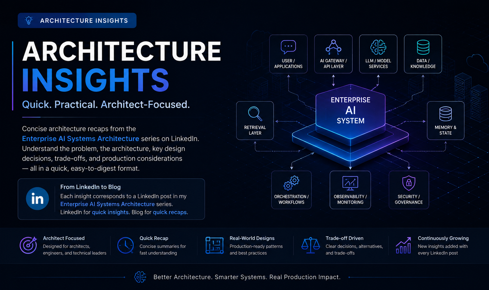

# 🏗️ Architecture Insights

Architecture Insights is a growing collection of concise, architecture-focused articles that accompany my **Enterprise AI Systems Architecture** series on LinkedIn.

Each LinkedIn post explores an important aspect of designing modern enterprise AI systems through architecture-focused explanations, diagrams, and practical design perspectives. This section brings those ideas together on the blog as a structured **quick recap for AI architects, engineers, and technical leaders**.

Each Architecture Insight provides a concise overview of the corresponding LinkedIn topic, focusing on the architectural problem, core components, system interactions, key design decisions, trade-offs, and production considerations.

The goal is to make complex enterprise AI architecture topics easier to revisit and understand without requiring a full deep-dive into an entire handbook chapter.

Topics include:

- Enterprise AI system architecture
- RAG architecture patterns
- AI agents and multi-agent systems
- AI gateways and model integration
- Retrieval and knowledge architectures
- Memory and state management
- AI orchestration patterns
- Observability and evaluation
- Security and governance
- Production AI design trade-offs

This is a continuously growing section. A new Architecture Insight is added alongside each new topic published in the **Enterprise AI Systems Architecture** series on LinkedIn.

---

## Explore Architecture Insights

Use this section as a quick architectural reference to revisit the key ideas, patterns, and design decisions behind modern enterprise AI systems.

---

## Article

**Canonical technical source**

Detailed articles, architecture diagrams, code, and production analysis.

---

## LinkedIn

**Discovery + discussion**

Compact versions, key insights, architecture discussions, and announcements.

---

## Newsletter

**Recurring audience**

Selected new articles and engineering insights.

---

## Handbook

**Structured reference**

Chapter-based technical learning material.

---

### GitHub

**Implementation**

Projects, experiments, and supporting source code.

---

# 📚 Enterprise AI Engineering Handbook

The **Enterprise AI Engineering Handbook** provides structured technical reference material supporting this journey.

[Enterprise AI Engineering Handbook](https://enterpriseai.handbook.mihirkjha.com/)

---

# 💻 GitHub

Implementation projects and supporting engineering work:

[GitHub](https://github.com/MihirKJha/)

---

# 💼 LinkedIn

Follow the journey, article announcements, architecture discussions, and production AI insights:

[LinkedIn](https://www.linkedin.com/in/mihirkrjha/

---

# 📰 Enterprise AI Engineering Newsletter

Follow the broader technical journey through the **Enterprise AI Engineering** newsletter:

[Enterprise AI Engineering Newsletter](https://www.linkedin.com/newsletters/enterprise-ai-engineering-7479222208079319041/)

---

# 👨‍💻 About the Author

**Mihir Jha**

*Software Architect | AI Engineering | Cloud Architecture | Backend Engineering*

Focused on bridging traditional software and cloud engineering with modern AI engineering to design scalable, secure, observable, and production-ready intelligent systems.

---

### 🚀 Learn AI. Build AI. Engineer AI.

**AI for Backend Engineers**

**© 2026 Mihir Jha**

