<div class="article-series">

  <span class="article-series__name">AI FOR BACKEND ENGINEERS</span>
  <span class="article-series__number">BLOG 01</span>

</div>


# 🚀 AI for Backend Engineers: Building Intelligent Systems

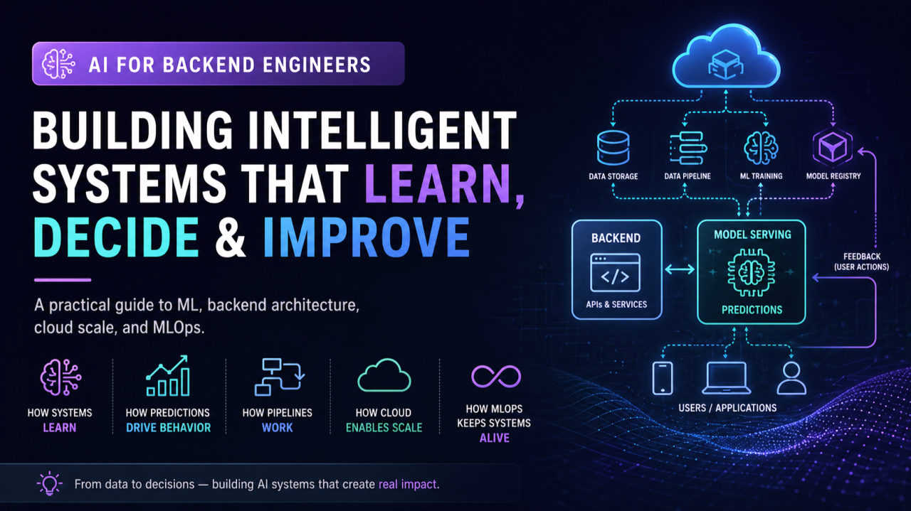

> **Backend engineering is evolving from static systems to intelligent systems.**

As backend engineers, we are used to building systems that follow clear rules:

```text
Input
  ↓
Business Logic
  ↓
Decision
  ↓
Response
```

We define the logic.

The system executes it.

With Machine Learning, something fundamental changes:

```text
Historical Data
      ↓
Learning Algorithm
      ↓
Model
      ↓
Prediction
      ↓
Backend Decision
```

The system can now **learn patterns from data instead of relying entirely on explicitly programmed rules**.

This is not simply an AI problem.

It is an **architecture problem**.

The moment Machine Learning enters a production backend, we need to think about:

- Data
- APIs
- Inference
- Latency
- Scalability
- Security
- Observability
- Model lifecycle
- Feedback loops
- Cloud infrastructure

This article connects **Machine Learning + Backend Engineering + Cloud + MLOps** from a production-system perspective.

---

# 🧭 From Rule-Based Systems to Learning Systems

Traditional backend systems are generally:

- Deterministic
- Rule-driven
- Explicitly programmed
- Relatively static after deployment

A simplified architecture looks like this:

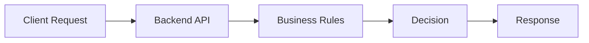

For example:

```java
public boolean approveTransaction(Transaction transaction) {

    if (transaction.amount() > 10000) {
        return false;
    }

    if (!allowedCountry(transaction.country())) {
        return false;
    }

    return true;
}
```

This approach is predictable and easy to reason about.

But it also means that engineers must explicitly identify and encode the rules.

---

# 🤖 What Changes with Machine Learning?

A machine-learning system learns relationships from historical data.

Instead of manually encoding every rule:

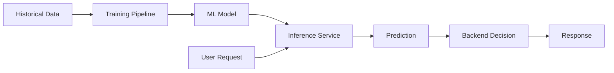

The system becomes data-driven.

A useful architectural principle is:

> **ML predicts → Backend decides**

The model provides a prediction, probability, score, ranking, or representation.

The application can then apply business policy to that output.

---

# ⚡ Example: Fraud Detection

Consider a payment system.

A traditional fraud engine may use rules such as:

```text
IF amount > threshold
AND country != expected_country
AND velocity > threshold
THEN flag_transaction
```

An ML system can learn fraud patterns from historical transactions.

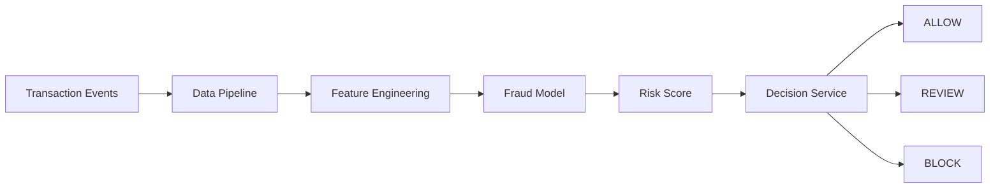

The model might return:

```text
Risk Score = 0.91
```

The decision layer can then apply policy:

```python
risk_score = model.predict_proba(features)[0][1]

if risk_score >= 0.90:
    decision = "BLOCK"
elif risk_score >= 0.60:
    decision = "REVIEW"
else:
    decision = "ALLOW"
```

Notice the separation:

```text
ML Model
   ↓
Prediction
   ↓
Decision Policy
   ↓
Business Action
```

This separation makes the system easier to test, govern, and evolve.

---

# 🧠 Supervised vs Unsupervised Learning

## Supervised Learning

Supervised learning learns from labelled examples.

```text
Input Features + Known Outcome
                ↓
         Training Dataset
                ↓
        Learning Algorithm
                ↓
              Model
```

Typical applications:

- Fraud detection
- Spam detection
- Sentiment classification
- Credit-risk classification
- Customer churn prediction

---

## Unsupervised Learning

Unsupervised learning works with unlabelled data and attempts to discover structure.

Typical applications:

- Customer segmentation
- Anomaly detection
- Behavioral analysis
- Pattern discovery
- Feature engineering

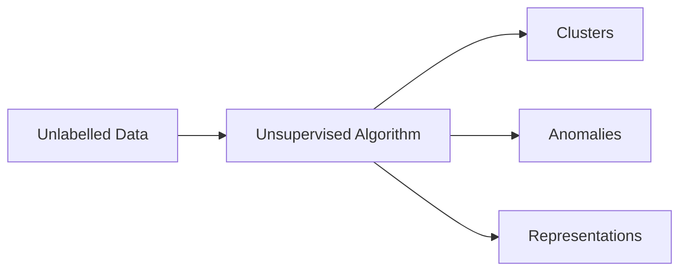

For backend engineers, the important point is:

> Not every intelligent system starts with a predefined output label.

---

# 🎯 Classification vs Regression

Different ML problems produce different types of output.

| ML Problem | Output | Backend Example |
|---|---|---|
| Classification | Category | Fraud / Not Fraud |
| Regression | Numeric value | Risk Score |
| Clustering | Group | Customer Segment |
| Anomaly Detection | Outlier / Score | Suspicious Activity |

### Classification

```text
Request
  ↓
Model
  ↓
FRAUD
```

### Regression

```text
Request
  ↓
Model
  ↓
0.87 Risk Score
```

The backend can then use that output as part of a larger workflow.

---

# 🧩 A Simple ML Implementation

A backend engineer can start with a basic Scikit-Learn pipeline.

```python
from sklearn.datasets import load_breast_cancer
from sklearn.model_selection import train_test_split
from sklearn.pipeline import Pipeline
from sklearn.preprocessing import StandardScaler
from sklearn.linear_model import LogisticRegression
from sklearn.metrics import accuracy_score

X, y = load_breast_cancer(return_X_y=True)

X_train, X_test, y_train, y_test = train_test_split(
    X,
    y,
    test_size=0.2,
    random_state=42,
    stratify=y
)

pipeline = Pipeline([
    ("scaler", StandardScaler()),
    ("model", LogisticRegression(max_iter=1000))
])

pipeline.fit(X_train, y_train)

predictions = pipeline.predict(X_test)

accuracy = accuracy_score(y_test, predictions)

print(f"Accuracy: {accuracy:.3f}")
```

The important part is not the specific algorithm.

It is the lifecycle:

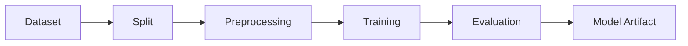

---

# 🔌 Turning the Model into a Backend Capability

Once trained, the model can be exposed through an inference API.

A simplified FastAPI implementation:

```python
from fastapi import FastAPI
from pydantic import BaseModel
import joblib

app = FastAPI()

model = joblib.load("model.joblib")


class PredictionRequest(BaseModel):
    features: list[float]


@app.post("/predict")
def predict(request: PredictionRequest):

    prediction = model.predict(
        [request.features]
    )[0]

    probability = model.predict_proba(
        [request.features]
    )[0].max()

    return {
        "prediction": int(prediction),
        "confidence": float(probability)
    }
```

The backend now exposes:

```text
POST /predict
      ↓
Inference Service
      ↓
Model Runtime
      ↓
Prediction
```

---

# 🏗️ Model Service vs Business Service

A common architecture mistake is to put business logic and model logic into one large service.

A cleaner separation is:

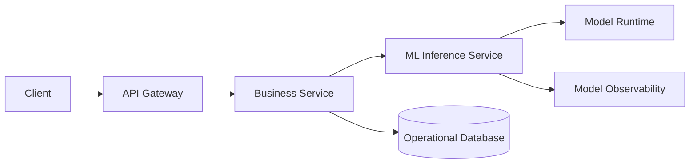

### Business Service

Owns:

- Business workflows
- Authorization
- Domain rules
- Transactions
- Orchestration

### ML Service

Owns:

- Model loading
- Feature transformation
- Inference
- Prediction
- Model-specific telemetry

This separation makes independent scaling and deployment easier.

---

# 🔁 ML Systems Are Pipelines, Not Just Models

A model is only one component in a larger system.

A production lifecycle may look like:

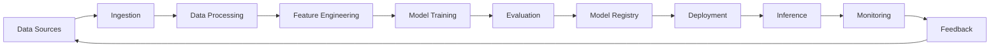

This introduces engineering responsibilities around:

- Data ingestion
- Feature generation
- Model training
- Model validation
- Model deployment
- Inference
- Monitoring
- Feedback
- Retraining
- Version management

The model is part of the architecture, not the architecture itself.

---

# 🧠 Software Lifecycle vs ML Lifecycle

Traditional software often follows:

```text
Develop
   ↓
Test
   ↓
Deploy
   ↓
Operate
```

An ML system adds a learning loop:

```text
Collect Data
   ↓
Prepare Data
   ↓
Train
   ↓
Evaluate
   ↓
Deploy
   ↓
Monitor
   ↓
Collect New Data
   ↓
Retrain
```

Visually:

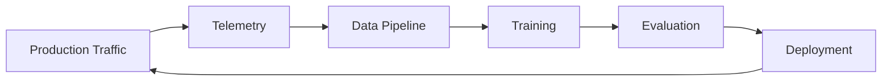

### The key difference

> **Deployment is not the end of an ML system.**

It is the beginning of a production feedback loop.

---

# ⚡ Real-Time Inference

Real-time ML runs inside the user request path.

Example:

> User opens an application → recommendation service returns personalized results.

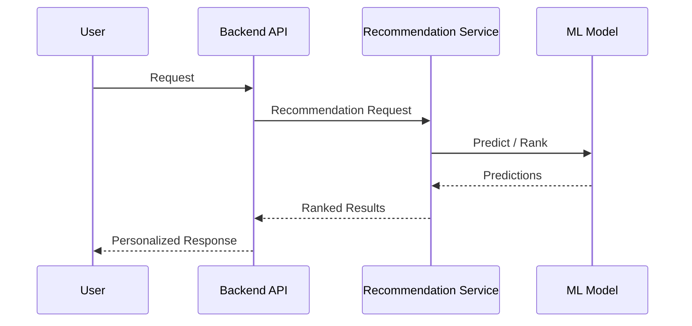

Real-time inference introduces:

- Latency requirements
- Throughput requirements
- Horizontal scaling
- Model loading
- Caching
- Failure handling
- Model versioning

---

# 🔄 Batch ML

Batch systems operate asynchronously.

Typical batch inputs include:

- Clicks
- Views
- Purchases
- Search behavior
- Transactions
- Application events

Architecture:


Batch processing is often simpler and cheaper when business requirements do not require immediate inference.

---

# ⚖️ Real-Time vs Batch

| Dimension | Real-Time | Batch |
|---|---|---|
| Latency | ms / seconds | minutes / hours |
| Cost | Higher | Usually lower |
| Complexity | Higher | Lower |
| Typical Use | Online decisions | Retraining |
| Response | Immediate | Delayed |
| Scaling | Continuous | Scheduled |

The important architecture question is:

> **What latency does the business actually require?**

Not:

> "Can we make everything real time?"

---

# 📈 Latency and System Complexity

A simplified relationship:

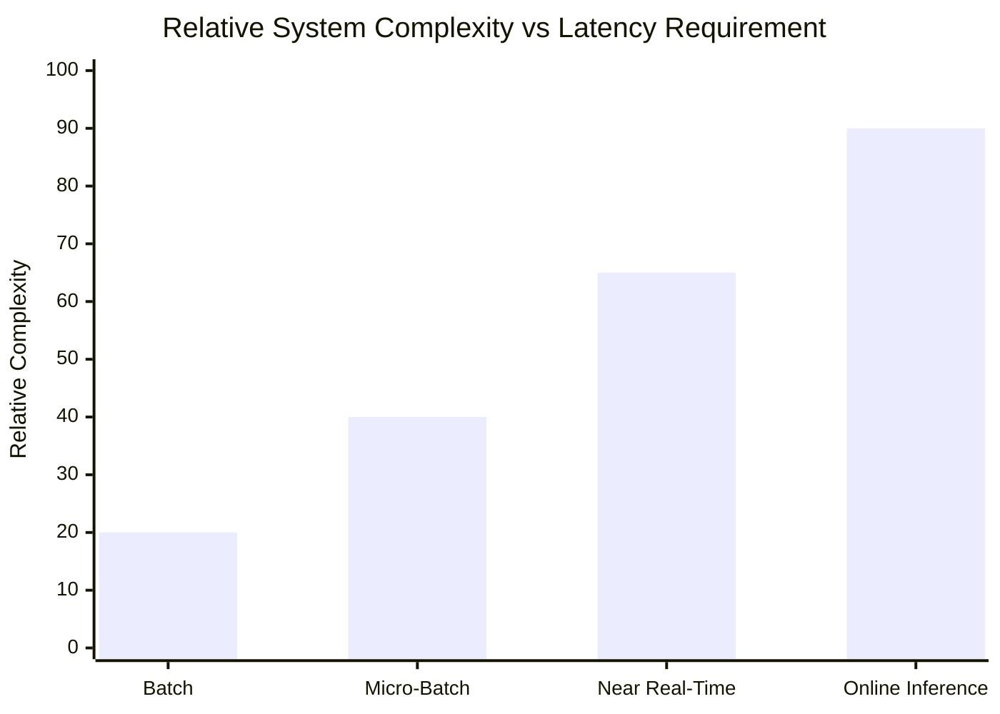

As latency requirements become stricter, the architecture generally requires more operational sophistication.

This can introduce:

- Caching
- Dedicated inference services
- Accelerators
- Model optimization
- Asynchronous workflows
- Autoscaling
- High-availability design

---

# 🛍️ Recommendation System — A Complete Example

Recommendation systems are one of the clearest examples of ML integrated with backend and cloud architecture.

They combine:

- Backend APIs
- Event streams
- Data pipelines
- Feature engineering
- Ranking models
- Real-time inference
- Batch training
- Feedback loops
- Monitoring

### End-to-End Architecture

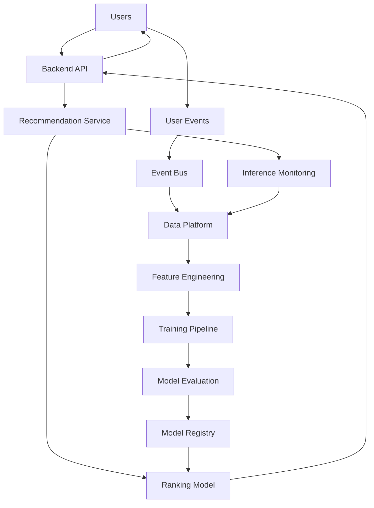

The same system is therefore performing two jobs:

```text
                        Recommendation System
                                │
              ┌─────────────────┴─────────────────┐
              │                                   │
              ▼                                   ▼
       Real-Time Serving                     Continuous Learning
              │                                   │
              ▼                                   ▼
      User Experience                         Data Pipeline
              │                                   │
              ▼                                   ▼
          Prediction                            Training
              │                                   │
              └───────────────┬───────────────────┘
                              ▼
                       Better Recommendations
```

---

# 🧪 Model Evaluation

A model's output should not automatically be trusted.

For classification, common metrics include:

- Accuracy
- Precision
- Recall
- F1
- ROC-AUC

For regression:

- MAE
- MSE
- RMSE
- R²

Example:

```python
from sklearn.metrics import (
    accuracy_score,
    precision_score,
    recall_score,
    f1_score
)

accuracy = accuracy_score(y_test, predictions)
precision = precision_score(y_test, predictions)
recall = recall_score(y_test, predictions)
f1 = f1_score(y_test, predictions)

print({
    "accuracy": accuracy,
    "precision": precision,
    "recall": recall,
    "f1": f1
})
```

The engineering question is:

> **Is the model good enough for the business decision?**

A 95% accurate model may still be unacceptable for certain fraud, financial, medical, or security decisions if the cost of false negatives is extremely high.

---

# 📊 Model Version Comparison

Imagine a production team evaluating three model versions:

| Model | Precision | Recall | F1 |
|---|---:|---:|---:|
| v1 | 0.88 | 0.81 | 0.84 |
| v2 | 0.91 | 0.86 | 0.88 |
| v3 | 0.93 | 0.89 | 0.91 |

Visual comparison:

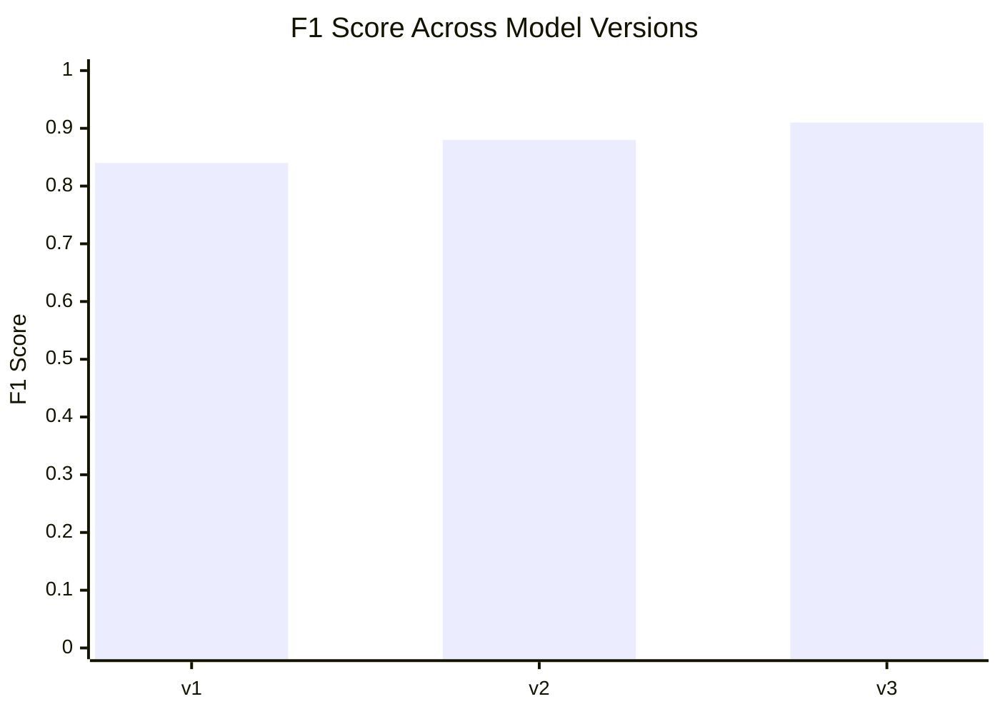

This makes model quality a measurable engineering signal rather than a one-time training result.

---

# 🔁 MLOps: The Continuous Loop

Production ML systems evolve continuously.

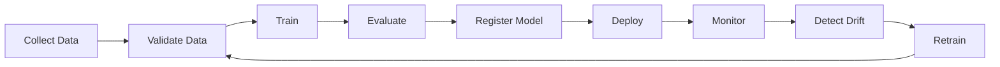

MLOps introduces practices around:

- Experiment tracking
- Model registry
- Data validation
- Model evaluation
- Automated deployment
- Monitoring
- Drift detection
- Retraining
- Rollbacks

---

# ⚠️ Production Challenges

| Challenge | Engineering Concern |
|---|---|
| Data Quality | Garbage-in / garbage-out |
| Data Drift | Input distribution changes |
| Model Drift | Prediction quality changes |
| Training/Serving Skew | Different transformations |
| Latency | Inference becomes too slow |
| Cost | Training/inference becomes expensive |
| Scaling | Traffic spikes |
| Observability | Hard-to-debug behavior |
| Versioning | Which model is serving? |
| Rollback | Safely revert bad models |

A useful architectural rule is:

> **Most production AI problems are system-level problems, not model-level problems.**

---

# 🧠 What This Means for Backend Engineers

Backend engineers already understand:

- APIs
- Microservices
- Distributed systems
- Databases
- Caching
- Messaging
- Security
- Observability
- CI/CD

AI adds another layer:

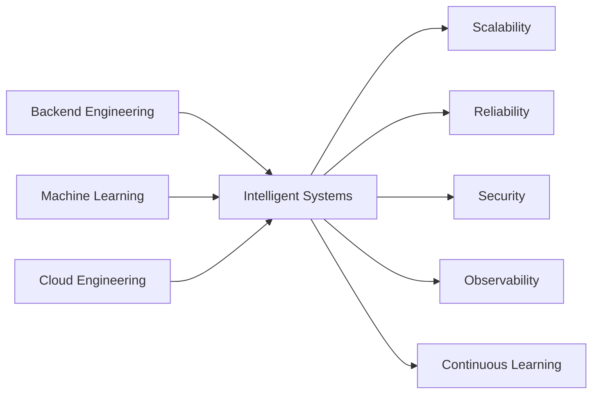

The transition is not:

```text
Backend Engineer
       ↓
ML Engineer
```

It can instead be:

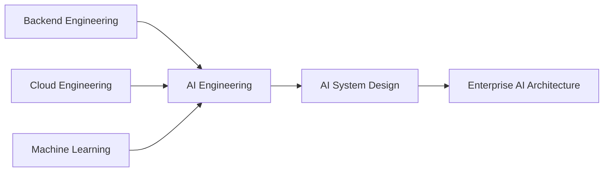

This is where backend experience becomes a strong foundation for AI engineering.

---

# 🏗️ Backend + ML + Cloud

A useful mental model:

```text
                    Intelligent System
                           │
          ┌────────────────┼────────────────┐
          │                │                │
       Backend             AI              Cloud
          │                │                │
     APIs / Domain     Models / ML     Infrastructure
     Microservices     Inference       Scaling
     Events            Evaluation      Observability
          │                │                │
          └────────────────┼────────────────┘
                           │
                       Production
```

AI doesn't replace traditional engineering.

It extends it.

---

# 🛡️ Designing for Model Failure

A production backend should not necessarily fail completely because the model is unavailable.

A simple fallback pattern:

```java
public RiskDecision evaluate(Transaction transaction) {

    try {
        double score = modelClient.predict(transaction);

        return decisionEngine.evaluate(score);

    } catch (ModelUnavailableException ex) {

        return fallbackDecision(transaction);
    }
}
```

This is the AI version of a familiar reliability principle:

> **Graceful degradation applies to AI systems too.**

Other failure-handling patterns include:

- Timeouts
- Retries
- Circuit breakers
- Fallback models
- Cached predictions
- Rule-based fallback
- Asynchronous processing

---

# 🔐 Security Considerations

Introducing ML into a backend system also introduces new security concerns.

Examples:

```text
Data
 ↓
Training
 ↓
Model
 ↓
Inference
 ↓
Decision
```

Security must therefore cover:

- Training data
- Model artifacts
- Feature pipelines
- Inference APIs
- Credentials
- Access control
- Auditability
- Sensitive data
- Model endpoints

A production AI architecture should treat the model as part of the application's security boundary.

---

# 👀 Observability

Traditional backend observability often focuses on:

```text
Latency
Errors
Throughput
CPU
Memory
```

AI systems require additional signals:

```text
Model latency
Prediction distribution
Confidence
Data drift
Feature drift
Model version
Evaluation metrics
Fallback rate
Inference errors
```

A conceptual observability architecture:

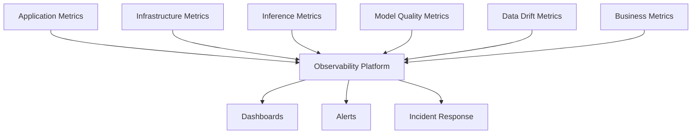

This is where traditional observability skills become even more valuable.

---

# 📐 AI System Design Perspective

When designing an AI-powered backend, ask:

```text
1. What decision are we improving?
2. Is ML actually required?
3. What data is available?
4. What is the latency requirement?
5. What happens if the model is unavailable?
6. How will the model be evaluated?
7. How will drift be detected?
8. How will models be versioned?
9. How will the system scale?
10. How will the system be secured?
11. How will cost be controlled?
12. How will we know the system is actually improving?
```

This is the beginning of **AI System Design**.

---

# 📈 Static Systems → Intelligent Systems

The broader architectural evolution can be visualized as:

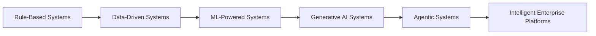

The progression is:

```text
Static Rules
      ↓
Data-Driven Decisions
      ↓
ML Predictions
      ↓
Generative AI
      ↓
AI Agents
      ↓
Intelligent Enterprise Systems
```

The backend engineer increasingly becomes an **intelligent systems engineer**.

---

# 🧭 Production Architecture Principles

## 1. Keep Business Logic Explicit

Do not hide critical deterministic business rules inside an opaque model when normal application logic is sufficient.

## 2. Treat Models as Dependencies

Models should have:

- Versions
- Health checks
- Monitoring
- Deployment strategy
- Rollback strategy

## 3. Separate Training from Inference

Training and inference normally have different:

- Compute requirements
- Scaling requirements
- Failure modes
- Deployment lifecycles

## 4. Design for Failure

Use:

```text
Model Failure
     ↓
Timeout / Circuit Breaker
     ↓
Fallback
     ↓
Safe Business Behavior
```

## 5. Observe the Entire System

Monitor:

```text
Application
     +
Data
     +
Model
     +
Infrastructure
```

not just CPU and memory.

---

# 🧠 Final Takeaway

Machine Learning is not simply about algorithms.

It is about building systems that can:

- Learn from data
- Make intelligent predictions
- Support backend decisions
- Adapt to changing patterns
- Improve continuously over time

The architectural transition is:

```text
Rules
  ↓
Software Systems
  ↓
Data-Driven Systems
  ↓
ML-Powered Systems
  ↓
Intelligent Systems
```

And this is where traditional backend engineering starts evolving into **AI System Design**.

---

## 💼 LinkedIn Version

A compact version of this article is also available on LinkedIn.

**[Read the LinkedIn Article →](https://www.linkedin.com/pulse/ai-backend-engineers-building-intelligent-systems-mihir-jha-ddxlc/?trackingId=OkeyAEG%2BSyezt01dcy8eTQ%3D%3D)**

---

# 📚 Related Topics in the Enterprise AI Engineering Handbook

This article provides the engineering perspective from [Enterprise AI Engineering Handbook](https://enterpriseai.handbook.mihirkjha.com/).

For structured technical reference material, explore:

- [Introduction to Machine Learning](https://enterpriseai.handbook.mihirkjha.com/01-machine-learning/01-introduction-to-machine-learning/)
- [Machine Learning Fundamentals](https://enterpriseai.handbook.mihirkjha.com/01-machine-learning/02-machine-learning-fundamentals/)
- [Machine Learning Lifecycle](https://enterpriseai.handbook.mihirkjha.com/01-machine-learning/03-machine-learning-lifecycle/)
- [Machine Learning in Practice](https://enterpriseai.handbook.mihirkjha.com/01-machine-learning/04-machine-learning-in-practice/)
- [Machine Learning Ecosystem and Tools](https://enterpriseai.handbook.mihirkjha.com/01-machine-learning/05-machine-learning-ecosystem-and-tools/)

---

# 🚀 What's Next?

This article is part of the:

## **AI for Backend Engineers**

journey.

The broader path connects:

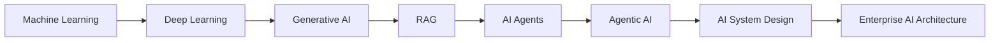

The goal is to understand how backend and cloud engineers can evolve toward designing and building **production-grade intelligent systems**.

---

# 💬 Final Thought

Backend engineering is evolving:

> **From static systems → intelligent systems.**

And the engineers who can connect:

**Data + Backend + Cloud + AI**

will be well positioned to design the next generation of intelligent software systems.

---

# 🔗 Let's Connect

If you're exploring:

- AI Engineering
- Cloud AI Architecture
- MLOps
- Distributed ML Systems
- RAG & Agentic AI
- Scalable Backend Architecture
- AI System Design

Let's connect and learn together.

💼 [LinkedIn](https://www.linkedin.com/in/mihirkrjha/)
📚 [Enterprise AI Engineering Handbook](https://enterpriseai.handbook.mihirkjha.com/)
📰 [Enterprise AI Engineering Newsletter](https://www.linkedin.com/newsletters/enterprise-ai-engineering-7479222208079319041/)
💻 [GitHub](https://github.com/MihirKJha/)

---

# 📌 Key Message

> **Build AI systems. Don't just build AI models.**

Engineering Perspective:

> **Learn to design the system around the model.**

---

<div align="center" markdown="1">

### 🚀 Keep Learning. Keep Building. Keep Sharing.

**Building Production-Grade AI Systems Through Engineering, Architecture & Continuous Learning.**

**© 2026 Mihir Jha**

</div>