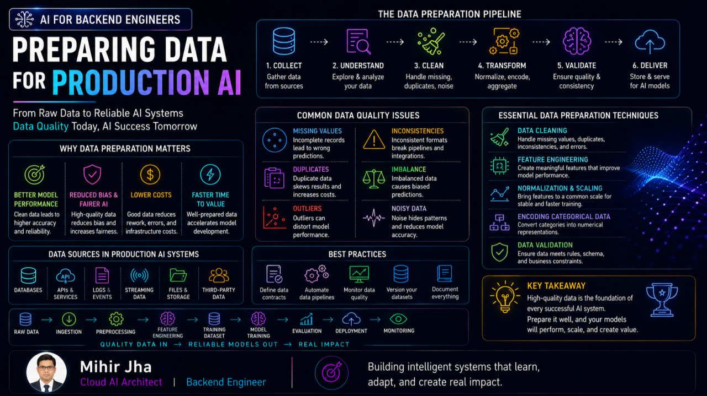
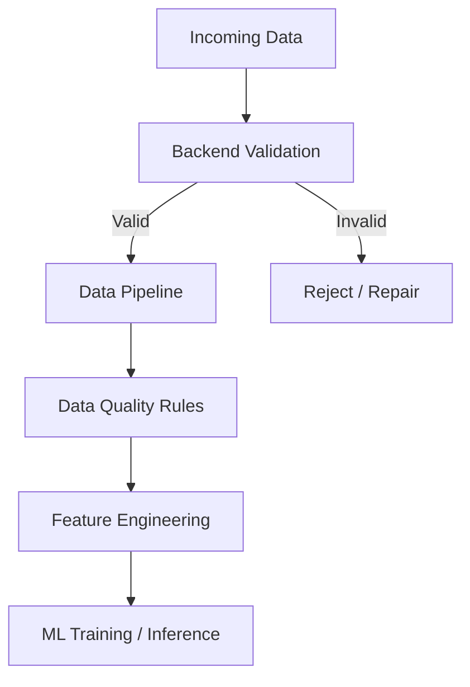
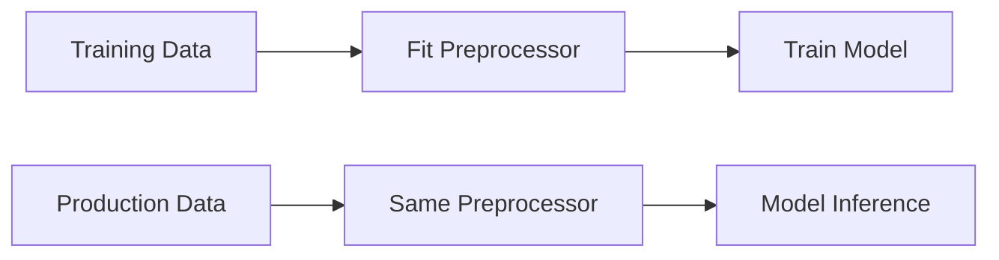
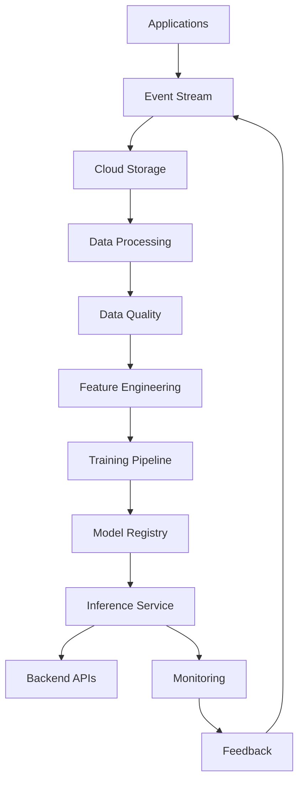
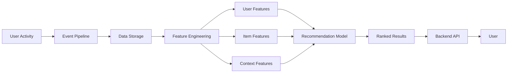
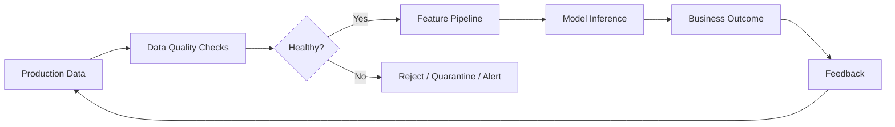

<div class="article-series">

  <span class="article-series__name">AI FOR BACKEND ENGINEERS</span>
  <span class="article-series__number">BLOG 02</span>

</div>


# 🚀 AI for Backend Engineers: Preparing Data for Production AI




> **Why great models often fail without great data.**

Many engineers think Machine Learning success starts with choosing the right algorithm.

But in production systems, success starts much earlier:

- Clean data
- Reliable pipelines
- Useful features
- Trustworthy inputs

In the previous articles, we explored:

- Why data matters more than models
- Handling missing data
- Feature engineering basics
- Normalization vs Standardization
- Exploratory Data Analysis (EDA)
- Cloud data pipelines for ML

This article connects those ideas into one practical system view.

Because in real-world AI systems:

> **Models learn only from the data we give them.**

---

# 🧠 The Hidden Truth About ML Systems

A weak model with strong data can outperform a powerful model with weak data.

Why?

Because models do not understand business context by themselves. They learn from:

- Labels
- Features
- Historical behavior
- Data quality
- Patterns in training data

If those inputs are poor, predictions will also be poor.

A useful production mental model is:


The model sits in the middle of the system.

It does not compensate automatically for a broken data pipeline.

---

# ⚡ Why Data Matters More Than Models

Teams often ask:

> **Which model should we use?**

A better question is:

> **Can we trust our data?**

Production problems caused by poor data include:

- Wrong labels
- Stale records
- Duplicate records
- Missing values
- Noisy signals
- Biased samples
- Training vs production mismatch

A stronger algorithm cannot reliably compensate for fundamentally weak inputs.

## A simple production hierarchy

```text
Data Quality
     ↓
Feature Quality
     ↓
Model Quality
     ↓
Application Quality
     ↓
Business Outcome
```

This is why data engineering and ML engineering are deeply connected.

---

# ⚠️ Missing Data: Small Gaps, Big Problems

One of the most common production problems is incomplete data.

Examples:

```text
age = null
income = blank
city = unknown
transaction_amount = missing
```

Missing data can cause:

- Failed training jobs
- Inaccurate predictions
- Biased outcomes
- Broken APIs
- Pipeline failures

The correct handling strategy depends on where the problem appears.

---

# 🔧 Handling Missing Data Across the System

A useful architecture is to handle missing values at multiple layers.



## 🌐 Backend Layer

Validate required fields at the API boundary.

For example:

```java
public void validate(TransactionRequest request) {

    if (request.amount() == null) {
        throw new ValidationException("amount is required");
    }

    if (request.customerId() == null) {
        throw new ValidationException("customerId is required");
    }
}
```

The principle is:

> **Reject or repair invalid data as early as possible.**

---

## ⚡ Pipeline Layer

For non-critical missing values, the data pipeline may apply:

- Default values
- Mean / median imputation
- Business fallback values
- Missing-value indicators

Example with Python:

```python
from sklearn.impute import SimpleImputer

imputer = SimpleImputer(
    strategy="median"
)

X_train_imputed = imputer.fit_transform(X_train)
```

For categorical data:

```python
from sklearn.impute import SimpleImputer

categorical_imputer = SimpleImputer(
    strategy="most_frequent"
)
```

The important rule is to fit preprocessing on **training data** and reuse the same transformation during inference.

---

## 🤖 ML Layer

Some models and frameworks can handle incomplete data more naturally than others.

But that should not become an excuse for ignoring data quality.

> **Missing data is a system design problem, not just a model problem.**

---

# 🧠 Feature Engineering: Where Real Gains Happen

Raw data is rarely enough.

Production ML systems transform raw events into meaningful signals that help models make better and more reliable decisions.

This transformation process is called **Feature Engineering**.

A typical flow:


A strong feature can often create a bigger improvement than simply replacing one algorithm with another.

The key idea is:

> **Same data, better representation = better performance.**

---

# ⚡ Fraud Detection Example

Fraud detection systems depend heavily on feature engineering.

Raw transaction data might include:

```text
amount
country
timestamp
merchant
device_id
customer_id
```

But production systems may derive higher-level signals such as:

- Transaction velocity
- Number of transactions in the last 5 minutes
- Distance from previous transaction
- New-device indicator
- Unusual location indicator
- Night-purchase indicator
- Merchant-category behavior

For example:

```python
import pandas as pd

df["transaction_count_10m"] = (
    df.groupby("customer_id")["transaction_id"]
      .rolling("10min")
      .count()
      .reset_index(level=0, drop=True)
)

df["is_new_device"] = (
    df["device_id"] != df["last_known_device_id"]
).astype(int)
```

These engineered signals can provide more useful information than simply feeding raw fields into a model.

---

# 🧮 Normalization vs Standardization

Many ML models perform better when numeric features are scaled consistently.

Two common approaches are **Normalization** and **Standardization**.

---

## 🔹 Normalization — Min-Max Scaling

Normalization maps values into a defined range, commonly:

```text
0 → 1
```

Formula:

```text
x' = (x - min(x)) / (max(x) - min(x))
```

Conceptually:


Common use cases include:

- KNN
- Neural Networks
- Distance-based models

---

## 🔹 Standardization — Z-Score Scaling

Standardization transforms values around the mean.

Formula:

```text
z = (x - μ) / σ
```

The transformed distribution has:

```text
Mean ≈ 0
Standard Deviation ≈ 1
```

Common use cases include:

- Linear Regression
- Logistic Regression
- SVM

---

## ⚖️ Comparison

| Property | Normalization | Standardization |
|---|---|---|
| Typical Range | 0–1 | Unbounded |
| Formula | Min-Max | Z-Score |
| Sensitive to Min/Max | Yes | Less so |
| Common Use | Distance-based models | Many linear models |
| Main Goal | Fixed range | Center + scale |

---

# ⚠️ Production Rule: Training Must Match Inference

One of the most important production rules is:

> **Use the same transformation logic during training and inference.**

A dangerous architecture is:

```text
Training
Raw Data
 ↓
Scaler A
 ↓
Model

Production
Raw Data
 ↓
Scaler B
 ↓
Model
```

This can create inconsistent predictions.

The correct approach is:



Scikit-Learn pipelines are useful for maintaining this consistency:

```python
from sklearn.pipeline import Pipeline
from sklearn.preprocessing import StandardScaler
from sklearn.linear_model import LogisticRegression

pipeline = Pipeline([
    ("scaler", StandardScaler()),
    ("model", LogisticRegression(max_iter=1000))
])

pipeline.fit(X_train, y_train)

predictions = pipeline.predict(X_test)
```

Now the preprocessing is part of the model pipeline rather than being manually duplicated.

---

# 🔍 EDA: Explore Before You Train

Many teams rush directly into model training.

But without understanding the data first, ML systems can learn misleading patterns.

Exploratory Data Analysis helps identify:

- Missing values
- Outliers
- Duplicate records
- Imbalanced classes
- Feature relationships
- Data distribution problems
- Unexpected values

A typical EDA flow:


---

# 🧪 Example: Loan Risk Dataset

Suppose a loan-risk dataset contains:

```text
customer_id
age
income
employment_years
loan_amount
credit_score
default
```

EDA may reveal:

```text
Income → 12% missing
Customer ID → 2% duplicates
Default → highly imbalanced
Age → unexpected extreme values
Credit Score → unusual distribution
```

Without EDA:

> The model may learn incorrect business patterns.

With EDA:

> The team can fix data problems before they become model problems.

---

# 📊 Simple Data Quality View

A useful production dashboard might track:

| Data Quality Signal | Example |
|---|---:|
| Missing Values | 2.4% |
| Duplicate Records | 0.3% |
| Invalid Values | 0.1% |
| Schema Violations | 12 |
| Stale Records | 1.8% |
| Feature Drift | 3 Features |

The goal is not only to measure model accuracy.

It is to understand whether the **inputs remain trustworthy**.

---

# ☁️ Cloud Data Pipelines for ML

Modern ML systems require reliable data pipelines.

A production pipeline may include:

```text
Data Sources
     ↓
Event / Batch Ingestion
     ↓
Raw Storage
     ↓
Data Processing
     ↓
Data Quality
     ↓
Feature Engineering
     ↓
Training Dataset
     ↓
Model Training
     ↓
Model Registry
     ↓
Inference
```

A simplified cloud architecture:



Typical infrastructure responsibilities include:

- Data ingestion
- Object storage
- Distributed processing
- Feature generation
- Training infrastructure
- Model storage
- Inference
- Monitoring

But remember:

> **Cloud enables scale — but not data correctness.**

---

# 🏗️ Real-World Recommendation System

Recommendation systems are a strong example of how data quality and feature engineering affect production AI.

Raw user activity might include:

### Raw Inputs

```text
Clicks
Views
Purchases
Watch Time
Search Terms
```

These can become:

### Processed Features

```text
User Preference Score
Category Affinity
Recency Score
Price Sensitivity
Trending Signal
```

Architecture:



The key insight:

> **Better recommendations often start with better features, not bigger models.**

---

# ⚙️ Backend Engineers Already Understand Many of These Problems

Backend engineers already solve problems that map directly into production ML:

| Backend Engineering | ML System Equivalent |
|---|---|
| Schema validation | Data validation |
| API contracts | Feature contracts |
| Retry policies | Pipeline retries |
| Monitoring | Data/model monitoring |
| Scaling | Training/inference scaling |
| Event-driven architecture | Data pipelines |
| CI/CD | MLOps pipelines |
| Versioning | Model/version management |

This means many backend engineers are **closer to AI engineering than they think**.

---

# 🧱 Common Production Mistakes

Some common mistakes are:

- Chasing better models too early
- Ignoring missing data
- Skipping EDA
- Weak feature engineering
- Inconsistent preprocessing
- Manual CSV-based pipelines
- No data-quality checks
- No monitoring
- Training-serving mismatch

The recurring pattern is:

> Teams often optimize the model before fixing the system around the model.

---

# 🔄 Data Quality Feedback Loop

Production AI should continuously monitor the quality of incoming data.



This transforms data quality from a one-time preparation task into an ongoing production capability.

---

# 🚨 What Happens When Data Quality Degrades?

Consider:

```text
Normal Data
   ↓
Healthy Features
   ↓
Good Predictions
```

Now suppose a production upstream service changes its schema.

```text
Schema Change
   ↓
Incorrect Feature
   ↓
Model Input Changes
   ↓
Prediction Quality Drops
   ↓
Business Impact
```

This is why production AI requires **data observability**.

---

# 📈 Data Quality Before Model Quality

A useful production mental model is:


This does not mean model selection is unimportant.

It means model quality depends heavily on the quality of what the model receives.

---

# 🧠 Production Design Principle

A robust ML system should treat data as a first-class production dependency.

That means designing for:

- Schema evolution
- Validation
- Missing values
- Data freshness
- Feature consistency
- Data lineage
- Quality checks
- Monitoring
- Failure handling

This is familiar territory for backend and cloud engineers.

---

# 🎯 Final Takeaway

ML is not just about algorithms.

It is about building systems that:

- Learn from data
- Make decisions
- Improve continuously

But before all of that:

> **The data must be trustworthy.**

The production chain is:

```text
Data
 ↓
Data Quality
 ↓
Features
 ↓
Model
 ↓
Inference
 ↓
Decision
 ↓
Business Outcome
```

A sophisticated model cannot rescue a fundamentally unreliable data pipeline.

---

# 🚀 What's Next

This article is part of the ongoing:

## **AI for Backend Engineers**

series.

The journey connects:

- Machine Learning fundamentals
- AI in real-world applications
- Backend architecture and APIs
- Cloud platforms for scale
- MLOps and production reliability
- System design for intelligent products

The next topics continue exploring how engineers can build production-ready intelligent systems step by step.

---

# 💬 Final Thought

Many people see AI as models.

Experienced engineers know:

> **AI starts with data systems.**

And engineers who master:

### **Backend + Data + Cloud + ML**

will be well positioned to build the next generation of intelligent systems.

---

# 📚 Related Topics in the Enterprise AI Engineering Handbook

This article complements the structured chapters in the **Enterprise AI Engineering Handbook**.

Recommended reading:

- [Introduction to Machine Learning](https://enterpriseai.handbook.mihirkjha.com/01-machine-learning/01-introduction-to-machine-learning/)
- [Machine Learning Fundamentals](https://enterpriseai.handbook.mihirkjha.com/01-machine-learning/02-machine-learning-fundamentals/)
- [Machine Learning Lifecycle](https://enterpriseai.handbook.mihirkjha.com/01-machine-learning/03-machine-learning-lifecycle/)
- [Machine Learning in Practice](https://enterpriseai.handbook.mihirkjha.com/01-machine-learning/04-machine-learning-in-practice/)
- [Machine Learning Ecosystem and Tools](https://enterpriseai.handbook.mihirkjha.com/01-machine-learning/05-machine-learning-ecosystem-and-tools/)

---

# 🔗 Let's Connect

If you're exploring:

- AI Engineering
- Cloud AI Architecture
- MLOps
- Distributed ML Systems
- RAG & Agentic AI
- Scalable Backend Architecture
- AI System Design

### 💼 LinkedIn

[LinkedIn — Mihir Jha](https://www.linkedin.com/in/mihirkrjha/)

### 📚 Enterprise AI Engineering Handbook

[Enterprise AI Engineering Handbook](https://enterpriseai.handbook.mihirkjha.com/)

### 📰 Enterprise AI Engineering Newsletter

[Enterprise AI Engineering Newsletter](https://www.linkedin.com/newsletters/enterprise-ai-engineering-7479222208079319041/)

### 💻 GitHub

[GitHub Repository - Mihir Jha](https://github.com/MihirKJha/)

---

## 📌 Key Message

> **Great models need great data.**

> **Build the data foundation before chasing the next model upgrade.**

---

<div align="center" markdown="1">

### 🚀 Keep Learning. Keep Building. Keep Sharing.

**Building Production-Grade AI Systems Through Engineering, Architecture & Continuous Learning.**

**© 2026 Mihir Jha**

</div>