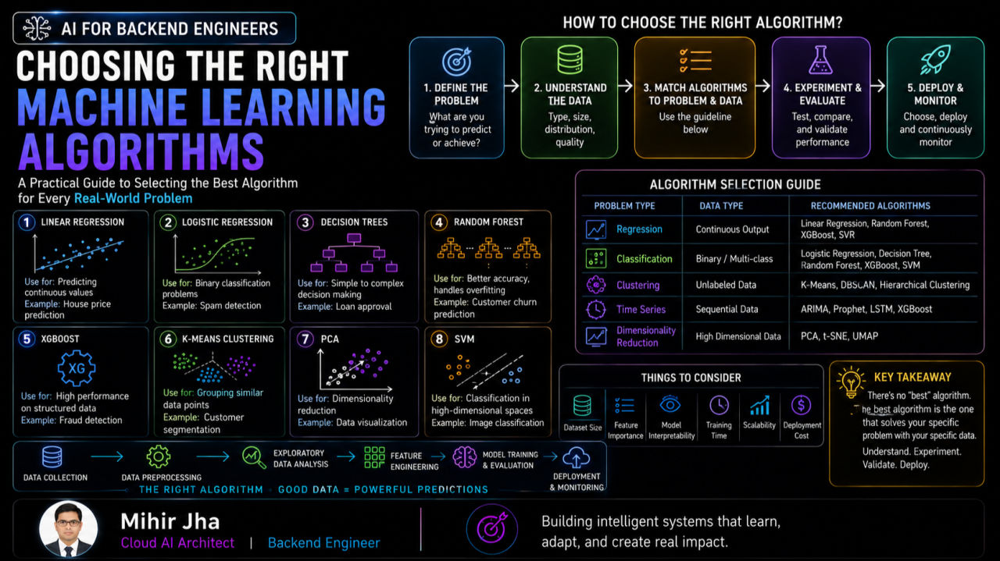
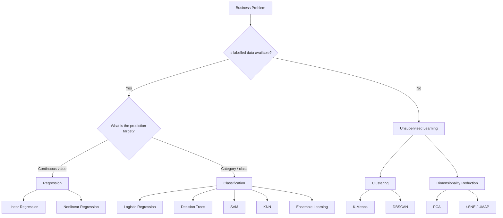
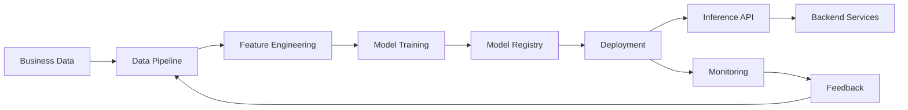
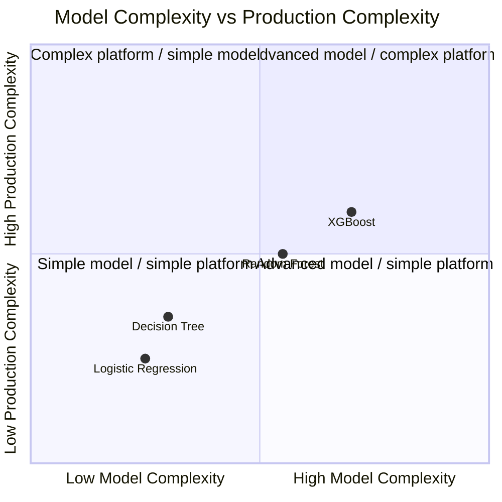

<div class="article-series">

  <span class="article-series__name">AI FOR BACKEND ENGINEERS</span>
  <span class="article-series__number">BLOG 03</span>

</div>

# Choosing the Right Machine Learning Algorithms



> Choosing a machine learning algorithm is not about finding the most sophisticated model. It is about selecting the right approach for the business problem, data, production constraints, and engineering environment.

## 🎯 Learning Objectives

After reading this article, you will be able to:

- Understand how common Machine Learning algorithms map to business problems
- Compare regression, classification, ensemble, clustering, and dimensionality-reduction approaches
- Understand important production trade-offs beyond model accuracy
- Evaluate algorithms based on explainability, latency, scalability, and operational complexity
- Understand why simpler models often remain highly relevant in enterprise systems
- Connect algorithm selection with backend, cloud, and production engineering concerns

---

## 🔥 Introduction

In previous articles in the **AI for Backend Engineers** journey, we explored the foundations of Machine Learning and the critical role data plays in building successful AI systems.

We learned that:

- Intelligent systems are built on data.
- Better data often creates bigger gains than better models.

But once the data is prepared, another important question emerges:

> **Which Machine Learning algorithm should we use?**

Over the past few weeks, we explored some of the most widely used ML algorithms in production systems, including:

- Linear Regression
- Logistic Regression
- Decision Trees
- Random Forest
- XGBoost
- Clustering with K-Means
- PCA and Dimensionality Reduction

We discussed where they are used, their strengths and limitations, and the business problems they help solve.

But real-world AI is not just about understanding algorithms individually.

The bigger challenge is understanding:

1. When should we use a particular algorithm?
2. What trade-offs does it introduce?
3. How does it impact system scalability and business outcomes?
4. Why do some algorithms remain popular in production despite newer alternatives?

As backend engineers, we are already familiar with building scalable, reliable, and distributed systems.

Machine Learning adds another layer:

> Instead of hardcoding decision logic, we build systems that learn patterns from data and continuously improve over time.

This article connects:

- ML algorithms and business problems
- Real-world production use cases
- Practical engineering considerations
- Cloud-based ML platforms
- Algorithm trade-offs in production systems

---

# 🧠 The Hidden Truth About Production ML

Many engineers spend too much time searching for the **"best algorithm."**

But in production systems, success usually depends more on:

- Data quality
- Feature engineering
- Inference latency
- Monitoring
- Scalability
- Operational simplicity

A simpler model with stronger engineering often outperforms a more advanced model deployed poorly.

This is why many enterprise AI systems still rely heavily on:

- Logistic Regression
- Decision Trees
- Random Forest
- XGBoost

The reason is simple:

> **Production AI is ultimately about solving business problems reliably and efficiently.**

Model sophistication is only one dimension of a production system.

---

# 🧭 A Practical Algorithm Selection Framework

A useful way to think about algorithm selection is to start with the business problem rather than the model.



This is only a starting point.

The final decision should also consider:

- Explainability
- Accuracy requirements
- Data volume
- Feature characteristics
- Training cost
- Inference latency
- Scalability
- Monitoring
- Regulatory requirements
- Operational complexity

---

# 📌 Linear Regression in Real Systems

Linear Regression predicts continuous numerical values using historical patterns.

Although simple, it remains one of the most widely used algorithms in production environments.

## Common Use Cases

- Sales forecasting
- Revenue prediction
- Demand forecasting
- Cloud capacity planning
- Delivery time estimation

## ☁️ Real-World Example: Cloud Capacity Forecasting

Imagine a cloud capacity forecasting platform continuously collecting:

- CPU utilization
- Memory usage
- Request volume
- Storage growth

Linear Regression can estimate future resource requirements and help optimize infrastructure planning.

A backend system could use the prediction to influence:

- Capacity planning
- Resource allocation
- Scaling decisions
- Infrastructure budgeting

## Production Insight

Linear Regression remains attractive because of:

- Fast training
- Explainable results
- Low infrastructure cost
- Simple operational behavior

Sometimes simplicity wins.

---

# 📌 Logistic Regression in Production Systems

Logistic Regression is one of the most widely used classification algorithms.

Despite being decades old, it still remains relevant in enterprise-grade systems.

## Common Use Cases

- Fraud detection
- Spam filtering
- Customer churn prediction
- Credit risk assessment

## 💳 Real-World Example: Fraud Detection

A payment platform may evaluate:

1. Transaction amount
2. Location patterns
3. Purchase frequency
4. Device information
5. Account history

The model predicts the probability of fraud.

The backend system then decides whether to:

- Allow the transaction
- Block the transaction
- Request additional verification

This highlights an important architectural distinction:

> **ML predicts probabilities. Business systems make decisions.**

The model itself should not necessarily own the complete business workflow.

## Production Insight

Logistic Regression can remain attractive when systems require:

- High explainability
- Fast inference
- Operational simplicity
- Regulatory transparency

A slightly less accurate but explainable model can sometimes be preferred over a black-box alternative.

---

# 📌 Decision Trees for Business Decisions

Decision Trees are widely used because their logic can resemble human decision-making.

Their decision paths can be easier to understand by:

- Business teams
- Auditors
- Regulators
- Engineers

## Common Use Cases

- Loan approval systems
- Insurance risk assessment
- Customer eligibility checks
- Medical diagnosis support

## Real-World Example

A lending platform may evaluate:

- Credit score
- Repayment history
- Salary range
- Debt ratio
- Employment stability

and generate an approval recommendation.

## Production Insight

Decision Trees remain valuable because explainability can be as important as raw predictive performance.

For architecture teams, this can also simplify:

- Debugging
- Rule interpretation
- Model reviews
- Business validation

---

# 📌 Random Forest vs XGBoost

As business problems become more complex, a single Decision Tree can become insufficient.

This led to ensemble learning techniques.

---

## 🌲 Random Forest

Random Forest combines multiple decision trees to improve prediction quality and stability.

### Strengths

- Stable performance
- Relatively easier tuning
- Reduced overfitting compared with a single tree

### Common Uses

- Churn prediction
- Customer analytics
- Risk modelling

---

## ⚡ XGBoost

XGBoost builds trees sequentially and learns from previous mistakes.

It has become a highly effective approach for many structured-data problems.

### Strengths

- Strong predictive performance
- Strong ranking performance
- Effective for structured/tabular data

### Common Uses

- Fraud detection
- Recommendation ranking
- Credit scoring
- Ad targeting

## Production Insight

Many enterprise AI systems continue to rely on tree-based ensemble methods because structured business data remains common across enterprise workloads.

### Comparison

| Consideration | Random Forest | XGBoost |
|---|---|---|
| Model strategy | Bagging | Boosting |
| Training approach | Multiple trees in parallel | Trees built sequentially |
| Ease of tuning | Generally easier | Generally more involved |
| Tabular data | Strong | Excellent |
| Explainability | Moderate | Moderate |
| Operational complexity | Moderate | Moderate |
| Common enterprise use | Risk, churn, analytics | Fraud, ranking, scoring |

The exact choice should depend on the dataset, evaluation results, latency requirements, and operational constraints.

---

# 📌 Unsupervised Learning & Clustering

Not every business problem comes with labelled data.

Many organizations need to discover hidden patterns automatically.

This is where clustering becomes valuable.

## 🛒 Real-World Example: Customer Segmentation

An e-commerce platform may analyze:

- Browsing behavior
- Purchase history
- Session duration
- Product interests

K-Means can automatically group customers into meaningful segments.

Examples:

- Premium customers
- Discount seekers
- Inactive users
- High-frequency buyers

## Business Impact

These insights can support:

- Personalization engines
- Recommendation systems
- Targeted marketing campaigns

The important point is that unsupervised learning can reveal structure in data even when explicit labels do not exist.

---

# 📌 PCA & Dimensionality Reduction

Feature engineering can generate hundreds or even thousands of features.

While more features can sometimes improve model performance, they can also introduce:

1. Redundancy
2. Noise
3. Scalability issues

## What PCA Solves

**Principal Component Analysis (PCA)** reduces feature dimensions while preserving important information.

## Common Use Cases

- Recommendation systems
- Image processing
- Large-scale analytics
- Predictive modelling

## Business Impact

PCA can help:

- Reduce training time
- Reduce storage requirements
- Improve scalability
- Simplify downstream processing

---

# 📌 Other Important ML Algorithms Used in Industry

Several additional algorithms continue to play important roles in production systems.

---

## K-Nearest Neighbors (KNN)

KNN classifies or predicts outcomes based on the similarity of nearby data points.

It assumes that similar data points are likely to have similar characteristics.

### Common Uses

- Recommendation systems
- Similarity search
- Product matching

### Strength

Simple and intuitive.

### Limitation

Can become expensive for large-scale real-time systems.

---

## Naive Bayes

Naive Bayes is a probabilistic algorithm based on Bayes' Theorem that predicts outcomes using feature probabilities.

It can work effectively for text classification despite its simplifying feature-independence assumption.

### Common Uses

- Spam filtering
- Sentiment analysis
- Document classification

### Strength

Fast and lightweight.

### Limitation

Relies on strong feature-independence assumptions.

---

## Support Vector Machines (SVM)

SVM is a supervised learning algorithm that finds a decision boundary separating different classes.

It can be particularly effective for classification problems with clearly separable margins.

### Common Uses

- Text classification
- Image recognition
- Anomaly detection

### Strength

Effective on smaller datasets.

### Limitation

Can become difficult to scale for very large datasets.

---

## DBSCAN

DBSCAN is a density-based clustering algorithm that groups closely packed data points while identifying outliers as noise.

Unlike K-Means, it does not require specifying the number of clusters in advance.

### Common Uses

- Anomaly detection
- Fraud pattern discovery
- Geospatial clustering

### Strength

Naturally identifies outliers.

### Limitation

Sensitive to parameter selection.

---

# ☁️ Cloud Platforms & Modern ML

Modern cloud platforms make it easier to train, deploy, and scale Machine Learning models.

Examples include:

- AWS SageMaker
- Azure Machine Learning
- Google Vertex AI

These platforms allow organizations to focus more on solving business problems and less on managing underlying infrastructure.

A simplified production architecture can look like:



However, regardless of the cloud platform used, success still depends on selecting the right algorithm for the right business problem.

---

# 🏗️ Algorithm Selection Is Also a System Design Problem

For backend engineers and architects, algorithm selection should not happen in isolation.

A production model sits inside a larger system:

```text
Business Requirement
        │
        ▼
Data
        │
        ▼
Feature Engineering
        │
        ▼
Algorithm Selection
        │
        ▼
Training & Validation
        │
        ▼
Model Deployment
        │
        ▼
Inference Service
        │
        ▼
Business Workflow
        │
        ▼
Monitoring & Feedback
```

This means algorithm selection can influence:

- API latency
- Infrastructure cost
- Scaling strategy
- Batch vs real-time inference
- Model deployment architecture
- Monitoring requirements
- Data pipelines
- Model versioning
- Security boundaries

The algorithm is therefore only one component of the production system.

---

# 💻 Illustrative Scikit-Learn Example

The following example shows how a backend-oriented ML workflow can remain simple while still being production-conscious.

```python
from sklearn.model_selection import train_test_split
from sklearn.metrics import mean_squared_error
from sklearn.linear_model import LinearRegression

# Example:
# X -> engineered features
# y -> continuous target

X_train, X_test, y_train, y_test = train_test_split(
    X,
    y,
    test_size=0.2,
    random_state=42
)

model = LinearRegression()

model.fit(X_train, y_train)

predictions = model.predict(X_test)

mse = mean_squared_error(y_test, predictions)

print(f"Mean Squared Error: {mse:.4f}")
```

The code itself is simple.

The difficult engineering questions come afterward:

- Where does the data come from?
- How is feature consistency maintained?
- How is the model versioned?
- How is inference exposed?
- How is latency monitored?
- How are model failures handled?
- How is drift detected?
- How is retraining triggered?

That is the difference between **training a model** and **engineering an ML system**.

---

# ⚠️ Common Mistakes Teams Make

Many teams focus heavily on algorithms while ignoring more important factors.

Common mistakes include:

1. Choosing algorithms before understanding business requirements
2. Focusing only on accuracy metrics
3. Ignoring explainability requirements
4. Neglecting feature engineering
5. Overcomplicating solutions
6. Ignoring inference latency
7. Ignoring operational cost
8. Treating the model as the entire AI system

> **Often the simplest algorithm solves the problem best.**

---

# 🎯 Production Decision Framework

A practical decision can be viewed across multiple dimensions:

| Dimension | Questions |
|---|---|
| Business Fit | Does the algorithm solve the actual business problem? |
| Data Fit | Is it appropriate for the available data? |
| Accuracy | Does it meet the required quality threshold? |
| Explainability | Can stakeholders understand the prediction? |
| Latency | Can inference meet real-time requirements? |
| Scalability | Can the solution support production load? |
| Cost | Is the operational footprint reasonable? |
| Reliability | Can failures be detected and handled? |
| Maintainability | Can the system be updated safely? |
| Governance | Does it satisfy regulatory and organizational requirements? |

This is why the **"best" algorithm is rarely universal**.

---

# 🧩 Model Complexity vs Production Complexity

A useful engineering principle is:



A technically advanced model can still be the wrong engineering choice if the production system becomes unnecessarily complex.

---

# 🔗 Connecting Algorithms to Enterprise Engineering

The most useful perspective for backend engineers is not:

> "Which algorithm should I memorize?"

It is:

> **"Which algorithm best fits the business problem and the system that must operate around it?"**

For example:

### Fraud Detection

```text
Transaction
    │
    ▼
Feature Extraction
    │
    ▼
Classification Model
    │
    ▼
Fraud Probability
    │
    ▼
Decision Service
    │
    ├── Approve
    ├── Block
    └── Additional Verification
```

The ML model is only one component of the overall system.

### Cloud Capacity Forecasting

```text
Metrics
  │
  ▼
Feature Pipeline
  │
  ▼
Regression Model
  │
  ▼
Capacity Forecast
  │
  ▼
Scaling / Planning System
```

Again, the model is part of a larger engineering workflow.

---

# 🎯 Final Takeaway

Machine Learning is not about finding the most sophisticated algorithm.

It is about selecting the **right algorithm for the right business problem**.

As backend engineers, understanding:

- Data
- Algorithms
- Scalability
- System behavior
- Production constraints
- Business requirements

is far more valuable than memorizing mathematical formulas.

The most successful AI systems combine:

> **Data + Algorithms + Engineering + Business Context**

And that is where backend engineering evolves into **AI Systems Engineering**.

---

# 📚 Related Enterprise AI Engineering Handbook Topics

The concepts in this article connect directly with the structured handbook:

- [Machine Learning Fundamentals](https://enterpriseai.handbook.mihirkjha.com/01-machine-learning/02-machine-learning-fundamentals/)
- [Machine Learning Lifecycle](https://enterpriseai.handbook.mihirkjha.com/01-machine-learning/03-machine-learning-lifecycle/)
- [Regression Fundamentals](https://enterpriseai.handbook.mihirkjha.com/01-machine-learning/06-regression-fundamentals/)
- [Decision Trees](https://enterpriseai.handbook.mihirkjha.com/01-machine-learning/12-decision-trees/)
- [Regression Trees](https://enterpriseai.handbook.mihirkjha.com/01-machine-learning/13-regression-trees/)
- [Classification Fundamentals](https://enterpriseai.handbook.mihirkjha.com/01-machine-learning/11-classification-fundamentals/)
- [Ensemble Learning](https://enterpriseai.handbook.mihirkjha.com/01-machine-learning/19-ensemble-learning/)
- [Unsupervised Learning Fundamentals](https://enterpriseai.handbook.mihirkjha.com/01-machine-learning/21-unsupervised-learning-fundamentals/)
- [K-Means Clustering](https://enterpriseai.handbook.mihirkjha.com/01-machine-learning/23-k-means-clustering/)
- [Principal Component Analysis](https://enterpriseai.handbook.mihirkjha.com/01-machine-learning/27-principal-component-analysis-pca/)
- [Model Evaluation Fundamentals](https://enterpriseai.handbook.mihirkjha.com/01-machine-learning/31-model-evaluation-fundamentals/)
- [Regression Evaluation Metrics](https://enterpriseai.handbook.mihirkjha.com/01-machine-learning/33-regression-evaluation-metrics/)
- [Cross-Validation and Model Validation](https://enterpriseai.handbook.mihirkjha.com/01-machine-learning/35-cross-validation-and-model-validation/)
- [Data Leakage and Modeling Pitfalls](https://enterpriseai.handbook.mihirkjha.com/01-machine-learning/37-data-leakage-and-modeling-pitfalls/)

---

# 🚀 What's Next in the AI for Backend Engineers Journey?

This article is part of the broader **AI for Backend Engineers** journey, connecting:

- Machine Learning fundamentals
- Deep Learning
- Generative AI
- RAG
- AI Agents
- Cloud AI
- MLOps
- Production AI Architecture
- AI System Design

Future articles will continue exploring how modern AI capabilities can be integrated into scalable backend and cloud-native systems.

---

## 💼 LinkedIn Version

A compact version of this article is also available on LinkedIn.

**[Read the LinkedIn Article →](https://www.linkedin.com/pulse/ai-backend-engineers-ml-algorithms-real-world-applications-mihir-jha-8ztdc/?trackingId=OkeyAEG%2BSyezt01dcy8eTQ%3D%3D)**

---


# 📚 Related Topics in the Enterprise AI Engineering Handbook

This article provides the engineering perspective from the [Enterprise AI Engineering Handbook](https://enterpriseai.handbook.mihirkjha.com/).

For structured technical reference material, explore:

- [Regression Fundamentals](https://enterpriseai.handbook.mihirkjha.com/01-machine-learning/regression/01-regression-fundamentals/)
- [Linear Regression](https://enterpriseai.handbook.mihirkjha.com/01-machine-learning/regression/02-linear-regression/)
- [Logistic Regression](https://enterpriseai.handbook.mihirkjha.com/01-machine-learning/regression/04-logistic-regression/)
- [Classification Fundamentals](https://enterpriseai.handbook.mihirkjha.com/01-machine-learning/classification/01-classification-fundamentals/)
- [Decision Trees](https://enterpriseai.handbook.mihirkjha.com/01-machine-learning/classification/02-decision-trees/)
- [Ensemble Learning](https://enterpriseai.handbook.mihirkjha.com/01-machine-learning/classification/09-ensemble-learning/)
- [Unsupervised Learning Fundamentals](https://enterpriseai.handbook.mihirkjha.com/01-machine-learning/unsupervised-learning/01-unsupervised-learning-fundamentals/)
- [K-Means Clustering](https://enterpriseai.handbook.mihirkjha.com/01-machine-learning/unsupervised-learning/03-k-means-clustering/)
- [Principal Component Analysis (PCA)](https://enterpriseai.handbook.mihirkjha.com/01-machine-learning/unsupervised-learning/07-principal-component-analysis-pca/)
- [Building Production Classification Systems](https://enterpriseai.handbook.mihirkjha.com/01-machine-learning/classification/10-building-production-classification-systems/)

---

# 🔗 Let's Connect

If you're exploring:

- AI Engineering
- Cloud AI Architecture
- MLOps
- Distributed ML Systems
- RAG & Agentic AI
- Scalable Backend Architecture
- AI System Design

Let's connect and learn together.

💼 [LinkedIn](https://www.linkedin.com/in/mihirkrjha/)
📚 [Enterprise AI Engineering Handbook](https://enterpriseai.handbook.mihirkjha.com/)
📰 [Enterprise AI Engineering Newsletter](https://www.linkedin.com/newsletters/enterprise-ai-engineering-7479222208079319041/)
💻 [GitHub](https://github.com/MihirKJha/)


---

## 📖 About the Author

**Mihir Jha**  
*Software Architect | AI Engineering | Cloud Architecture | Backend Engineering*

I focus on bridging traditional software and cloud engineering with modern AI engineering to design scalable, secure, observable, and production-ready intelligent systems.

---

# 📌 Key Message

> **The best machine learning algorithm is the one that fits the problem, data, and system constraints.**

Engineering Perspective:

> **Choose algorithms based on business requirements, data characteristics, scalability, explainability, and production constraints — not popularity alone.**

---

<div align="center" markdown="1">

### 🚀 Keep Learning. Keep Building. Keep Sharing.

**Building Production-Grade AI Systems Through Engineering, Architecture & Continuous Learning.**

**© 2026 Mihir Jha**

</div>