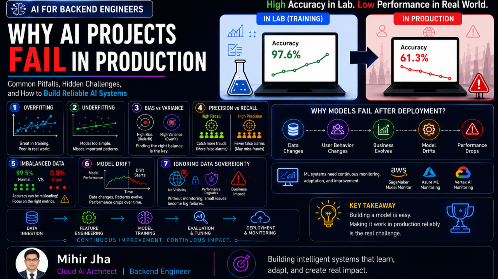
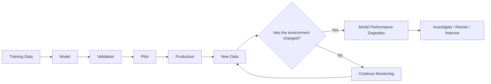
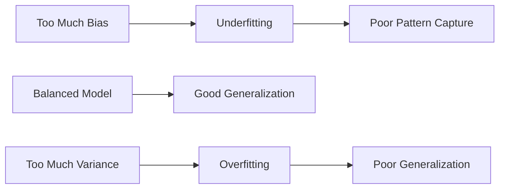
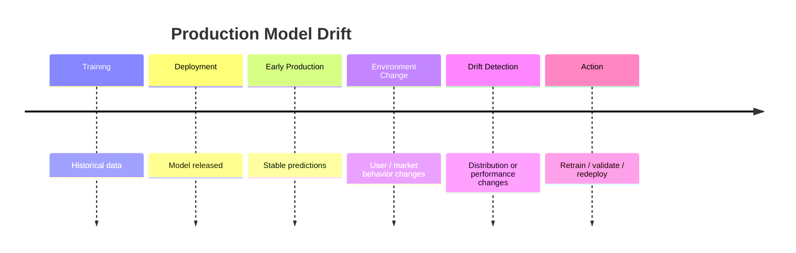
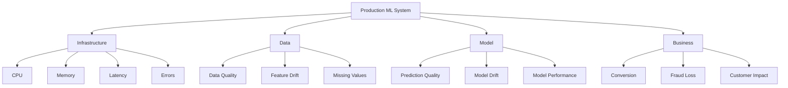
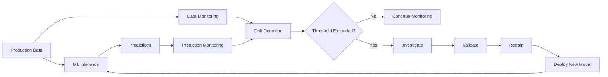
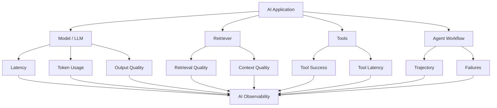
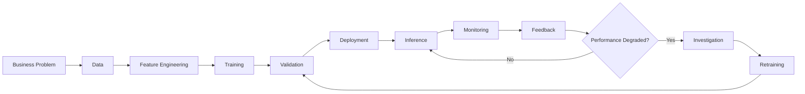
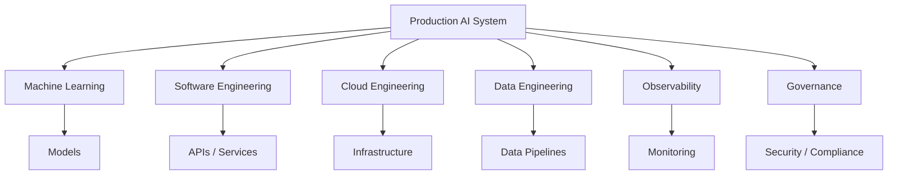

<div class="article-series">

  <span class="article-series__name">AI FOR BACKEND ENGINEERS</span>
  <span class="article-series__number">BLOG 04</span>

</div>


# 🚀 AI for Backend Engineers — Why AI Projects Fail in Production




> A high-performing model in a notebook is not the same thing as a successful production AI system.

## 🎯 Learning Objectives

After reading this article, you will be able to:

- Understand why AI projects can fail after successful experimentation
- Identify common model-quality problems such as overfitting and underfitting
- Understand the bias-variance trade-off
- Distinguish precision from recall in business scenarios
- Understand why imbalanced datasets can make accuracy misleading
- Understand model drift and why production data changes over time
- Identify what should be monitored in production ML systems
- Understand how AI observability extends traditional ML monitoring
- Connect model quality with production engineering and business outcomes

---

# 🔥 Introduction

In the previous articles in the **AI for Backend Engineers** journey, we explored the foundations of Machine Learning, the importance of data preparation, and how different ML algorithms solve real-world business problems.

We learned that:

- Good data is essential.
- Choosing the right algorithm matters.
- Production AI is about solving business problems, not just building models.

But even after selecting the right data and the right algorithm, many Machine Learning projects still fail.

And surprisingly, many failures do not happen during model training.

They happen **after deployment**.

A model that performs exceptionally well in a notebook may struggle when exposed to:

- Real users
- Changing business conditions
- Evolving data patterns
- Production latency requirements
- Compliance requirements
- Operational constraints

This is where Machine Learning becomes less about algorithms and more about:

**Engineering + Monitoring + Continuous Improvement**

In this article, we connect:

- Model quality challenges
- Production failures
- Real-world business impact
- Monitoring strategies
- Practical lessons for AI systems

---

# 🧠 The Hidden Truth About AI Projects

When people think about failed AI projects, they often assume:

- The algorithm was wrong
- The model was too simple
- The data scientists made mistakes

In reality, many failed AI projects begin with impressive results.

A model may achieve:

- 95% accuracy
- Excellent validation scores
- Promising pilot results

and still fail after deployment.

Why?

Because production environments are constantly changing.



Customers change.

Markets change.

Fraud patterns change.

Business processes evolve.

The model that performed well yesterday may no longer perform well tomorrow.

> **Production AI is not a one-time project. It is a continuously evolving system.**

---

# 📓 Notebook Success ≠ Production Success

A model may achieve excellent results during experimentation, but production environments introduce challenges such as:

- Changing data
- Evolving user behavior
- System latency
- Compliance requirements
- Business constraints
- Infrastructure constraints
- Operational complexity

Many AI projects fail not because the model is inherently bad, but because production realities were never considered.

A useful mental model is:

```text
Notebook Success
      │
      ▼
Model Validation
      │
      ▼
Pilot
      │
      ▼
Production
      │
      ├── New Data
      ├── New Users
      ├── New Business Conditions
      ├── New Failure Modes
      └── New Operational Constraints
```

The engineering problem therefore continues long after the first successful model evaluation.

---

# 📌 Problem #1 — Overfitting

One of the most common reasons ML projects fail is **overfitting**.

Overfitting occurs when a model learns the training data too closely.

Instead of learning patterns that generalize, the model may learn specific details and noise from the training dataset.

As a result:

- Excellent training performance
- Weak generalization
- Poor performance on unseen data

## 💳 Example: Fraud Detection

Imagine a fraud detection model trained on last year's fraud patterns.

The model learns:

- Specific transaction amounts
- Specific merchant categories
- Specific fraud signatures

Training results look excellent.

But new fraud techniques emerge.

The production environment changes.

The model struggles because it learned historical behavior too specifically.

## Business Impact

Over-fitted models can create:

- Missed fraud
- Poor customer experience
- Inaccurate predictions
- Declining business trust

### Production Principle

> **A model must generalize to the future, not just explain the past.**

---

# 📈 Problem #2 — Underfitting

Underfitting is the opposite problem.

The model is too simple to capture meaningful patterns.

Instead of learning useful relationships, it oversimplifies the problem.

## 📈 Example: Customer Churn Prediction

Suppose a telecom company wants to predict customer churn.

A simplistic model may consider only:

- Customer age
- Account duration

while ignoring:

- Support interactions
- Usage behavior
- Service quality metrics

The result is weak prediction quality regardless of how much data is available.

## Business Impact

Underfitting often leads to:

- Missed opportunities
- Weak personalization
- Ineffective recommendations
- Low prediction quality

---

# ⚖️ Problem #3 — Bias vs Variance

As engineers, we often look for perfect solutions.

Machine Learning rarely offers one.

Most models balance two competing forces:

## Bias

Bias refers to a model's tendency to make overly simplistic assumptions about the data.

High bias can result in:

- Underfitting
- Weak training performance
- Weak generalization

## Variance

Variance refers to a model's sensitivity to the training data.

High variance can result in:

- Overfitting
- Strong training performance
- Weak performance on unseen data

The engineering challenge is finding the right balance.



## 🏦 Example: Loan Approval System

A high-bias model may reject too many applicants because its decision rules are overly simplistic.

A high-variance model may approve or reject applicants inconsistently based on small changes in input data.

Neither produces reliable business outcomes.

## Engineering Insight

The goal is not to eliminate bias or variance completely.

The goal is to find a balance that generalizes well enough for the production environment.

---

# 📌 Problem #4 — Precision vs Recall

One of the most misunderstood topics in Machine Learning is the difference between **precision** and **recall**.

## Precision

Precision measures:

> Of the cases predicted as positive, how many were actually positive?

Precision is particularly important when false positives are costly.

## Recall

Recall measures:

> Of the actual positive cases, how many did the model successfully identify?

Recall is particularly important when false negatives are costly.

A useful summary is:

> **Precision focuses on reducing false positives, while recall focuses on reducing false negatives.**

## 💳 Example: Fraud Detection

Imagine a fraud detection system processing millions of transactions.

### High Recall

The model catches nearly all fraudulent transactions.

But it may also block many legitimate customers.

Possible result:

- Customer frustration
- Increased support costs
- Lower conversion

### High Precision

The model flags transactions only when it is highly confident.

Possible result:

- Fewer false alarms
- Better customer experience
- But some fraud remains undetected

## Business Reality

There is no universal answer.

Different businesses prioritize different outcomes.

| Business Concern | Metric Often Prioritized |
|---|---|
| Avoid false alarms | Precision |
| Avoid missed fraud | Recall |
| Balance both | F1 Score |
| Optimize business decision | Metric + business threshold |

> **Production AI is often about managing trade-offs rather than maximizing a single metric.**

---

# 📌 Problem #5 — Imbalanced Datasets

Many real-world datasets are highly imbalanced.

This creates one of the biggest traps in Machine Learning.

## 💳 Example: Fraud Detection

Imagine:

```text
99.5% Normal Transactions
 0.5% Fraudulent Transactions
```

A model that predicts every transaction as normal achieves:

```text
99.5% Accuracy
```

That sounds impressive.

But the model completely fails its actual purpose.

## Why Accuracy Can Be Misleading

In imbalanced datasets, accuracy can hide poor performance on the minority class.

Metrics such as:

- Precision
- Recall
- F1 Score

can become much more informative.

A simplified example:

| Model | Accuracy | Recall | Business Interpretation |
|---|---:|---:|---|
| Model A | 99.5% | 0% | Misses all fraud |
| Model B | 98.7% | 82% | Detects most fraud |
| Model C | 98.2% | 91% | Strong fraud detection |

The best model is not necessarily the one with the highest accuracy.

---

# 📌 Problem #6 — Model Drift

Even successful models can eventually degrade.

This phenomenon is commonly referred to as **model drift**.

Over time:

- Customer behavior changes
- Fraud patterns evolve
- Market conditions shift
- New products are introduced
- User populations change

The data entering the system becomes different from the data used during training.

## 🛒 Example: E-Commerce Recommendation Systems

A recommendation model trained during a holiday season may perform poorly months later because customer purchasing behavior has changed.

Nothing is necessarily broken.

> **The world simply evolved.**

## Drift Timeline



## Business Impact

Model drift can result in:

- Declining prediction quality
- Poor recommendations
- Increased business risk
- Reduced customer satisfaction
- Increased operational intervention

---

# 📊 Problem #7 — Lack of Monitoring and Observability

Traditional software systems are heavily monitored.

Teams commonly track:

- CPU utilization
- Memory consumption
- API latency
- Error rates
- Throughput

Machine Learning systems require all of that — **and more**.

## What Should Be Monitored?

Production ML systems should track multiple layers:



### Monitoring Layers

| Layer | Examples |
|---|---|
| Infrastructure | CPU, memory, latency, errors |
| Data | Quality, missing values, distributions |
| Features | Feature drift, unexpected values |
| Model | Prediction quality, model drift |
| Business | Revenue, fraud loss, churn, conversion |

## Engineering Reality

A model can appear healthy from an infrastructure perspective while producing increasingly poor predictions.

A service can have:

```text
HTTP 200
Low latency
No crashes
```

and still be producing poor business decisions.

That is why observability must extend beyond the infrastructure layer.

---

# ☁️ Modern Cloud Monitoring

Cloud providers now offer built-in monitoring capabilities for Machine Learning systems.

Examples include:

- AWS SageMaker Model Monitor
- Azure Machine Learning Monitoring
- Google Vertex AI Monitoring

These capabilities can help teams detect:

- Data drift
- Prediction drift
- Model degradation

before they become major business issues.

A simplified architecture is:



However, monitoring tools alone are not enough.

Organizations still need processes to:

- Investigate
- Validate
- Retrain
- Roll out safely
- Compare model versions
- Measure business impact

---

# 🤖 Modern AI Observability

## Beyond Traditional ML Monitoring

As AI systems become more complex, monitoring is no longer limited to model accuracy and data drift.

Generative AI and Agentic AI systems introduce additional dimensions such as:

- Prompt behavior
- Retrieval quality
- Tool usage
- LLM latency
- Token usage
- Cost
- User interactions
- Agent trajectories
- Output quality

A modern AI observability view therefore looks more like:



Examples of platforms used for modern AI observability include:

- LangSmith for LLM tracing and agent observability
- Langfuse for prompt and response analytics
- Arize AI for model and LLM monitoring
- Weights & Biases for experiment tracking and monitoring
- MLflow for model lifecycle management

> **If you cannot observe your AI system, you cannot reliably operate it in production.**

---

# 🏗️ From Model Monitoring to AI Operations

The evolution can be viewed as:

```text
Traditional Application Monitoring
                │
                ▼
          ML Monitoring
                │
        ┌───────┴────────┐
        ▼                ▼
     Data Quality     Model Quality
        │                │
        └───────┬────────┘
                ▼
          AI Observability
                │
     ┌──────────┼───────────┐
     ▼          ▼           ▼
  Models     Retrieval     Agents
     │          │           │
     └──────────┼───────────┘
                ▼
        Production AI Ops
```

This is an important architectural transition:

> **AI observability is becoming a system capability, not simply a model capability.**

---

# ⚠️ Common Production Mistakes Teams Make

Across industries, many AI projects fail for similar reasons.

Common mistakes include:

1. Chasing accuracy without understanding business goals
2. Ignoring data-quality issues
3. Neglecting feature engineering
4. Overfitting models
5. Failing to monitor production performance
6. Assuming models will remain accurate forever
7. Focusing on algorithms instead of business outcomes
8. Ignoring Data Governance
9. Ignoring Data Sovereignty
10. Treating deployment as the end of the project

The most important lesson is:

> **The best model is not the most complex model. It is the model that reliably solves the business problem.**

---

# 🏭 Production AI Lifecycle

A production ML system should be treated as a lifecycle rather than a one-time training task.



This highlights an important architectural principle:

> **Deployment is the beginning of the production lifecycle, not the end.**

---

# 🧩 Production Readiness Checklist

Before deploying an ML system, teams should be able to answer:

| Area | Question |
|---|---|
| Data | Is production data representative and reliable? |
| Features | Are training and inference features consistent? |
| Model | Does the model generalize beyond validation data? |
| Metrics | Are the selected metrics aligned with the business problem? |
| Latency | Does inference meet production SLAs? |
| Scalability | Can the service handle expected traffic? |
| Monitoring | Can data, model, and business degradation be detected? |
| Security | Are model endpoints and data protected? |
| Governance | Are regulatory and data requirements satisfied? |
| Retraining | Is there a clear process for model improvement? |
| Rollback | Can a bad model version be safely removed? |
| Observability | Can engineers explain unexpected behavior? |

---

# 💡 Engineering Perspective

A successful production ML system combines multiple disciplines:



This is why AI Engineering is increasingly becoming a multidisciplinary engineering discipline.

---

# 🎯 Final Takeaway

Machine Learning success is not determined by training accuracy alone.

Successful AI systems require:

1. Quality data
2. Appropriate algorithms
3. Continuous monitoring
4. Business alignment
5. Ongoing improvement

Building a model is only the beginning.

The real challenge starts after deployment because production AI systems operate in environments that constantly change.

Customers change.

Markets change.

Data changes.

Business requirements change.

And the teams that succeed are the ones that continuously adapt alongside them.

> **Production AI is a continuously evolving system.**

---

# 📚 Related Enterprise AI Engineering Handbook Topics

This article connects directly with the structured **Enterprise AI Engineering Handbook**:

- [Machine Learning Fundamentals](https://enterpriseai.handbook.mihirkjha.com/01-machine-learning/02-machine-learning-fundamentals/)
- [Machine Learning Lifecycle](https://enterpriseai.handbook.mihirkjha.com/01-machine-learning/03-machine-learning-lifecycle/)
- [Machine Learning in Practice](https://enterpriseai.handbook.mihirkjha.com/01-machine-learning/04-machine-learning-in-practice/)
- [Training and Evaluating Regression Models](https://enterpriseai.handbook.mihirkjha.com/01-machine-learning/10-training-and-evaluating-regression-models/)
- [Classification Model Evaluation](https://enterpriseai.handbook.mihirkjha.com/01-machine-learning/16-classification-model-evaluation/)
- [Feature Scaling and Data Preparation](https://enterpriseai.handbook.mihirkjha.com/01-machine-learning/17-feature-scaling-and-data-preparation/)
- [Bias-Variance Tradeoff](https://enterpriseai.handbook.mihirkjha.com/01-machine-learning/18-bias-variance-tradeoff/)
- [Model Evaluation Fundamentals](https://enterpriseai.handbook.mihirkjha.com/01-machine-learning/31-model-evaluation-fundamentals/)
- [Classification Evaluation Metrics](https://enterpriseai.handbook.mihirkjha.com/01-machine-learning/32-classification-evaluation-metrics/)
- [Regression Evaluation Metrics](https://enterpriseai.handbook.mihirkjha.com/01-machine-learning/33-regression-evaluation-metrics/)
- [Cross-Validation and Model Validation](https://enterpriseai.handbook.mihirkjha.com/01-machine-learning/35-cross-validation-and-model-validation/)
- [Regularization Techniques](https://enterpriseai.handbook.mihirkjha.com/01-machine-learning/36-regularization-techniques/)
- [Data Leakage and Modeling Pitfalls](https://enterpriseai.handbook.mihirkjha.com/01-machine-learning/37-data-leakage-and-modeling-pitfalls/)

---

# 🔮 What's Next

This article is part of the ongoing:

## **AI for Backend Engineers**

The series explores how modern AI systems connect with:

- Machine Learning fundamentals
- Deep Learning
- Generative AI
- RAG
- AI Agents
- Backend architecture
- Cloud platforms
- MLOps
- Production reliability
- AI System Design

Upcoming articles and deep dives will continue connecting these technologies step by step.

---

# 🔗 Let's Connect

If you're exploring:

- AI Engineering
- Cloud AI Architecture
- MLOps
- Distributed ML Systems
- RAG & Agentic AI
- Scalable Backend Architecture
- AI System Design

### 💼 LinkedIn

[LinkedIn — Mihir Jha](https://www.linkedin.com/in/mihirkrjha/)

### 📚 Enterprise AI Engineering Handbook

[Enterprise AI Engineering Handbook](https://enterpriseai.handbook.mihirkjha.com/)

### 📰 Enterprise AI Engineering Newsletter

[Enterprise AI Engineering Newsletter](https://www.linkedin.com/newsletters/enterprise-ai-engineering-7479222208079319041/)

### 💻 GitHub

[GitHub Repository - Mihir Jha](https://github.com/MihirKJha/)

---

---

# 👨‍💻 About the Author

**Mihir Jha**

*Software Architect | AI Engineering | Cloud Architecture | Backend Engineering*

I focus on bridging traditional software and cloud engineering with modern AI engineering to design scalable, secure, observable, and production-ready intelligent systems.

---

<div align="center" markdown="1">

### 🚀 Keep Learning. Keep Building. Keep Sharing.

**Building Production-Grade AI Systems Through Engineering, Architecture & Continuous Learning.**

**© 2026 Mihir Jha**

</div>