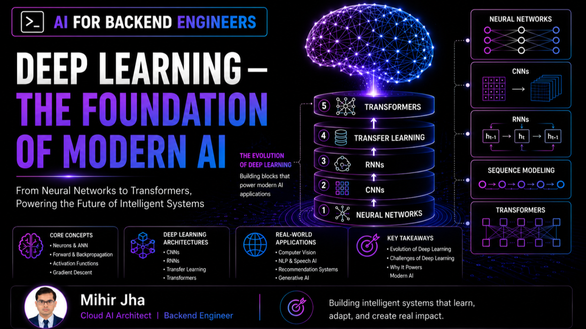
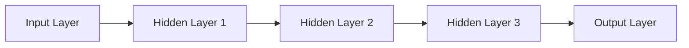
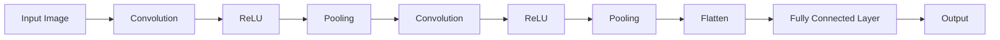
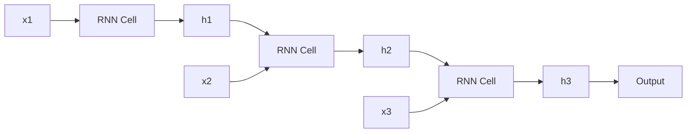
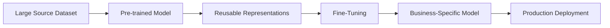
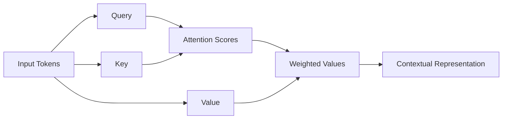
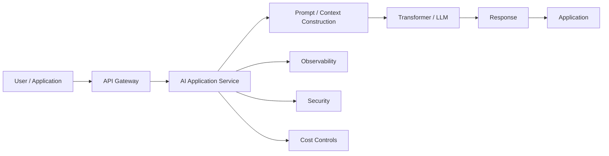
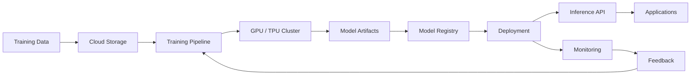
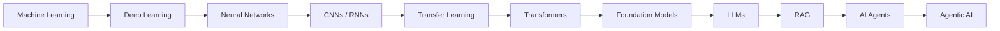

<div class="article-series">

  <span class="article-series__name">AI FOR BACKEND ENGINEERS</span>
  <span class="article-series__number">BLOG 05</span>

</div>


# 🚀 Deep Learning — The Foundation of Modern AI




> Deep Learning transformed AI by enabling systems to automatically learn complex representations from large amounts of data, providing the foundation for modern computer vision, speech, language, recommendation systems, and Generative AI.

**Reading Time:** 18–20 minutes  
**Difficulty:** Intermediate

---

## 🎯 Learning Objectives

After reading this article, you will be able to:

- Understand why Deep Learning changed modern AI
- Explain the basic architecture of neural networks
- Understand how CNNs process image data
- Understand how RNNs process sequential data
- Explain the role of hidden state and sequence memory
- Understand why RNNs and LSTMs/GRUs faced scalability limitations
- Explain how Transfer Learning reduces training cost and data requirements
- Understand why Transformers became foundational to modern AI
- Understand how Deep Learning workloads run on cloud infrastructure
- Identify production challenges around cost, latency, scaling, and observability
- Connect Deep Learning concepts with backend and cloud architecture

---

# 🔥 Introduction

In the previous articles in the **AI for Backend Engineers** journey, we explored:

- Building intelligent systems
- Preparing data for Production AI
- Choosing the Right Machine Learning Algorithms
- Why AI Projects Fail in Production

We learned that:

- Data quality matters.
- Algorithm selection matters.
- Production AI requires continuous monitoring and improvement.

However, many modern AI applications require a level of pattern recognition that traditional Machine Learning often struggles to achieve.

Examples include:

- Image recognition
- Voice assistants
- Recommendation engines
- Natural Language Processing
- Generative AI
- Large Language Models

This is where **Deep Learning changed everything**.

Deep Learning enabled systems to automatically learn complex patterns and representations from large amounts of data instead of relying as heavily on manually engineered features.

The evolution can be viewed as:

```text
Machine Learning
      │
      ▼
Neural Networks
      │
      ├── CNNs
      │
      ├── RNNs
      │     ├── LSTM
      │     └── GRU
      │
      ├── Transfer Learning
      │
      ▼
Transformers
      │
      ▼
Foundation Models
      │
      ▼
LLMs / Generative AI
      │
      ▼
RAG / AI Agents / Agentic AI
```

This article brings those concepts together and explains how they fit into real production systems — from model training to cloud infrastructure and operational challenges.

---

# 🧠 Why Deep Learning Changed AI

Traditional Machine Learning algorithms often depend heavily on manual feature engineering.

For example, a fraud detection system may require carefully designed features such as:

- Transaction amount
- Customer age
- Account history
- Merchant category
- Transaction frequency

The quality of these engineered features significantly influences model performance.

Deep Learning introduced a different approach.

Instead of manually defining every important feature, deep neural networks can learn increasingly useful representations directly from large amounts of data.

This enabled major advances in:

- Computer Vision
- Speech Recognition
- Natural Language Processing
- Recommendation Systems
- Generative AI

---

## Traditional ML vs Deep Learning

| Dimension | Traditional ML | Deep Learning |
|---|---|---|
| Feature Engineering | Often extensive | Often learned automatically |
| Typical Data Volume | Small to medium | Medium to very large |
| Compute Requirements | Lower | Often significantly higher |
| Training Time | Usually shorter | Often longer |
| Model Complexity | Lower | Higher |
| Explainability | Often easier | Often more difficult |
| Image / Audio / Text | Task-dependent | Particularly strong |
| Production Infrastructure | Relatively simple | Often more complex |

The important point is not that Deep Learning replaces traditional Machine Learning everywhere.

Rather:

> **Deep Learning becomes particularly valuable when the underlying patterns are too complex or high-dimensional for manual feature engineering to be effective.**

---

# 🔗 Neural Networks Explained for Engineers

At the heart of Deep Learning are **Artificial Neural Networks (ANNs)**.

A neural network consists of interconnected layers that transform input data into predictions.



## Input Layer

The input layer receives raw or prepared data.

Examples:

- Numerical features
- Image pixels
- Text representations
- Audio features
- Sensor measurements

## Hidden Layers

Hidden layers learn representations and relationships within the input.

As networks become deeper, later layers can learn increasingly complex representations.

## Output Layer

The output layer produces the final prediction.

Examples:

- Class probability
- Regression value
- Next token probability
- Image classification
- Anomaly score

---

# 🔄 How Neural Networks Learn

A neural network learns through an iterative optimization process.

A simplified flow is:

```text
Input Data
    │
    ▼
Forward Propagation
    │
    ▼
Prediction
    │
    ▼
Loss Calculation
    │
    ▼
Backpropagation
    │
    ▼
Weight Updates
    │
    ▼
Repeat
```

## Forward Propagation

Data flows from the input layer through the network to produce a prediction.

## Loss Calculation

The prediction is compared with the expected target using a loss function.

## Backpropagation

The error signal is propagated backward through the network.

## Optimization

An optimizer updates model parameters to reduce the loss.

This process repeats over many training iterations.

---

## 💻 Simplified Neural Network Example

A simple neural network can be expressed with Keras like this:

```python
from tensorflow import keras
from tensorflow.keras import layers

model = keras.Sequential([
    layers.Input(shape=(10,)),
    layers.Dense(64, activation="relu"),
    layers.Dense(32, activation="relu"),
    layers.Dense(1, activation="sigmoid")
])

model.compile(
    optimizer="adam",
    loss="binary_crossentropy",
    metrics=["accuracy"]
)
```

The code is simple, but production engineering introduces additional questions:

- Where does the training data come from?
- How are features versioned?
- How is the model evaluated?
- Where is the trained model stored?
- How is inference exposed?
- How is latency monitored?
- How is model drift detected?

Again, the model is only one component of the larger system.

---

# 📷 CNNs — Powering Computer Vision

**Convolutional Neural Networks (CNNs)** transformed image processing and computer vision.

Traditional fully connected neural networks treat input features largely as independent values.

CNNs instead exploit local spatial relationships in images.

They can automatically learn hierarchical visual representations.

The progression often looks like:

```text
Pixels
  │
  ▼
Edges
  │
  ▼
Textures
  │
  ▼
Shapes
  │
  ▼
Objects
  │
  ▼
Classification / Detection
```

This ability made CNNs foundational to many computer vision systems.

---

# 🧩 How a CNN Processes an Image

A simplified CNN architecture can be represented as:



## 1. Input Layer

The input layer receives an image as a matrix of pixel values.

Examples:

```text
Grayscale Image
Height × Width

Color Image
Height × Width × RGB Channels
```

## 2. Convolution Layer

A convolution layer applies small filters, also called kernels, across an image.

These filters learn patterns such as:

- Edges
- Corners
- Lines
- Textures

During training, useful filters are learned automatically.

## 3. Activation Layer

An activation function introduces non-linearity into the network.

A common activation is **ReLU — Rectified Linear Unit**.

```text
ReLU(x) = max(0, x)
```

This allows the network to model more complex relationships.

## 4. Pooling Layer

Pooling reduces the spatial dimensions of feature maps.

Common approaches include:

- Max Pooling
- Average Pooling

Benefits can include:

- Reduced computation
- Lower memory consumption
- Greater spatial robustness
- Reduced feature-map size

## 5. Fully Connected Layer

After feature extraction, learned representations are flattened and passed to one or more dense layers for decision making.

## 6. Output Layer

The output layer produces the final prediction.

Examples:

- Cat vs Dog
- Tumor detection
- Vehicle recognition
- Object classification

Typical output activations include:

- **Sigmoid** → Binary classification
- **Softmax** → Multi-class classification
- **Linear** → Regression

---

# 🏥 CNN Real-World Applications

CNN-based systems have been used across many industries.

### Healthcare

- X-ray analysis
- CT image analysis
- MRI analysis
- Pathology image analysis

### Manufacturing

- Automated defect detection
- Quality inspection
- Visual anomaly detection

### Retail

- Visual search
- Product recognition
- Image-based classification

### Autonomous Systems

- Traffic-sign recognition
- Pedestrian detection
- Lane detection
- Object recognition

### Consumer Applications

- Face unlock
- Photo tagging
- OCR
- Augmented reality

> CNNs remain an important foundation for visual AI systems, even as newer architectures such as Vision Transformers have become increasingly important.

---

# ⏳ RNNs — Powering Sequential Intelligence

While CNNs transformed computer vision, many real-world problems involve **sequential data**.

Examples include:

- Text
- Speech
- Time-series data
- Sensor readings
- User activity streams

In these problems, the order of information matters.

For example:

> "I love AI"

is not equivalent to:

> "AI loves me."

Traditional feed-forward neural networks do not naturally maintain a memory of previous inputs.

This is where **Recurrent Neural Networks (RNNs)** became important.

---

# 🧠 How RNNs Process Sequential Data

Unlike feed-forward neural networks, RNNs maintain a **hidden state** that carries information from previous time steps.



At each time step, the model combines:

- Current input
- Previous hidden state

to generate:

- Updated hidden state
- Current output

---

# 🔄 RNN Processing Model

A simplified flow is:

```text
Input at t1
   │
   ▼
RNN Cell
   │
   ▼
Hidden State
   │
   ├──────────────┐
   │              ▼
   │         Input at t2
   │              │
   └──────────► RNN Cell
                  │
                  ▼
              Hidden State
                  │
                  ▼
               Input at t3
                  │
                  ▼
               RNN Cell
                  │
                  ▼
                Output
```

The same cell and weights are reused across time steps.

This allows the model to learn temporal relationships.

---

# 💬 Example: Language Sequence

Consider:

```text
"The"
  ↓
"weather"
  ↓
"is"
  ↓
"very"
  ↓
Predict
  ↓
"good"
```

The prediction depends not only on the current token but also on the context accumulated from previous tokens.

The same idea can apply to:

- Speech recognition
- Time-series forecasting
- Predictive maintenance
- Sensor streams
- User behavior analysis

---

# ⚠️ RNN Limitations

Although RNNs introduced memory into neural networks, they struggled with long sequences.

Important challenges included:

- Vanishing gradients
- Difficulty learning long-term dependencies
- Sequential computation
- Slower training

These challenges motivated architectures such as:

- LSTM
- GRU

LSTMs and GRUs improved the ability to model long-term dependencies, but sequential processing remained a limitation for large-scale training.

That limitation eventually contributed to the rise of the **Transformer architecture**.

---

# 🚀 Transfer Learning — Building AI Faster and Smarter

Training a Deep Learning model from scratch can be expensive, time-consuming, and data-intensive.

Organizations may need:

- Large labelled datasets
- GPU infrastructure
- Long training cycles
- Significant engineering effort

For many business problems, this is not practical.

This is where **Transfer Learning** became extremely valuable.

Instead of learning everything from scratch, a model can reuse knowledge learned from a large source dataset and adapt it to a related task.

A useful analogy for software engineers is:

> **Transfer Learning is similar to reusing a mature library or framework instead of rebuilding the same capability from scratch.**

---

# 🔄 How Transfer Learning Works



## 1. Large Source Dataset

A model is trained on a large dataset.

Examples may include:

- ImageNet
- Large text corpora
- Large speech datasets

## 2. Pre-trained Model

The model learns general representations.

Examples:

- Image features
- Language representations
- Speech patterns

## 3. Fine-Tuning

The model is adapted using a smaller domain-specific dataset.

Depending on the use case, engineers may:

- Freeze early layers
- Train later layers
- Fine-tune the full model with a smaller learning rate

## 4. Business-Specific Model

The adapted model becomes specialized for a specific task.

Examples:

- Medical image classification
- Manufacturing inspection
- Product classification
- Document analysis
- Domain-specific text classification

## 5. Production Deployment

The trained model is deployed through:

- APIs
- Applications
- Batch pipelines
- Cloud AI platforms

---

# 💡 Transfer Learning Example

Imagine building an AI system to detect manufacturing defects.

Training a vision model from scratch may require a very large labelled dataset.

Instead, engineers can start with a pre-trained model that has already learned visual representations such as:

- Edges
- Shapes
- Textures
- Objects

The model can then be adapted to recognize manufacturing defects.

Potential advantages include:

- Faster development
- Lower training cost
- Smaller domain-specific dataset requirements
- Faster experimentation

---

# ☁️ Transfer Learning and Modern AI

Transfer Learning is now a core pattern throughout modern AI.

It appears in:

- Computer Vision
- NLP
- Speech
- Multimodal AI
- Foundation Models
- LLM adaptation

Modern organizations often build on pre-trained models instead of starting from random initialization.

This becomes especially important as model sizes increase.

---

# 🤖 Transformers — The Foundation of Modern AI

Perhaps the most significant architectural breakthrough in modern AI is the **Transformer**.

CNNs transformed computer vision.

RNNs enabled sequence modeling.

Transformers introduced a more scalable approach to understanding relationships across sequences.

The key innovation is the **Attention mechanism**.

---

# ❓ Why RNNs Were Not Enough

Although RNNs, LSTMs, and GRUs improved sequence modeling, they still faced limitations.

## Long-Term Dependencies

As sequences become longer, important information from earlier positions can become harder to preserve.

## Sequential Processing

RNNs process information step by step.

This limits parallelism during training.

## Scalability

Large-scale training becomes increasingly expensive when the architecture depends heavily on sequential computation.

Researchers needed an architecture that could process sequences more efficiently while learning relationships between distant elements.

---

# ⚡ The Transformer Revolution

Transformers changed the approach.

Instead of processing information sequentially through recurrence, Transformers use attention mechanisms to model relationships across the sequence.

Conceptually:

```text
RNN:

Token 1 → Token 2 → Token 3 → Token 4
   │         │         │         │
 Hidden    Hidden    Hidden    Hidden
 State     State     State     State


Transformer:

Token 1 ─────────┐
Token 2 ─────────┤
Token 3 ─────────┼──► Attention ──► Representation
Token 4 ─────────┘
```

This approach enables substantially more parallel computation during training.

---

# 🧠 Attention at a High Level

Attention allows a model to determine which parts of an input sequence are more relevant to another part of the sequence.

For example:

```text
"The server failed because it lost the database connection."

                      ↑
                  "it" may relate
                  to "server"
```

Instead of relying only on a sequential hidden state, attention allows the model to learn relationships between elements.

A simplified representation is:



We will explore **Self-Attention, Query-Key-Value representations, Encoder/Decoder architectures, BERT, GPT, and modern LLMs** in subsequent articles.

---

# 🌍 Why Transformers Matter

Transformers became foundational to many modern AI systems.

They power or underpin technologies used for:

- Large Language Models
- Generative AI
- Machine Translation
- AI Assistants
- Code Generation
- Intelligent Search
- Document Intelligence
- Multimodal AI
- Vision Transformers
- Speech AI

The evolution can be summarized as:

```text
Neural Networks
      ↓
CNNs / RNNs
      ↓
LSTM / GRU
      ↓
Transformers
      ↓
Foundation Models
      ↓
LLMs / Generative AI
      ↓
RAG / AI Agents / Agentic AI
```

---

# 🏢 Transformers in Production

Modern organizations generally do not train large foundation models entirely from scratch.

Instead, many systems rely on:

- Pre-trained foundation models
- Fine-tuning or adaptation
- Retrieval
- Prompting
- Tool integration
- Managed inference platforms

Production Transformer-based systems can support:

### Enterprise Search

Retrieval and question answering across company knowledge.

### AI Assistants

Conversational support and workflow assistance.

### Document Intelligence

Extraction, summarization, classification, and reasoning over documents.

### Customer Support

Automated response generation and assistance for support agents.

### Code Generation

Developer copilots and software-development assistance.

### Knowledge Management

Search, summarization, and knowledge extraction.

---

# 🏗️ Transformer Production Architecture

A simplified production architecture can look like:



In modern AI applications, this architecture expands further to include:

- Retrieval
- Vector stores
- Tool calling
- Guardrails
- Evaluation
- Caching
- Model routing
- Human review

These become major architecture topics in the upcoming RAG and Agentic AI phases.

---

# ☁️ Deep Learning on Cloud Infrastructure

Deep Learning workloads often require significant computational resources.

Traditional CPUs may not be sufficient for large-scale training.

Modern workloads rely heavily on:

- GPUs
- Specialized accelerators
- Distributed training infrastructure
- High-throughput storage
- High-bandwidth networking

---

## AWS

Examples include:

- SageMaker Training Jobs
- EC2 GPU instances

## Microsoft Azure

Examples include:

- Azure Machine Learning compute
- Azure GPU virtual machines

## Google Cloud

Examples include:

- Vertex AI Training
- TPU infrastructure
- GPU-based training environments

---

# ☁️ Cloud Deep Learning Architecture

A simplified architecture:



Cloud platforms allow organizations to scale Deep Learning workloads without purchasing and maintaining all underlying hardware themselves.

---

# 📊 Production Challenges in Deep Learning

While Deep Learning unlocks powerful capabilities, it also introduces operational challenges.

## High Infrastructure Cost

Large training workloads can require significant GPU resources.

## Long Training Times

Complex models can require hours, days, or longer training cycles.

## Explainability Challenges

Understanding why a model produced a particular decision can be difficult.

## Monitoring Complexity

Model quality can degrade even when infrastructure appears healthy.

## Large Model Sizes

Larger models can increase:

- Memory usage
- Inference latency
- Infrastructure cost
- Deployment complexity

Production systems therefore require a balance between:

**Performance + Cost + Scalability + Reliability + Maintainability**

---

# ⚠️ Common Mistakes Teams Make

Organizations can struggle when they:

- Train unnecessarily large models
- Ignore infrastructure costs
- Skip monitoring and observability
- Overlook latency requirements
- Fail to leverage transfer learning
- Focus on model complexity instead of business value
- Deploy without a clear rollback strategy
- Underestimate inference infrastructure requirements

The best Deep Learning system is not necessarily the largest.

> **It is the system that reliably delivers business value within its production constraints.**

---

# 📦 Deep Learning Production Checklist

Before deploying a Deep Learning workload, consider:

| Area | Key Question |
|---|---|
| Data | Is the training data representative? |
| Model | Does the model generalize? |
| Compute | Is the GPU/accelerator strategy appropriate? |
| Latency | Does inference meet the required SLA? |
| Cost | Is the model economically viable? |
| Scaling | Can inference scale with demand? |
| Monitoring | Can degradation be detected? |
| Security | Are models and data protected? |
| Governance | Are compliance requirements satisfied? |
| Rollback | Can model versions be safely reversed? |

---

# 🚀 In One Minute

- Neural Networks learn complex patterns from data.
- CNNs became foundational for computer vision.
- RNNs introduced sequence memory.
- LSTM and GRU improved long-term sequence modeling.
- Transfer Learning enabled reuse of pre-trained knowledge.
- Transformers changed scalable sequence modeling.
- Transformers became foundational to modern Generative AI.
- Cloud platforms provide scalable GPU and accelerator infrastructure.
- Production Deep Learning requires monitoring, optimization, security, and cost management.

---

# 🎯 Final Takeaway

Deep Learning has become the engine behind many of today's AI breakthroughs.

From:

- Image recognition
- Speech processing
- Recommendation systems
- Natural Language Processing
- Generative AI
- Large Language Models

deep neural networks have enabled capabilities that were previously difficult or impractical.

However, production success requires far more than powerful models.

It requires:

**Quality Data + Scalable Infrastructure + Monitoring + Cost Management + Cloud-Native Architecture**

For software and backend engineers, the key is not simply understanding how a neural network works.

The real opportunity is understanding how the model becomes part of a **reliable production system**.

---

# 🧠 From Deep Learning to AI Engineering

The progression we have covered is:



This progression is important because modern AI applications are not disconnected technologies.

They are layers built on top of foundational concepts.

---

# 📚 Related Enterprise AI Engineering Handbook Topics

For structured, chapter-based learning, continue with the **Enterprise AI Engineering Handbook**:

- [Deep Learning Fundamentals](https://enterpriseai.handbook.mihirkjha.com/02-deep-learning/)
- [Neural Networks](https://enterpriseai.handbook.mihirkjha.com/02-deep-learning/)
- [CNNs](https://enterpriseai.handbook.mihirkjha.com/02-deep-learning/)
- [RNNs](https://enterpriseai.handbook.mihirkjha.com/02-deep-learning/)
- [Transfer Learning](https://enterpriseai.handbook.mihirkjha.com/02-deep-learning/)
- [Transformers](https://enterpriseai.handbook.mihirkjha.com/02-deep-learning/)
- [Foundation Models](https://enterpriseai.handbook.mihirkjha.com/03-generative-ai/)
- [Large Language Models](https://enterpriseai.handbook.mihirkjha.com/03-generative-ai/)

> Update the chapter URLs above to the exact paths used in your current handbook `mkdocs.yml`.

---

# 🔮 What's Next

So far in the **AI for Backend Engineers** journey, we have explored:

- Machine Learning Fundamentals
- Data Preparation
- ML Algorithms
- Production ML Challenges
- Deep Learning

The next major transition is into:

## **Large Language Models & Foundation Models**

We will explore questions such as:

- What exactly is a Large Language Model?
- Why was the Transformer architecture revolutionary?
- What is Self-Attention?
- How are BERT and GPT different?
- How do LLMs generate text?
- Why do LLMs hallucinate?
- How do embeddings work?
- How are LLMs integrated into production systems?

Understanding these concepts provides the foundation for the next stages:

**LLMs → RAG → AI Agents → Agentic AI**

---

# 📚 AI for Backend Engineers — Learning Journey

```text
✅ Building Intelligent Systems
        ↓
✅ Preparing Data for Production AI
        ↓
✅ Choosing the Right Machine Learning Algorithms
        ↓
✅ Why AI Projects Fail in Production
        ↓
✅ Deep Learning — The Foundation of Modern AI
        ↓
⏭️ Large Language Models in Real Systems
        ↓
RAG
        ↓
AI Agents
        ↓
Agentic AI
        ↓
AI System Design
        ↓
Production Enterprise AI
```

---

# 📚 Related Topics in the Enterprise AI Engineering Handbook

This article provides the engineering perspective from the [Enterprise AI Engineering Handbook](https://enterpriseai.handbook.mihirkjha.com/).

For structured technical reference material, explore:

- [Introduction to Deep Learning](https://enterpriseai.handbook.mihirkjha.com/02-deep-learning/deep-learning-fundamentals/01-introduction-to-deep-learning/)
- [Neural Network Fundamentals](https://enterpriseai.handbook.mihirkjha.com/02-deep-learning/deep-learning-fundamentals/02-neural-network-fundamentals/)
- [Forward and Backpropagation](https://enterpriseai.handbook.mihirkjha.com/02-deep-learning/deep-learning-fundamentals/07-forward-and-backpropagation/)
- [Convolutional Neural Networks](https://enterpriseai.handbook.mihirkjha.com/02-deep-learning/computer-vision-cnns/01-convolutional-neural-networks/)
- [Recurrent Neural Networks](https://enterpriseai.handbook.mihirkjha.com/02-deep-learning/sequence-models-transformers/01-recurrent-neural-networks/)
- [Attention and Positional Encoding](https://enterpriseai.handbook.mihirkjha.com/02-deep-learning/sequence-models-transformers/03-attention-and-positional-encoding/)
- [Transformer Architecture](https://enterpriseai.handbook.mihirkjha.com/02-deep-learning/sequence-models-transformers/04-transformer-architecture/)
- [Transfer Learning and Fine-Tuning](https://enterpriseai.handbook.mihirkjha.com/02-deep-learning/computer-vision-cnns/03-transfer-learning-and-fine-tuning/)
- [GPU-Accelerated Deep Learning](https://enterpriseai.handbook.mihirkjha.com/02-deep-learning/production-deep-learning/01-gpu-accelerated-deep-learning/)
- [Building Production Deep Learning Systems](https://enterpriseai.handbook.mihirkjha.com/02-deep-learning/production-deep-learning/03-building-production-deep-learning-systems/)

---

## 💼 LinkedIn Version

A compact version of this article is also available on LinkedIn.

**[Read the LinkedIn Article →](https://www.linkedin.com/pulse/ai-backend-engineers-deep-learning-foundation-modern-mihir-jha-y1kvf/?trackingId=OkeyAEG%2BSyezt01dcy8eTQ%3D%3D)**

---

# 🔗 Let's Connect

If you're exploring:

- AI Engineering
- Cloud AI Architecture
- MLOps
- Distributed ML Systems
- RAG & Agentic AI
- Scalable Backend Architecture
- AI System Design

Let's connect and learn together.

💼 [LinkedIn](https://www.linkedin.com/in/mihirkrjha/)
📚 [Enterprise AI Engineering Handbook](https://enterpriseai.handbook.mihirkjha.com/)
📰 [Enterprise AI Engineering Newsletter](https://www.linkedin.com/newsletters/enterprise-ai-engineering-7479222208079319041/)
💻 [GitHub](https://github.com/MihirKJha/)


---

# 👨‍💻 About the Author

**Mihir Jha**  
*Software Architect | AI Engineering | Cloud Architecture | Backend Engineering*

I focus on bridging traditional software and cloud engineering with modern AI engineering to design scalable, secure, observable, and production-ready intelligent systems.

---

# 📌 Key Message

> **Modern Generative AI is built on decades of Deep Learning evolution.**

Engineering Perspective:

> **Understand the foundations — neural networks, CNNs, RNNs, and Transformers — to understand the systems built on top of them.**

---

<div align="center" markdown="1">

### 🚀 Keep Learning. Keep Building. Keep Sharing.

**Building Production-Grade AI Systems Through Engineering, Architecture & Continuous Learning.**

**© 2026 Mihir Jha**

</div>