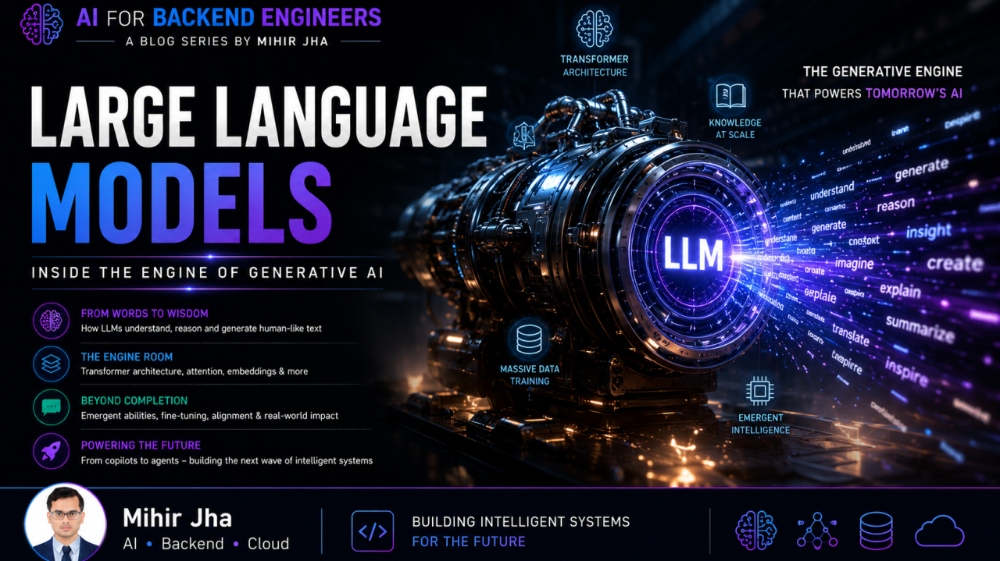
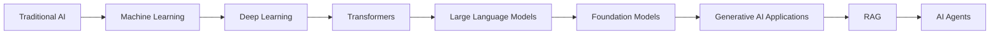
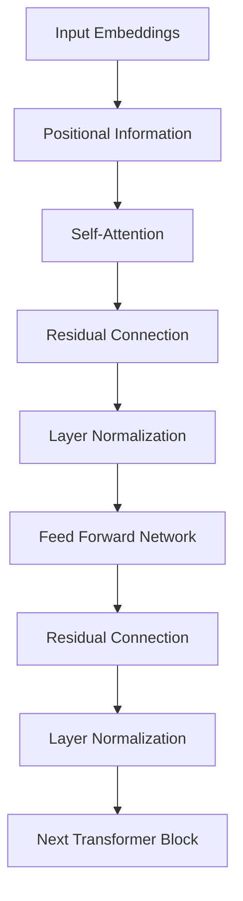
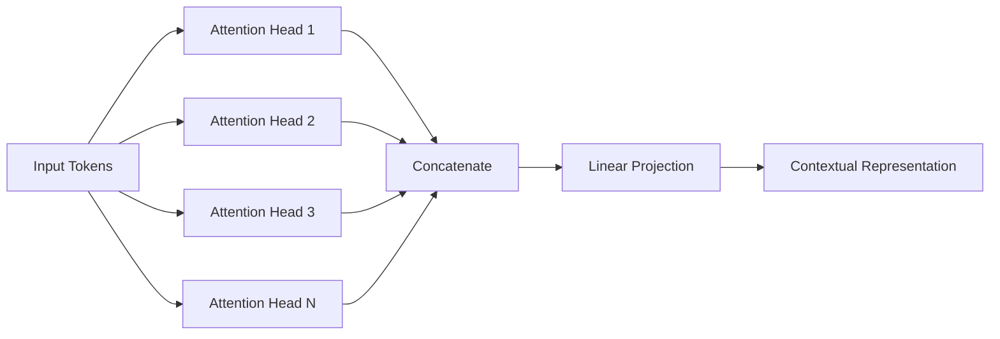
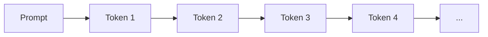
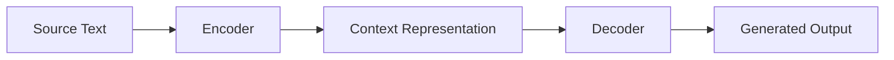
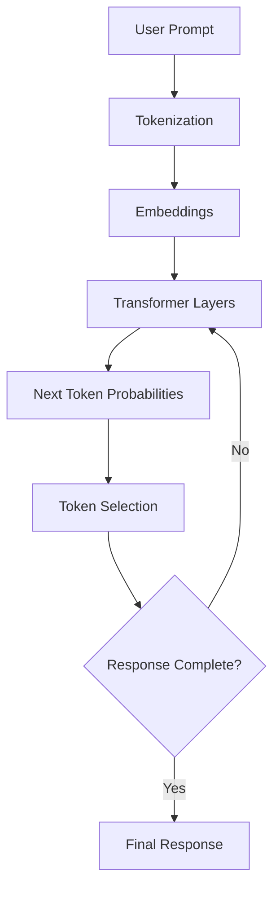
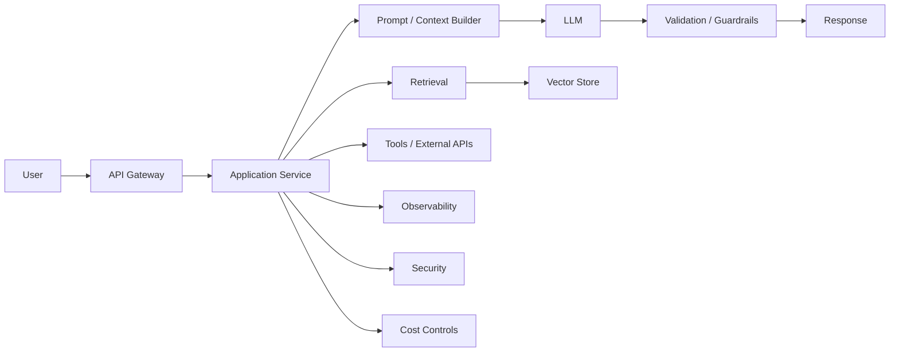

<div class="article-series">

  <span class="article-series__name">AI FOR BACKEND ENGINEERS</span>
  <span class="article-series__number">BLOG 06</span>

</div>


# 🚀 AI for Backend Engineers — Large Language Models: Inside the Engine of Generative AI



> Large Language Models transformed AI from specialized task-specific models into general-purpose systems capable of understanding and generating human language.

**Reading Time:** 20–25 minutes  
**Difficulty:** Intermediate

---

## 🎯 Learning Objectives

After reading this article, you will be able to:

- Understand why Large Language Models changed modern AI
- Explain how LLMs evolved from earlier language-modeling approaches
- Understand the relationship between Transformers, LLMs, and Foundation Models
- Understand tokens, vocabulary, parameters, and context windows
- Explain the role of embeddings and positional information
- Understand Query, Key, and Value representations
- Understand Self-Attention and Multi-Head Attention
- Understand the major components inside a Transformer block
- Differentiate Encoder-only, Decoder-only, and Encoder-Decoder architectures
- Understand how LLMs generate text one token at a time
- Understand important LLM ecosystem differences
- Connect LLM internals with production AI architecture

---

# 🔗 Connecting the Learning Journey

Over the previous articles in the **AI for Backend Engineers** journey, we built a foundation in Artificial Intelligence:

1. Building Intelligent Systems with Machine Learning
2. Preparing Data for Production AI
3. Choosing the Right Machine Learning Algorithms
4. Why AI Projects Fail in Production
5. Deep Learning — The Foundation of Modern AI

In the previous article, we explored how Deep Learning evolved through:

- Artificial Neural Networks
- Convolutional Neural Networks (CNNs)
- Recurrent Neural Networks (RNNs)
- Transfer Learning
- Transformers

We discovered that the Transformer architecture fundamentally changed how machines process language and opened the door to a new generation of AI systems.

Along the way, we also explored topics such as:

- Large Language Models
- How LLMs generate text
- Prompt Engineering
- Hallucinations
- Embeddings

But one important question remains:

> **How do Large Language Models actually work?**

Understanding LLMs is not just about knowing how to use ChatGPT, Claude, or another model.

For engineers, it is important to understand the architecture that allows these systems to process context, learn language patterns, generate tokens, and scale across enormous workloads.

This article goes inside the engine.

---

# 🌍 Why Large Language Models Changed AI

Artificial Intelligence has existed for decades.

Machine Learning enabled computers to recognize patterns from data.

Deep Learning enabled systems to learn complex representations using multi-layer neural networks.

Yet many AI systems remained largely **task-specific**.

A model trained for image classification could not automatically become a document summarization system.

A sentiment-analysis model could not automatically generate software code.

A translation model was designed for a particular transformation task.

Typically, each problem required:

- A dedicated model
- A dedicated dataset
- A dedicated training pipeline
- A dedicated deployment process

This fragmented approach limited the scalability and accessibility of AI.

Large Language Models changed that paradigm.

A sufficiently capable Transformer-based model trained on massive amounts of text could perform many different tasks by changing the **input context or prompt** rather than retraining a completely separate model for every task.

This enabled applications such as:

- Question answering
- Code generation
- Document summarization
- Translation
- Content generation
- Research assistance
- Technical explanation
- Business decision support

This shift can be viewed as:

```text
Task-Specific AI
        │
        ▼
Multiple Specialized Models
        │
        ▼
Foundation Models
        │
        ▼
General-Purpose AI Capabilities
        │
        ▼
LLM-Powered Applications
```

For backend engineers, this represents a significant architectural shift.

Traditional systems generally rely on:

- Deterministic logic
- Explicit rules
- Predefined workflows
- Strongly typed inputs and outputs

LLM-powered systems introduce:

- Probabilistic behavior
- Context-sensitive outputs
- Natural-language interfaces
- Dynamic reasoning patterns
- Model-dependent behavior

That does not eliminate conventional software engineering.

Instead, it adds another engineering layer.

---

# 🧠 From Specialized AI to Foundation Models

A useful evolution is:



Foundation Models are trained on broad datasets and can later be adapted to many downstream tasks.

Instead of creating a completely new model for every application, teams can often start from a pretrained model and customize the surrounding system or adaptation strategy.

This dramatically changes the economics and architecture of AI development.

---

# 📈 The Rise of Large Language Models

Early language models relied heavily on statistical approaches such as **N-grams**.

These models estimated the probability of the next word using a limited amount of previous context.

They worked for relatively simple language prediction tasks but struggled with:

- Long-range context
- Ambiguity
- Complex linguistic relationships

## RNNs

Recurrent Neural Networks introduced a hidden state that allowed information to flow across a sequence.

This was an important step forward.

## LSTMs

Long Short-Term Memory networks improved the handling of longer dependencies.

However, sequential processing remained a fundamental constraint.

## Transformers

The major breakthrough arrived with the 2017 paper:

> **Attention Is All You Need**

Transformers introduced the **Self-Attention** mechanism.

Instead of processing words one at a time, the architecture allowed tokens to consider relationships with other tokens across the sequence.

This dramatically changed the scalability of language modeling.

---

# 📊 The Scaling Story

As Transformer models became larger, three factors became particularly important.

## 📚 Massive Training Data

Modern LLMs can be trained on extremely large collections of text and code.

Examples include:

- Books
- Research papers
- Websites
- Code repositories
- Encyclopedic content
- Other large-scale text corpora

The diversity of training data enables models to learn broad patterns in:

- Language
- Facts
- Syntax
- Semantics
- Code
- Reasoning patterns

## ⚙️ Massive Computational Power

Training large models requires significant compute.

Modern training environments can involve:

- GPUs
- TPUs
- Distributed compute clusters
- High-speed networking
- Large-scale storage

## 🧠 Massive Model Capacity

Parameters represent learned numerical weights inside the network.

Increasing model capacity can allow a model to learn increasingly complex relationships, although it also increases:

- Memory requirements
- Training costs
- Inference costs
- Infrastructure complexity

Together:

**Data + Compute + Model Capacity**

created a new generation of highly capable Foundation Models.

---

# 💡 Foundation Models

A Foundation Model is broadly a pretrained model designed to support many downstream tasks rather than one narrow task.

Instead of:

```text
Task A → Train Model A
Task B → Train Model B
Task C → Train Model C
```

the new paradigm becomes:

```text
Large Pretrained Model
        │
        ├── Task A
        ├── Task B
        ├── Task C
        ├── Task D
        └── Task E
```

Adaptation can happen through techniques such as:

- Prompting
- Fine-tuning
- Parameter-efficient adaptation
- Retrieval
- Tool integration
- Application-level orchestration

This is one of the key architectural ideas behind modern Generative AI.

---

# 🧠 What Is a Large Language Model?

A Large Language Model is not:

- A search engine
- A conventional database
- A collection of predefined answers

Instead, an LLM can be viewed as a large neural network trained on enormous amounts of text so that it learns statistical and semantic patterns within language.

At a high level:

> **An LLM learns to predict the next token based on the context available to it.**

This relatively simple objective, when combined with large models, large datasets, and large-scale compute, can produce remarkably capable behavior.

We can think of an LLM as a combination of several fundamental concepts:

```text
Text
 │
 ▼
Tokenization
 │
 ▼
Vocabulary IDs
 │
 ▼
Embeddings
 │
 ▼
Positional Information
 │
 ▼
Transformer Layers
 │
 ├── Self-Attention
 ├── Feed Forward Network
 ├── Residual Connections
 └── Layer Normalization
 │
 ▼
Output Probabilities
 │
 ▼
Next Token
```

---

# 🔤 Tokens

Humans read words and sentences.

LLMs process **tokens**.

A token may represent:

- A complete word
- Part of a word
- Punctuation
- A number
- A special symbol

For example:

```text
"ChatGPT is amazing"
```

may be split into a sequence of tokens.

The exact tokenization depends on the tokenizer and vocabulary used by the model.

The important distinction is:

> **LLMs process token sequences, not raw human sentences.**

---

# 📖 Vocabulary

Every language model uses a vocabulary containing the tokens it can represent.

A tokenizer converts text into vocabulary IDs.

Conceptually:

```text
"ChatGPT"
     │
     ▼
Tokenizer
     │
     ▼
Token IDs
     │
     ▼
Neural Network
```

This vocabulary is the bridge between human-readable text and the numerical representations processed by the model.

---

# 🔢 Parameters

Parameters are learned numerical values stored throughout a neural network.

During training, these parameters are adjusted so that the model becomes better at predicting tokens.

Conceptually:

```text
Training Data
     │
     ▼
Prediction
     │
     ▼
Loss
     │
     ▼
Parameter Updates
     │
     ▼
Improved Model
```

The number of parameters is one measure of model scale, but it should not be treated as the sole measure of model quality.

Production model selection must also consider:

- Capability
- Latency
- Cost
- Context size
- Safety
- Deployment options
- Accuracy for the target workload

---

# 🪟 Context Window

The **context window** defines how much tokenized information a model can process within a single request.

Conceptually:

```text
Prompt
  +
Retrieved Context
  +
Conversation History
  +
Instructions
        │
        ▼
   Context Window
        │
        ▼
      Model
```

A larger context window can enable:

- Longer conversations
- Larger documents
- More code
- More retrieved information

However, larger context does not automatically guarantee better results.

Engineers still need to consider:

- Context relevance
- Context quality
- Latency
- Cost
- Information density

This becomes particularly important in **RAG architecture**.

---

# 🧠 Attention

The central innovation behind modern Transformers is the **Attention mechanism**.

Instead of considering only the immediately previous token, attention allows each token to determine which other tokens are relevant to its representation.

Conceptually:

```text
"The server failed because it lost the database connection."

                    │
                    ▼
              Attention
                    │
       ┌────────────┼────────────┐
       ▼            ▼            ▼
    server       failed       connection
```

The model learns relationships between elements of the sequence.

This ability to dynamically focus on relevant information is a major reason Transformers scale so effectively.

---

# ⚙️ Inside a Transformer

If LLMs are the engine behind modern Generative AI, the **Transformer** is the architecture inside that engine.

Many major modern model families are built on Transformer principles.

A simplified Transformer block looks like:



Multiple Transformer blocks are stacked to build a deep model.

As representations pass through these layers, the model constructs increasingly sophisticated contextual representations.

---

# 🧩 Token Embeddings

Computers do not process words directly.

Tokens are mapped to numerical vectors known as **embeddings**.

Conceptually:

```text
Token
  │
  ▼
Embedding Lookup
  │
  ▼
Dense Vector
```

Embeddings allow the model to represent relationships between tokens in a continuous numerical space.

This concept is also foundational to:

- Semantic search
- Vector databases
- RAG
- Recommendation systems

---

# 📍 Positional Information

Transformers process tokens in parallel.

Therefore, the model needs additional information about token order.

Consider:

> "Cats chase dogs."

and:

> "Dogs chase cats."

The same words appear, but the meaning is different.

Positional information allows the model to preserve sequence order.

Conceptually:

```text
Token Embedding
       +
Positional Information
       │
       ▼
Context-Aware Input Representation
```

---

# 🔑 Query, Key, and Value

Within Self-Attention, every token is transformed into three representations:

### Query (Q)

> What information is this token looking for?

### Key (K)

> What information does this token offer?

### Value (V)

> What information should be passed forward if this token is considered relevant?

A useful engineering analogy is a library:

```text
Query  → Question you are asking
Key    → Labels / metadata used for matching
Value  → Actual information retrieved
```

The model compares Queries with Keys to calculate relevance and uses Values to construct the contextual representation.

---

# 🧠 Multi-Head Self-Attention

A Transformer does not rely on a single attention calculation.

Instead, it can perform multiple attention operations in parallel using **multiple attention heads**.

Different heads can learn different relationships, such as:

- Grammar
- Subject-verb relationships
- Semantic similarity
- Long-range dependencies
- Entity relationships
- Contextual meaning

Conceptually:



Multiple attention heads provide multiple learned perspectives on the same sequence.

---

# ⚙️ Feed Forward Network

After attention gathers contextual information, each representation passes through a **Feed Forward Network (FFN)**.

The FFN applies additional nonlinear transformations.

Conceptually:

```text
Contextual Representation
          │
          ▼
      Linear Layer
          │
          ▼
      Activation
          │
          ▼
      Linear Layer
          │
          ▼
    Refined Representation
```

This allows the network to learn additional higher-order transformations.

---

# 🔄 Residual Connections

As models become deeper, preserving information and maintaining stable gradients becomes increasingly important.

Residual connections allow information to bypass a transformation and be combined with its output.

Conceptually:

```text
Input ─────────────────────┐
  │                        │
  ▼                        │
Transformation             │
  │                        │
  └───────────────► Add ◄──┘
                       │
                       ▼
                    Output
```

Residual connections are a major component of deep Transformer architectures.

---

# 📏 Layer Normalization

Layer Normalization helps stabilize activations within the network.

Combined with residual pathways, normalization supports the training of deep Transformer networks.

At a high level:

```text
Input
  │
  ▼
Attention / FFN
  │
  ▼
Residual
  │
  ▼
Normalization
  │
  ▼
Next Layer
```

---

# 💡 Transformer Block Summary

A simplified Transformer block can therefore be represented as:

```text
Input
 │
 ▼
Token Embeddings + Position
 │
 ▼
Self-Attention
 │
 ▼
Residual + Normalization
 │
 ▼
Feed Forward Network
 │
 ▼
Residual + Normalization
 │
 ▼
Next Transformer Block
```

Stacking many such blocks produces a deep Transformer model.

---

# 🔄 Encoder vs Decoder vs Encoder-Decoder

Not all Transformer architectures are used in the same way.

Three major patterns are:

- Encoder-only
- Decoder-only
- Encoder-Decoder

---

## Encoder-Only Transformers

Encoder models focus on **understanding** input.

Because they can process contextual relationships across the entire input, they are particularly useful for understanding-oriented tasks.

Typical applications include:

- Text classification
- Sentiment analysis
- Named Entity Recognition
- Semantic search
- Information retrieval

### Example

**BERT** is a well-known Encoder-based architecture.

Think of an Encoder as:

> **An expert reader.**

It focuses primarily on understanding input rather than generating long-form output.

---

# Decoder-Only Transformers

Decoder models are optimized for **autoregressive generation**.

They generate one token at a time.



Each newly generated token becomes part of the context used for predicting the next token.

This architecture is well suited to:

- Chatbots
- Code generation
- Story generation
- Question answering
- Conversational AI

Examples include model families such as:

- GPT
- Claude
- Llama
- DeepSeek
- Mistral
- Gemma
- Qwen

The exact architectures, training methods, and capabilities differ between model families.

---

# 🔄 Encoder-Decoder Transformers

Some tasks require both understanding input and generating an output sequence.

Machine translation is a classic example.

The Encoder processes the input.

The Decoder generates the output.



Examples include:

- T5
- BART
- FLAN-T5

Typical applications include:

- Translation
- Summarization
- Question answering
- Sequence-to-sequence transformation

---

# ❓ Why GPT Uses a Decoder-Only Architecture

A common misconception is that conversational LLMs need the full original Encoder-Decoder architecture.

Decoder-only models are highly effective for autoregressive generation because their primary task is predicting the next token.

The user's prompt becomes part of the Decoder's context, and the model generates the response incrementally.

This design also scales well for large generative workloads.

---

# ✨ How Large Language Models Generate Text

An LLM does not normally retrieve an entire answer from a database of prewritten sentences.

Instead, it generates output incrementally by predicting one token at a time.

The overall flow is:



---

# 🧾 Stage 1 — Input Processing

The prompt is:

1. Tokenized
2. Converted into token IDs
3. Mapped into embeddings
4. Combined with positional/context information

This produces the numerical representation consumed by the Transformer.

---

# ⚙️ Stage 2 — Transformer Computation

The token representations pass through multiple Transformer layers.

Within each layer, the model performs operations such as:

- Self-Attention
- Feed Forward transformation
- Residual connections
- Normalization

Each layer builds richer contextual representations.

---

# 🎯 Stage 3 — Next Token Prediction

The final model representation is transformed into a probability distribution over the vocabulary.

Conceptually:

```text
Context
  │
  ▼
Probability Distribution
  │
  ├── token A → 0.42
  ├── token B → 0.31
  ├── token C → 0.18
  └── token D → 0.09
```

A token is selected according to the configured decoding strategy.

That token is appended to the existing context.

The process repeats.

---

# 🔁 Autoregressive Generation

This means generation behaves approximately like:

```text
Prompt
  │
  ▼
Predict Token 1
  │
  ▼
Predict Token 2
  │
  ▼
Predict Token 3
  │
  ▼
Predict Token 4
  │
  ▼
...
  │
  ▼
Final Response
```

This explains how a model can generate:

- Paragraphs
- Software code
- Documentation
- Explanations
- Conversations

while producing only one token at a time.

---

# 🌍 The Modern LLM Ecosystem

The modern LLM ecosystem contains many model families with different priorities.

Some emphasize:

- Reasoning
- Coding
- Multilingual support
- Long-context processing
- Multimodal capabilities
- Enterprise deployment
- Open-weight availability
- Efficiency

Examples include:

## GPT

Associated with OpenAI and widely used for general-purpose AI applications.

## Claude

Associated with Anthropic and commonly used for long-context and enterprise-oriented workflows.

## Gemini

Associated with Google and designed around multimodal capabilities and Google ecosystem integration.

## Llama

Associated with Meta and widely used across open-model research and customization ecosystems.

## DeepSeek

A model family known for strong attention in reasoning and coding use cases.

## Mistral

A model family emphasizing efficient and capable models.

## Gemma

A Google model family designed for accessible model deployment and experimentation.

## Qwen

An Alibaba model family with strong multilingual and enterprise-oriented applications.

---

# 📊 Comparing LLMs

Although many modern LLMs share the Transformer foundation, they differ across important dimensions.

| Dimension | Why It Matters |
|---|---|
| Model Capability | Determines suitability for the task |
| Context Window | Determines how much information can be processed |
| Latency | Impacts user experience and SLA |
| Cost | Impacts unit economics |
| Multimodal Support | Determines supported input/output types |
| Coding Performance | Important for developer applications |
| Fine-Tuning | Determines customization options |
| Deployment | API, managed service, self-hosted, or hybrid |
| Privacy | Important for enterprise data |
| Governance | Important for regulated environments |
| Open vs Closed | Impacts portability and control |

Therefore:

> **The largest model is not automatically the best model.**

Model selection should follow the requirements of the application.

---

# 🏗️ From LLM to Production AI Application

An LLM is rarely the entire application.

A production system usually contains additional layers:



This is where backend and AI engineering meet.

The LLM itself becomes one component within a larger distributed system.

---

# 🏢 Enterprise LLM Architecture Considerations

When introducing LLMs into enterprise systems, engineers must consider more than model quality.

Important concerns include:

- Latency
- Cost
- Security
- Data privacy
- Prompt injection
- Model reliability
- Observability
- Evaluation
- Availability
- Fallback models
- Rate limits
- Context management
- Caching
- Governance

For example:

```text
                Enterprise AI Application
                         │
          ┌──────────────┼──────────────┐
          ▼              ▼              ▼
       Security      Observability     Cost
          │              │              │
          └──────────────┼──────────────┘
                         ▼
                        LLM
                         │
                 ┌───────┴───────┐
                 ▼               ▼
              Tools           Retrieval
```

This is the beginning of **Enterprise AI System Design**.

---

# 💡 Why LLM Internals Matter for Backend Engineers

It is tempting to treat an LLM as:

```text
Input → API → Output
```

But that abstraction is often too shallow for production engineering.

Understanding the fundamentals helps explain:

- Why context matters
- Why token counts affect cost
- Why context windows matter
- Why latency changes with output length
- Why embeddings enable semantic retrieval
- Why autoregressive generation can be expensive
- Why different model families behave differently
- Why RAG can extend model knowledge
- Why model selection is an architectural decision

The better you understand the engine, the better you can design the system around it.

---

# 🧩 LLMs as a New Software Interface

Traditional applications often expose:

```text
API
 │
 ├── Structured Input
 ├── Deterministic Logic
 └── Structured Output
```

LLM applications introduce:

```text
Natural Language
      │
      ▼
Prompt / Context
      │
      ▼
Probabilistic Model
      │
      ▼
Generated Output
```

This does not eliminate traditional APIs.

Instead, many production systems combine both:

```text
User Intent
    │
    ▼
LLM
    │
    ├── Structured Output
    ├── Tool Calls
    ├── Retrieval
    └── Workflow Decisions
             │
             ▼
       Traditional Services
```

This hybrid architecture is one of the defining characteristics of modern AI applications.

---

# ⚠️ Common Mistakes When Building with LLMs

Understanding the underlying model does not automatically guarantee a good production system.

Common mistakes include:

- Treating the LLM as a database
- Ignoring token costs
- Ignoring context-window constraints
- Assuming larger models are always better
- Skipping evaluation
- Ignoring prompt security
- Treating generated output as deterministic
- Ignoring latency
- Building without observability
- Exposing sensitive data to models without appropriate controls

The model is powerful, but the surrounding system determines whether that capability becomes production value.

---

# 🧠 Production LLM Checklist

Before integrating an LLM into a production application, ask:

| Area | Question |
|---|---|
| Model | Is this model appropriate for the workload? |
| Context | What information must be available to the model? |
| Retrieval | Does the application require external knowledge? |
| Cost | What is the expected token volume and unit cost? |
| Latency | Does the model satisfy response-time requirements? |
| Security | How are prompts and sensitive data protected? |
| Evaluation | How will output quality be measured? |
| Observability | Can engineers trace requests and failures? |
| Reliability | What happens when the model is unavailable? |
| Fallback | Is there another model or degraded mode? |
| Governance | Are regulatory and organizational requirements satisfied? |

---

# 🎯 Final Takeaway

Large Language Models are not magical black boxes.

They are the result of decades of innovation across:

- Natural Language Processing
- Deep Learning
- Transformer architecture
- Distributed computing
- Specialized AI hardware
- Large-scale datasets

By combining:

**Transformer Architecture + Massive Data + Massive Compute + Large Model Capacity**

LLMs transformed AI from specialized task-specific models into general-purpose systems capable of understanding and generating human language.

For backend engineers, understanding LLM internals is more than an academic exercise.

It provides the architectural foundation required to:

- Select models intelligently
- Design production AI systems
- Understand latency and cost
- Integrate retrieval
- Build tool-enabled applications
- Design observability
- Apply appropriate security controls
- Reason about AI system behavior

> **The better you understand the engine, the more effectively you can build with it.**

---

# 📚 Related Enterprise AI Engineering Handbook Topics

For structured technical reference material, continue with the **Enterprise AI Engineering Handbook**:

- [Foundation Models & Large Language Models](https://enterpriseai.handbook.mihirkjha.com/03-generative-ai/)
- [Tokenization](https://enterpriseai.handbook.mihirkjha.com/03-generative-ai/)
- [Embeddings](https://enterpriseai.handbook.mihirkjha.com/03-generative-ai/)
- [Transformers](https://enterpriseai.handbook.mihirkjha.com/03-generative-ai/)
- [Generative AI](https://enterpriseai.handbook.mihirkjha.com/03-generative-ai/)
- [Prompt Engineering](https://enterpriseai.handbook.mihirkjha.com/04-prompt-engineering/)
- [RAG](https://enterpriseai.handbook.mihirkjha.com/05-retrieval-augmented-generation/)
- [AI Agents](https://enterpriseai.handbook.mihirkjha.com/06-ai-agents/)
- [AI System Design](https://enterpriseai.handbook.mihirkjha.com/08-ai-system-design/)

> Update these links to the exact handbook chapter URLs used in the current navigation when the corresponding pages are finalized.

---

# 🔮 What's Next

The **AI for Backend Engineers** journey now moves from Deep Learning fundamentals into the broader world of Generative AI.

So far:

```text
✅ Machine Learning Fundamentals
        ↓
✅ Data Preparation
        ↓
✅ ML Algorithms
        ↓
✅ Production ML Challenges
        ↓
✅ Deep Learning
        ↓
✅ Large Language Models
        ↓
⏭️ Prompt Engineering
        ↓
RAG
        ↓
AI Agents
        ↓
Agentic AI
        ↓
AI System Design
```

The next step is to understand how engineers communicate instructions to these models effectively.

That takes us into **Prompt Engineering**.

---

# 📚 AI for Backend Engineers — Learning Journey

```text
✅ Blog 1 — Building Intelligent Systems
        ↓
✅ Blog 2 — Preparing Data for Production AI
        ↓
✅ Blog 3 — Choosing the Right Machine Learning Algorithms
        ↓
✅ Blog 4 — Why AI Projects Fail in Production
        ↓
✅ Blog 5 — Deep Learning: The Foundation of Modern AI
        ↓
✅ Blog 6 — Large Language Models: Inside the Engine of Generative AI
        ↓
⏭️ Next — Prompt Engineering
        ↓
RAG
        ↓
AI Agents
        ↓
Agentic AI
        ↓
AI System Design
        ↓
Production Enterprise AI
```

---

# 📚 Related Topics in the Enterprise AI Engineering Handbook

This article provides the engineering perspective from the [Enterprise AI Engineering Handbook](https://enterpriseai.handbook.mihirkjha.com/).

For structured technical reference material, explore:

- [Generative AI Fundamentals](https://enterpriseai.handbook.mihirkjha.com/03-generative-ai/foundation-models-llm-fundamentals/01-generative-ai-fundamentals/)
- [Language Understanding Fundamentals](https://enterpriseai.handbook.mihirkjha.com/03-generative-ai/foundation-models-llm-fundamentals/02-language-understanding-fundamentals/)
- [Word Embeddings](https://enterpriseai.handbook.mihirkjha.com/03-generative-ai/foundation-models-llm-fundamentals/03-word-embeddings/)
- [Language Modeling](https://enterpriseai.handbook.mihirkjha.com/03-generative-ai/foundation-models-llm-fundamentals/04-language-modeling/)
- [Attention & Positional Encoding](https://enterpriseai.handbook.mihirkjha.com/03-generative-ai/foundation-models-llm-fundamentals/05-attention-positional-encoding/)
- [GPT & BERT Architecture](https://enterpriseai.handbook.mihirkjha.com/03-generative-ai/foundation-models-llm-fundamentals/06-gpt-bert-architecture/)
- [Hugging Face & Transformers](https://enterpriseai.handbook.mihirkjha.com/03-generative-ai/foundation-models-llm-fundamentals/07-hugging-face-transformers/)
- [LLM Generation Strategies](https://enterpriseai.handbook.mihirkjha.com/03-generative-ai/llm-generation-evaluation/01-llm-generation-strategies/)
- [LLM Evaluation](https://enterpriseai.handbook.mihirkjha.com/03-generative-ai/llm-generation-evaluation/02-llm-evaluation/)

---

# 🔗 Connect

If you're exploring:

- AI Engineering
- Cloud AI Architecture
- MLOps
- Distributed ML Systems
- RAG & Agentic AI
- Scalable Backend Architecture
- AI System Design

Let's connect and learn together.

💼 [LinkedIn](https://www.linkedin.com/in/mihirkrjha/)
📚 [Enterprise AI Engineering Handbook](https://enterpriseai.handbook.mihirkjha.com/)
📰 [Enterprise AI Engineering Newsletter](https://www.linkedin.com/newsletters/enterprise-ai-engineering-7479222208079319041/)
💻 [GitHub](https://github.com/MihirKJha/)

---

# 👨‍💻 About the Author

**Mihir Jha**

*Software Architect | AI Engineering | Cloud Architecture | Backend Engineering*

I focus on bridging traditional software and cloud engineering with modern AI engineering to design scalable, secure, observable, and production-ready intelligent systems.

---

# 📌 Key Message

> **An LLM is more than an API — it is a Transformer-based system built from tokens, embeddings, attention, and autoregressive generation.**

Engineering Perspective:

> **Understand the engine behind the model so you can make better decisions about context, latency, memory, cost, and architecture.**

---

<div align="center" markdown="1">

### 🚀 Keep Learning. Keep Building. Keep Sharing.

**Building Production-Grade AI Systems Through Engineering, Architecture & Continuous Learning.**

**© 2026 Mihir Jha**

</div>