<div class="article-series">

  <span class="article-series__name">AI FOR BACKEND ENGINEERS</span>
  <span class="article-series__number">BLOG 08</span>

</div>


# 🚀 AI for Backend Engineers — Large Language Models: Adapting Foundation Models for Enterprise AI

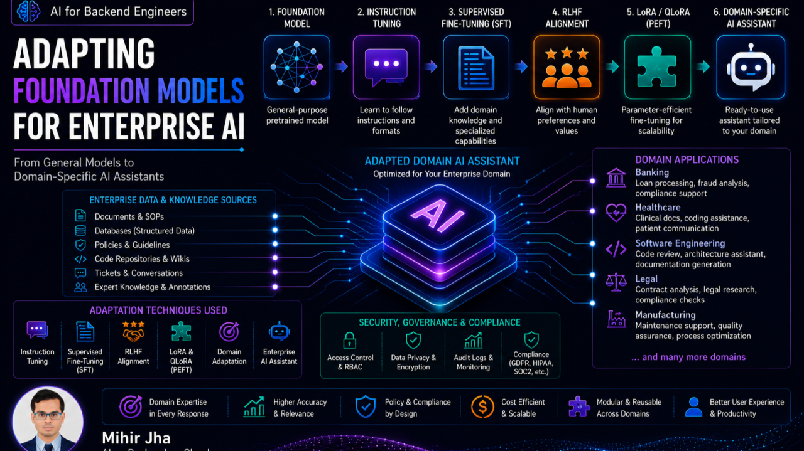


> Foundation Models provide broad capabilities. Enterprise AI engineering is about adapting those capabilities to the specific domain, workflows, terminology, and requirements of an organization.

**Reading Time:** 20–25 minutes  
**Difficulty:** Intermediate–Advanced

---

# 🔗 Connecting the Learning Journey

In the previous article, **[Large Language Models — From Foundation Models to AI Applications](#)**, we explored how developers work effectively with Large Language Models.

We learned that:

- Prompt Engineering improves communication with the model.
- Sampling strategies influence generation behavior.
- Hallucinations are an important production challenge.
- LLM applications require much more than a model API.
- Security, validation, observability, latency, and cost all matter.

For many applications, those techniques are sufficient.

However, enterprise AI introduces another challenge.

Organizations often need AI systems that understand:

- Their products
- Business processes
- Industry terminology
- Compliance requirements
- Organizational workflows
- Domain-specific tasks

Simply writing better prompts cannot teach an LLM information it never learned during training.

This raises an important question:

> **How do organizations transform a general-purpose Foundation Model into an AI system specialized for their business?**

That is the focus of this article.

---

# 🏢 Foundation Models Are Generalists

Modern Foundation Models such as GPT, Llama, Gemma, Claude, Mistral, Qwen, and DeepSeek provide broad capabilities.

They can:

- Generate text
- Explain concepts
- Write code
- Summarize documents
- Answer questions
- Transform content
- Assist with reasoning

But they remain general-purpose systems.

For example:

```text
General Foundation Model
        │
        ├── Banking
        ├── Healthcare
        ├── Retail
        ├── Legal
        └── Software Engineering
```

The model may understand the general concepts behind each domain.

It does not automatically know:

- Your internal policies
- Your organization's terminology
- Your private workflows
- Your latest product definitions
- Your proprietary coding standards
- Your internal compliance procedures

Enterprise AI therefore requires an adaptation strategy.

---

# 🏗️ From Foundation Model to Specialized AI

A simplified adaptation lifecycle is:


These techniques do not necessarily have to be applied sequentially in every project.

Instead, organizations should choose the lightest approach that solves the actual business problem.

A key principle is:

> **Model adaptation is a decision framework, not a default implementation.**

---

# 📚 Pretraining — Building the Foundation

Every modern Large Language Model begins with **pretraining**.

Before a model can answer questions, generate code, summarize documents, or assist users, it must first learn broad patterns of language and representation.

Pretraining typically uses very large collections of data such as:

- Books
- Research papers
- Technical documentation
- Programming code
- Websites
- Encyclopedic content
- News articles
- Multilingual data

The exact datasets and data-mixing strategies differ by model family.

---

# 🧠 The Core Pretraining Objective

At a simplified level, language-model pretraining can be expressed as:

> **Predict the next token.**

Consider:

```text
"Artificial Intelligence is transforming ______."
```

The model predicts probabilities for candidate next tokens.

Conceptually:

```text
Candidate Token     Probability
-------------------------------
world               0.32
software            0.21
industries          0.18
technology          0.15
healthcare          0.07
...
```

The predicted distribution is compared with the actual training token.

The resulting loss is used to update model parameters.

This happens repeatedly over extremely large training corpora.

---

# 🔄 Simplified Pretraining Loop

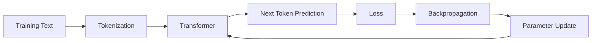

Over time, the model learns patterns involving:

- Syntax
- Semantics
- Programming languages
- Facts represented in training data
- Writing patterns
- Relationships between concepts
- Statistical regularities in language

These capabilities emerge from large-scale optimization rather than from manually coding each concept.

---

# ☁️ Why Enterprises Usually Do Not Pretrain Foundation Models

Pretraining is extremely expensive.

Large-scale foundation-model training can require:

- Large GPU/TPU clusters
- Distributed training
- High-bandwidth networking
- Large-scale storage
- Sophisticated training infrastructure
- Long training periods

This means most organizations do **not** train a new Foundation Model from scratch.

Instead:

```text
Existing Foundation Model
          ↓
Enterprise Adaptation
          ↓
Specialized Application
```

This is one of the most important economic realities of enterprise AI.

---

# 💡 Key Takeaway — Pretraining

Pretraining gives a Foundation Model its broad language and representation capabilities.

It is responsible for the general intelligence baseline from which later adaptation can build.

For most enterprises:

> **The right question is not "How do we train a foundation model?" but "Which existing foundation model should we adapt?"**

---

# 🎯 Instruction Tuning — Teaching Models to Follow Instructions

A pretrained model can be extremely capable while still behaving differently from a modern conversational assistant.

Consider:

> Explain REST APIs to a beginner.

A pretrained model's objective is fundamentally tied to language modeling.

It has not necessarily been optimized specifically to behave as a helpful assistant.

This is where **Instruction Tuning** becomes important.

---

# 🧩 What Is Instruction Tuning?

Instruction Tuning trains a model using examples that pair:

```text
Instruction
     +
Expected Response
```

For example:

```text
Instruction:
Explain the difference between SQL and NoSQL databases.

Expected Response:
Provide a concise comparison covering:
- Data model
- Scalability
- Consistency
- Common use cases
- Trade-offs
```

With enough curated examples, the model learns patterns such as:

- Answer the user's request directly.
- Follow requested formats.
- Adapt communication to the audience.
- Produce more complete responses.
- Maintain conversational behavior.

---

# 🔄 Instruction Tuning Workflow

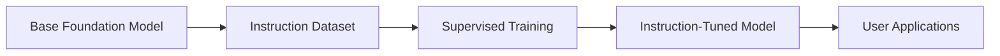

A useful analogy is onboarding a software engineer.

A developer may already know:

- Java
- Spring Boot
- Kubernetes
- Microservices

but still needs to learn:

- Team conventions
- Review expectations
- Documentation standards
- Operational procedures

The core knowledge already exists.

The adaptation teaches the engineer **how to operate within a specific environment**.

Instruction Tuning plays a similar role for language models.

---

# ✅ What Instruction Tuning Improves

Compared with a purely pretrained model, instruction-tuned models generally aim to provide:

- More helpful responses
- Better adherence to instructions
- Better formatting
- Better conversational behavior
- More predictable task execution

This is a major step toward modern AI assistants.

---

# 🧭 Instruction Tuning vs Pretraining

| Aspect | Pretraining | Instruction Tuning |
|---|---|---|
| Primary Goal | Learn general language patterns | Follow human instructions |
| Training Data | Massive raw/curated corpus | Instruction-response examples |
| Scope | Broad | Behavior-oriented |
| Output | General language capability | More assistant-like behavior |
| Enterprise Specificity | Low | Still generally broad |

A useful way to remember it:

> **Pretraining teaches broad capability. Instruction Tuning teaches behavior.**

---

# 🧠 Why Enterprises Often Start With an Instruction-Tuned Model

Starting with an instruction-tuned Foundation Model gives engineering teams a useful baseline.

Instead of beginning with:

```text
Raw pretrained model
```

teams can begin with:

```text
Instruction-tuned model
        ↓
Prompt Engineering
        ↓
RAG / Fine-Tuning / PEFT
        ↓
Enterprise Application
```

This reduces the amount of adaptation required for many use cases.

---

# 🧠 Supervised Fine-Tuning (SFT)

Instruction Tuning teaches a model how to follow instructions.

But enterprise systems may also need **specialized domain behavior**.

For example:

> Explain the loan approval process at ABC Bank.

A general model may understand mortgage lending.

It does not automatically know:

- ABC Bank's policies
- Internal approval rules
- Organization-specific terminology
- Internal risk workflows
- Proprietary products

This is where **Supervised Fine-Tuning (SFT)** can become useful.

---

# 🧩 What Is Supervised Fine-Tuning?

SFT continues training an existing model using a carefully curated dataset of:

```text
Domain Input
     +
Expected Domain Output
```

The objective is to make the model better at a specialized task or domain behavior.

---

# 💻 Example SFT Training Record

For a software engineering assistant:

```json
{
  "instruction": "Review this Java Spring Boot REST API for security issues.",
  "input": "public String getUser(String id) { ... }",
  "output": {
    "issues": [
      "Missing input validation",
      "Authorization not enforced",
      "Potential sensitive data exposure"
    ],
    "recommendations": [
      "Validate the identifier",
      "Enforce authorization",
      "Return only required fields"
    ]
  }
}
```

Thousands or millions of high-quality examples can teach the model to behave more consistently for this task.

---

# 🔄 SFT Workflow

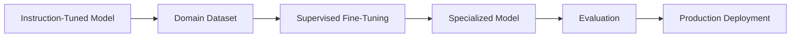

---

# 🏦 SFT Use Cases Across Industries

## Banking

- Financial product assistance
- Loan workflow support
- Fraud investigation assistance
- Compliance workflows

## Healthcare

- Clinical documentation
- Medical terminology
- Medical coding
- Patient communication

## Software Engineering

- Internal coding standards
- Secure code generation
- API documentation
- Architecture guidance

## Legal

- Contract analysis
- Legal document classification
- Compliance-oriented workflows
- Document summarization

## Retail

- Product support
- Customer service
- Inventory workflows
- Order assistance

---

# ✅ Benefits of SFT

SFT can provide:

- More consistent domain terminology
- Better specialized-task performance
- More predictable response structure
- Reduced prompt complexity for repeated tasks
- Better alignment with domain-specific examples

The model can begin to behave more like a domain specialist.

---

# ⚠️ Challenges of SFT

SFT is powerful, but it introduces additional engineering responsibilities.

## Training Data Quality

Poor examples can produce poor behavior.

A key principle remains:

> **Garbage in, garbage out.**

## Compute Cost

SFT is cheaper than pretraining but still requires specialized compute.

## Maintenance

Business processes change.

Models trained on obsolete processes may become outdated.

## Catastrophic Forgetting

Aggressive fine-tuning can reduce some general capabilities learned during pretraining.

Fine-tuning must therefore be carefully evaluated.

---

# 🧭 When Should You Use SFT?

SFT is generally more attractive when:

- A recurring task needs specialized behavior.
- The required behavior can be represented with examples.
- You have enough high-quality training data.
- Prompt engineering alone is insufficient.
- You need consistent output behavior.

It may be less attractive when the core problem is simply **missing or changing knowledge**.

That distinction becomes extremely important when deciding between:

**SFT vs RAG**

---

# 🤝 Reinforcement Learning from Human Feedback (RLHF)

After Instruction Tuning and SFT, a model can still face another challenge:

> **Not all correct responses are equally good.**

Consider:

> How can I improve Java microservice performance?

Multiple answers may all be technically valid.

But one may be:

- More concise
- More practical
- Better structured
- Easier to understand
- Safer

Humans naturally prefer some responses over others.

RLHF attempts to capture those preferences.

---

# 🧠 What RLHF Is Trying to Optimize

Traditional supervised learning often provides:

```text
Input → Correct Answer
```

RLHF adds a preference dimension:

```text
Input
  ↓
Response A
Response B
Response C
  ↓
Human Preference
  ↓
Reward Signal
```

The model learns not only what is possible, but what humans tend to prefer.

---

# 🔄 RLHF Workflow

A simplified RLHF pipeline is:

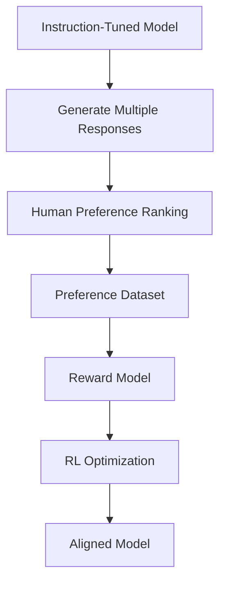

---

# 1. Generate Multiple Responses

For a given prompt, the model produces several candidate responses.

---

# 2. Human Preference Ranking

Human reviewers rank those responses.

For example:

```text
Prompt:
Explain Kubernetes.

Ranking:
1. Response B
2. Response A
3. Response C
```

This captures preference rather than just correctness.

---

# 3. Train a Reward Model

A separate reward model learns to estimate which responses humans are likely to prefer.

Conceptually:

```text
Response
   ↓
Reward Model
   ↓
Preference Score
```

---

# 4. Optimize the Language Model

Reinforcement learning techniques can then be used to improve the model against the learned preference signal.

The goal is to increase behaviors such as:

- Helpfulness
- Clarity
- Safety
- Instruction following

---

# ✅ What RLHF Can Improve

RLHF is commonly associated with improvements in:

- Helpfulness
- Conversational quality
- Safety
- Clarity
- Alignment with human preferences

This is one reason modern conversational models behave very differently from early raw language models.

---

# ⚠️ RLHF Limitations

RLHF also introduces challenges.

## Human Feedback Is Subjective

Different reviewers may prefer different answers.

## Expensive to Scale

Human review requires:

- Time
- Expertise
- Annotation infrastructure
- Quality control

## Does Not Automatically Add New Knowledge

A crucial distinction:

> **RLHF primarily changes behavior and preference alignment. It does not automatically give the model a new enterprise knowledge base.**

## Over-Optimization

An over-optimized reward model can encourage undesirable behaviors such as:

- Excessive agreeableness
- Over-cautiousness
- Preference for pleasing responses
- Loss of useful disagreement

---

# 🧭 Instruction Tuning vs SFT vs RLHF

| Technique | Primary Goal | Main Signal |
|---|---|---|
| Pretraining | Learn broad representations | Next-token prediction |
| Instruction Tuning | Follow instructions | Instruction-response examples |
| SFT | Learn specialized behavior | Domain examples |
| RLHF | Align with human preferences | Preference / reward signal |

A useful conceptual progression is:

```text
Pretraining
    ↓
Knowledge + Representation
    ↓
Instruction Tuning
    ↓
Instruction Following
    ↓
SFT
    ↓
Domain Behavior
    ↓
RLHF / Preference Optimization
    ↓
Human-Aligned Behavior
```

---

# ⚡ LoRA and QLoRA — Making Fine-Tuning Practical

Modern Foundation Models can contain billions of parameters.

Traditional fine-tuning updates a very large number of those parameters.

That can require significant:

- GPU memory
- Compute
- Training time
- Cost

This is where **Parameter-Efficient Fine-Tuning (PEFT)** becomes important.

Two widely used techniques are:

- LoRA
- QLoRA

---

# 🧩 The Problem With Full Fine-Tuning

Imagine a 2,000-page technical manual.

If only one chapter needs updating, rewriting every page is wasteful.

Traditional fine-tuning is conceptually similar:

```text
Entire Foundation Model
        ↓
Update Huge Number of Parameters
        ↓
Expensive Training
```

PEFT instead aims to modify only a small portion of trainable parameters.

---

# 🔧 What Is LoRA?

**LoRA — Low-Rank Adaptation** freezes the original Foundation Model weights and introduces small trainable adapter matrices.

The core idea is:

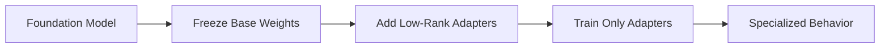

The base model remains largely unchanged while lightweight adapters learn domain-specific behavior.

---

# 🧠 LoRA Intuition

A simple conceptual representation is:

```text
Original Model
      │
      ├─────────────── Frozen
      │
      ▼
Small Adapter
      │
      ▼
Learned Domain Behavior
```

This can significantly reduce the number of trainable parameters.

---

# ✅ Benefits of LoRA

## Lower Training Cost

Fewer parameters require optimization.

## Lower GPU Memory Requirements

Training can become possible on hardware that would not support full fine-tuning.

## Faster Training

Smaller trainable parameter sets can shorten training cycles.

## Reusable Adapters

The same base model can support multiple specialized adapters.

For example:

```text
                   Base Model
                       │
          ┌────────────┼────────────┐
          ▼            ▼            ▼
      Banking       Legal       Coding
      Adapter       Adapter      Adapter
```

---

# 🏢 Enterprise Adapter Architecture

An enterprise organization might use:

```text
Single Foundation Model
        │
        ├── Customer Support Adapter
        ├── HR Policy Adapter
        ├── Software Engineering Adapter
        ├── Legal Adapter
        └── Sales Adapter
```

This can provide a modular specialization strategy.

---

# 🧮 What Is QLoRA?

QLoRA combines:

1. Quantization
2. LoRA

Instead of keeping the base model in relatively high-precision representations, the base model is loaded in a lower-precision form.

A commonly used configuration is 4-bit quantization.

The LoRA adapters remain trainable on top of the quantized base model.

Conceptually:

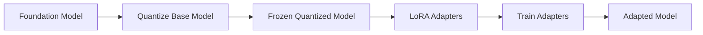

This can substantially reduce memory requirements.

---

# 📊 LoRA vs QLoRA

| Dimension | LoRA | QLoRA |
|---|---|---|
| Base Model | Frozen | Frozen + Quantized |
| Trainable Parameters | Small Adapter Set | Small Adapter Set |
| Memory Usage | Reduced | Further Reduced |
| Training Cost | Lower | Often Lower |
| Hardware Requirements | Lower than Full FT | Lower than LoRA in many setups |
| Complexity | Moderate | Higher |
| Common Use | PEFT | Memory-constrained fine-tuning |

The exact trade-off depends on the model, quantization method, dataset, and training stack.

---

# 🏭 LoRA / QLoRA in Enterprise AI

An organization might use one base model and specialize it through lightweight adapters:

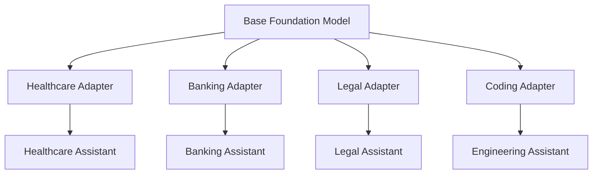

This architecture can be more efficient than maintaining independent full models for every domain.

---

# 🌍 Domain Adaptation

So far we've explored:

- Instruction Tuning
- Supervised Fine-Tuning
- RLHF
- LoRA
- QLoRA

These are techniques.

The broader objective is **Domain Adaptation**.

> **Domain Adaptation transforms a general-purpose Foundation Model into an AI system that is better suited to a specific industry, organization, task, or workflow.**

---

# 🎯 Why Domain Adaptation Matters

Consider a banking assistant.

A general-purpose model may understand:

- Loans
- Interest rates
- Credit scores
- Mortgages

But it does not automatically know:

- Your organization's approval policy
- Your private workflows
- Your internal risk rules
- Your product definitions
- Your latest compliance procedures

The same problem exists in:

- Healthcare
- Legal
- Retail
- Manufacturing
- Software engineering

Domain adaptation introduces business-specific specialization.

---

# 🏦 Domain Adaptation Across Industries

## Banking

Possible use cases include:

- Financial product assistance
- Loan workflow support
- Fraud investigation support
- Customer service

## Healthcare

Possible use cases include:

- Clinical documentation
- Medical terminology
- Patient communication
- Medical coding

## Software Engineering

Possible use cases include:

- Code review
- Architecture assistance
- Documentation generation
- Internal coding standards

## Legal

Possible use cases include:

- Contract analysis
- Compliance checking
- Document summarization
- Legal research assistance

## Manufacturing

Possible use cases include:

- Quality assurance
- Equipment maintenance
- Production workflows
- Process optimization

---

# 🏗️ Enterprise Domain Adaptation Architecture

A generalized architecture might look like:

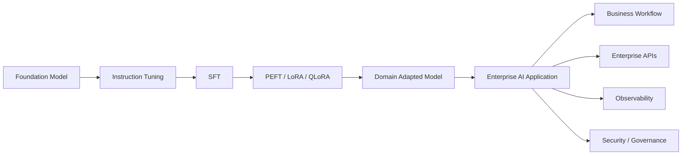

This is where model engineering meets enterprise software architecture.

---

# 🧠 Domain Adaptation Does Not Mean the Model Knows Everything

An important architectural distinction is:

> **Model adaptation changes model behavior and capabilities, but it is not a substitute for a live enterprise knowledge system.**

Suppose a company fine-tunes a model on its internal documentation.

Tomorrow:

- HR changes a policy.
- Engineering publishes a new API.
- Compliance changes a regulation.
- A product launch introduces new pricing.

The model does not automatically learn those updates.

Its learned parameters remain associated with the training process that created the adapted model.

This introduces the next challenge:

```text
Adapted Model
      │
      ▼
Knowledge Changes
      │
      ▼
Model Becomes Stale
```

Retraining every time enterprise knowledge changes can be expensive and slow.

---

# 🔄 Model Adaptation vs RAG

This is one of the most important architectural decisions in Enterprise AI.

| Requirement | Prompting | Fine-Tuning | RAG |
|---|---|---|---|
| Better instructions | ✅ | Sometimes | Sometimes |
| New behavior | Limited | ✅ | Limited |
| Specialized style | ✅ | ✅ | Limited |
| Stable domain behavior | Limited | ✅ | Limited |
| Frequently changing knowledge | ❌ | ❌ | ✅ |
| Private enterprise knowledge | Limited | Possible | ✅ |
| Exact source grounding | ❌ | ❌ | ✅ |
| Runtime updates | ❌ | ❌ | ✅ |
| Training required | ❌ | ✅ | ❌ |

A practical decision framework is:

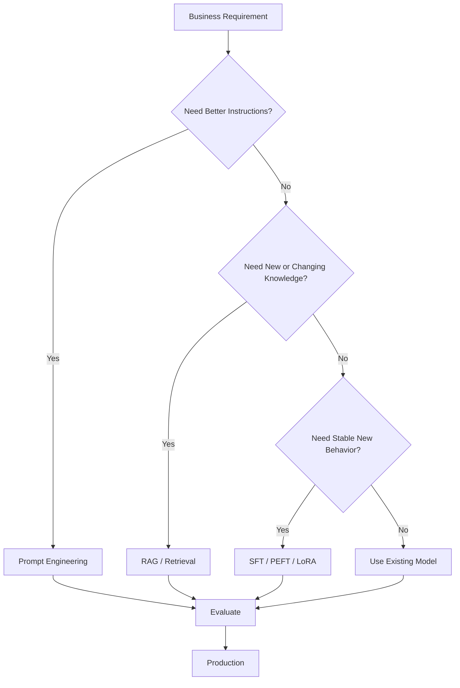

The best enterprise solution may combine several techniques.

---

# 🔗 The Future Enterprise AI Pattern

A mature enterprise AI application may combine:

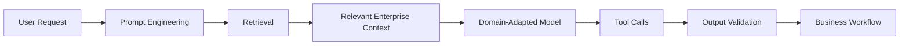

This creates a layered AI architecture:

```text
Prompting
   ↓
Retrieval
   ↓
Model Adaptation
   ↓
Tools
   ↓
Validation
   ↓
Business Logic
   ↓
Production System
```

This layered approach is much closer to how enterprise AI systems should be engineered.

---

# ⚠️ Common Mistakes in Model Adaptation

Organizations can make several mistakes when adapting Foundation Models.

## Fine-Tuning by Default

Not every problem needs fine-tuning.

## Using Poor Training Data

High-quality examples matter more than simply increasing dataset size.

## Training for Knowledge That Changes Frequently

Fast-changing knowledge is often better served through retrieval.

## Ignoring Evaluation

A fine-tuned model must be evaluated against real representative workloads.

## Ignoring Cost

Training and inference costs must be evaluated together.

## Ignoring Security

Sensitive training data requires appropriate data governance.

## Ignoring Model Versioning

Adapted models need lifecycle and rollback strategies.

---

# 🧪 Model Adaptation Evaluation

A production adaptation pipeline should evaluate more than generic benchmark scores.

It should measure:

- Task accuracy
- Domain correctness
- Instruction following
- Output format compliance
- Hallucination rate
- Safety
- Latency
- Cost
- Regression against previous model versions

A useful evaluation pipeline is:

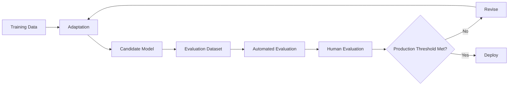

---

# ☁️ Production Infrastructure Considerations

Fine-tuning models introduces infrastructure requirements.

Typical components may include:

- GPU instances
- Distributed training
- Object storage
- Experiment tracking
- Model registry
- Evaluation pipelines
- Containerized training jobs
- Inference infrastructure

A simplified cloud architecture is:

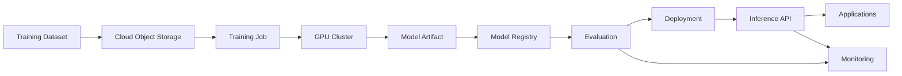

This is where model adaptation becomes an **MLOps / LLMOps** problem as well as an ML problem.

---

# 🔐 Enterprise Governance Considerations

Model adaptation may involve sensitive enterprise data.

Organizations should consider:

- Data classification
- PII handling
- Access control
- Data retention
- Auditability
- Training-data provenance
- Model lineage
- Model approval processes
- Regulatory requirements

The model is only one element of governance.

The complete system needs governance across:

```text
Data
 ↓
Training
 ↓
Model
 ↓
Deployment
 ↓
Inference
 ↓
Monitoring
```

---

# 💡 Cloud AI Architect Perspective

The most important architectural lesson is:

> **Do not assume that a more specialized model is automatically a better enterprise solution.**

A strong architecture chooses the lightest mechanism that satisfies the requirement.

For example:

```text
Need better formatting?
        ↓
Prompt Engineering

Need current enterprise knowledge?
        ↓
RAG

Need stable specialized behavior?
        ↓
Fine-Tuning / PEFT

Need complex enterprise actions?
        ↓
Tools / Agents / Workflows
```

This decision-making discipline prevents unnecessary model complexity.

---

# 🎯 Final Takeaway

Foundation Models provide broad general-purpose capabilities.

Enterprise AI requires those capabilities to be adapted to the specific requirements of a business.

The adaptation toolbox includes:

- Pretraining
- Instruction Tuning
- Supervised Fine-Tuning
- RLHF
- LoRA
- QLoRA
- Domain Adaptation

Each technique solves a different problem.

The important lesson is:

> **Enterprise AI adaptation is not about fine-tuning everything. It is about choosing the right adaptation strategy for the business requirement.**

Prompt Engineering can influence how a model responds.

Fine-Tuning can specialize stable behavior.

LoRA and QLoRA can make that adaptation economically practical.

But when enterprise knowledge changes frequently, retraining the model is often not the right answer.

That is where **Retrieval-Augmented Generation (RAG)** becomes critical.

---

# 🚀 The Architecture Evolution

The journey now becomes:

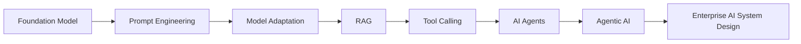

Each layer solves a different problem.

```text
Foundation Model
    ↓
Provides general capability

Prompt Engineering
    ↓
Improves instruction

Fine-Tuning / PEFT
    ↓
Adapts stable behavior

RAG
    ↓
Provides current external knowledge

Tools
    ↓
Enable actions

Agents
    ↓
Coordinate reasoning and tools

Enterprise AI Architecture
    ↓
Makes the whole system production-ready
```

---

# 📚 Related Enterprise AI Engineering Handbook Topics

Continue with the structured **Enterprise AI Engineering Handbook**:

- [Foundation Models & Large Language Models](https://enterpriseai.handbook.mihirkjha.com/03-generative-ai/)
- [Fine-Tuning](https://enterpriseai.handbook.mihirkjha.com/03-generative-ai/)
- [PEFT](https://enterpriseai.handbook.mihirkjha.com/03-generative-ai/)
- [LoRA](https://enterpriseai.handbook.mihirkjha.com/03-generative-ai/)
- [Quantization](https://enterpriseai.handbook.mihirkjha.com/03-generative-ai/)
- [Prompt Engineering](https://enterpriseai.handbook.mihirkjha.com/04-prompt-engineering/)
- [RAG](https://enterpriseai.handbook.mihirkjha.com/05-retrieval-augmented-generation/)
- [AI Agents](https://enterpriseai.handbook.mihirkjha.com/06-ai-agents/)
- [Agentic AI](https://enterpriseai.handbook.mihirkjha.com/07-agentic-ai/)
- [AI System Design](https://enterpriseai.handbook.mihirkjha.com/08-ai-system-design/)

> Update these links to the exact handbook chapter URLs used in your current navigation when the corresponding chapters are finalized.

---

# 🔮 What's Next

So far in the **AI for Backend Engineers** journey:

```text
✅ Blog 1 — Building Intelligent Systems
        ↓
✅ Blog 2 — Preparing Data for Production AI
        ↓
✅ Blog 3 — Choosing the Right Machine Learning Algorithms
        ↓
✅ Blog 4 — Why AI Projects Fail in Production
        ↓
✅ Blog 5 — Deep Learning: The Foundation of Modern AI
        ↓
✅ Blog 6 — Large Language Models: Inside the Engine of Generative AI
        ↓
✅ Blog 7 — Large Language Models: From Foundation Models to AI Applications
        ↓
✅ Blog 8 — Adapting Foundation Models for Enterprise AI
        ↓
⏭️ Next — Production-Ready RAG System Design
        ↓
AI Agents
        ↓
Agentic AI
        ↓
AI System Design
        ↓
Production Enterprise AI
```

---

# 📚 AI for Backend Engineers — Learning Journey

The overall progression now looks like:

```text
Machine Learning
      ↓
Deep Learning
      ↓
Foundation Models
      ↓
Large Language Models
      ↓
Prompt Engineering
      ↓
Model Adaptation
      ↓
RAG
      ↓
AI Agents
      ↓
Agentic AI
      ↓
AI System Design
      ↓
Production Enterprise AI
```

---
## 💼 LinkedIn Version

A compact version of this article is also available on LinkedIn.

**[Read the LinkedIn Article →](https://www.linkedin.com/pulse/ai-backend-engineers-large-language-models-adapting-foundation-jha-hdybf/?trackingId=pLK7auZ2TfqpK1vou0r2KA%3D%3D)**

---


# 📚 Related Topics in the Enterprise AI Engineering Handbook

This article provides the engineering perspective from the [Enterprise AI Engineering Handbook](https://enterpriseai.handbook.mihirkjha.com/).

For structured technical reference material, explore:

- [LLM Data Preparation](https://enterpriseai.handbook.mihirkjha.com/03-generative-ai/llm-training-fine-tuning/01-llm-data-preparation/)
- [Hugging Face Training Workflow](https://enterpriseai.handbook.mihirkjha.com/03-generative-ai/llm-training-fine-tuning/02-hugging-face-training-workflow/)
- [Transformer Fine-Tuning Fundamentals](https://enterpriseai.handbook.mihirkjha.com/03-generative-ai/llm-training-fine-tuning/03-transformer-fine-tuning-fundamentals/)
- [Supervised Fine-Tuning (SFT)](https://enterpriseai.handbook.mihirkjha.com/03-generative-ai/llm-training-fine-tuning/04-supervised-fine-tuning-sft/)
- [Parameter-Efficient Fine-Tuning](https://enterpriseai.handbook.mihirkjha.com/03-generative-ai/llm-training-fine-tuning/05-parameter-efficient-fine-tuning/)
- [LoRA & QLoRA](https://enterpriseai.handbook.mihirkjha.com/03-generative-ai/llm-training-fine-tuning/06-lora-qlora/)
- [Model Quantization](https://enterpriseai.handbook.mihirkjha.com/03-generative-ai/llm-training-fine-tuning/07-model-quantization/)
- [Instruction Tuning](https://enterpriseai.handbook.mihirkjha.com/03-generative-ai/llm-alignment-preference-optimization/01-instruction-tuning/)
- [Reinforcement Learning from Human Feedback](https://enterpriseai.handbook.mihirkjha.com/03-generative-ai/llm-alignment-preference-optimization/04-reinforcement-learning-from-human-feedback/)
- [Direct Preference Optimization (DPO)](https://enterpriseai.handbook.mihirkjha.com/03-generative-ai/llm-alignment-preference-optimization/06-direct-preference-optimization-dpo/)

---
# 🔗 Connect

If you're exploring:

- AI Engineering
- Foundation Models
- Large Language Models
- Fine-Tuning
- PEFT / LoRA / QLoRA
- RAG & Advanced Retrieval
- AI Agents & Agentic AI
- Cloud AI Architecture
- Scalable Backend Architecture
- AI System Design

Let's connect and learn together.

💼 [LinkedIn](https://www.linkedin.com/in/mihirkrjha/)
📚 [Enterprise AI Engineering Handbook](https://enterpriseai.handbook.mihirkjha.com/)
📰 [Enterprise AI Engineering Newsletter](https://www.linkedin.com/newsletters/enterprise-ai-engineering-7479222208079319041/)
💻 [GitHub](https://github.com/MihirKJha/)

---

# 👨‍💻 About the Author

**Mihir Jha**

*Software Architect | AI Engineering | Cloud Architecture | Backend Engineering*

I focus on bridging traditional software and cloud engineering with modern AI engineering to design scalable, secure, observable, and production-ready intelligent systems.

---

# 📌 Key Message

> **Not every enterprise AI problem requires fine-tuning — choose the lightest adaptation strategy that solves the requirement.**

Engineering Perspective:

> **Use prompting for instructions, fine-tuning for stable behavior, and retrieval when enterprise knowledge changes frequently.**

---

<div align="center" markdown="1">

### 🚀 Keep Learning. Keep Building. Keep Sharing.

**Building Production-Grade AI Systems Through Engineering, Architecture & Continuous Learning.**

**© 2026 Mihir Jha**

</div>