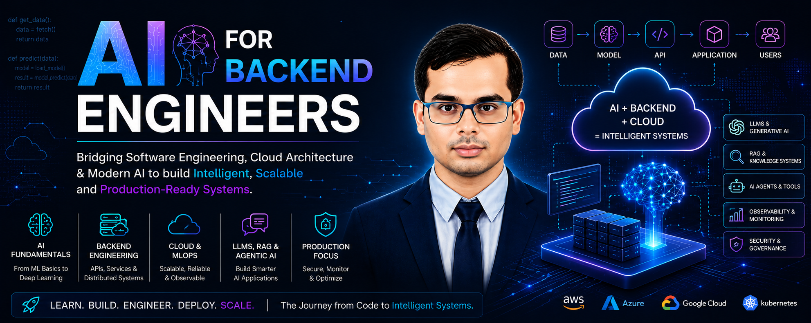
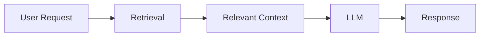
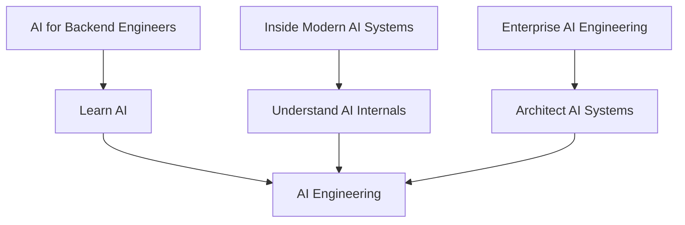
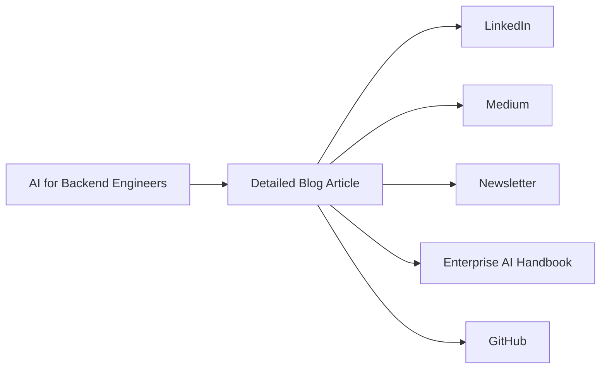

<p align="center">
  
</p>

<div align="center">

# 🚀 AI for Backend Engineers

### **Bridging Software Engineering, Cloud Architecture & Modern AI**

**Status: 🚧 Series in Progress**

A practical learning journey for backend engineers who want to understand
how modern AI systems are built, integrated, and operated in real-world
engineering environments.

</div>

---

# 🎯 The Goal

AI is rapidly becoming part of modern software systems.

Backend engineers increasingly work with:

- Machine Learning models
- Deep Learning
- Foundation Models
- Large Language Models
- RAG systems
- AI Agents
- Cloud AI services
- MLOps and AI infrastructure

But learning these technologies in isolation is not enough.

The goal of this series is to connect:

```text
Software Engineering
        +
Backend Engineering
        +
Cloud Architecture
        +
Artificial Intelligence
        +
Production Engineering
```

into one continuous engineering journey.

The central question is:

> **How can backend engineers move from building traditional software systems to building intelligent, production-ready systems?**

---

# 🧭 The Learning Journey

The series progressively moves from fundamental AI concepts toward modern AI systems.

```mermaid
flowchart LR
    A[Machine Learning]
    B[Deep Learning]
    C[Foundation Models]
    D[Large Language Models]
    E[Prompt Engineering]
    F[RAG]
    G[AI Agents]
    H[Agentic AI]
    I[Cloud & MLOps]
    J[AI System Design]

    A --> B
    B --> C
    C --> D
    D --> E
    E --> F
    F --> G
    G --> H
    H --> I
    I --> J
```



The journey is intentionally designed to build one layer on top of another.

---

# 🏗️ What This Series Focuses On

The series combines four perspectives.

### 🧠 AI Fundamentals

Understand the foundations behind:

- Machine Learning
- Deep Learning
- Foundation Models
- Large Language Models
- Generative AI

### 💻 Backend Engineering

Connect AI capabilities with:

- APIs
- Services
- Microservices
- Distributed systems
- Event-driven architectures
- Application workflows

### ☁️ Cloud Engineering

Explore how AI systems operate using:

- Cloud infrastructure
- Managed AI services
- Scalable compute
- Data platforms
- MLOps infrastructure

### 🏭 Production Engineering

Focus on:

- Reliability
- Observability
- Security
- Scalability
- Cost
- Evaluation
- Governance
- Continuous improvement

The objective is not simply to understand AI.

It is to understand **AI as an engineering discipline**.

---

# 📚 The Journey So Far

The first part of the series has now been published.

## ✅ 01 — Building Intelligent Systems

The journey begins with the fundamentals of Machine Learning and the role of AI in modern software systems.

Topics include:

- Machine Learning fundamentals
- Intelligent systems
- Data-driven systems
- AI problem framing
- Production perspective

The objective is to establish the foundation before moving into algorithms and implementation.

---

## ✅ 02 — Preparing Data for Production AI

AI systems are only as effective as the data supporting them.

This article explores the engineering challenges around preparing data for Machine Learning systems.

Key themes include:

- Data preparation
- Data quality
- Feature preparation
- Production data challenges
- Reliable ML pipelines

The focus shifts from:

```text
Raw Data
   ↓
Useful Data
   ↓
Reliable AI Input
```

---

## ✅ 03 — Choosing the Right Machine Learning Algorithms

Once the data is ready, the next challenge is choosing the right algorithm.

The article brings together practical perspectives around:

- Regression
- Classification
- Decision Trees
- Ensemble methods
- Clustering
- Dimensionality reduction
- Production trade-offs

The central lesson is:

> **The best algorithm is the one that solves the business problem within the system's constraints.**

---

## ✅ 04 — Why AI Projects Fail in Production

A high-performing model in a notebook does not automatically become a successful production system.

This article explores:

- Overfitting
- Underfitting
- Bias and variance
- Precision and recall
- Imbalanced datasets
- Model drift
- Monitoring
- AI observability

The focus moves from:

```text
Build the Model
      ↓
Deploy the Model
```

toward:

```text
Build
  ↓
Deploy
  ↓
Monitor
  ↓
Learn
  ↓
Improve
```

Production AI is a continuously evolving system.

---

## ✅ 05 — Deep Learning: The Foundation of Modern AI

The series then moves from traditional Machine Learning into Deep Learning.

This article connects:

- Neural Networks
- CNNs
- RNNs
- Transfer Learning
- Transformers
- Cloud-based Deep Learning
- Production considerations

The key transition is:

```text
Machine Learning
        ↓
Deep Learning
        ↓
Transformers
        ↓
Modern Generative AI
```

Understanding these foundations is essential before moving deeper into LLMs and Generative AI.

---

## ✅ 06 — Large Language Models: Inside the Engine of Generative AI

The next step is to understand what happens inside modern Large Language Models.

The article explores concepts such as:

- Tokens
- Embeddings
- Context windows
- Attention
- Query, Key, Value
- Multi-Head Attention
- Transformer blocks
- Encoder and Decoder architectures
- Autoregressive generation

The objective is to move beyond:

> **"I can call an LLM API."**

toward:

> **"I understand the engine behind the API."**

---

## ✅ 07 — Large Language Models: From Foundation Models to AI Applications

Understanding the LLM engine is only the beginning.

The next question is:

> **How do we build useful applications with these models?**

This article explores the transition from Foundation Models to AI applications through concepts such as:

- Prompt Engineering
- Zero-shot prompting
- Few-shot prompting
- Role prompting
- System instructions
- Sampling
- Hallucinations
- Context
- Production LLM engineering

The emphasis is on turning model capabilities into reliable application behavior.

---

## ✅ 08 — Adapting Foundation Models for Enterprise AI

The latest article explores how general-purpose Foundation Models can be adapted for more specialized enterprise requirements.

The article introduces concepts including:

- Instruction Tuning
- Supervised Fine-Tuning
- RLHF
- LoRA
- QLoRA
- Domain Adaptation
- Model specialization

The central architectural question becomes:

```text
Prompt Engineering
        ↓
Model Adaptation
        ↓
Enterprise AI
```

But there is an important limitation:

> A specialized model still cannot automatically learn continuously changing enterprise knowledge.

That leads naturally to the next stage of the journey.

---

# 🔮 What's Next?

The next major step is:

## **Retrieval-Augmented Generation**

Modern enterprise systems frequently need access to:

- Internal documentation
- Product information
- Policies
- Business knowledge
- Frequently changing data
- Private enterprise content

Instead of continually retraining the model, modern AI systems can retrieve relevant information at runtime.



This begins the transition from:

```text
Understanding AI Models
        ↓
Building AI Applications
        ↓
Building Knowledge-Aware AI Systems
```

The next phase will progressively explore how production RAG systems are designed and engineered.

---

# 🧩 From Backend Engineering to AI Engineering

One of the core ideas behind this journey is that backend engineering skills remain highly relevant.

Traditional backend systems already require:

- API design
- Distributed systems
- Reliability
- Security
- Observability
- Scalability
- Data management
- Failure handling

AI systems add new dimensions:

```text
Traditional Backend
       +
Models
       +
Retrieval
       +
Inference
       +
Evaluation
       +
AI Observability
       =
Production AI Engineering
```

This is where backend engineering begins to evolve into **AI Systems Engineering**.

---

# 🏭 The Production Perspective

Throughout the series, AI concepts are connected to real engineering concerns.

For every major capability, the questions are:

```text
How does it work?
      ↓
How do we integrate it?
      ↓
How does it scale?
      ↓
How do we monitor it?
      ↓
How do we secure it?
      ↓
How much does it cost?
      ↓
How do we operate it reliably?
```

This production perspective is what differentiates the series from a purely theoretical AI tutorial series.

---

# 🧠 What You Will Eventually Learn

The journey will progressively connect:

```text
Machine Learning
        ↓
Deep Learning
        ↓
Foundation Models
        ↓
LLMs
        ↓
Prompt Engineering
        ↓
RAG
        ↓
AI Agents
        ↓
Agentic AI
        ↓
Cloud AI
        ↓
MLOps / LLMOps
        ↓
AI System Design
```

The exact future sequence will evolve as the series progresses.

The goal is not to publish a fixed list of technologies.

The goal is to build a **coherent engineering understanding of modern AI systems**.

---

# 🔗 Relationship With the Other Series

This series is one part of the broader content ecosystem.



### 🤖 AI for Backend Engineers

**Learn AI**

Understand AI concepts and connect them with software and backend engineering.

### 🧠 Inside Modern AI Systems

**Understand AI**

Build and understand the internal components behind modern AI systems.

### 🏢 Enterprise AI Engineering

**Architect AI**

Design, secure, operate, and scale enterprise AI platforms.

Together:

```text
Learn
  ↓
Understand
  ↓
Build
  ↓
Architect
  ↓
Operate
```

---

# 🚧 Series Status

The series is actively evolving.

The first eight articles establish the foundation from:

```text
Machine Learning
        ↓
Deep Learning
        ↓
LLMs
        ↓
Foundation Models
        ↓
Enterprise AI
```

The next stages move into increasingly system-oriented AI engineering.

New articles will be added progressively.

The exact future roadmap intentionally remains flexible.

---

# 💻 Supporting Projects

Where appropriate, articles will be supported by practical engineering work such as:

- Source code
- Architecture examples
- Notebooks
- AI experiments
- Cloud implementations
- Production-oriented prototypes
- Evaluation workflows

The objective is to connect:

**Theory → Architecture → Implementation → Production**

---

# 📰 Content Ecosystem

The blog is the canonical technical home for the detailed articles.



### Blog

**Canonical technical source**

Detailed articles, architecture diagrams, code, and production analysis.

### LinkedIn

**Discovery + discussion**

Compact versions, key insights, architecture discussions, and announcements.

### Medium

**Secondary distribution**

Long-form secondary publication pointing readers back to the canonical article.

### Newsletter

**Recurring audience**

Selected new articles and engineering insights.

### Handbook

**Structured reference**

Chapter-based technical learning material.

### GitHub

**Implementation**

Projects, experiments, and supporting source code.

---

# 📚 Enterprise AI Engineering Handbook

The **Enterprise AI Engineering Handbook** provides structured technical reference material supporting this journey.

🔗 https://enterpriseai.handbook.mihirkjha.com/

---

# 💻 GitHub

Implementation projects and supporting engineering work:

🔗 https://github.com/MihirKJha/

---

# 💼 LinkedIn

Follow the journey, article announcements, architecture discussions, and production AI insights:

🔗 https://www.linkedin.com/in/mihirkrjha/

---

# 📰 Enterprise AI Engineering Newsletter

Follow the broader technical journey through the **Enterprise AI Engineering** newsletter:

🔗 https://www.linkedin.com/newsletters/enterprise-ai-engineering-7479222208079319041/

---

# 👨‍💻 About the Author

**Mihir Jha**

*Software Architect | AI Engineering | Cloud Architecture | Backend Engineering*

Focused on bridging traditional software and cloud engineering with modern AI engineering to design scalable, secure, observable, and production-ready intelligent systems.

---

<div align="center">

### 🚀 Learn AI. Build AI. Engineer AI.

**AI for Backend Engineers**

**© 2026 Mihir Jha**

</div>