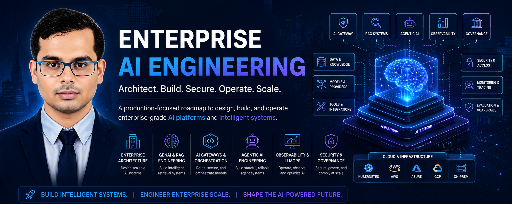
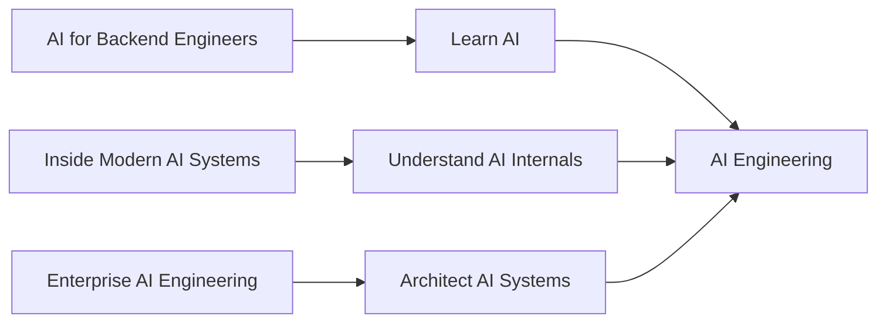
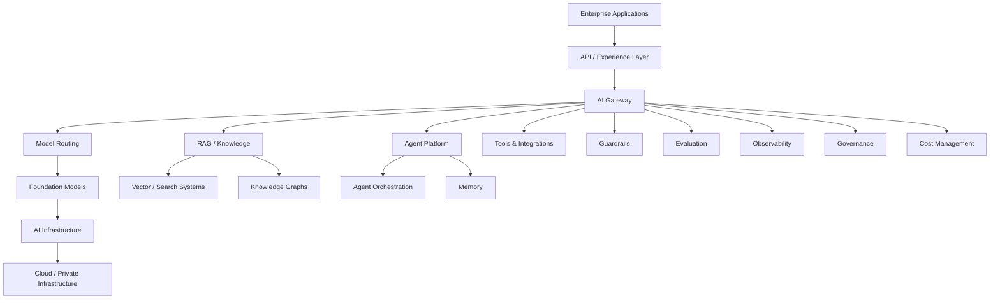
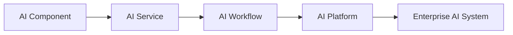
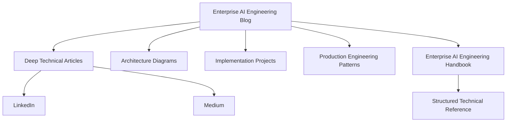

---

# 🏢 Enterprise AI Engineering



>A long-term architecture journey focused on the engineering principles,
system design patterns, infrastructure, and operational practices required
to build **enterprise-grade AI platforms and intelligent systems**.

### **Designing, Building & Operating Production-Grade AI Systems**

**Status: 🚧 Series in Progress**

---

---

# 🎯 The Vision

AI is moving beyond individual models and isolated applications.

The next challenge is building systems that are:

- Scalable
- Reliable
- Secure
- Observable
- Cost-efficient
- Governed
- Maintainable

This series explores the engineering behind those systems.

The goal is not simply to ask:

> **How do I use an AI model?**

The deeper question is:

> **How do I architect, build, secure, operate, and scale AI systems in the enterprise?**

---

# 🧭 Where This Series Fits

The broader content ecosystem follows three complementary perspectives:



### AI for Backend Engineers

**Learn AI**

Understand AI concepts and how they connect with backend and software engineering.

### Inside Modern AI Systems

**Understand AI**

Build and understand the internal components behind modern AI systems.

### Enterprise AI Engineering

**Architect AI**

Design and operate production-grade AI systems at enterprise scale.

The progression becomes:

```text
Learn
  ↓
Understand
  ↓
Build
  ↓
Architect
  ↓
Operate
  ↓
Optimize
```

---

# 🏗️ What This Series Explores

The series spans the major architectural layers required to build modern enterprise AI platforms.

Rather than publishing the complete roadmap, the major areas include:

### 🧠 AI Systems Architecture

Understanding how models, services, retrieval, agents, tools, gateways, and business systems fit together.

### 🔎 RAG & Knowledge Systems

Designing retrieval pipelines, enterprise search, vector systems, hybrid retrieval, knowledge systems, and advanced RAG architectures.

### 🚪 AI Gateways & Orchestration

Exploring multi-model routing, provider abstraction, orchestration, fallback strategies, workflow composition, and AI control planes.

### 🤖 Agentic AI Systems

Understanding stateful agents, memory, tool use, multi-agent coordination, interoperability, and human-in-the-loop workflows.

### 📊 Observability, Reliability & LLMOps

Designing systems that can be evaluated, traced, monitored, tested, recovered, and operated reliably.

### ⚙️ AI Platform Engineering

Exploring Kubernetes, GPU infrastructure, platform engineering, model lifecycle management, orchestration, and internal AI platforms.

### ⚡ Real-Time & Distributed AI

Designing event-driven, streaming, distributed, and low-latency AI systems.

### 🚀 AI Inference & Serving

Understanding how AI models are served efficiently through scalable inference infrastructure, optimized runtimes, and model-serving architectures.

### 🔐 Security & Governance

Designing AI systems with secure identity, authorization, isolation, governance, compliance, guardrails, and responsible operational controls.

### 🧩 Data & ML Engineering

Connecting AI systems with production data pipelines, feature engineering, data quality, distributed processing, and ML lifecycle engineering.

### 🌐 Advanced AI Systems

Exploring multimodal AI, knowledge graphs, GraphRAG, private AI, hybrid cloud, sovereign AI, AI FinOps, document intelligence, and other emerging enterprise patterns.

---

# 🔬 The Architecture Perspective

Every topic is approached from an engineering and architecture perspective.

The recurring questions are:

```text
What problem are we solving?
        ↓
Where does this component belong?
        ↓
How does it interact with the rest of the system?
        ↓
What are the scalability constraints?
        ↓
What can fail?
        ↓
How do we observe it?
        ↓
How do we secure it?
        ↓
How much does it cost?
        ↓
How do we operate it at scale?
```

This series focuses heavily on **trade-offs**, not just technology features.

---

# 🏛️ Enterprise AI Architecture Model

A simplified view of the system landscape is:



The exact architecture will vary by business requirement.

The purpose of the series is to understand **why those architectural decisions are made**.

---

# 🧭 Architecture Journey

The long-term journey evolves across several architectural layers:

```text
Enterprise AI Foundations
          ↓
GenAI & RAG
          ↓
AI Gateways & Orchestration
          ↓
Agentic AI
          ↓
Observability & LLMOps
          ↓
AI Platforms
          ↓
Distributed AI
          ↓
Inference & Serving
          ↓
Security & Governance
          ↓
Data & ML Engineering
          ↓
Enterprise Design Patterns
          ↓
Advanced AI Systems
```

The roadmap is intentionally evolving as AI technologies and enterprise patterns continue to develop.

---

# 🚀 What You Can Expect

Future articles will progressively move from individual architectural components toward complete system designs.

Expect content such as:

- Architecture deep dives
- Production system designs
- Reference architectures
- Mermaid diagrams
- Sequence diagrams
- Infrastructure diagrams
- Code and implementation examples
- Technology comparisons
- Failure scenarios
- Security models
- Performance considerations
- Cost engineering
- Operational patterns
- Real-world case studies

The emphasis will remain:

> **Architecture + Engineering + Trade-offs + Production**

---

# 🏆 From Components to Enterprise Platforms

The long-term objective is to move beyond isolated examples.

The progression is:



Eventually, these concepts converge into complete enterprise platforms capable of supporting:

- Multiple AI models
- Multiple AI applications
- Retrieval systems
- Agents
- Enterprise tools
- Security controls
- Observability
- Governance
- Multi-cloud infrastructure

---

# 🏆 Capstone Direction

The roadmap ultimately converges toward larger engineering projects.

The long-term capstone direction is a **cloud-native Enterprise AI Platform** integrating capabilities such as:

```text
AI Gateway
    +
Multi-Model Routing
    +
RAG
    +
Agents
    +
Tools / MCP
    +
Evaluation
    +
Observability
    +
Security
    +
Governance
    +
Cost Engineering
    +
Cloud Infrastructure
```

The objective is to demonstrate **system-level architecture**, not isolated tutorials.

---

# 💻 Engineering & GitHub Philosophy

The supporting GitHub projects will focus on building reusable engineering assets such as:

- Reference architectures
- Prototype platforms
- AI services
- Framework integrations
- Infrastructure examples
- Architecture patterns
- Evaluation tooling
- Security patterns
- Observability components

The goal is to demonstrate:

**Architecture + Implementation + Engineering Judgment**

rather than simply collecting technology demos.

---

# 🌐 Content Ecosystem

This series is part of a larger technical ecosystem.



### Blog

**Canonical technical source**

Deep articles, architectures, implementation details, and production trade-offs.

### Handbook

**Structured technical reference**

Organized learning material and reusable technical knowledge.

### GitHub

**Implementation layer**

Code, projects, experiments, and architecture implementations.

### LinkedIn

**Discovery and discussion**

Compact articles, insights, architecture discussions, and announcements.

### Newsletter

**Recurring audience**

A curated stream of Enterprise AI Engineering content.

---

# 🚧 Series Status

This is a **long-term evolving series**.

The exact topics, technologies, and sequence will continue to evolve as:

- AI platforms mature
- New architecture patterns emerge
- Frameworks evolve
- Enterprise requirements change
- Production lessons accumulate

The roadmap is therefore intentionally **directional rather than exhaustive**.

New areas will appear as the engineering landscape evolves.

---

# 🧠 The Long-Term Objective

The ultimate goal is to develop a practical understanding of how to design systems that combine:

```text
Software Engineering
        +
AI Engineering
        +
Cloud Architecture
        +
Distributed Systems
        +
Security
        +
Observability
        +
Governance
        +
Cost Engineering
```

into reliable enterprise AI platforms.

The destination is not a collection of AI technologies.

The destination is:

> **Enterprise-grade AI architecture.**

---

# 🔗 Related Series

### 🤖 AI for Backend Engineers

Explore the foundations of AI and how they connect with backend engineering.

### 🧠 Inside Modern AI Systems

Go deeper into the internal components that power modern AI systems.

### 🏢 Enterprise AI Engineering

Understand how those components become scalable, secure, observable, and production-ready enterprise systems.

---

# 📚 Enterprise AI Engineering Handbook

The **Enterprise AI Engineering Handbook** provides the structured technical reference layer supporting this broader ecosystem.

🔗 https://enterpriseai.handbook.mihirkjha.com/

---

# 💻 GitHub

Implementation projects and supporting engineering work:

🔗 https://github.com/MihirKJha/

---

# 💼 LinkedIn

Follow the journey, architecture discussions, and article announcements:

🔗 https://www.linkedin.com/in/mihirkrjha/

---

# 📰 Enterprise AI Engineering Newsletter

Practical insights across AI Engineering, Cloud Architecture, Backend Engineering, RAG, Agentic AI, MLOps, LLMOps, and Enterprise AI Architecture.

🔗 https://www.linkedin.com/newsletters/enterprise-ai-engineering-7479222208079319041/

---

# 👨‍💻 About the Author

**Mihir Jha**

*Software Architect | Enterprise AI Engineering | Cloud Architecture | Backend Engineering*

Focused on designing scalable, secure, observable, and production-ready systems at the intersection of:

**Software Engineering + Cloud Architecture + AI Engineering**

---

<div align="center">

### 🏗️ Learn AI. Understand AI. Architect AI.

**Building Production-Grade Enterprise AI Systems Through Engineering, Architecture & Continuous Learning.**

**© 2026 Mihir Jha**

</div>