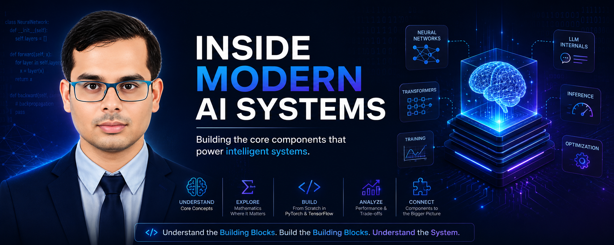
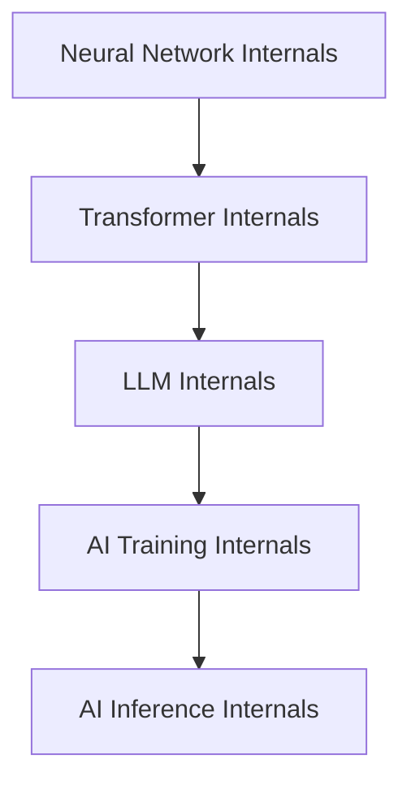
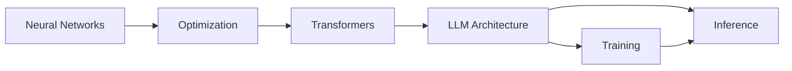
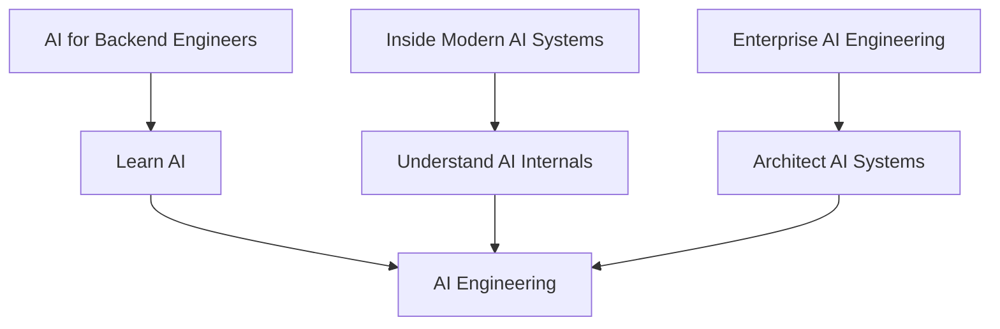
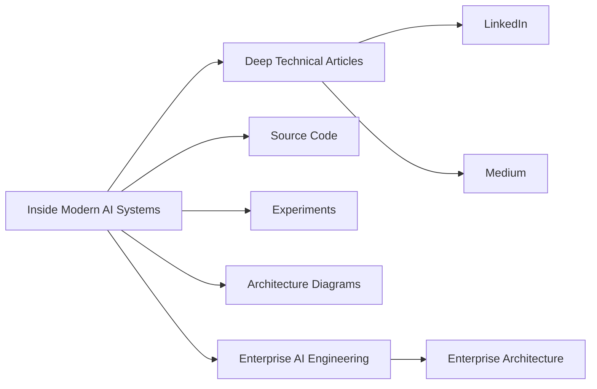

<p align="center">
  
</p>

<div align="center">

# 🧠 Inside Modern AI Systems

### **Building AI Components from Scratch with PyTorch & TensorFlow**

**Status: 🚧 Series in Progress**

A hands-on technical series focused on understanding **how modern AI systems work internally** by building and experimenting with their core components using **PyTorch** and **TensorFlow/Keras**.

</div>

---

# 🎯 The Goal

Modern AI systems are built on layers of abstractions.

Frameworks make it easy to use:

- Neural networks
- Transformers
- Large Language Models
- Training pipelines
- Inference systems

But abstraction can also hide the underlying mechanics.

This series is about looking underneath those abstractions.

The goal is to move from:

```text
Use the Framework
       ↓
Understand the Framework
       ↓
Understand the Component
       ↓
Understand the Mathematics
       ↓
Build the Component
       ↓
Understand the Performance
       ↓
Understand the System
```

The central question is:

> **What is actually happening underneath the abstraction?**

---

# 🧭 What This Series Focuses On

This series focuses specifically on **AI component internals**.

It explores how the fundamental building blocks of modern AI systems work and how those components fit together.

The emphasis is on:

- Internal architecture
- Core mechanics
- Mathematics where useful
- Implementation
- Framework abstractions
- Performance
- Memory behavior
- Component relationships
- Practical experimentation

The series deliberately avoids turning into an enterprise architecture or cloud deployment series.

Those concerns belong to the **Enterprise AI Engineering** track.

---

# 🧩 The Five-Part Journey

The series progresses through five major areas.



## Phase 1 — Neural Network Internals

The journey begins with the fundamental building blocks of deep learning.

The focus includes concepts such as:

- Artificial neurons
- Layers and networks
- Forward propagation
- Backpropagation
- Loss functions
- Optimizers
- Weight initialization

The objective is to understand the mechanisms that make neural networks learn.

---

## Phase 2 — Transformer Internals

The next stage moves into the architecture behind modern language and generative AI systems.

Topics include areas such as:

- Tokenization
- Embeddings
- Positional representations
- Self-Attention
- Multi-Head Attention
- Causal and cross attention
- Residual connections
- Layer normalization
- Feed-forward networks
- Transformer encoders and decoders

The goal is to understand how the Transformer is constructed from its individual components.

---

## Phase 3 — LLM Internals

Once the Transformer foundation is established, the series moves into the internal mechanics of Large Language Models.

This includes areas such as:

- GPT-style architectures
- Autoregressive generation
- Logits and probabilities
- Sampling
- KV caching
- Efficient attention
- Modern attention variants
- Mixture of Experts
- Parameter-efficient adaptation
- Quantization
- Model compression

The emphasis is on understanding what happens **inside the LLM during generation and optimization**.

---

## Phase 4 — AI Training Internals

The series then moves from individual model components into the mechanics of training.

This area explores:

- Dataset and DataLoader mechanics
- Batching
- Training loops
- Gradient accumulation
- Mixed precision
- Learning-rate scheduling
- Regularization
- Checkpointing
- Distributed training

The focus is on understanding the machinery behind model training rather than treating training as a single framework call.

---

## Phase 5 — AI Inference Internals

The final phase focuses on what happens when trained models are actually used.

This includes areas such as:

- Inference pipelines
- Context handling
- Memory management
- KV-cache behavior
- Batch inference
- Streaming generation
- Throughput
- Latency
- Model evaluation

The objective is to understand the path from:

```text
Input
  ↓
Tokenization
  ↓
Model Computation
  ↓
Decoding
  ↓
Generated Output
```

and the engineering constraints surrounding that process.

---

# 🔬 How the Components Connect

The individual topics are not isolated.

They form a dependency chain:



Understanding one layer makes the next layer easier to reason about.

For example:

```text
Neurons
   ↓
Neural Networks
   ↓
Attention
   ↓
Transformers
   ↓
GPT / LLM Architecture
   ↓
Training
   ↓
Inference
```

This progression is intentional.

---

# ⚙️ PyTorch + TensorFlow/Keras

Each major component can be studied through both:

### PyTorch

Used to examine the component through a flexible and explicit programming model.

### TensorFlow/Keras

Used to understand the equivalent abstraction and implementation in another major deep learning ecosystem.

The objective is **not** to declare a winner.

Instead, the comparison helps answer:

- What does each framework abstract?
- What remains visible to the engineer?
- How are the components represented?
- What are the performance implications?
- What are the implementation trade-offs?

---

# 🏗️ Standard Article Structure

Articles in this series follow a consistent pattern.

A typical deep dive moves through:

```text
Why It Exists
      ↓
Core Concept
      ↓
Internal Architecture
      ↓
Mathematics
      ↓
Implementation
      ↓
PyTorch
      ↓
TensorFlow / Keras
      ↓
Framework Comparison
      ↓
Performance
      ↓
Relationship With Other Components
```

Where appropriate, articles may also include:

- Architecture diagrams
- Mermaid diagrams
- Numerical examples
- Experiments
- Benchmarks
- Visualizations
- Code walkthroughs
- Unit tests

---

# 💻 Hands-On Philosophy

This is intended to be a **build-and-understand** series.

Instead of stopping at:

```python
model = SomeFrameworkModel(...)
```

the goal is to understand what happens underneath that abstraction.

For example:

```text
Framework API
      ↓
Layer
      ↓
Tensor Operations
      ↓
Mathematical Transformation
      ↓
GPU / CPU Computation
```

The same philosophy applies across:

- Attention
- Transformers
- Training
- Optimization
- Inference
- Memory
- Sampling

---

# 📊 Performance Perspective

Understanding an AI component also means understanding its engineering characteristics.

Where relevant, the series will examine:

- Computational complexity
- Memory consumption
- GPU utilization
- Tensor operations
- Training cost
- Inference latency
- Throughput
- Memory bandwidth
- Scaling behavior

The question is not only:

> **Does it work?**

but also:

> **Why does it behave the way it does?**

---

# 🧠 What You Should Be Able to Do After the Series

By following the series, the intended outcome is that you can reason about modern AI systems from the inside rather than treating them as black boxes.

You should be able to:

- Explain the major components of neural networks
- Understand how Transformers are constructed
- Explain how attention works
- Understand the mechanics of LLM generation
- Reason about training loops and optimization
- Understand inference and memory behavior
- Compare PyTorch and TensorFlow/Keras implementations
- Identify important performance trade-offs
- Understand how individual AI components connect into larger systems

The ultimate goal is:

> **Understand the building blocks well enough to understand the system built from them.**

---

# 🔎 Areas You Will Explore

Without exposing the complete future publishing sequence, the series will progressively explore areas such as:

```text
Neural Networks
      ↓
Optimization
      ↓
Tokenization
      ↓
Embeddings
      ↓
Attention
      ↓
Transformers
      ↓
LLMs
      ↓
Generation
      ↓
Efficient Inference
      ↓
Training Systems
      ↓
Distributed Training
      ↓
Memory Management
      ↓
Evaluation
```

The exact article sequence will evolve as the series progresses.

---

# 🚧 Series Status

This is a **long-term series in progress**.

The roadmap is intentionally evolving rather than being treated as a fixed public publishing schedule.

New deep dives will be added progressively as the series develops.

Some topics may expand into multiple articles, while others may be combined or reordered based on:

- Technical dependencies
- New developments
- Experiments
- Production relevance
- Learning progression

---

# 🔗 Relationship With the Other Series

The three major content tracks have deliberately different goals.



### 🤖 AI for Backend Engineers

**Learn AI**

Connect AI concepts with software, backend, cloud, and production engineering.

### 🧠 Inside Modern AI Systems

**Understand AI**

Understand and build the internal components behind modern AI systems.

### 🏢 Enterprise AI Engineering

**Architect AI**

Design, secure, operate, and scale enterprise AI systems.

Together:

```text
Learn
  ↓
Understand
  ↓
Build
  ↓
Architect
  ↓
Operate
```

---

# 💻 GitHub & Experiments

The series will be supported by implementation work and experiments.

Expected supporting material includes:

- Source code
- Jupyter notebooks
- Framework implementations
- Experiments
- Benchmarks
- Visualizations
- Tests
- Reference implementations

Each published deep dive can link to its corresponding implementation when available.

---

# 🌐 Content Ecosystem

The series is part of the broader **Enterprise AI Engineering** knowledge ecosystem.



The blog remains the canonical technical source.

LinkedIn and Medium provide broader distribution and discovery.

---

# 📚 Enterprise AI Engineering Handbook

The **Enterprise AI Engineering Handbook** provides structured reference material across the broader AI engineering journey.

🔗 https://enterpriseai.handbook.mihirkjha.com/

---

# 💻 GitHub

Implementation work and supporting projects:

🔗 https://github.com/MihirKJha/

---

# 💼 LinkedIn

Follow the technical journey and article announcements:

🔗 https://www.linkedin.com/in/mihirkrjha/

---

# 📰 Enterprise AI Engineering Newsletter

Follow the broader technical journey through the **Enterprise AI Engineering** newsletter:

🔗 https://www.linkedin.com/newsletters/enterprise-ai-engineering-7479222208079319041/

---

# 👨‍💻 About the Author

**Mihir Jha**

*Software Architect | AI Engineering | Cloud Architecture | Backend Engineering*

Focused on bridging traditional software and cloud engineering with modern AI engineering to understand, design, and build scalable, secure, observable, and production-ready intelligent systems.

---

<div align="center">

### 🧠 Understand the Components. Build the Components. Understand the System.

**Inside Modern AI Systems**

**© 2026 Mihir Jha**

</div>