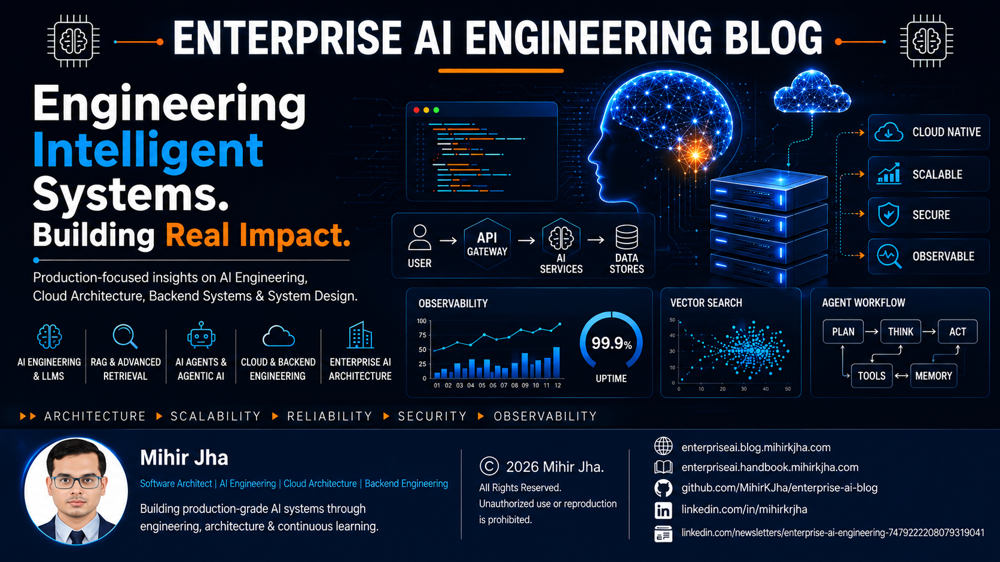
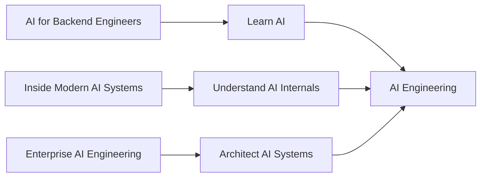
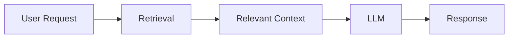
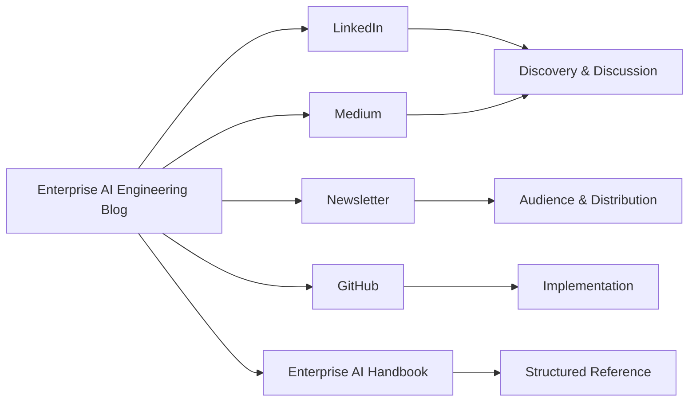
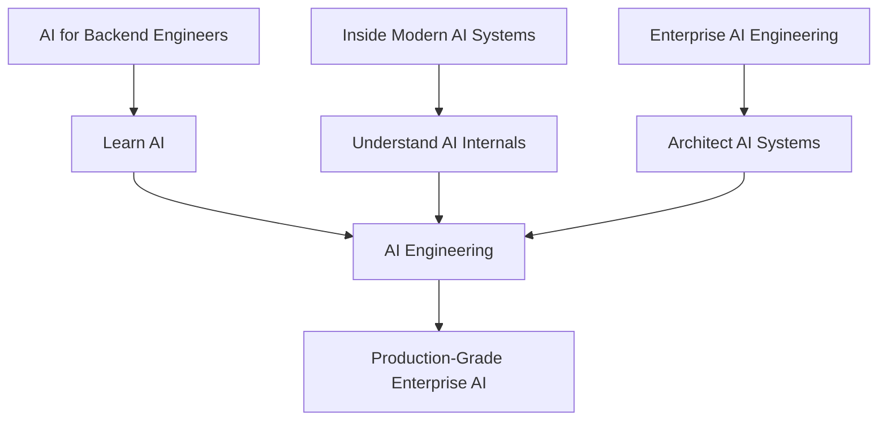

# Enterprise AI Engineering Blog

<p align="center">
  
</p>

> **Practical perspectives on building scalable software, cloud-native systems, and production-grade AI.**

Welcome to the **Enterprise AI Engineering Blog**.

This is where I document my journey across **Software Engineering, Backend Engineering, Cloud Architecture, and modern AI engineering**, with a strong focus on how these technologies come together in real-world systems.

The goal is not simply to explain individual technologies.

The goal is to understand:

> **How do we design, build, secure, operate, and scale intelligent systems?**

---

# 🧭 The Content Journey

The blog is organized around three complementary technical series.



## 🤖 AI for Backend Engineers

**Learn AI**

A practical journey connecting:

- Machine Learning
- Deep Learning
- Foundation Models
- Large Language Models
- Prompt Engineering
- RAG
- AI Agents
- Cloud AI
- Production AI Engineering

## 🧠 Inside Modern AI Systems

**Understand AI**

A hands-on exploration of the internal components that power modern AI systems using:

- PyTorch
- TensorFlow / Keras
- Neural Networks
- Transformers
- LLM Internals
- Training
- Inference
- Performance

## 🏢 Enterprise AI Engineering

**Architect AI**

A production-focused architecture journey exploring areas such as:

- Enterprise AI Architecture
- RAG Systems
- AI Gateways
- Agentic AI
- Observability
- LLMOps
- AI Platforms
- AI Security
- Governance
- Inference Infrastructure
- Distributed AI Systems

Together, the progression is:

```text
Learn
  ↓
Understand
  ↓
Build
  ↓
Architect
  ↓
Operate
  ↓
Optimize
```

---

# 🚀 AI for Backend Engineers

The first major series is already underway.

The published journey currently covers:

## ✅ Building Intelligent Systems

Introduction to Machine Learning and intelligent systems from a practical engineering perspective.

Topics include:

- Machine Learning fundamentals
- Intelligent systems
- Data-driven systems
- AI problem framing
- Production perspective

---

## ✅ Preparing Data for Production AI

Understanding the role of data preparation, data quality, and reliable data pipelines in AI systems.

Key themes include:

- Data preparation
- Data quality
- Feature preparation
- Production data challenges
- Reliable ML pipelines

The focus shifts from:

```text
Raw Data
   ↓
Useful Data
   ↓
Reliable AI Input
```

---

## ✅ Choosing the Right Machine Learning Algorithms

A practical approach to selecting algorithms based on:

- Business problem
- Data characteristics
- Explainability
- Scalability
- Latency
- Production constraints

The central lesson is:

> **The best algorithm is the one that solves the business problem within the system's constraints.**

---

## ✅ Why AI Projects Fail in Production

A high-performing model in a notebook does not automatically become a successful production system.

This article explores:

- Overfitting
- Underfitting
- Bias and variance
- Precision and recall
- Imbalanced datasets
- Model drift
- Monitoring
- AI observability

The focus moves from:

```text
Build the Model
      ↓
Deploy the Model
```

toward:

```text
Build
  ↓
Deploy
  ↓
Monitor
  ↓
Learn
  ↓
Improve
```

Production AI is a continuously evolving system.

---

## ✅ Deep Learning — The Foundation of Modern AI

The series then moves from traditional Machine Learning into Deep Learning.

This article connects:

- Neural Networks
- CNNs
- RNNs
- Transfer Learning
- Transformers
- Cloud-based Deep Learning
- Production considerations

The key transition is:

```text
Machine Learning
        ↓
Deep Learning
        ↓
Transformers
        ↓
Modern Generative AI
```

---

## ✅ Large Language Models — Inside the Engine of Generative AI

The journey then goes beneath the API to understand how modern Large Language Models work.

The article explores concepts such as:

- Tokens
- Embeddings
- Context windows
- Attention
- Query, Key, Value
- Multi-Head Attention
- Transformer blocks
- Encoder and Decoder architectures
- Autoregressive generation

The objective is to move beyond:

> **"I can call an LLM API."**

toward:

> **"I understand the engine behind the API."**

---

## ✅ Large Language Models — From Foundation Models to AI Applications

Understanding the LLM engine is only the beginning.

The next question is:

> **How do we build useful applications with these models?**

This article explores:

- Prompt Engineering
- Zero-shot prompting
- Few-shot prompting
- Role prompting
- System instructions
- Sampling
- Hallucinations
- Context
- Production LLM engineering

The emphasis is on turning model capabilities into reliable application behavior.

---

## ✅ Large Language Models — Adapting Foundation Models for Enterprise AI

The latest stage explores how general-purpose Foundation Models can be adapted for specialized enterprise requirements.

Key concepts include:

- Instruction Tuning
- Supervised Fine-Tuning
- RLHF
- LoRA
- QLoRA
- Domain Adaptation
- Model specialization

The central architectural question becomes:

```text
Prompt Engineering
        ↓
Model Adaptation
        ↓
Enterprise AI
```

But there is an important limitation:

> A specialized model still cannot automatically learn continuously changing enterprise knowledge.

That leads naturally to the next stage of the journey.

---

# 🔮 What's Next?

The next major step is:

## **Retrieval-Augmented Generation**

Modern enterprise systems frequently need access to:

- Internal documentation
- Product information
- Policies
- Business knowledge
- Frequently changing data
- Private enterprise content

Instead of continually retraining a model, modern AI systems can retrieve relevant information at runtime.



This begins the transition from:

```text
Understanding AI Models
        ↓
Building AI Applications
        ↓
Building Knowledge-Aware AI Systems
```

The exact future sequence will continue to evolve as the series progresses.

---

# 🔬 What You'll Find Here

Articles and deep dives may include:

- Architecture diagrams
- Mermaid diagrams
- Code examples
- Framework comparisons
- System design
- Production trade-offs
- Performance considerations
- Security considerations
- Observability
- Cost considerations
- Reliability patterns
- Engineering lessons
- Practical implementation guidance

The emphasis is on **understanding how the pieces fit together**, not simply collecting definitions.

---

# 🏗️ The Engineering Perspective

Modern AI systems increasingly combine traditional software engineering with AI capabilities.

A simplified view is:

```text
Software Engineering
        +
Backend Engineering
        +
Cloud Architecture
        +
Machine Learning
        +
Generative AI
        +
Distributed Systems
        +
Security & Observability
        =
Enterprise AI Engineering
```

This intersection is the core focus of the blog.

---

# 🧠 From Backend Engineering to AI Engineering

Traditional backend systems already require:

- API design
- Distributed systems
- Reliability
- Security
- Observability
- Scalability
- Data management
- Failure handling

AI systems introduce additional dimensions:

- Models
- Inference
- Retrieval
- Evaluation
- Context
- AI observability
- Probabilistic behavior

The resulting engineering model becomes:

```text
Traditional Backend
       +
AI Capabilities
       +
Production Engineering
       =
AI Systems Engineering
```

This is the perspective carried throughout the blog.

---

# 📚 Enterprise AI Engineering Handbook

For structured, chapter-based technical reference material, visit the:

**[Enterprise AI Engineering Handbook](https://enterpriseai.handbook.mihirkjha.com/)**

The relationship is:

```text
Blog
 ↓
Deep Technical Articles

Handbook
 ↓
Structured Technical Reference

GitHub
 ↓
Implementations & Projects

LinkedIn / Medium
 ↓
Distribution & Discussion
```

---

# 💻 GitHub

Supporting implementations, experiments, and engineering projects are maintained on GitHub.

**[GitHub — MihirKJha](https://github.com/MihirKJha/)**

The blog and GitHub projects are intended to connect:

```text
Concept
  ↓
Architecture
  ↓
Implementation
  ↓
Experimentation
  ↓
Production Thinking
```

---

# 💼 LinkedIn

Follow me on LinkedIn for:

- Compact versions of technical articles
- Architecture discussions
- New article announcements
- Engineering insights
- Production AI perspectives

**[LinkedIn — Mihir Jha](https://www.linkedin.com/in/mihirkrjha/)**

---

# 📰 Enterprise AI Engineering Newsletter

The **Enterprise AI Engineering** newsletter brings together practical perspectives across:

- AI Engineering
- Cloud Architecture
- Backend Engineering
- Generative AI
- RAG
- AI Agents
- MLOps / LLMOps
- Production AI Systems
- Enterprise AI Architecture

**[Read the Enterprise AI Engineering Newsletter](https://www.linkedin.com/newsletters/enterprise-ai-engineering-7479222208079319041/)**

---

# 🌐 Content Distribution

The blog is the **canonical technical source**.



Future detailed articles will be published on the blog first, with compact versions distributed through LinkedIn and Medium.

The objective is:

```text
Detailed Technical Source
        ↓
Compact Distribution
        ↓
Discussion & Discovery
        ↓
Broader Engineering Community
```

---

# 🧭 The Three-Series Model

The complete ecosystem can be viewed as:



### AI for Backend Engineers

**Learn AI**

Understand the fundamentals and connect AI with backend and software engineering.

### Inside Modern AI Systems

**Understand AI**

Understand and build the core components behind modern AI systems.

### Enterprise AI Engineering

**Architect AI**

Design, secure, operate, and scale enterprise AI systems.

Together:

```text
Learn
  ↓
Understand
  ↓
Build
  ↓
Architect
  ↓
Operate
  ↓
Optimize
```

---

# 🚧 What's Ahead

The journey will continue toward increasingly system-oriented AI engineering.

Future areas will broadly explore:

```text
RAG
  ↓
Advanced Retrieval
  ↓
AI Agents
  ↓
Agentic AI
  ↓
AI Observability
  ↓
AI Platforms
  ↓
Enterprise AI Architecture
```

The exact future sequence is intentionally evolving.

The objective is not to publish a fixed technology checklist.

The objective is to build a **coherent engineering understanding of modern AI systems**.

---

# 🎯 The Bigger Goal

The long-term objective is to bridge:

**Software Engineering + Cloud Architecture + AI Engineering**

and develop practical understanding of systems that are:

- Intelligent
- Scalable
- Secure
- Observable
- Reliable
- Cost-aware
- Production-ready

Ultimately:

> **Learn AI. Understand AI. Build AI. Architect AI.**

---

# 📖 How the Blog Relates to the Handbook

The two resources serve different purposes.

```text
Enterprise AI Engineering Blog
            │
            ▼
Deep dives
Architecture discussions
Production trade-offs
Engineering perspectives
            │
            ▼
Enterprise AI Engineering Handbook
            │
            ▼
Structured reference
Chapter-based learning
Systematic revision
```

Use the blog to explore ideas deeply.

Use the handbook as a structured technical reference.

---

# 🚧 Current Status

The blog foundation is now in place:

- Custom domain
- HTTPS
- MkDocs Material
- Structured article navigation
- Three-series content model
- Canonical blog publishing
- LinkedIn distribution
- Newsletter integration
- Handbook integration
- GitHub integration

The focus now shifts from building the publishing platform to **building the knowledge base**.

---

# 🔗 Connect With Me

### 💼 LinkedIn

https://www.linkedin.com/in/mihirkrjha/

### 📰 Enterprise AI Engineering Newsletter

https://www.linkedin.com/newsletters/enterprise-ai-engineering-7479222208079319041/

### 📚 Enterprise AI Engineering Handbook

https://enterpriseai.handbook.mihirkjha.com/

### 💻 GitHub

https://github.com/MihirKJha/

---

# 👨‍💻 About the Author

**Mihir Jha**

*Software Architect | AI Engineering | Cloud Architecture | Backend Engineering*

Focused on bridging traditional software and cloud engineering with modern AI engineering to design scalable, secure, observable, and production-ready intelligent systems.

---

<div align="center">

### 🚀 Learn AI. Build AI. Engineer AI.

**Building Production-Grade AI Systems Through Engineering, Architecture & Continuous Learning.**

**© 2026 Mihir Jha**

</div>